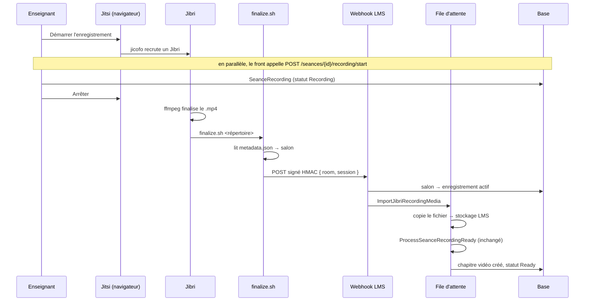

# Design — Finalisation d'un enregistrement Jibri vers la formation

> Issue **#469**. Phase 2/5 du spec-workflow. **En attente d'approbation.**
> Requirements approuvés : [requirements.md](requirements.md).

---

## 1. Un défaut existant découvert pendant la conception

`SeanceRecordingRetentionService::purge()` supprime les **lignes** (`$chapter->forceDelete()`,
`$locked->delete()`) et **ne touche jamais au système de fichiers**
([SeanceRecordingRetentionService.php:32-54](../../../app/Services/Visio/Recording/SeanceRecordingRetentionService.php#L32-L54)).

Et `ChapterArtifactStorage::purgeChapter()` n'est appelé que d'**un seul endroit** — le pipeline
de conversion, pour nettoyer avant de reconvertir
([FileConversionService.php:79](../../../app/Services/FileConversionService.php#L79)) — jamais à
la suppression. Aucun observer n'est branché sur `Chapter`.

**Conséquence : supprimer un chapitre laisse aujourd'hui tous ses fichiers sur disque.**
Documents sources sur le disque privé, vidéos et diapositives sur le disque public.

| Portée | Décision |
|---|---|
| L'effacement du média **d'un enregistrement** | **Dans le périmètre** — R4 existe précisément pour ça |
| L'orphelinage des fichiers à la suppression de **tout** chapitre | **Hors périmètre**, à ouvrir en issue de suivi. Toucher tous les chemins de suppression de chapitre déborde très largement #469. |

Ce défaut est **signalé, pas corrigé en douce**.

---

## 2. Décision structurante : le média appartient à l'enregistrement, pas au chapitre

`ChapterArtifactStorage::storeVideo()` exige un `chapterId` pour construire son chemin. Or au
moment de l'import, **le chapitre n'existe pas encore** : c'est
`SeanceRecordingAttachmentResolver::upsertVideoChapter()` qui le crée, et il a besoin de l'URL
pour le faire. Ordonner « chapitre d'abord » obligerait à créer un chapitre avec une URL
provisoire puis à la corriger — deux écritures, un état intermédiaire incohérent.

**Le média est donc rangé sous l'identifiant de l'enregistrement**, pas du chapitre :

```
storage/app/public/recordings/{recording_id}/video/{aléatoire}.mp4
```

Trois raisons, dans cet ordre :

1. **L'ordre devient naturel.** L'URL est connue avant la création du chapitre, donc
   `ProcessSeanceRecordingReady` est réutilisé **sans une ligne de modification** (R2).
2. **Le domaine le dit.** Un `SeanceRecording` **est** le média ; le chapitre ne fait qu'y
   pointer. Un enregistrement peut exister sans chapitre (échec de rattachement :
   `ambiguous_lesson`, `lesson_not_found`) — dans ce cas le fichier doit quand même être purgeable.
   Le ranger sous le chapitre le rendrait orphelin dans exactement ces cas d'échec.
3. **La purge a déjà l'objet en main.** `SeanceRecordingRetentionService::purge()` détient
   `$locked` : effacer `recordings/{id}` y tient en un appel.

**Ce que je n'ai pas fait, et pourquoi.** Élargir `ChapterArtifactStorage` aux enregistrements
aurait évité une classe. Refusé : son docblock la déclare « **seule autorité** sur quel artefact
**de chapitre** vit sur quel disque ». Y greffer une seconde notion de propriétaire dissout
précisément la règle que cette classe existe pour rendre lisible.

---

## 3. Vue d'ensemble



**Le fichier ne transite jamais en HTTP.** Le webhook ne porte que des métadonnées (quelques
centaines d'octets), donc le HMAC continue de couvrir le corps brut intégral — ce qui serait
intenable sur un `.mp4` de plusieurs centaines de mégaoctets.

---

## 4. Composants

### 4.1 `finalize.sh` — côté serveur visio (ops, hors dépôt applicatif)

Monté dans `/config`, désigné par `JIBRI_FINALIZE_RECORDING_SCRIPT_PATH`. L'image le rend
exécutable automatiquement ([`/etc/s6-overlay/scripts/config:23-26`]).

| Étape | Comportement |
|---|---|
| 1 | Journalise `$@` daté, **toujours**, avant toute autre action (R1 — la dette du contrat d'appel) |
| 2 | **Sort en 1** si `$1` n'est pas un répertoire lisible |
| 3 | Lit `metadata.json` → `meeting_url` → nom du salon |
| 4 | Signe `timestamp \n nonce \n corps` en HMAC-SHA256 |
| 5 | `POST` vers le LMS, **3 tentatives**, attente 5 s / 15 s / 45 s |
| 6 | **Ne supprime jamais** le fichier local (R6) |

### 4.2 `RoomRecordingResolver` — R3

Traduit un nom de salon en enregistrement actif.

```php
final class RoomRecordingResolver
{
    public function resolve(string $room): ?SeanceRecording;   // null si 0 ou >1
}
```

Requête : `SeanceRecording` joint à `Seance` sur `visio_room_id`, statut actif, **hors scope
d'institution** (le webhook n'a pas de tenant — même choix que le service existant, qui fait déjà
`withoutGlobalScope('institution')` en [ligne 56]). Renvoie `null` sur 0 **et** sur plusieurs :
choisir arbitrairement rattacherait un cours à la mauvaise classe.

### 4.3 `RecordingMediaSource` — interface (DIP, §1.6)

```php
interface RecordingMediaSource
{
    /** Chemin absolu du média de cette session, ou null. */
    public function locate(string $sessionId): ?string;
}
```

Implémentation unique aujourd'hui : `LocalDirectoryRecordingMediaSource`, qui lit sous une racine
configurée (`services.visio.recordings_root`).

**Pourquoi une interface pour une seule implémentation.** C'est la frontière qui rend le choix
de déploiement réversible : le plan d'infrastructure du projet prévoit un second serveur pour la
visio (§9.2, §10.9). Le jour où Jibri quitte cette machine, seul un
`HttpRecordingMediaSource` s'ajoute — aucun appelant ne change. C'est aussi ce qui rend le job
testable avec un double en mémoire (LSP), sans toucher au disque.

**Garde anti-traversée.** `$sessionId` est validé contre `^[0-9a-f-]{36}$` (UUID Jibri) **avant**
toute concaténation. Aucun chemin n'est accepté du client : le client nomme une session, le
serveur construit le chemin.

### 4.4 `RecordingMediaStorage` — R4

```php
final class RecordingMediaStorage
{
    public function store(string $absoluteSourcePath, int $recordingId): string;  // chemin relatif
    public function url(string $relativePath): string;
    public function purge(int $recordingId): void;
}
```

Disque **public**, comme toute vidéo de chapitre — cohérence assumée avec la décision #598, pas
un choix nouveau. Le nom de fichier est aléatoire, donc non énumérable, contrairement aux
diapositives (dette #598 déjà tracée).

### 4.5 `ImportJibriRecordingMedia` — job, file `low`

```
1. charge l'enregistrement ; sort si statut Ready (idempotence, R6)
2. RecordingMediaSource::locate(session)   → introuvable ⇒ échec explicite
3. RecordingMediaStorage::store(...)       → échec ⇒ statut Failed + motif
4. ProcessSeanceRecordingReady::dispatch(id, url, titre, 'jibri')->onQueue('low')
```

File `low` : cohérent avec le dispatch existant du webhook
([SeanceRecordingWebhookService.php:67](../../../app/Services/Visio/Recording/SeanceRecordingWebhookService.php#L67))
et avec le worker `--queue=high,default,low`.

### 4.6 Modifications des classes existantes — délibérément minimes

| Fichier | Change | Taille après |
|---|---|---|
| `SeanceRecordingWebhookService` | une branche : `room` + `session` → délègue au resolver et dispatche l'import ; la voie `recording_id` + `url` reste **intacte** | 142 → ~185 lignes (< 300 ✓) |
| `SeanceRecordingRetentionService` | `purge()` appelle `RecordingMediaStorage::purge()` avant de supprimer les lignes | 90 → ~100 lignes ✓ |

Aucune modification de `ProcessSeanceRecordingReady`, ni de
`SeanceRecordingAttachmentResolver`, ni de `ChapterArtifactStorage`.

---

## 5. Contrat du webhook

Route **inchangée** : `POST /api/webhooks/visio/recording-ready`.

```jsonc
// voie existante — inchangée, tests actuels verts sans modification (R7)
{ "recording_id": 42, "url": "https://…/a.mp4", "title": "…", "provider": "external" }

// voie nouvelle
{ "room": "seance-a1b2c3", "session": "00e7571b-7204-4ecb-8cab-7fb84b57b916", "title": "…" }
```

Discrimination : `recording_id` présent ⇒ voie historique. Sinon `room` + `session`.
Ni l'un ni l'autre ⇒ **422**, comme aujourd'hui.

### Pourquoi pas de FormRequest ici — exception assumée

§1.5 impose « tout input via FormRequest ». **Exception délibérée sur ce point d'entrée** : la
validation d'un FormRequest s'exécute **avant** le contrôleur, donc avant la vérification HMAC.
Une requête non signée recevrait alors un **422 détaillant les champs attendus** au lieu d'un
401 opaque — c'est-à-dire une aide au sondage offerte à un appelant non authentifié, et une
régression de R7. Sur un webhook, **l'authentification précède la validation**. La validation des
champs reste stricte, simplement exécutée après le HMAC, dans le service.

---

## 6. Modèle de données

Aucune migration. Colonnes existantes réutilisées :

| Colonne | Usage |
|---|---|
| `seance_recordings.provider` | `'jibri'` |
| `seance_recordings.provider_recording_id` | l'UUID de session Jibri — permet de retrouver l'origine |
| `seance_recordings.recording_url` | URL publique après import |
| `seance_recordings.file_size_bytes` | taille mesurée à l'import |
| `seance_recordings.error_message` | motif d'échec |

`checksum` reste **inutilisée** : le fichier ne traverse pas le réseau, un contrôle d'intégrité
n'aurait rien à détecter. Ne pas remplir une colonne parce qu'elle existe.

---

## 7. Gestion des erreurs

| Situation | Statut HTTP | État de l'enregistrement | Fichier |
|---|---|---|---|
| Secret absent | 503 | inchangé | conservé |
| Signature / horodatage invalide | 401 | inchangé | conservé |
| Nonce rejoué | 409 | inchangé | conservé |
| Salon inconnu / ambigu | 404 | inchangé | conservé |
| `session` mal formé | 422 | inchangé | conservé |
| Média introuvable à l'import | 202 puis `Failed` | `Failed` + motif | conservé |
| Copie en échec | 202 puis `Failed` | `Failed` + motif | conservé |
| Rattachement impossible | 202 puis `Failed` | `Failed` + motif existant | **conservé** |

Aucun `$e->getMessage()` ne remonte au client (§1.2) : les motifs sont des clés stables
(`media_not_found`, `media_copy_failed`), journalisées avec le détail côté serveur.

---

## 8. Stratégie de test

| Niveau | Cible | Points clés |
|---|---|---|
| **Unitaire** | `RoomRecordingResolver` | 0 / 1 / plusieurs correspondances ; **deux institutions** avec le même `visio_room_id` ⇒ ne doit jamais croiser les tenants |
| **Unitaire** | `RecordingMediaStorage` | stockage, URL, purge effective (`Storage::fake`) |
| **Unitaire** | `LocalDirectoryRecordingMediaSource` | UUID valide / invalide / traversée `../` refusée |
| **Feature** | webhook voie `room` | 202 + job en file ; 404 salon inconnu ; 404 ambigu ; 401 non signé |
| **Feature** | **non-régression** | `VisioRecordingWebhookTest` existant **exécuté sans modification** |
| **Feature** | `ImportJibriRecordingMedia` | chemin nominal ; média absent ⇒ `Failed` ; rejeu ⇒ idempotent |
| **Feature** | purge | le fichier disparaît réellement du disque |

Doubles via l'interface `RecordingMediaSource` (LSP), jamais de mock de base (§ standards de
test). Le test d'isolation multi-tenant utilise **un vrai jeton porteur**, jamais
`Sanctum::actingAs` — sans bearer, aucun tenant n'est résolu et le test ne prouverait rien.

---

## 9. Ce que ce design ne fait pas

- **Ne pilote pas Jibri depuis le LMS** : jicofo gère déjà la sélection dans la brasserie.
- **Ne rend pas les vidéos privées** : décision #598, à rouvrir séparément.
- **Ne corrige pas** l'orphelinage des fichiers à la suppression d'un chapitre quelconque (§1).
- **Ne mesure pas** la capacité à 5 enregistrements simultanés.
