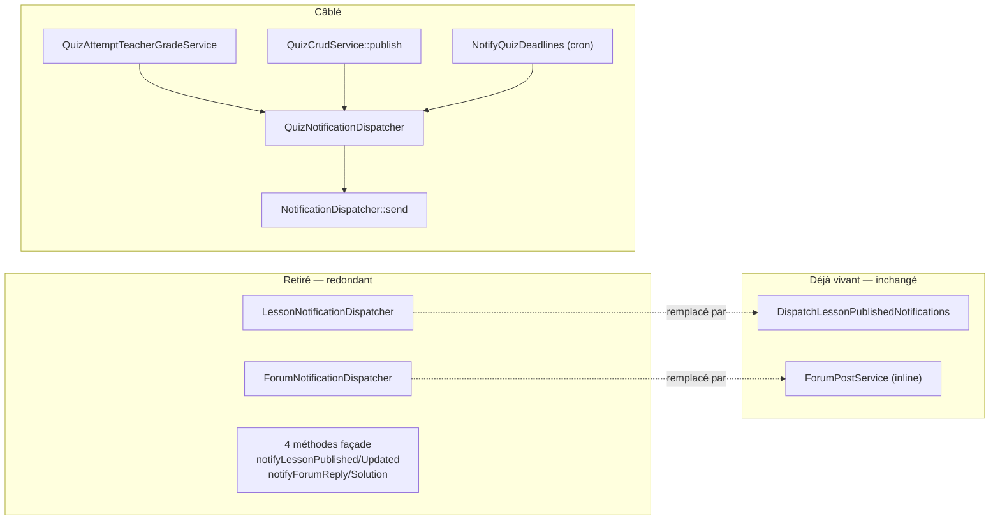

# Design — #500 · Câbler le quiz, retirer la chaîne Leçon/Forum redondante

## 1. Vue d'ensemble



## 2. Retraits

| Élément | Raison |
|---|---|
| `app/Services/Notification/LessonNotificationDispatcher.php` | Le job `DispatchLessonPublishedNotifications` fait le même travail **et** restaure le tenant. Le garder, c'est garder deux vérités. |
| `app/Services/Notification/ForumNotificationDispatcher.php` | `ForumPostService` émet déjà, avec `institution_id`, et sa sémantique est celle voulue (documentée `:26-35`). |
| `NotificationService` : `notifyLessonPublished`, `notifyLessonUpdated`, `notifyForumReply`, `notifyForumSolution` + 2 dépendances constructeur | Façade sur du code supprimé. |
| Entrées `phpstan-baseline.neon` des 2 fichiers | Sinon `ignore.unmatched` → CI rouge (piège vécu sur #609). |

`NotificationService` conserve : `send`, `sendToMany`, `notifyQuizAvailable`,
`notifyGradeReceived`, `notifyQuizDeadline`, `notifyVisioScheduled`, `notifyVisioStarting`,
`cleanupOldNotifications` — **toutes** avec au moins un appelant après ce lot.

## 3. Corrections préalables du dispatcher quiz

```php
// AVANT — deux attributs inexistants
$message = "Vous avez reçu une note de {$attempt->score}/{$attempt->max_score} …";
'percentage' => $attempt->percentage,

// APRÈS — colonnes réelles
$message = "Vous avez reçu une note de {$attempt->points_earned}/{$attempt->points_possible} …";
'percentage' => $attempt->score,   // `score` EST le pourcentage 0-100
```

Les **clés** de `data` (`score`, `max_score`, `percentage`) sont conservées : aucune
notification n'ayant jamais été émise, il n'y a pas de contrat client à casser, et garder
les noms attendus par le front évite un changement inutile côté client.

`notifyQuizDeadline` : `->where('status', 'completed')` → `->completed()`
(`QuizAttempt::scopeCompleted()`, introduit par #609, mergée). Aucune reduplication du
littéral.

## 4. Câblage — une ligne d'émission par service, rien d'autre

Conformément au périmètre (« uniquement la ligne d'émission, pas la logique environnante ») :

| Service | Emplacement | Ajout |
|---|---|---|
| `QuizAttemptTeacherGradeService::manualGrade()` | après `manualGradeAttempt()` | dépendance `QuizNotificationDispatcher` + 1 appel |
| `QuizCrudService::publish()` | après `$this->access->publish($quiz)` | idem |

`manualGradeAttempt` n'a **qu'un** appelant de production (`QuizAttemptTeacherGradeService:45`,
vérifié) : câbler au niveau du service métier couvre tout le chemin, sans dupliquer.

Aucune autre ligne de ces deux fichiers n'est modifiée.

## 5. `NotifyQuizDeadlines` — la commande planifiée

Nouveau `app/Console/Commands/NotifyQuizDeadlines.php`, calqué sur les deux précédents
existants du dépôt :

- **Contexte tenant** : reprend le pattern éprouvé de
  `DispatchLessonPublishedNotifications:76-88` — `TenantManager::reset()` puis `set()` par
  institution. Le balayage global se fait en `withoutGlobalScope('institution')`, explicite,
  au lieu de compter sur le fail-open du trait (qui journalise un avertissement).
  **Effet recherché** : la commande est correcte *aujourd'hui*, sans dépendre de #579.
- **Idempotence** : même garde que `NotifyUpcomingEvaluations:58-66` — pas de seconde
  notification pour le même `(user, quiz)` le même jour. Sans cela, un cron quotidien
  renotifie indéfiniment.
- **Planification** : `routes/console.php`, à côté de `evaluations:notify-upcoming`.

## 6. Alternatives écartées (Q12)

1. **Tout câbler (option A brute de l'issue).** Rejeté : mesuré, cela produit 2
   notifications par publication de leçon et 1+n par réponse forum. Une régression
   utilisateur immédiate.
2. **Tout retirer (option B).** Rejeté par la décision produit : supprimerait la seule
   implémentation quiz, alors que le front sait déjà rendre ces trois types.
3. **Câbler la correction automatique aussi** (`QuizGradingService::submitAttempt`).
   Rejeté : l'étudiant reçoit son score dans la réponse HTTP de sa propre soumission ;
   notifier serait du bruit, et doublerait le volume de notifications pour zéro information.
4. **Supprimer `notifyQuizDeadline` plutôt que d'écrire la commande.** Rejeté : c'est
   l'option la moins coûteuse, mais elle retire une fonctionnalité que la décision produit
   a explicitement retenue, et laisserait `quiz_deadline` (icône, couleur, URL) orphelin
   côté front.
5. **Faire porter `institution_id` par la commande elle-même** plutôt que restaurer le
   tenant. Rejeté : dupliquerait le correctif de #579 à un seul endroit au lieu de le
   traiter à la source ; le pattern « restaurer le tenant » est déjà celui du dépôt.

## 7. Ce qui invaliderait ce design (Q15)

- Si un appelant externe (hors dépôt : SDK, intégration) consommait les 4 méthodes façade
  supprimées → rupture d'API. *Écarté* : `NotificationService` est un service applicatif
  interne, jamais exposé par une route ; le SDK est généré depuis OpenAPI, pas depuis les
  services.
- Si les notifications leçon/forum n'étaient **pas** réellement émises ailleurs, retirer les
  dispatchers supprimerait la feature. *Vérifié* par lecture : job + 3 `Notification::create`
  inline, tous couverts par des tests existants.
- Si `score` n'était pas le pourcentage → message faux. *Vérifié* :
  `QuizGradingService.php:177` `($pointsEarned / $pointsPossible) * 100`.

## 8. Stratégie de test

| Test | Prouve |
|---|---|
| `test_manual_grading_notifies_the_student` (NOUVEAU) | R1 — RED avant câblage (0 notification) |
| `test_grade_notification_carries_real_points_and_percentage` (NOUVEAU) | B1/B2 — RED avant : message « /  » et `percentage` null |
| `test_publishing_a_quiz_notifies_the_class` (NOUVEAU) | R2 |
| `test_deadline_reminder_skips_students_who_already_finished` (NOUVEAU) | B3 — RED avant : l'étudiant ayant rendu était notifié |
| `test_deadline_command_does_not_notify_twice_the_same_day` (NOUVEAU) | R3 idempotence |
| `test_deadline_command_sets_institution_on_notifications` (NOUVEAU) | R6 — visible hors HTTP |
| Tests existants forum/leçon | R5 — non-régression, aucun doublon |
