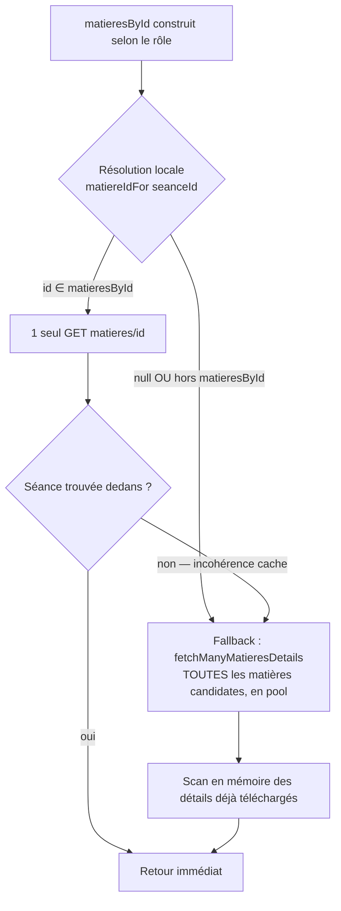
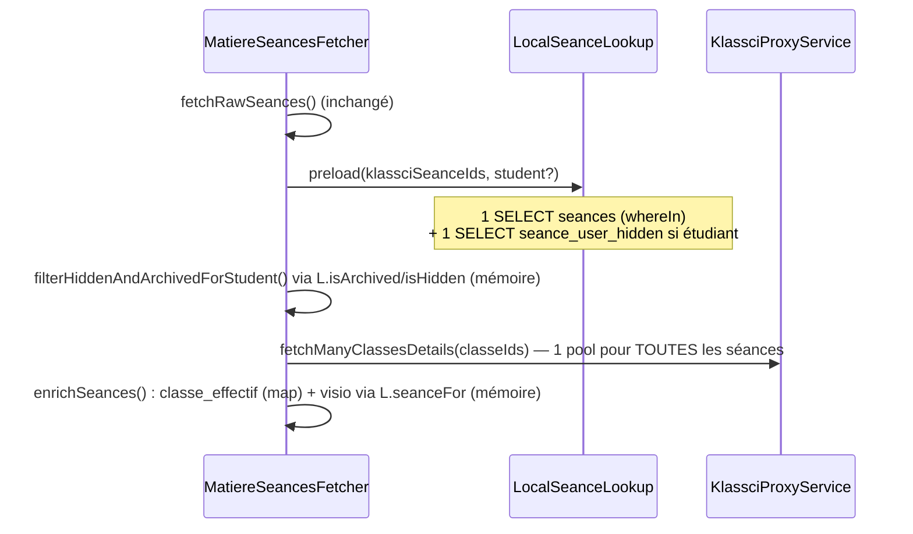

# Design — #517 N+1 HTTP sur endpoints chauds

## Vue d'ensemble

Trois refactors indépendants, tous basés sur le pattern déjà validé en production par #476
(`UpcomingSeancesFetcher` + `LocalSeanceLookup`) et #135 (`KlassciBatchFetcher::fetchManyByEndpoint`
via `Http::pool`) :

1. **H3** — `KlassciSeanceLookupService` : fast-path résolution locale + fallback batch.
2. **H4** — `MatiereSeancesFetcher` : préchargement local mutualisé (réutilise `LocalSeanceLookup`)
   + batch classes.
3. **H5** — `KlassciClassesFetcher` : boucle séquentielle → batch.

Aucun nouveau concept d'infrastructure : `KlassciProxyService::fetchManyMatieresDetails()` /
`fetchManyClassesDetails()` existent déjà et sont déjà DI-injectées dans les 3 services (via
`KlassciProxyService`, déjà un constructeur-dépendance de chacun).

## H3 — KlassciSeanceLookupService

### Nouveau collaborateur : `LocalSeanceMatiereResolver`

```php
final class LocalSeanceMatiereResolver
{
    public function matiereIdFor(int $klassciSeanceId): ?int
    {
        return Seance::where('klassci_seance_id', $klassciSeanceId)->value('klassci_matiere_id');
    }
}
```

Extrait en collaborateur séparé (pas inline dans `KlassciSeanceLookupService`) pour :
- Isolation testable (mock dans le test unitaire existant, sans DB réelle) — Liskov / §1.6 L.
- SRP : une seule responsabilité (accès DB), aucune logique HTTP/autorisation.
- Accès Eloquent standard, SANS `withoutGlobalScope` — même invariant tenant que
  `LocalSeanceLookup` (contexte HTTP authentifié, scope `institution` actif).

### Algorithme unifié (remplace les 3 boucles dupliquées teacher/student/coordinator)



- **R3 (sécurité)** : `matiereIdFor()` n'est utilisé QUE si son résultat appartient à
  `array_keys($matieresById)` — le set des matières que le endpoint role-specific (dashboard
  enseignant/étudiant, ou `/matieres` pour coordinateur) autorise. Empêche un accès à une matière
  hors périmètre via une donnée locale désynchronisée.
- **R2 (fallback)** : si la résolution locale échoue OU est incohérente (séance absente du détail
  fetché — cache local désynchronisé), on retombe sur le scan complet, mais celui-ci utilise
  désormais `fetchManyMatieresDetails()` (pool `Http::pool`, taille configurable
  `KLASSCI_POOL_SIZE`, défaut 4) au lieu d'un `foreach` séquentiel — élimine le N+1 même dans le
  pire cas (coordinateur, centaines de matières).
- Nouvelle méthode privée partagée `findSeanceAmongMatieres(array $matieresById, int $seanceId,
  string $klassciToken): array{0: seance|null, 1: matiereDetails, 2: matiereFallback}` factorise
  la logique commune aux 3 branches (teacher/student/coordinator), qui ne diffèrent que par la
  construction de `$matieresById` et le post-traitement du champ `enseignant`.
- `stringId()` (devenu mort) est supprimé ; `KlassciPayload::toInt()` (déjà utilisé par
  `UpcomingSeancesFetcher`, `KlassciSeancesSyncService`, etc.) est réutilisé pour la résolution
  d'ID typée — DRY.

## H4 — MatiereSeancesFetcher

Réutilise **tel quel** le collaborateur `LocalSeanceLookup` (issue #476), déjà DI-friendly
(aucune dépendance constructeur), déjà responsable de : préchargement `whereIn` mutualisé,
`isArchived()`, `isHidden()`, `seanceFor()`.



- Injection ajoutée au constructeur : `LocalSeanceLookup $localLookup`.
- `filterHiddenAndArchivedForStudent(array $seances)` : signature simplifiée (n'a plus besoin de
  `User $user`, l'étudiant est déjà capturé par `preload()`).
- `enrichSeances()` : collecte `classeIds` de TOUTES les séances (dédupliqués), 1 seul
  `fetchManyClassesDetails()`, puis boucle en mémoire sur le map retourné — IDs échoués dans le
  pool → `?? 0` (comportement identique au `catch (Throwable) { 0 }` actuel, sémantique préservée
  car `KlassciBatchFetcher` logge + omet déjà les échecs du map, cf. son docblock).

## H5 — KlassciClassesFetcher

Deux boucles séquentielles remplacées par batch, sans changement de signature publique
(`fetch()`, `fetchClasseDetails()` inchangées) :

- `fetchAllClassesWithDetails()` : collecte `classeIds` depuis `/classes`, 1
  `fetchManyClassesDetails()`, puis reconstruction du même format `{classe: {...}, etudiants:[...]}`
  par lookup mémoire dans le map retourné (fallback vers la classe brute si absente du map —
  identique au `catch` actuel).
- `fetchTeacherClasses()` : collecte `matiereIds` depuis `me/teacher-dashboard`, 1
  `fetchManyMatieresDetails()`, puis reconstruction du `classesMap` dédupliqué par lookup mémoire.

## Tests

- `tests/Unit/Services/Seances/KlassciSeanceLookupServiceTest.php` — mis à jour (mock
  `fetchManyMatieresDetails` au lieu de `requestWithUserToken` matiere-par-matiere pour le chemin
  fallback) + 2 nouveaux cas : fast-path local (1 seul GET matiere) et fallback batch multi-matières
  (preuve N+1 éliminé : `shouldReceive('requestWithUserToken')->never()` avec `->with(..., 'matieres/*', ...)`
  pour les IDs autres que celui résolu, et `fetchManyMatieresDetails` appelé une fois avec TOUS
  les IDs candidats).
- `tests/Unit/Services/Matiere/MatiereSeancesFetcherTest.php` — nouveau : pattern
  baseline-vs-afterGrowth (3 vs 30 séances), assertion que `fetchManyClassesDetails` est appelé
  **exactement 1 fois** peu importe N (mock `shouldReceive(...)->once()`), et que le nombre de
  requêtes SQL locales reste constant (`countLocalSeancesQueries`, même pattern que
  `UpcomingSeancesNoNPlusOneTest`).
- `tests/Feature/Sync/ClasseSyncServiceTest.php` — mis à jour (mock `fetchManyClassesDetails` au
  lieu de `requestWithUserToken('classes/{id}')`).
- Nouveau test unitaire `KlassciClassesFetcherTest` : preuve batch pour le fallback enseignant
  (`fetchTeacherClasses`) — `fetchManyMatieresDetails` appelé une fois pour N matières.

## Self-critique (§4 PRODUCTION_STANDARDS)

- **Alternative écartée #1** : résolution locale SEULE sans fallback batch pour H3. Rejetée — une
  séance tout juste créée (fenêtre du cron `SyncKlassciSeances`, #515, jusqu'à 5 min) ne serait pas
  trouvée localement → 404 alors qu'elle existe côté KLASSCI. Violerait R6 (non-régression
  fonctionnelle).
- **Alternative écartée #2** : batch pool SEUL sans résolution locale pour H3 (comme H4/H5).
  Rejetée pour H3 spécifiquement — H3 est sur le chemin de lecture le PLUS chaud (ouverture d'une
  page de détail séance, potentiellement des centaines de matières pour un coordinateur) ; la
  colonne indexée `klassci_matiere_id` permet de descendre à 2 HTTP dans le cas nominal (99% des
  cas, séance déjà synchronisée) au lieu de N en parallèle. Pour H4/H5 (listes déjà bornées par
  matière/classe), le gain marginal de la résolution locale ne justifiait pas la complexité
  additionnelle — le pool suffit.
- **Projection 10×** : coordinateur avec 500 matières → H3 fast-path = 2 HTTP (inchangé même à
  10×) ; fallback = pool de 500/4 = 125 vagues parallèles au lieu de 500 séquentielles (÷~100 sur
  la latence perçue, cap dur pool_size=32 en prod → ÷~16 minimum garanti par la clamp de sécurité
  de `KlassciBatchFetcher`). H4 : matière à 200 séances/30 classes → 1 HTTP pool au lieu de 200.
- **Source** : pattern déjà en prod pour `UpcomingSeancesFetcher` (#476, PR #488/#492) et
  `KlassciBatchFetcher` (#135, PR mergée) — pas une nouveauté architecturale, réutilisation stricte.
- **Invalidation** : si une régression fonctionnelle apparaît sur le chemin coordinateur H3 (une
  séance existante localement mais dont le `klassci_matiere_id` local diverge du KLASSCI réel —
  cache désynchronisé au-delà de la fenêtre de fallback), il faudrait revoir la garde R3 pour
  élargir plutôt que restreindre le fallback.
