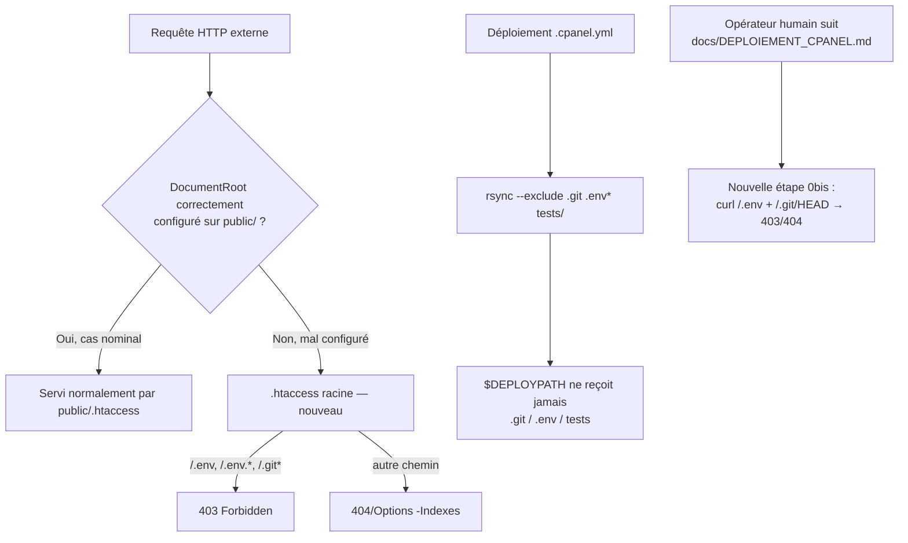

# Design — #537 [P0][SECURITY] Exposition potentielle du webroot cPanel (.env/.git)

## Vue d'ensemble

Trois fichiers modifiés, aucune action serveur :



## 1. `.htaccess` (nouveau, racine du dépôt)

> **Révisé après audit sécurité `spec-security` (finding HIGH)** : la première
> version de ce design ne bloquait explicitement que `.env*` et `.git/`. L'audit a
> montré que `.claude/specs/` est versionné dans le dépôt et contient des noms de
> dossiers décrivant des vulnérabilités réelles du projet (IDOR cross-tenant,
> fuite d'identifiant KLASSCI, etc.) — une régle énumérant seulement `.git` laissait
> ce chemin, et tout futur répertoire-point, totalement exposé dans le scénario même
> que ce fichier prétend couvrir. Le design ci-dessous a été généralisé en
> conséquence (bloque tout segment de chemin commençant par un point, pas une liste
> figée de noms).

### Apache lit ce fichier même quand le DocumentRoot est correct

Point non-évident découvert en concevant ce fichier : Apache remonte les
`.htaccess` de **tous les répertoires ancêtres du chemin filesystem résolu**, pas
seulement ceux sous le DocumentRoot. Comme `lms-backend/` est toujours un ancêtre
filesystem de `lms-backend/public/index.php`, ce fichier est lu **dans les deux
cas** (DocumentRoot correct ou mal configuré) — tant que `AllowOverride` est actif à
ce niveau (défaut cPanel/EasyApache 4). Cela renforce la défense en profondeur (le
correctif protège même en configuration nominale) mais impose de raisonner sur
`%{REQUEST_URI}` plutôt que sur le "chemin local" per-directory habituel de
`RewriteRule`, dont la sémantique est ambiguë pour un `.htaccess` situé au-dessus du
DocumentRoot (aucun accès SSH pour vérifier empiriquement ce cas précis → on choisit
le mécanisme non-ambigu plutôt que de supposer).

### Décision : une règle générique basée sur `REQUEST_URI`, pas une liste de noms

`<FilesMatch>` d'Apache ne matche que le **nom de fichier final** de la requête (ex.
pour `/.git/HEAD`, le nom testé est `HEAD`, pas `.git/HEAD`) — documenté dans
[Apache Core — `<FilesMatch>`](https://httpd.apache.org/docs/2.4/mod/core.html#filesmatch)
("filename, not the full path"). Une liste de `RewriteRule` par nom de dossier
(`.git`, puis `.claude`, puis le prochain dossier-point qu'un futur commit
ajouterait...) est une énumération qui se périme structurellement. La solution
retenue matche sur `%{REQUEST_URI}` (chemin complet, sans ambiguïté de contexte
per-directory — cf. ci-dessus) avec le motif `(^|/)\.`, qui couvre **tout** segment
de chemin commençant par un point, générique et non énumérable :

```apache
RewriteCond %{REQUEST_URI} !^/\.well-known/ [NC]
RewriteCond %{REQUEST_URI} (^|/)\.
RewriteRule ^ - [F,L]
```

`mod_rewrite` est quasi-universellement disponible (requis par `public/.htaccess`
existant, qui l'utilise déjà) — c'est donc la protection **primaire**. Un repli
`<IfModule !mod_rewrite.c>` couvre le cas résiduel où il serait absent, avec
`<FilesMatch "^\.">` (couverture partielle : nom de fichier final uniquement) +
`RedirectMatch` explicites sur `.git`, `.claude`, `.env` (liste non-exhaustive,
acceptable uniquement comme repli dégradé).

### Non-régression (R4)

- `RewriteCond %{REQUEST_URI} !^/\.well-known/` exclut explicitement la validation
  ACME/TLS avant que la règle générique ne s'applique.
- Le motif `(^|/)\.` ne matche aucune route applicative Laravel existante (aucune
  route API n'a de segment commençant par un point).
- Ce fichier ne remplace ni ne modifie `public/.htaccess`, qui continue de gérer
  100% du trafic applicatif normal (réécriture front-controller, headers auth).

### Contenu (référence, implémenté en tâche 1)

```apache
<IfModule mod_rewrite.c>
    RewriteEngine On
    RewriteCond %{REQUEST_URI} !^/\.well-known/ [NC]
    RewriteCond %{REQUEST_URI} (^|/)\.
    RewriteRule ^ - [F,L]
</IfModule>

<IfModule !mod_rewrite.c>
    <FilesMatch "^\.">
        <IfModule mod_authz_core.c>
            Require all denied
        </IfModule>
        <IfModule !mod_authz_core.c>
            Order allow,deny
            Deny from all
        </IfModule>
    </FilesMatch>
    RedirectMatch 403 ^/\.git(/|$)
    RedirectMatch 403 ^/\.claude(/|$)
    RedirectMatch 403 ^/\.env
</IfModule>

Options -Indexes
```

## 2. `.cpanel.yml` — copie sélective non-destructive

### Alternatives écartées (Q12 self-critique)

1. **`cp -R .` puis `rm -rf $DEPLOYPATH/.git``** — écarté : si `$DEPLOYPATH` est déjà
   la copie de travail Git active du mécanisme manuel (`docs/DEPLOIEMENT_CPANEL.md`),
   cette commande **supprime le `.git` de production en cours d'usage**, cassant
   irréversiblement le second mécanisme de déploiement. Risque destructif
   inacceptable pour un correctif de sécurité.
2. **Modifier le DocumentRoot / la config Apache directement** — écarté : nécessite
   un accès serveur (SSH/WHM), explicitement interdit par la mission.

### Solution retenue

Remplacer `/bin/cp -R . $DEPLOYPATH` par
`rsync -a --exclude='.git' --exclude='.env*' --exclude='tests' --exclude='.claude' ./ $DEPLOYPATH`
(sans `--delete`) — `.claude` ajouté suite au finding sécurité §1 (specs versionnées
décrivant des vulnérabilités réelles) :
- `rsync` sans `--delete` est **additif uniquement** : il ne touche jamais un
  fichier présent à destination mais absent (ou exclu) de la source. Un `.git`
  ou `.env` déjà présent à `$DEPLOYPATH` (mécanisme manuel) reste donc intact
  (R6).
- `rsync` est un composant standard de la stack cPanel/WHM (utilisé en interne par
  `cpbackup` et les transferts de compte) — **source** : documentation cPanel/WHM,
  "System Requirements" (rsync listé comme dépendance système standard des
  installations WHM/cPanel). Aucun accès SSH pour vérifier le chemin binaire exact
  sur ce serveur précis → limite honnête, voir §4.
- Si `rsync` est absent, la tâche `.cpanel.yml` échoue et cPanel le journalise
  (visible dans l'historique de déploiement) — fail-closed (R7), cohérent avec le
  pattern déjà utilisé dans le codebase pour `SSLVerificationValidator`
  (`docs/DEPLOYMENT_OPS.md` §9.1 : refuse de démarrer plutôt que de dégrader
  silencieusement).

## 3. `docs/DEPLOIEMENT_CPANEL.md` — combler le gap (R8)

Ajouter une étape de vérification (section 0, avant la sauvegarde DB, ou section 6
avec les autres vérifications de santé — retenu : section 6, à côté des checks santé
existants, car c'est un check **post-déploiement**, pas un pré-requis) :

```bash
# 6c. Le webroot ne doit exposer ni .env ni .git (issue #537)
curl -s -o /dev/null -w "webroot .env: %{http_code}\n" https://api.klassci.com/.env
curl -s -o /dev/null -w "webroot .git: %{http_code}\n" https://api.klassci.com/.git/HEAD
# Attendu : 403 ou 404 dans les deux cas. Si 200 → rotation immédiate de TOUS les
# secrets (APP_KEY, credentials DB, KLASSCI_API_TOKEN, SUPRADMIN_PASSWORD) + vérifier
# le DocumentRoot du vhost (doit pointer sur .../lms-backend/public).
```

## 4. Limites honnêtes (Q14/Q15 self-critique)

- **Non vérifié en conditions réelles** : je n'ai pas d'accès SSH/WHM au serveur de
  production. Le chemin `rsync` (`/usr/bin/rsync` supposé) et la version Apache
  (2.4 supposée, EasyApache 4 standard) ne sont pas confirmés empiriquement pour
  *ce* serveur précis — seulement documentés comme standards cPanel/WHM depuis 2018.
- **Ce qui invaliderait ce design** : si un opérateur exécute
  `which rsync` sur le serveur et qu'il est absent à un chemin différent, la ligne
  `.cpanel.yml` devra être ajustée (échec visible, pas de risque silencieux entre
  temps). Si `curl .../​.env` renvoie 200 après déploiement de ce correctif, le
  DocumentRoot lui-même doit être corrigé côté WHM — hors périmètre de ce correctif
  Git, action serveur qui reste à la charge du user.
- **Projection 10×** : un fichier `.htaccess` statique et une exclusion `rsync` n'ont
  aucune caractéristique de charge — la protection est binaire (bloque ou non), donc
  la question du volume (10× utilisateurs) ne s'applique pas à ce correctif.

## 5. Tests

Pas de test PHPUnit pertinent : `.htaccess` et `.cpanel.yml` sont des artefacts de
configuration serveur, exécutés par Apache/cPanel, hors du runtime Laravel testable
en CI. Un test PHPUnit qui « lirait » le fichier `.htaccess` et vérifierait des
regex ne prouverait rien sur le comportement Apache réel — je le signale
explicitement plutôt que d'ajouter un test qui donnerait une fausse impression de
couverture (Q3/Q14 self-critique). Vérification = commandes `curl` documentées en
§3, exécutées par le user après déploiement réel.
