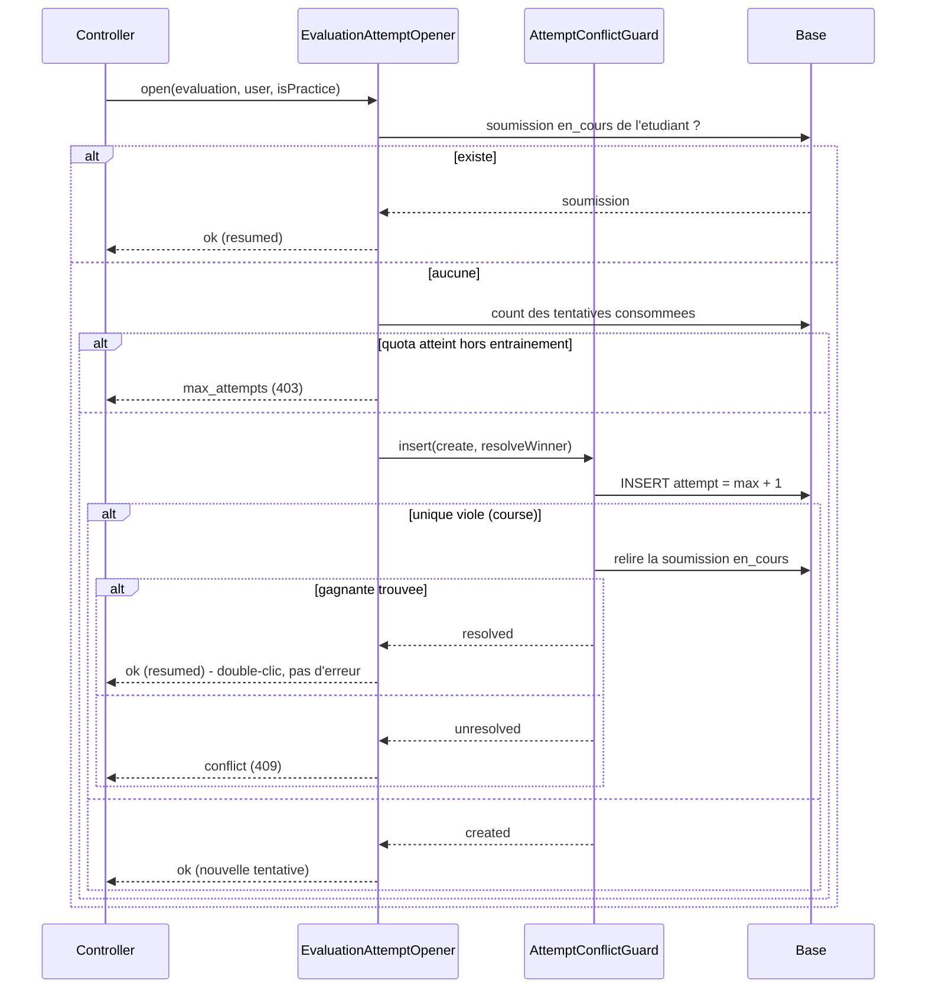

# #540 — Design

## 1. Principe directeur

> Le quota est une règle **métier** ; l'unicité est une garantie **base**.
> L'application propose, la base dispose. Toute insertion de tentative est donc
> *optimiste* : on insère, et si l'index unique rejette, on **re-résout** au lieu
> de laisser remonter un 500.

## 2. Décision d'architecture — pourquoi PAS `lockForUpdate`

L'issue proposait « `lockForUpdate` sur le scope étudiant/éval **OU** unique sur
colonnes non-nullable + capture de la violation ». Je retiens la **seconde**.

| Critère | `lockForUpdate` | Unique + capture (retenu) |
|---|---|---|
| 500 démarrages simultanés sur la même évaluation (Q13) | sérialise tout sur une ligne, risque de `lock wait timeout` | insertions parallèles ; seul le perdant refait un SELECT |
| Verrouille l'absence de ligne (le cas réel : 0 tentative → 2 insertions) | non : un `SELECT … FOR UPDATE` sans résultat ne verrouille aucune ligne ; il faudrait s'en remettre aux *gap locks* de REPEATABLE READ, donc au niveau d'isolation, pas au code | oui : l'index unique est une garantie du moteur, indépendante de l'isolation |
| Sous SQLite (suite locale) | sans effet réel → un test « vert » ne prouverait rien | l'index s'applique aux deux moteurs |
| Portée | protège le seul code qui pense à verrouiller | protège **toute** écriture, y compris un futur import ou une commande artisan |

Sources : MySQL 8 *Reference Manual* §17.7.1 (« locking reads set no lock on rows
that do not exist »), §15.6.2.1 (unicité garantie par le moteur) ; Laravel expose
`Illuminate\Database\UniqueConstraintViolationException` depuis la 10.x, ce qui
permet une capture **typée** plutôt qu'un parsing de code SQLSTATE.

**Critère d'invalidation (Q15)** : si un test de concurrence réelle sous MySQL 8
montrait deux lignes insérées malgré l'unique, la solution serait fausse et il
faudrait basculer sur un verrou nommé (`GET_LOCK`) ou une sérialisation applicative.

## 3. Composants

### 3.1 `App\Services\Attempts\AttemptConflictGuard` (nouveau)

Collaborateur sans état, injecté par constructeur. Encapsule l'unique mécanisme
partagé par les trois domaines (éval, knowledge-check, et quiz en #581) :

```
insert(Closure $insert, ?Closure $resolveWinner): AttemptInsertOutcome
```

- succès → `AttemptInsertOutcome::created($model)`
- `UniqueConstraintViolationException` + gagnante retrouvée → `::resolved($model)`
- `UniqueConstraintViolationException` + rien à retrouver → `::unresolved()`

Pas d'interface : la couche `app/Services` du projet est composée de classes
`final` concrètes injectées par constructeur (`QuizAccessService`,
`KlassciProxyService`, …) ; introduire une interface pour cette seule classe serait
un style personnel contraire au standard du fichier (Phase 3.2). La classe est
**directement testable en unitaire** (elle ne reçoit que des closures) : le besoin
de substitution que sert habituellement une interface est déjà couvert.

### 3.2 `App\Services\Attempts\AttemptInsertOutcome` (nouveau)

Value object générique (`@template TAttempt of Model`) : `attempt()`, `conflicted()`,
`isResolved()`. Constructeur privé + trois fabriques nommées → états incohérents
impossibles à construire.

### 3.3 `App\Services\Evaluation\Student\EvaluationAttemptOpener` (nouveau)

Extraction de `resolveOrCreateSubmission` hors de `EvaluationAttemptStateService`
(257 lignes : y ajouter quota + conflit ferait dépasser la limite §5 de 300 lignes)
et **point d'entrée unique** de l'ouverture d'une soumission, partagé par `/start`
et `/submit`.



Règles portées par l'opener :

- `attempt` = `max(attempt) + 1` sur **toutes** les tentatives de l'étudiant
  (robuste aux trous, contrairement à `count + 1` — même correctif que le quiz #211) ;
- comptage du quota sur **toutes** les tentatives, `en_cours` incluse (R4.1) ;
- `student_id` **et** `klassci_etudiant_id` renseignés (R2.2) ;
- `institution_id` hérité de l'évaluation (comportement existant conservé).

### 3.4 Knowledge-check

- `knowledge_check_attempts` reçoit `attempt_number` (NOT NULL, défaut 1) et
  l'unique `(knowledge_check_id, user_id, attempt_number)` → filet DB (R1.1).
- `KnowledgeCheckAccessService::nextAttemptNumberForUser()` — miroir exact de
  `QuizAccessService` (même nom, même sémantique `max + 1`).
- `KnowledgeCheckAttemptService::submitAttempt()` vérifie le quota **avant** de
  corriger, puis insère via le guard. Le retour devient porteur de statut
  (`ok` / `max_attempts` / `conflict`), à l'image de
  `EvaluationAttemptStateService` ; le controller `match`e ce statut.
- `start` continue de **ne rien persister** : créer une ligne « ouverte »
  imposerait un nouveau statut de tentative, explicitement interdit (R5.1), et
  exigerait un janitor pour libérer les tentatives abandonnées.

### 3.5 `SubmitEvaluationRequest::authorize()`

Le Check 5 passe de « une soumission existe pour cet étudiant » à « une soumission
**finalisée** (`soumis` / `corrige`) existe ». Sans cela, renseigner `student_id` au
démarrage (R2.2) transformerait le 500 nominal en **403** : l'étudiant ne pourrait
plus soumettre sa propre tentative en cours. L'intention du test existant
`test_already_submitted_cannot_resubmit` est préservée — sa fixture crée une
soumission `soumis`, qui reste bloquante.

## 4. Migrations

| Migration | Rôle | Réversibilité |
|---|---|---|
| `…_add_attempt_number_to_knowledge_check_attempts_table` | colonne + backfill déterministe (1..n par couple quiz/étudiant, ordre `id`) + unique | `down()` : drop unique puis colonne |
| `…_backfill_student_id_on_evaluation_submissions` | répare les lignes historiques créées par `/start` avec `student_id = NULL` | `down()` no-op documenté (on ne re-casse pas des données réparées) |

Backfill : boucle PHP chunkée, ordonnée `(knowledge_check_id, user_id, id)` — ni
`UPDATE … JOIN` ni fonction fenêtre, non portables entre SQLite et MySQL 8. Le
backfill `student_id` ne met à jour que les lignes dont l'étudiant est identifié
**sans ambiguïté** (exactement un `users` portant ce `klassci_id` dans la même
institution) ; les autres restent NULL plutôt que d'être rattachées au hasard.

## 4bis. Accorder l'application avec l'index (correctif issu de la revue)

Le premier jet posait le filet base **sans vérifier que l'application voyait le
même jeu de lignes**. Elle ne le voyait pas :

```
index unique       : (knowledge_check_id, user_id, attempt_number)   ← ignore institution_id
requête Eloquent   : ... AND institution_id = <tenant>               ← global scope BelongsToInstitution
```

`institution_id` a été ajoutée **nullable, sans backfill**, et laissée nullable à
dessein. Toute ligne antérieure à février 2026 est donc invisible au scope — mais
l'index continue de la faire respecter. `max + 1` re-proposait un numéro déjà
pris : **409 définitif** pour l'étudiant concerné.

Correctif : les requêtes qui adressent l'espace de clés de l'index
(`attemptKeyspace()`, `submissionKeyspace()`) retirent explicitement le scope.
C'est sans risque cross-tenant car leur filtre est ancré sur une clé déjà
rattachée à une seule institution (`knowledge_check_id`, `evaluation_id`).

**Piège de test à retenir** : `Sanctum::actingAs()` ne pose aucun jeton, or
`ResolveInstitution` fait `TenantManager::reset()` puis résout depuis le jeton
porteur. Un test écrit avec `actingAs` laisse donc le tenant **nul**, désactive le
global scope et passe au vert sans rien prouver. La preuve exige
`createToken()` + en-tête `Authorization`.

## 5. Dette signalée, non corrigée ici

- `evaluation_submissions` porte un index `(evaluation_id, klassci_etudiant_id)`
  strictement redondant avec le préfixe de `eval_sub_unique` ; idem
  `quiz_attempts_quiz_id_user_id_attempt_number_index` face à l'unique de mêmes
  colonnes. Coût : écritures et espace inutiles. Hors périmètre (#541 / #549).
- `KnowledgeCheckAttemptService::submitAttempt` écrit la tentative **puis**
  `ChapterProgress`, hors transaction → #543.
- `EvaluationStudentAttemptController::submitEvaluation` conserve son
  `catch (\Exception) → 500` générique : il ne couvre plus le conflit (traité en
  amont) mais reste un filet trop large.
- **`POST /submit` ne passe pas par la porte temporelle KLASSCI**, qui vit dans
  `startAttempt()`. Avec `deadline_at` à NULL et une fenêtre fermée, `/start`
  refuse en 403 mais un `/submit` direct enregistre une note corrigée et
  synchronisable. Défaut **antérieur** à #540 (l'ancien `/submit` créait déjà la
  soumission sans contrôle de fenêtre) ; le corriger ajouterait un appel HTTP
  KLASSCI sur le chemin de soumission → relève de #499, pas du quota.
- `KnowledgeCheckAccessService::isPassedByUser()` / `bestScore()` restent scopés
  au tenant : une tentative héritée à `institution_id = NULL` peut faire
  apparaître comme non-réussi un étudiant qui a réussi. Défaut d'affichage,
  antérieur, sans effet sur l'unicité — hors périmètre.
