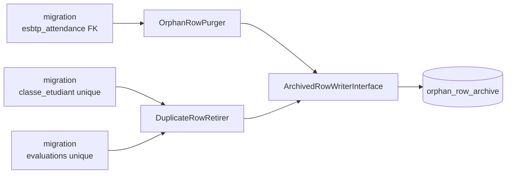

# Design — #541 Unicités & FK manquantes/inopérantes

## 1. Décision centrale : unique **partiel** via colonne générée

Le besoin R1 est une unicité *partielle* : « une seule ligne **vivante** par
(institution, évaluation KLASSCI) ». MySQL 8 ne connaît pas les index partiels
(`WHERE`), et un unique incluant `deleted_at` serait **inopérant** (les lignes
vivantes ont `deleted_at IS NULL`, et SQL autorise les `NULL` en doublon).

Solution retenue — colonne **générée** portant le drapeau de vivacité :

```
klassci_link_guard  =  CASE WHEN deleted_at IS NULL THEN 1 END
unique (institution_id, klassci_evaluation_id, klassci_link_guard)
```

* ligne vivante → garde = `1` → le triplet est contraint ;
* ligne soft-deletée → garde = `NULL` → **sortie** de la contrainte ;
* `klassci_evaluation_id NULL` (évaluation LMS-only) → **sortie** aussi, donc un
  nombre illimité de ces lignes, ce qu'exige `MatiereEvaluationsFetcher:151`.

La colonne est **calculée par la base** : aucune logique applicative à maintenir,
aucun risque de dérive si une ligne est supprimée en SQL brut.

### Preuve de portabilité (exécutée, pas supposée)

Sonde exécutée sur **SQLite 3.40** et **MySQL 8.4.11** (conteneur identique à la
jambe CI #574). Les 6 comportements attendus sont vérifiés sur les deux moteurs :

| Vérification | SQLite | MySQL 8.4 |
|---|---|---|
| `ALTER` colonne générée + unique | OK | OK |
| doublon vivant rejeté | OK | OK |
| recréation après soft delete autorisée | OK | OK |
| plusieurs `klassci_evaluation_id NULL` autorisés | OK | OK |
| plusieurs lignes soft-deletées de même clé autorisées | OK | OK |
| unique préexistant préservé après ajout de FK | OK | OK |

`Illuminate\Database\Schema\Grammars\SQLiteGrammar::compileForeign` délègue au
**rebuild de table** de Laravel 12 : l'ajout de FK par `ALTER` fonctionne et est
**réellement appliqué** sous SQLite (`PRAGMA foreign_key_list` non vide, insertion
orpheline rejetée) — la suite de tests SQLite prouve donc R3, elle ne le suppose pas.

## 2. Non-destruction (R4) — table de quarantaine générique

Précédent projet : `content_corruption_backups` (#231) archive la valeur d'origine
**avant** écrasement. On généralise ce principe :

```
orphan_row_archive(id, source_table, source_row_id, reason, payload JSON, archived_at)
unique (source_table, source_row_id, reason)   -- idempotence des relances
```

Toute ligne retirée par une migration d'intégrité y est copiée **intégralement**.

### Alternatives écartées (Q12)

1. **Supprimer les orphelins directement** — rejeté : destruction irréversible dans
   une migration ; l'audit 2026-08-15 a classé les suppressions destructives en P0.
2. **Refuser de migrer tant qu'il reste des orphelins** (patron `InstitutionForeignKeyGuard`
   de #583) — rejeté *pour ce cas précis* : un `institution_id` orphelin est
   **rattachable** à un tenant (décision humaine utile) ; une présence dont la séance
   ou l'utilisateur n'existe plus n'est rattachable à **rien**. Le garde bloquerait
   le déploiement sans offrir d'autre issue que la suppression. On archive donc,
   ce qui conserve la réversibilité **et** débloque.

## 3. Composants (SRP + DIP, §1.6)



| Classe | Responsabilité unique | Substituable (L) |
|---|---|---|
| `ForeignKeyCandidate` | VO immuable : table/colonne → table/colonne référencée | — |
| `ArchivedRowWriterInterface` / `ArchivedRowWriter` | écrire des lignes dans la quarantaine | oui (double en test) |
| `OrphanRowPurger` | archiver **puis** supprimer les lignes orphelines d'un candidat FK | oui |
| `DuplicateRowRetirer` | retirer les doublons d'une clé : soft delete si la table le permet, sinon archive + suppression | oui |

Toutes les dépendances sont injectées au constructeur (`DatabaseManager`,
`LoggerInterface`, `ArchivedRowWriterInterface`). Les migrations résolvent via le
conteneur — usage légitime en couche infrastructure, comme `2026_08_15_140000` (#583).

**Testabilité** : les tables réelles étant contraintes après migration, on ne peut
plus y fabriquer un orphelin ni un doublon. Les services sont donc **paramétrés par
le nom de table** et exercés sur des tables synthétiques créées dans le test — ce qui
prouve l'algorithme, tandis que des tests de schéma prouvent l'application aux tables
réelles.

## 4. `classe_etudiant` — choix de la clé naturelle

`unique(classe_id, user_id, annee_universitaire_id)` → `unique(classe_id, user_id)`.

Justification : une ligne `classes` **porte déjà** son année
(`create_klassci_sync_tables:59`, alimentée par `ClasseSyncService:221`). Une classe
est donc déjà un objet daté ; l'année dans le pivot est redondante avec `classe_id`,
et n'a jamais été écrite. `classe_id` et `user_id` sont `NOT NULL` (`foreignId`), donc
l'unique est **effective**. `institution_id` n'est pas nécessaire dans la clé :
`classe_id` référence une PK locale déjà rattachée à une institution.

`annee_universitaire_id` est **conservée** (colonne informative) et désormais
**alimentée** depuis `classes.annee_universitaire_id` par le synchroniseur, pour
qu'elle cesse d'être un champ mort.

`upsertEnrollment` passe de `SELECT`-puis-`INSERT`/`UPDATE` (TOCTOU) à un
`updateOrInsert` dont les colonnes de correspondance sont **exactement** celles de
l'index unique — condition nécessaire pour qu'il ne puisse pas violer la contrainte.

## 5. Sémantique des FK de `esbtp_attendance`

`seance_id → seances(id)` et `user_id → users(id)`, **ON DELETE CASCADE**.

Une ligne de présence n'a aucun sens sans sa séance ni son participant : la cascade
empêche que le défaut réapparaisse. Elle diffère du `RESTRICT` de #583 sur
`institution_id`, où l'enjeu était d'interdire qu'une suppression vide 30 tables.
Les suppressions de `users`/`seances` sont par ailleurs des **soft deletes**
(#566, `seances.deleted_at`), donc la cascade ne se déclenche qu'à la purge physique.

## 6. Stratégie de test

| Niveau | Objet | Fichier |
|---|---|---|
| Unitaire | `OrphanRowPurger`, `DuplicateRowRetirer`, `ArchivedRowWriter` sur tables synthétiques | `tests/Unit/Services/Integrity/*` |
| Schéma | les 3 contraintes existent réellement après migration | `tests/Feature/Database/IntegrityConstraintsTest.php` |
| Comportement | doublon rejeté, recréation post-soft-delete autorisée, orphelin rejeté, multi-tenant autorisé | idem |
| Métier | `ClasseStudentsSynchronizer` idempotent (2 syncs = 1 ligne) + année alimentée | `tests/Unit/Services/Sync/Classes/*` |

---

## 7. Corrections issues de la revue pré-merge (`/code-review high`)

La première version de cette branche a été revue et **cinq défauts vérifiés** en
sont ressortis, dont trois détruisaient des données. Ils sont consignés ici parce
qu'ils portent sur la partie du travail qu'aucun test ne regardait.

### 7.1 Le choix de la survivante était une perte de données déguisée

Garder `MIN(id)` paraissait neutre. Reproduit sur base de test, ça donnait :

- `evaluations` : le **brouillon vide** (plus ancien) survivait, l'évaluation
  portant **les copies notées** était soft-deletée. Les `evaluation_submissions`
  restaient accrochées à une ligne masquée par le scope `SoftDeletes` : les notes
  disparaissaient de l'interface, sans message.
- `classe_etudiant` : l'inscription **`abandonne`** survivait, l'**`actif`** était
  supprimée — `Classe::etudiantsActifs()` filtrant sur ce statut, l'étudiant
  sortait de sa propre classe.

Le choix est désormais **explicite et substituable** ({@see DuplicateSurvivorPolicy}) :
`MostReferencedSurvives` pour les évaluations, `PreferredValueSurvives('statut','actif')`
pour le pivot, départage commun par récence puis par identifiant.

### 7.2 « Soft delete = réversible » était faux

Une fois l'index unique posé, remettre `deleted_at` à `NULL` sur une ligne retirée
le **viole** — la survivante occupe déjà la clé. La branche soft delete
n'archivait rien : la ligne n'était récupérable nulle part. Les deux modes
archivent désormais **avant** de retirer, et la documentation ne prétend plus le
contraire.

### 7.3 L'archive n'était pas vérifiée avant suppression

`insertOrIgnore` (indispensable à l'idempotence) dégrade les erreurs en
avertissements sous MySQL : une copie pouvait manquer en silence, puis la ligne
source être supprimée. `RowQuarantine` **relit** désormais l'archive et refuse le
retrait si une seule copie manque.

### 7.4 Les migrations n'étaient pas rejouables

Sous MySQL chaque DDL auto-commite : un échec après `ADD COLUMN` (ou après
`DROP INDEX`) laissait un schéma à moitié posé et **tout `php artisan migrate`
ultérieur mourait**. Chaque étape est maintenant conditionnée à l'état réel du
schéma, et `classe_etudiant` pose le nouvel index **avant** de retirer l'ancien —
l'ordre inverse laissait la table sans aucune unicité dans la fenêtre d'échec.

### 7.5 La course tranchée par la base ressortait en 500

C'était la course même que cette issue corrige : `EvaluationCreationService`
convertissait le rejet de l'index en 500 opaque, alors que l'endpoint définit
déjà le 409 « une version en ligne existe déjà ». La violation d'unicité y est
désormais traduite en 409.

### 7.6 Et la raison pour laquelle rien de tout ça n'avait été vu

`RefreshDatabase` part d'une base **vide** : les réparateurs n'y faisaient rien,
et les tests unitaires ne les exerçaient que sur des tables synthétiques sans
copies, sans statut, sans interaction soft-delete/unique.
`IntegrityMigrationRepairTest` comble ce trou : il annule la migration visée,
sème l'état d'avant dans les **vraies** tables, la rejoue, et observe qui survit.
