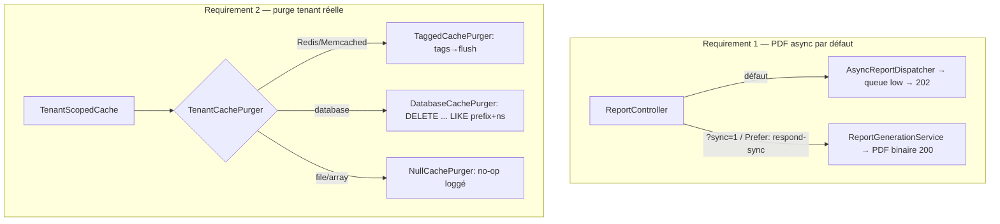

# Design — #547 : PDF async par défaut + purge tenant réelle (store `database`)

## 1. Vue d'ensemble

Deux corrections indépendantes, une seule PR (même racine : le store `database` par
défaut). Aucune modification de contrat public ni de consommateur métier.



## 2. Requirement 1 — PDF async par défaut

### 2.1 Décision

Le chemin async existe déjà **entièrement** (job `GenerateReportPdf` queue `low`,
`AsyncReportDispatcher`, endpoints status/download, `AsyncReportStore`, isolation tenant
worker #536). On **inverse uniquement le défaut** dans `ReportController` : la seule
zone de changement est `wantsAsync()` → `wantsSync()`.

### 2.2 Changement

`ReportController` (seul fichier touché pour R1) :

```php
// Défaut = async. Opt-out synchrone EXPLICITE seulement (intégrations legacy
// qui attendent le binaire PDF inline). async>sync si les deux sont présents
// (le défaut sûr l'emporte — Requirement 1.4).
private function wantsSync(Request $request): bool
{
    if ($request->boolean('async') || $request->header('Prefer') === 'respond-async') {
        return false; // opt-in async explicite : reste async (rétro-compat 1.3)
    }

    return $request->boolean('sync') || $request->header('Prefer') === 'respond-sync';
}
```

Chaque action inverse la condition :

```php
public function generateAttendanceReport(GenerateAttendanceReportRequest $request): Response|JsonResponse
{
    $user = $this->authenticatedUser($request);
    if (! $this->wantsSync($request)) {
        return $this->accepted($this->asyncReports->dispatch('attendance', $request->validated(), $user));
    }

    return $this->toHttpResponse($this->reports->generateAttendance($request->validated(), $user));
}
```

Aucune signature publique ni route modifiée. `wantsAsync()` supprimée (remplacée).

### 2.3 Rejet d'alternatives

- **Supprimer le chemin sync** : rejeté — casse les intégrations qui téléchargent le
  PDF inline et le test `AttendanceReportGenerationServiceTest`. Opt-out préservé.
- **Flag de config `reports.async_default`** : rejeté — YAGNI ; le défaut est une
  décision d'architecture, pas un réglage d'exploitation. Un flag ajouterait une
  branche non testée et un état implicite. Le comportement est déterministe par requête.

## 3. Requirement 2 — Purge tenant réelle sur store `database`

### 3.1 Racine

`cache.key` (colonne DB) stocke `{store->getPrefix()}{key}`
(`DatabaseStore::putMany:195`, vérifié dans vendor). Le store expose `getPrefix()`,
`getConnection()`, et la table (`config('cache.stores.database.table')`, défaut `cache`).
Une purge **ciblée tenant** est donc :

```sql
DELETE FROM `{table}` WHERE `key` LIKE '{prefix}{tenantNamespace}:%'
```

Ce n'est PAS un `Cache::flush()` cross-tenant : le `LIKE` est borné au namespace
`institution_{id}` du tenant courant (dérivé serveur, jamais d'un input client).

### 3.2 Abstraction (DIP §1.6 D, LSP §1.6 L, OCP §1.6 O)

Nouvelle interface + 3 implémentations, une par capacité de store, résolues par un
`select` de capacité. `TenantScopedCache` **dépend de l'abstraction**, pas des `if`.

```
app/Services/Cache/Purge/
├── TenantCachePurgerInterface.php   // purge(string $namespace): void
├── TaggedCachePurger.php            // Redis/Memcached : tags([ns])->flush()
├── DatabaseCachePurger.php          // database : DELETE ... LIKE prefix+ns
├── NullCachePurger.php              // file/array : no-op loggé (LSP-safe)
└── TenantCachePurgerFactory.php     // select par capacité du Repository injecté
```

- `TenantCachePurgerInterface::purge(string $namespace)` — contrat minimal (ISP §1.6 I).
- Chaque implémentation est substituable sans contournement → **fake trivial en test**.
- La factory lit la capacité du `Illuminate\Cache\Repository` concret injecté
  (`supportsTags()`, `getStore() instanceof DatabaseStore`) et retourne l'impl adaptée.
  Une seule raison de changer par classe (SRP).

### 3.3 Namespace de clé partagé (Requirement 2.4)

Pour que la purge `database` retrouve les entrées, `TenantScopedCache::remember()` doit,
sur un store **sans tags**, préfixer la clé par le namespace tenant :

```php
public function remember(string $key, int $ttl, \Closure $callback): mixed
{
    if ($this->cache->supportsTags()) {
        return $this->cache->tags([$this->tenantTag()])->remember($key, $ttl, $callback);
    }

    // Store sans tags : on encapsule la clé dans le namespace tenant pour que
    // DatabaseCachePurger puisse la cibler par motif (LIKE). Idempotent : si la
    // clé porte déjà le préfixe (clés KLASSCI `klassci_{tenant}_...`), on ne
    // double-préfixe pas — un seul namespace par clé.
    return $this->cache->remember($this->namespaced($key), $ttl, $callback);
}

private function namespaced(string $key): string
{
    $ns = $this->tenantTag();               // institution_{id} | institution_none

    return str_starts_with($key, $ns.':') ? $key : "{$ns}:{$key}";
}
```

`tenantTag()` (existant) devient la **source unique** du namespace, réutilisée par
`remember()`, `flushTenant()` et la purge. Séparateur `:` (pattern Laravel usuel), sûr
pour le `LIKE` (on échappera `%`/`_` — voir 3.5).

### 3.4 flushTenant() délègue à la stratégie

```php
public function flushTenant(): void
{
    $this->purger->purge($this->tenantTag());
}
```

`TenantScopedCache` n'a plus de branche `if supportsTags` dans `flushTenant()` : la
capacité est encapsulée dans le purger (OCP — ajouter un store = ajouter un purger, pas
éditer `TenantScopedCache`). Le no-op loggé migre dans `NullCachePurger`.

### 3.5 DatabaseCachePurger — sécurité du LIKE

```php
final class DatabaseCachePurger implements TenantCachePurgerInterface
{
    public function __construct(
        private readonly DatabaseStore $store,
        private readonly LoggerInterface $logger,
    ) {}

    public function purge(string $namespace): void
    {
        $prefix = $this->store->getPrefix();
        // Échappe les métacaractères LIKE du namespace (défense en profondeur ;
        // le namespace est serveur-only mais on ne construit jamais un LIKE non
        // échappé). '\' comme caractère d'échappement explicite.
        $pattern = $this->escapeLike($prefix.$namespace.':').'%';

        $deleted = $this->store->getConnection()
            ->table($this->table())
            ->where('key', 'like', $pattern, )      // ESCAPE '\' via clause brute si besoin
            ->delete();

        $this->logger->info('tenant_cache.database_purge', [
            'namespace' => $namespace,
            'deleted' => $deleted,
        ]);
    }
}
```

- `getPrefix()`/`getConnection()` lus **du store lui-même** — aucun hardcoding.
- Table lue via `config('cache.stores.database.table', 'cache')`.
- `escapeLike()` neutralise `%`, `_`, `\` du namespace.

### 3.6 Rejet d'alternatives

- **`Cache::flush()` sur database** : rejeté — cross-tenant, interdit CONTRIBUTING.md §E.
- **Migration prod vers Redis** : rejeté — hors périmètre #547 (c'est #374/#381) ; ne
  corrige pas le store `database` qui reste le défaut documenté. On répare le store réel.
- **GC périodique (scheduler) des lignes expirées** : rejeté comme correctif principal —
  traite le symptôme (nettoyage tardif) pas la racine (la purge post-write doit libérer
  immédiatement). Laravel purge déjà les lignes **expirées** paresseusement ; le problème
  ce sont les orphelines **non expirées** (clé obsolète, TTL encore vivant) que seul un
  DELETE ciblé élimine.

## 4. Data models

Aucune migration. On lit/écrit la table `cache` existante (colonne `key`), via l'API
Query Builder du store, sans changer son schéma.

## 5. Error handling

- `DatabaseCachePurger::purge()` : le `delete()` est loggé (compte supprimé). Une
  exception SQL remonte au caller (`KlassciProxyService::invalidateCache`) comme
  aujourd'hui — pas d'avalage silencieux ; générique côté client (§1.2 déjà en place).
- Génération PDF : inchangée (`errorPayload()` générique, §1.2).

## 6. Testing strategy

| Cas | Type | Store | Assert |
|---|---|---|---|
| POST report sans flag → 202 queue low | Feature | database | `assertAccepted`, `Queue::assertPushedOn('low')` |
| POST report `?sync=1` → 200 binaire | Feature | database | `assertOk`, header PDF |
| `sync=1` **et** `async=1` → 202 | Feature | database | async l'emporte (1.4) |
| `Prefer: respond-async` → 202 (rétro-compat) | Feature | database | 202 |
| `flushTenant()` database purge le tenant courant | Feature | database | lignes du tenant supprimées |
| Tenant A purge → tenant B intact | Feature | database | 2 institutions (§1.3) |
| tenant non résolu → namespace `institution_none` | Unit | fake | motif `institution_none:` |
| store sans tags/DB → no-op loggé | Unit | fake | `warning`, aucune purge |
| store à tags → `tags([ns])->flush()` | Unit | Mockery | comportement préservé |
| `remember()` sans tags → clé namespacée | Unit | Mockery | clé `institution_X:...` |
| purger factory sélectionne par capacité | Unit | Mockery | bonne impl retournée |

Tests existants conservés verts : `TenantScopedCacheTest` (adapté au purger injecté),
`AsyncReportControllerTest`, `AsyncReportTenantIsolationTest`,
`AttendanceReportGenerationServiceTest`, `KlassciProxyServiceMemoTest`.

## 7. Wiring (AppServiceProvider)

Bind `TenantCachePurgerInterface` via `TenantCachePurgerFactory::make($repository)` dans
le même bloc qui construit déjà `TenantScopedCache` avec le Repository concret résolu
selon `config('cache.default')` (`AppServiceProvider.php:37-49`). Pas de nouvelle Facade,
tout injecté.
