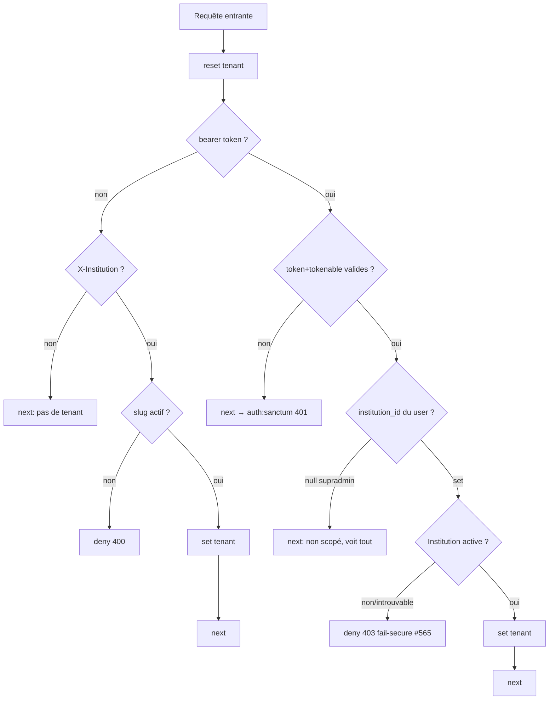

# Design — #565 Institution désactivée → lecture cross-tenant (fail-secure)

## 1. Racine du problème (Phase 1 — audit)

Deux sorties « tenant non posé » sont **confondues** dans `resolveFromBearerToken` :

| Cas | `institution_id` user | Institution | Attendu | Actuel (bug) |
|---|---|---|---|---|
| Supradmin | `null` | — | Passe, non scopé (voit tout) | ✅ Passe (return l.97) |
| Institution active | set | active | Pose tenant, scope | ✅ Pose (l.102-103) |
| **Institution désactivée** | set | `is_active=false` | **Refus** | ❌ Passe non scopé → **FUITE** |
| **Institution introuvable** | set | `find()=null` | **Refus** | ❌ Passe non scopé → **FUITE** |

Le trait `BelongsToInstitution` étant fail-open, « passe non scopé » = requête
globale non filtrée = fuite. La racine est donc **le middleware qui ne distingue
pas le supradmin légitime (null) de l'institution désactivée (fuite)**.

## 2. Solution (Phase 2 — une seule solution, §6)

**Rendre `ResolveInstitution` fail-secure** : la voie bearer refuse (403) dès que le
porteur est rattaché à une institution **désactivée ou introuvable**, tout en
préservant strictement supradmin (null) et le chemin nominal (active).

### 2.1 Pourquoi au middleware et pas dans le trait

Le trait ne peut **pas** distinguer, au moment d'une requête, « tenant absent
légitimement » (supradmin/job/test `actingAs`/contrôleur à filtre explicite) de
« tenant qui aurait dû être posé mais ne l'est pas ». Cette information n'existe
qu'à la **frontière** (le middleware voit le token → l'utilisateur → l'état de son
institution). Y porter un `throw` casserait les 3 flux légitimes documentés
(`BelongsToInstitution` docblock l.20-33 + `BelongsToInstitutionTest`). Le middleware
est le **seul** endroit où refuser est à la fois sûr et suffisant. Cf. R7.

### 2.2 Contrôle de flux

`resolveFromBearerToken` passe de `: void` à `: ?Response` :
- retourne `null` → « continuer » (tenant posé ou absence légitime) ;
- retourne une `Response` → « refuser » (le `handle` la propage).

Pas d'exception jetée depuis le middleware (contrôle de flux explicite, testable,
sans dépendre du handler global). Le refus header (400) et le refus bearer (403)
partagent un helper privé `deny(int $status, string $message)` (DRY).

### 2.3 Choix du code HTTP : 403 (bearer) vs 400 (header)

- **Voie header** = 400 (inchangé) : le client a fourni un slug qui ne résout pas →
  erreur de requête client (RFC 9110 §15.5.1).
- **Voie bearer** = **403** : la requête est bien formée et authentifiée (token
  valide, utilisateur réel) ; le refus vient de l'**état** de son institution
  (désactivée) → authorization/state failure (RFC 9110 §15.5.4 « understood but
  refuses to authorize »). C'est le code sémantiquement juste et il donne au
  frontend un signal exploitable distinct du 401 (login) : « établissement
  désactivé, contactez l'administration ».
- **Cohérence** exigée par l'issue = les **deux** voies refusent et ne laissent
  **rien** fuiter ; le code diffère car la **cause** diffère (client vs état serveur).

Le message ne révèle aucune donnée cross-tenant (l'institution est celle du porteur
lui-même) et aucun détail technique (§1.2) : « Établissement désactivé. Accès
suspendu, contactez votre administration. »

## 3. Diagramme de flux (cible)

## 4. Impact & rayon de souffle (Phase 1.3)

- `ResolveInstitution` est **prepend global** sur le groupe `api` (`bootstrap/app.php:34`)
  → **toutes** les requêtes API le traversent. Un défaut de régression casserait
  tout le trafic authentifié → suite de non-régression LARGE obligatoire avant
  conclusion (auth, tenant, dashboard, forum, évaluations, séances…).
- Chemins **inchangés** : supradmin (null), institution active, token invalide (401),
  routes publiques (header). Seul le cas « institution désactivée/introuvable via
  bearer » change : de « passe non scopé » à « 403 ».
- **Interaction #567** : si #567 ajoute `SoftDeletes` à `Institution`, une institution
  soft-deleted fera `find()=null` → R2 la refuse déjà (403). Notre logique
  (`!$institution || !$institution->is_active`) est **robuste** aux deux issues de
  #567 (soft delete OU delete physique). Aucune coordination bloquante requise ;
  interaction remontée à l'orchestrateur.

## 5. Data models

Aucun changement de schéma. Lecture seule de `institutions.is_active` (bool
existant) et `users.institution_id` (existant). Aucune migration.

## 6. Error handling

- 403 JSON `{success:false, message}` via helper `deny()` — même enveloppe que le
  400 header existant, cohérente avec le reste de l'API.
- Aucun `$e->getMessage()` exposé ; aucun secret ; message générique côté client.

## 7. Stratégie de test (Phase 4)

TDD strict — RED d'abord (reproduit la fuite), puis GREEN (refus). Tests via **vrai
bearer token** (`createToken`) car `Sanctum::actingAs` **contourne** le middleware
(pas de bearer → voie Priority 3, jamais `resolveFromBearerToken`).

| Test | Type | Prouve | R |
|---|---|---|---|
| `disabled_institution_bearer_is_refused_403` | Feature/HTTP | R1 refus 403 | R1 |
| `disabled_institution_bearer_cannot_read_cross_tenant_rows` | Feature/HTTP (route sonde globale-scopée) | Fuite RED→GREEN | R1 |
| `missing_institution_bearer_is_refused_403` | Feature/HTTP | R2 | R2 |
| `active_institution_bearer_resolves_and_proceeds` | Feature/HTTP | Nominal | R3 |
| `supradmin_null_institution_is_not_refused` | Feature/HTTP | Anti-régression supradmin | R4 |
| `invalid_bearer_token_still_401` | Feature/HTTP | Anti-régression 401 | R6 |
| `header_path_inactive_institution_still_400` | Feature/HTTP | Anti-régression header | R5 |

La route « sonde » (`/_probe/tenant-scoped-read`) est un échafaudage **de test
uniquement** (jamais dans `routes/`), montée dans le groupe `api` + `auth:sanctum`,
qui lit un modèle globale-scopé (`User`). Elle exerce le **vrai** seam
middleware→scope : avant le fix, un porteur d'institution désactivée y lisait les
`institution_id` d'un autre tenant (fuite) ; après, 403 avant tout accès.

## 8. Alternatives écartées (Q12)

1. **Fail-closed dans le trait (`throw` si tenant null en lecture)** — rejetée :
   casse les 3 flux légitimes sans-tenant (tests `actingAs`, contrôleurs à filtre
   explicite, jobs cross-tenant), rayon de souffle massif hors périmètre (~57
   services + toute la suite). Viole « sans casser le chemin nominal ».
2. **Heuristique trait `runningInConsole()` + `auth()`** — rejetée : détection
   d'environnement = code smell, facade `Auth` en code métier interdite (§1.6),
   comportement divergent test/prod (le test n'exercerait pas le chemin prod →
   viole « le test prouve le comportement »).
3. **Lever une `HttpException` depuis le middleware** — rejetée au profit du retour
   `?Response` : contrôle de flux explicite, sans dépendre du handler global ni
   risquer un mapping de statut inattendu.

## 9. Critère d'invalidation (Q15)

La solution serait invalidée si : (a) un test montrait qu'un supradmin (null) est
refusé (403) — régression inacceptable ; ou (b) un test montrait qu'après le fix,
une institution désactivée peut encore lire des données d'un autre tenant via
**n'importe quelle** voie authentifiée. Les tests R4 et le test de fuite ferment
ces deux critères.
