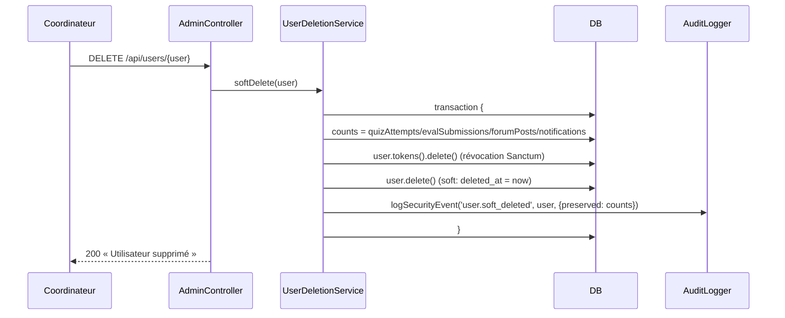
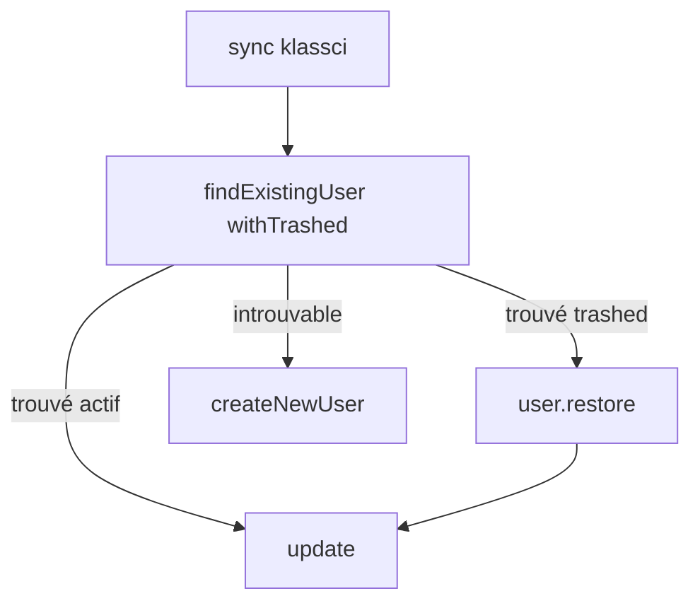

# Design — #566 : suppression logique des utilisateurs

> Approbation requise avant `tasks.md`. Une seule solution (§6).

## 1. Décision d'architecture

La logique de suppression (compter les liés → révoquer les jetons → soft delete → auditer) est
de la **logique métier** : elle n'a pas sa place dans le contrôleur (§5 « Controller : JAMAIS de
logique métier »). On introduit un service dédié `UserDeletionService` (SRP), injecté dans
`AdminController::deleteUser` par **method injection** (le container résout la dépendance — pas de
`new`, pas de Facade, §1.6 D).

Le trait `SoftDeletes` d'Eloquent est le mécanisme standard Laravel (source : documentation
officielle Laravel 12 « Soft Deleting »). Il ajoute le `SoftDeletingScope` global qui exclut
automatiquement les lignes `deleted_at IS NOT NULL` de **toutes** les requêtes par défaut — ce
qui satisfait R2 sans modifier une seule requête de lecture existante.

### Point subtil vérifié dans le code (racine du vrai risque)

`withoutGlobalScope('institution')` (utilisé par `LocalLmsAuthenticator` et
`KlassciUserSynchronizer`) ne retire **que** le scope institution — le `SoftDeletingScope` reste
actif. Conséquence :

- `LocalLmsAuthenticator::attemptLocalAuth` → un soft-deleted devient introuvable → login refusé.
  **C'est le comportement voulu (R3), aucun changement de code, uniquement un test.**
- `KlassciUserSynchronizer::findExistingUser` → un soft-deleted devient introuvable → `createNewUser`
  → INSERT → **violation** `users_klassci_id_institution_id_unique`. **Il FAUT `withTrashed()` +
  `restore()` (R5).** C'est le cœur du travail de cette issue.

## 2. Composants

| Fichier | Nature | Rôle |
|---|---|---|
| `database/migrations/2026_08_15_120000_add_deleted_at_to_users_table.php` | **Nouveau** | `deleted_at` nullable + index |
| `app/Models/User.php` | Modifié | `use SoftDeletes` + relation `evaluationSubmissions()` (pour le décompte) |
| `app/Services/User/UserDeletionService.php` | **Nouveau** | Orchestration du soft delete (transaction) |
| `app/Http/Controllers/API/AdminController.php` | Modifié | `deleteUser` délègue au service |
| `app/Services/Klassci/Auth/KlassciUserSynchronizer.php` | Modifié | `findExistingUser` en `withTrashed` + `restore()` |
| `app/Console/Commands/PurgeSoftDeletedUsers.php` | **Nouveau** | Purge physique RGPD, dry-run par défaut |

## 3. Modèle de données

Migration `up()` :
```php
Schema::table('users', function (Blueprint $table): void {
    $table->softDeletes();       // deleted_at TIMESTAMP NULL
    $table->index('deleted_at'); // filtrage rapide du SoftDeletingScope
});
```
`down()` : `dropIndex(['deleted_at'])` puis `dropSoftDeletes()`.

**Index uniques existants inchangés** : `users_email_institution_unique (email, institution_id)`
et `users_klassci_id_institution_id_unique (klassci_id, institution_id)`. MySQL ne supporte pas
d'index unique partiel : une ligne soft-deleted continue d'occuper son emplacement d'unicité.
C'est **précisément pourquoi** R5 restaure au lieu d'insérer.

## 4. Processus métier — soft delete



Atomicité : la révocation des jetons et le soft-delete sont dans **une** transaction
(`ConnectionInterface::transaction`) — jamais « supprimé mais jetons vivants ».

## 5. Processus métier — re-sync KLASSCI (R5)



`findExistingUser` : ajout de `->withTrashed()` sur les deux requêtes (par `(klassci_id,
institution_id)` puis fallback email scopé). Dans `doSync`, si `$user->trashed()` →
`$user->restore()` avant `update()`, avec un log info (`Utilisateur restauré via re-sync KLASSCI`).

## 6. Gestion des erreurs

- Route-model binding d'un soft-deleted → 404 natif (SoftDeletingScope). Aucun `getMessage()`
  exposé.
- Échec d'audit → avalé par `AuditLogger` (try/catch interne, #241), la suppression reste valide.
- Échec DB dans la transaction → rollback complet (ni soft-delete, ni révocation partielle).

## 7. Stratégie de test (TDD — RED d'abord)

Feature `tests/Feature/Admin/UserSoftDeleteTest.php` :
1. RED (avant migration+trait) : `deleteUser` détruit quiz_attempts/evaluation_submissions
   (assertDatabaseMissing) — prouve la destruction actuelle.
2. GREEN : soft delete → `assertSoftDeleted('users', ...)`, `assertDatabaseHas` sur les filles,
   404 au binding suivant, 401 avec l'ancien jeton.
3. Restauration KLASSCI : `tests/Feature/Auth/KlassciResyncRestoresUserTest.php` — soft-delete un
   user KLASSCI puis `sync()` → restauré, `deleted_at` null, `assertDatabaseCount('users', 1)`
   (pas de doublon, pas d'exception d'unicité).
4. Login local refusé : soft-delete puis `attemptLocalAuth` → `null`.
5. Audit : entrée `user.soft_deleted` avec `after.preserved.quiz_attempts == N`.

Unit `tests/Unit/Services/User/UserDeletionServiceTest.php` : le service, avec un `AuditLogger`
mocké (LSP/substituable), révoque les jetons et écrit l'audit — vérifie l'atomicité par comptage.

Commande : `tests/Feature/Console/PurgeSoftDeletedUsersTest.php` — dry-run ne détruit rien ;
`--force` purge (forceDelete) et audite.

Multi-tenant (§1.3) : institutions A et B — la restauration et la suppression restent cloisonnées.

## 8. Alternatives écartées (Q12)

1. **Mettre la logique dans le contrôleur** (rapide, 4 lignes) — rejeté : viole §5 (controller sans
   logique métier) et rend l'atomicité/audit non testables unitairement.
2. **Ajouter le trait `Auditable` à `User`** pour auto-logger la suppression — rejeté : l'observer
   générique loggue un `delete` sans le **décompte** exigé par R4, et grossit la surface
   d'événements (create/update audités non demandés). `logSecurityEvent` explicite est plus précis.
3. **Index unique partiel** (`WHERE deleted_at IS NULL`) pour autoriser la recréation — rejeté :
   non supporté par MySQL 8 (cible de prod, jambe CI MySQL #563-SUB9) ; la restauration R5 couvre
   le seul chemin métier réel (re-login KLASSCI).

## 9. Projection 10× (Q13)

À 200 000 utilisateurs, le soft-delete reste O(1) (un UPDATE + un DELETE sur les jetons de l'user).
L'index `deleted_at` garde le `SoftDeletingScope` performant. La purge RGPD est bornée par `--days`
et manuelle. Aucun fan-out, aucune dégradation.

## 10. Critère d'invalidation (Q15)

Cette conception est fausse si : un test montre qu'un soft-deleted reste authentifiable, OU si la
re-sync KLASSCI lève encore une violation d'unicité, OU si une lecture d'utilisateur standard
renvoie encore les supprimés. Les tests §7 sont exactement ces critères.
