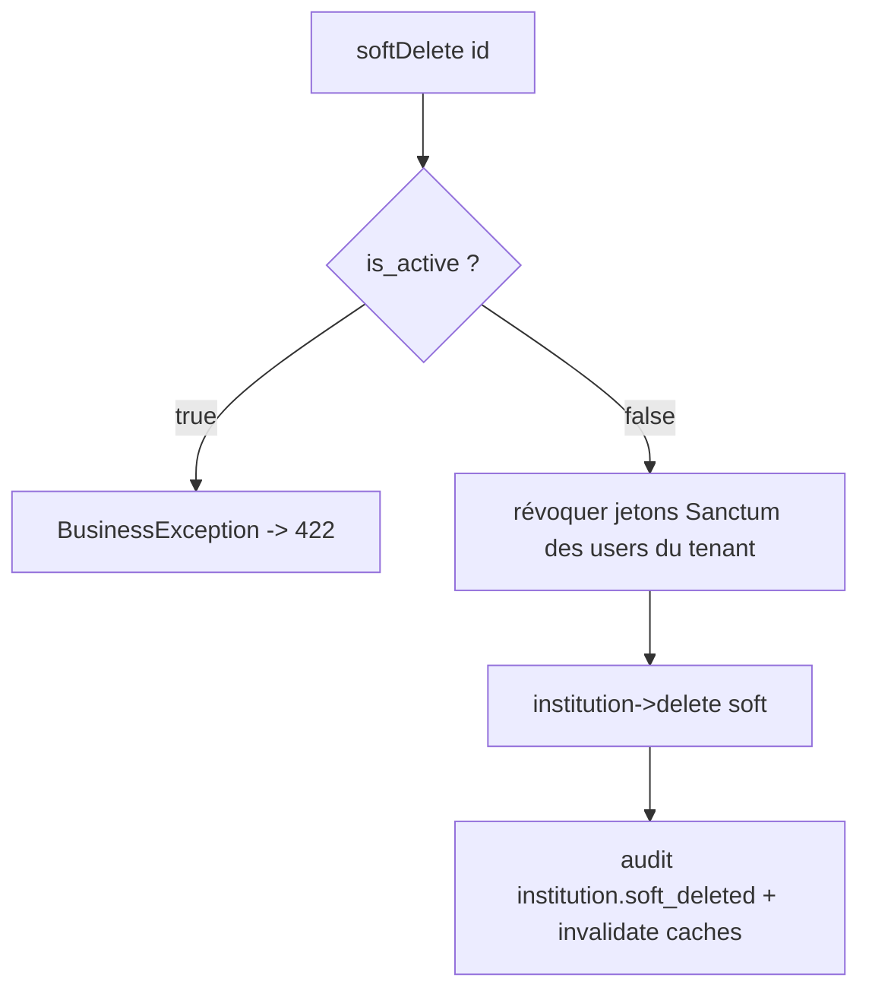

# Design — #567 : suppression logique des institutions

> Approbation requise avant `tasks.md`. Une seule solution (§6).

## 1. Décision d'architecture

Le trait `SoftDeletes` rend `Institution::delete()` logique et son `SoftDeletingScope` exclut
nativement les institutions supprimées de **toutes** les lectures existantes (R5) — sans toucher
aux lecteurs (`KlassciTenantDiscovery`, `InstitutionQueryService`, déjà à cache invalidé).

La logique métier de la suppression (garde `is_active` → révocation des sessions → soft delete →
audit) reste dans `InstitutionCrudService` (déjà le service dédié, §5). On y injecte `AuditLogger`
(DI, §1.6 D) ; la révocation des jetons se fait par une requête bornée (sous-requête, pas de
chargement en mémoire).

### Point vérifié dans le code (coordination #565↔#567)

`ResolveInstitution::resolveFromBearerToken` fait `Institution::find($institution_id)` puis
`if ($institution && $institution->is_active)`. Une institution soft-deletée → `find()` renvoie
`null` → tenant non résolu. **Sans #565** (fail-closed), un tenant `null` fait sauter le scope
`BelongsToInstitution` (log-and-no-op) → fuite cross-tenant. Cette fenêtre **existe déjà** pour
toute institution inactive/hard-deletée ; #567 ne l'aggrave pas. **R3 la ferme à la source** en
révoquant les jetons (401 immédiat) — #565 reste la défense en profondeur.

## 2. Composants

| Fichier | Nature | Rôle |
|---|---|---|
| `database/migrations/2026_08_15_130000_add_deleted_at_to_institutions_table.php` | **Nouveau** | `deleted_at` + index |
| `app/Models/Institution.php` | Modifié | `use SoftDeletes` |
| `app/Services/Institution/InstitutionCrudService.php` | Modifié | `softDelete` : garde + révocation + audit ; DI `AuditLogger` |
| `app/Http/Controllers/API/InstitutionController.php` | Modifié | `destroy` catch `BusinessException` → 422 |
| `app/Console/Commands/PurgeSoftDeletedInstitutions.php` | **Nouveau** | Purge physique, dry-run par défaut, refus si filles |
| `database/migrations/2026_04_27_000001_encrypt_klassci_tokens.php` | Modifié | `withoutGlobalScopes()` sur la requête `Institution` (ligne 106) |

## 3. Modèle de données

```php
Schema::table('institutions', function (Blueprint $table): void {
    $table->softDeletes();
    $table->index('deleted_at');
});
```
`down()` : `dropIndex(['deleted_at'])` + `dropSoftDeletes()`.

## 4. Processus métier — softDelete



Révocation (requête bornée, sans charger les ids en mémoire) :
```php
PersonalAccessToken::where('tokenable_type', (new User)->getMorphClass())
    ->whereIn('tokenable_id',
        User::withoutGlobalScope('institution')->where('institution_id', $id)->select('id'))
    ->delete();
```

## 5. Gestion des erreurs

- `destroy()` doit désormais catcher `BusinessException` (comme `toggle()`) → `businessError()` =
  **422**. Sans ce catch, l'exception tombe en `Throwable` → 500 (bug actuel du contrôleur pour ce
  chemin).
- `findOrFail` inchangé → 404 si l'id n'existe pas.
- Aucun `getMessage()` technique exposé (le message de `BusinessException` est safe par contrat).

## 6. `migrate:fresh` — piège identique à #566

`2026_04_27_encrypt_klassci_tokens::migrateInstitutionTokens()` (ligne 106) utilise le modèle
`Institution`. Avec `SoftDeletes`, le scope injecte `deleted_at is null` **avant** que la migration
`add_deleted_at` ne crée la colonne → `migrate:fresh` casse. Correctif : `withoutGlobalScopes()`
(une migration opère sur les lignes brutes). ⚠️ **Le même fichier est touché ligne 89 par #566
(User)** — lignes distinctes, merge git normalement propre ; à signaler à l'orchestrateur.

## 7. Purge (R6)

`users:purge... ` → non ; commande dédiée `institutions:purge-deleted {--force} {--days=30}` :
dry-run par défaut ; pour chaque institution soft-deletée au-delà du délai, **refuse** (log warning,
skip) si `users` avec cet `institution_id` existent (`institution_id` sans FK → orphelins) ; sinon
`forceDelete()` + audit. Non planifiée.

## 8. Stratégie de test (TDD — RED d'abord)

`tests/Feature/Institution/InstitutionSoftDeleteTest.php` :
1. active → `DELETE /api/admin/institutions/{id}` renvoie 422 (RED : aujourd'hui 500/suppression).
2. inactive → soft delete, `assertSoftDeleted('institutions', ...)`, ligne présente.
3. après suppression, un user du tenant (avec jeton) → `401` (révocation).
4. audit `institution.soft_deleted` présent.
5. `restore()` ramène la ligne.
`tests/Feature/Auth/InstitutionDiscoveryExcludesSoftDeletedTest.php` : `loadActiveTenants` /
`findMatchingTenants` ignore une institution soft-deletée.
`tests/Feature/Console/PurgeSoftDeletedInstitutionsTest.php` : dry-run inerte ; `--force` refuse si
users subsistent, purge sinon.
Multi-tenant (§1.3) : institutions A/B — la suppression de A n'affecte pas B.

## 9. Alternatives écartées (Q12)

1. **Dépendre de #565 pour couper l'accès** — rejeté (choix utilisateur) : couplage d'ordre de merge
   entre fenêtres parallèles ; #567 doit être autosuffisant sur la sécurité.
2. **Garde-fou explicite « dernière active » dans `softDelete`** — rejeté : code mort, la garde
   `is_active=false` (R2) le subsume déjà (Q5 : supprimer la complexité inutile).
3. **Ajouter les FK `institution_id` maintenant** — rejeté : hors périmètre (#563 « FK manquantes ») ;
   R6 (refus de purge tant que des filles existent) compense sans réécriture des 28 tables.

## 10. Projection 10× (Q13) & invalidation (Q15)

Révocation = 1 `DELETE` avec sous-requête (pas de N+1, pas de chargement mémoire) → tient à 200k
users. La conception est fausse si : une institution active est soft-deletée (doit être 422), OU si
un user d'une institution supprimée conserve l'accès, OU si la discovery renvoie encore une
institution supprimée. Les tests §8 sont ces critères.
