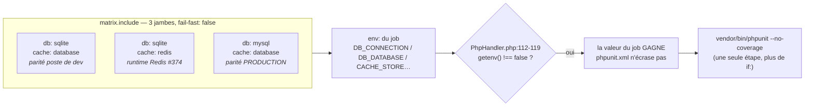

# Design — #574 : jambe MySQL 8 dans la matrice PHPUnit de la CI

## Vue d'ensemble

Un seul job `tests`, une matrice **non cartésienne** de trois jambes, pilotée entièrement par des
variables d'environnement de job. **Aucun fichier applicatif, aucun test, aucune migration,
`phpunit.xml` et `config/database.php` inclus, n'est touché.**



## Décision 1 — Piloter par l'environnement, ne pas toucher `phpunit.xml`

`vendor/phpunit/phpunit/src/TextUI/Configuration/PhpHandler.php:112-119` :

```php
if ($force || getenv($name) === false) {
    putenv("{$name}={$value}");
}
```

Une `<env>` sans `force="true"` **cède** devant une variable déjà exportée. `phpunit.xml:46-47`
documente déjà ce choix (« Pas de `force="true"` : un export shell (`CACHE_STORE=redis` en CI)
doit pouvoir prendre le dessus sans dupliquer ce fichier ») et la jambe `redis` en vit depuis
#374. On étend le mécanisme existant au lieu d'en inventer un second.

**Corollaire vérifié (R6.2)** : sur la jambe `sqlite`, les valeurs injectées par le job sont
*identiques* à celles que `phpunit.xml` fournissait — `sqlite`,
`database/database.testing.sqlite`, `database` pour cache/session/queue. Aucune dérive.

| Variable | phpunit.xml (avant) | job, jambe sqlite (après) | Identique ? |
|---|---|---|---|
| `DB_CONNECTION` | `sqlite` (l.49) | `sqlite` | ✅ |
| `DB_DATABASE` | `database/database.testing.sqlite` (l.50) | idem | ✅ |
| `CACHE_STORE` | `database` (l.48) | `${{ matrix.cache }}` → `database` / `redis` | ✅ |
| `SESSION_DRIVER` | `database` (l.53) | idem matrice | ✅ |
| `QUEUE_CONNECTION` | `database` (l.52) | idem matrice | ✅ |
| `DB_HOST`/`PORT`/`USERNAME`/`PASSWORD` | absentes | exportées | ✅ inertes — le bloc `sqlite` de `config/database.php:34-44` ne les lit pas |

## Décision 2 — Matrice `include:` seule (3 jambes), pas un produit cartésien 2×2

```yaml
matrix:
  include:
    - { db: sqlite, cache: database, db_database: database/database.testing.sqlite }
    - { db: sqlite, cache: redis,    db_database: database/database.testing.sqlite }
    - { db: mysql,  cache: database, db_database: lms_testing }
```

Les deux dimensions sont **orthogonales** : le moteur SQL ne change rien au comportement du store
Redis, et réciproquement. La 4ᵉ combinaison (`mysql` + `redis`) n'apporterait aucun signal que les
trois autres ne donnent pas — elle coûterait une jambe entière pour zéro information.

La jambe MySQL est appariée à `database` et non à `redis` parce que **c'est la configuration de
production** (`GUIDE_DEPLOIEMENT_PRODUCTION.md:95-96` : `CACHE_STORE=database`,
`QUEUE_CONNECTION=database`) : elle valide donc, sur le moteur réel, les tables `cache`,
`sessions` et `jobs` que le `database` store écrit — ce qu'aucune jambe ne fait aujourd'hui.

### Pourquoi `include:` explicite et **jamais** un ternaire `${{ … && … || … }}`

Piège identifié à l'audit, et évité par construction : le test de PHPUnit est
`getenv($name) === false`, **pas** `empty()`. Une variable qu'une expression ternaire GitHub
Actions résout à la chaîne vide est malgré tout **présente** dans l'environnement du process —
`getenv()` retourne `''`, PHPUnit n'écrit donc **pas** la valeur de `phpunit.xml`, et Laravel
reçoit `''`. Un `DB_DATABASE: ${{ matrix.db == 'mysql' && 'lms_testing' || '' }}` ferait
silencieusement tourner la jambe SQLite sur une base nommée chaîne vide.

Porter la valeur dans l'entrée `include:` (`db_database:`) supprime la classe de bug : **aucune
des cinq expressions du bloc `env:` ne peut résoudre à vide**, chaque clé étant définie
explicitement sur les trois jambes.

## Décision 3 — Un seul job, deux services, plutôt que deux jobs

GitHub Actions ne sait pas conditionner un *service container* : le conteneur MySQL démarrera
aussi sur les deux jambes SQLite, qui n'en ont pas l'usage.

**Ce compromis est déjà celui du fichier** : `security.yml` démarre aujourd'hui le service
`redis` sur la jambe `database`, qui ne l'utilise pas. On reste cohérent avec le standard du
fichier (`PRODUCTION_STANDARDS.md` §2 Phase 3) plutôt que d'introduire un second motif.

Coût réel, **mesuré** sur les runs `32573866871` et `32569485575` (branche `lms`) :

| Étape | Aujourd'hui (redis seul) | Après (redis + mysql) |
|---|---|---|
| `Initialize containers` | **9–10 s** | +15–30 s (pull + init `mysql:8.4`) |
| Jambe la plus lente (`redis`) | **72 s** de bout en bout | ≈ 100 s |
| Jambe `mysql` | — | nouvelle ; devient le chemin critique |

Comme les jambes tournent **en parallèle**, l'attente supplémentaire subie par les jambes SQLite
ne rallonge **pas** le portail : le chemin critique devient la jambe MySQL de toute façon. Le
surcoût réel est de l'ordre de **50 s de minutes-runner facturées** par exécution.

### Alternatives écartées (Q12)

1. **Deux jobs distincts (`tests` sqlite / `tests-mysql`)** — économiserait ces ~50 s de
   minutes-runner, au prix de **~45 lignes d'étapes dupliquées** à maintenir pendant 10 ans, avec
   la dérive garantie du jour où quelqu'un modifie l'une et pas l'autre. Rejeté :
   `PRODUCTION_STANDARDS.md` Q5 (« peut-on supprimer de la duplication ? ») pèse plus lourd que
   50 s de facturation.
2. **Workflow réutilisable (`workflow_call`) partagé entre deux jobs** — supprimerait à la fois la
   duplication *et* le conteneur inutile. Rejeté : ajoute un fichier de plomberie, imbrique les
   noms de jobs (`tests / Tests (…)`), et ne gagne rien en temps d'horloge puisque le chemin
   critique reste la jambe MySQL. Complexité non payée par un bénéfice mesurable.
3. **Remplacer SQLite par MySQL partout** — rejeté par R2.1 : SQLite est l'environnement de
   développement local documenté ; le retirer de la CI rendrait invisibles les régressions du
   poste de dev.

## Décision 4 — `mysql:8.4`, version épinglée

`mysql:8` et `mysql:latest` sont des tags **flottants** : le moteur de référence changerait sans
commit. On épingle.

Le choix de `8.4` plutôt que `8.0` :

- `8.4` est la branche **LTS** (support jusqu'en avril 2032) ; `8.0` est en fin de vie. Pour un
  projet à 10 ans, la référence doit être supportée.
- Sur **toutes** les divergences que cette issue vise, `8.0` et `8.4` sont **identiques** :
  `vendor/laravel/framework/src/Illuminate/Database/Connectors/MySqlConnector.php:147-149` montre
  que Laravel applique le même `sql_mode` dès `8.0.11` —
  `ONLY_FULL_GROUP_BY,STRICT_TRANS_TABLES,NO_ZERO_IN_DATE,NO_ZERO_DATE,ERROR_FOR_DIVISION_BY_ZERO,NO_ENGINE_SUBSTITUTION`.
  Le quoting des identifiants, `ENUM`, la longueur de préfixe d'index, l'appariement de types des
  clés étrangères se comportent pareil.
- Sens de l'erreur : si la production tourne en 8.0, une CI en 8.4 est **au moins aussi stricte**
  — elle ne peut pas être verte là où la prod serait rouge sur ces classes de divergence.

**Dette tracée** : la version exacte du moteur de production n'est documentée **nulle part** dans
le dépôt (`GUIDE_DEPLOIEMENT_PRODUCTION.md:21` dit « MySQL » sans version). Si l'hébergeur cPanel
sert en réalité **MariaDB**, l'écart MySQL↔MariaDB (JSON, `CHECK`, séquences) justifie une issue
de suivi. Le changement se ferait alors sur **une seule ligne** (`image:`).

## Décision 5 — `strict` de Laravel plutôt que la configuration du serveur

On ne passe **aucun** `--sql-mode` au conteneur. `config/database.php:59` déclare
`'strict' => true`, et Laravel émet `SET SESSION sql_mode='…'` à chaque connexion
(`MySqlConnector.php:117`). La CI reçoit donc **exactement** le mode de la production, quelle que
soit la configuration du serveur MySQL — le mode est déterminé par le code versionné, pas par
l'hébergeur. C'est aussi ce qui rend le test reproductible en local.

## Décision 6 — Identifiants : utilisateur dédié, root aléatoire

```yaml
env:
  MYSQL_RANDOM_ROOT_PASSWORD: "yes"   # root inutilisé, mot de passe jamais connu
  MYSQL_DATABASE: lms_testing
  MYSQL_USER: lms_test
  MYSQL_PASSWORD: lms_test            # conteneur éphémère, joignable depuis ce job seul
```

- **Aucun identifiant d'administration en clair** dans le dépôt (`PRODUCTION_STANDARDS.md` §1.2).
- L'application se connecte avec un utilisateur **non-root**, comme en production
  (`GUIDE_DEPLOIEMENT_PRODUCTION.md:77` : « `DB_USERNAME=utilisateur_dedie   # jamais root` »).
  Effet de bord recherché : cela **prouve** que les migrations n'exigent aucun privilège
  d'administration. L'image officielle accorde `ALL PRIVILEGES` sur `MYSQL_DATABASE` à
  `MYSQL_USER`, ce qui couvre `CREATE`/`ALTER`/`DROP`/`INDEX`/`REFERENCES` — donc
  `migrate:fresh`, qui ne fait que `SHOW FULL TABLES` + `DROP TABLE` sur ce schéma.
- `MYSQL_PASSWORD` **n'est pas un secret** : il doit être connu simultanément du service et de
  l'application, dans un conteneur détruit à la fin du job. Le passer par `secrets` casserait les
  forks sans rien protéger. Commenté comme tel dans le YAML.

## Décision 7 — Readiness : sonde TCP + preuve applicative

Deux niveaux, parce qu'un seul ne prouve rien :

1. **Healthcheck du conteneur** — `mysqladmin ping -h 127.0.0.1 --silent`.
   Le `-h 127.0.0.1` est essentiel : le point d'entrée de l'image officielle démarre un
   **serveur temporaire en `--skip-networking`** pendant l'initialisation. Une sonde par
   *socket* le déclarerait « prêt » alors que le port TCP n'est pas encore ouvert ; en forçant
   TCP, la sonde ne réussit qu'une fois le vrai serveur en écoute.
   `--health-start-period 30s` évite de consommer les tentatives pendant l'initialisation.
2. **Preuve applicative** — une étape ouvre une connexion **PDO avec les identifiants de
   l'application, sur la base attendue**. Un port ouvert n'est pas une base utilisable :
   l'utilisateur `lms_test` et le schéma `lms_testing` sont créés *après* le démarrage du
   serveur. (`feedback_5_questions_protocol` : « no errors » ≠ « comportement vérifié ».)

La même étape consigne `VERSION()` et `@@GLOBAL.sql_mode` : **la preuve de ce qui a été testé est
dans le log du run**, pas dans une affirmation de PR (critère de fermeture #574).
`@@GLOBAL.sql_mode` est le mode du *serveur* ; le mode réellement appliqué est celui que Laravel
impose par session (Décision 5) — le YAML le dit explicitement pour ne pas laisser croire le
contraire.

## Décision 8 — Étape de migration dédiée sur la jambe MySQL

```yaml
- name: Run migrations on MySQL (signal de diagnostic isolé)
  if: matrix.db == 'mysql'
  run: php artisan migrate --force --no-interaction
```

`RefreshDatabase` relance de toute façon `migrate:fresh` une fois par process
(`vendor/…/Testing/RefreshDatabase.php:83-90` et `:119`). Ce passage est donc **redondant sur le
plan fonctionnel** — et **délibéré sur le plan du diagnostic** :

> Cette jambe est **attendue rouge à sa première exécution** (énoncé de #574). Si les migrations
> ne passent pas sous MySQL, on veut *une* étape rouge nommée « Run migrations on MySQL », pas
> 1 446 tests en erreur dans un log de 40 000 lignes.

Coût : ~20 s, sur la seule jambe MySQL. Compromis assumé et écrit, pas masqué.

Vérifié : `AppServiceProvider::boot()` (`app/Providers/AppServiceProvider.php:101-142`) ne touche
ni la base ni le cache — `php artisan migrate` démarre donc proprement sur une base vide avec
`CACHE_STORE=database`.

## Décision 9 — Fusion des deux étapes PHPUnit en une seule

Aujourd'hui, `security.yml:266-281` porte deux étapes `Run PHPUnit suite (redis)` et
`(database)` gardées par `if: matrix.leg == …`. Avec une deuxième dimension, ce motif produirait
3 ou 4 étapes quasi identiques.

Puisque tout l'environnement vient désormais du bloc `env:` du job (Décision 1), **une seule
étape sans `if:`** suffit :

```yaml
- name: Run PHPUnit suite
  run: vendor/bin/phpunit --no-coverage
```

Net : −1 étape, −2 conditions, et l'ajout d'une future jambe ne coûte qu'une ligne de matrice.

## Ce que le correctif ne fait PAS (périmètre)

- Il **ne corrige aucun** test ni aucune migration que la jambe MySQL fera tomber. C'est le but
  déclaré de l'issue de les révéler ; leur traitement appartient à #575 / #580 / #583.
- Il ne crée **pas** de `.env.testing` : Laravel charge `.env.{APP_ENV}` en priorité, un tel
  fichier versionné écraserait silencieusement les variables du job (R6.3).
- Il ne touche **pas** au job `docs-sync`, qui exécute `--filter OpenApiSyncTest` — ce test
  n'utilise pas `RefreshDatabase` et ne touche pas la base : une jambe MySQL n'y apporterait
  aucun signal. Vérifié par exécution : la suite `OpenApiSyncTest` passe même en pointant
  `DB_DATABASE` sur un chemin inexistant (Laravel connecte paresseusement, ce test n'ouvre
  jamais la connexion). ⚠️ Corollaire à retenir : l'étape `Prepare sqlite test database` de
  `docs-sync` (`security.yml:154-155`) reste nécessaire au titre de la ceinture-bretelles ; ne
  pas la supprimer en croyant « nettoyer le SQLite ».
- **Périmètre d'impact borné à 1 job sur 9.** Vérifié étape par étape : `phpstan-analysis` boote
  bien Larastan (`vendor/larastan/larastan/bootstrap.php:31`) mais n'ouvre jamais de connexion —
  les propriétés de modèles sont déduites du **parsing statique des migrations**
  (`src/Properties/MigrationHelper.php:75`), pas d'un schéma vivant ; et les 7 autres jobs
  (`composer-audit`, `dependency-review`, `semgrep-sast`, `commitlint`, `sdk-generation`,
  `file-size-guard`, `docs-sync`) n'exécutent ni `artisan` ni PHPUnit contre la base.
- Il ne renomme rien d'autre que le job `tests`. Vérifié : le libellé
  `Tests (PHPUnit — ${{ matrix.leg }})` n'est référencé **nulle part** ailleurs dans le dépôt, et
  la branche `lms` **n'a aucune protection ni ruleset** (`gh api …/branches/lms/protection` →
  404 ; `…/rulesets` → `[]`) — le renommage ne casse donc aucun *required check*.

## Stratégie de test (honnête)

Le poste de développement dispose de Docker et de `pdo_mysql` : la jambe MySQL a donc été
**réellement exécutée en local** contre un `mysql:8.4` configuré à l'identique du service CI, au
lieu d'être simplement déclarée « non testable ».

| Vérifié, avec la mesure | Résultat |
|---|---|
| Validité syntaxique du workflow | parseur YAML — OK |
| Validité syntaxique de la sonde PHP | `php -l` — OK ; chemin d'échec testé contre un port fermé → sortie 1, message sur `STDERR`, aucune fatale |
| `mysqladmin ping -h 127.0.0.1 --silent` existe et fonctionne dans `mysql:8.4` | `docker exec` → sortie 0 ; conteneur `healthy` en ~28 s sur Docker Desktop Windows (dans les `--health-start-period 30s`) |
| L'étape de readiness applicative | exécutée telle quelle → connexion à la 1ʳᵉ tentative, `version = 8.4.11`, `sql_mode` serveur relevé |
| **Les 69 migrations passent sur MySQL 8.4** | `migrate:fresh --force` → **sortie 0, 69 migrations vertes**, avec l'utilisateur **non-root** `lms_test` et le mode strict Laravel |
| `dropAllTables()` fonctionne malgré les clés étrangères | prouvé : le `migrate:fresh` est parti d'une base contenant déjà des tables liées par FK |
| Non-régression de la jambe SQLite | suite complète relancée en local sur SQLite |
| Équivalence des variables sqlite avant/après | tableau de la Décision 1, ligne à ligne contre `phpunit.xml` |
| Mécanique de surcharge PHPUnit | lue dans `vendor/` (`PhpHandler.php:112-119`) |
| Périmètre d'impact | 1 job sur 9 (vérifié étape par étape) |

Conséquence directe sur les attentes : **l'étape « Run migrations on MySQL » sera verte**. Les
échecs attendus de cette jambe viendront donc des **tests**, pas du schéma — ce qui oriente le
tri vers #575 / #580 plutôt que vers un problème de migration.

| Ce qui reste non vérifiable ici | Pourquoi |
|---|---|
| Le temps réel de la jambe sur un runner Linux | Docker Desktop/Windows ajoute une latence TCP importante : le cumul local des migrations (109,7 s) n'est **pas** transposable. Se mesurera au premier run. |
| La liste définitive des tests qui tombent | Dépend de la version exacte du moteur et de l'ordre d'exécution ; le run local en donne une première liste, la CI fait foi. |

Aucune de ces limites n'est contournée par un test qui « passerait » sans rien prouver.
