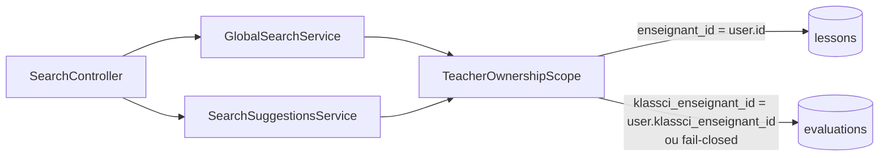

# Design — #575 · colonnes fantômes dans la recherche

## 1. Décision d'identité — quelle valeur comparer ?

C'est le point n° 2 du correctif attendu de #575 : « vérifier laquelle des deux
valeurs comparer avant de figer le correctif, sinon on remplace un filtre qui ne
matche jamais par un filtre qui matche mal ». La réponse est différente pour les
deux modèles, et elle est **tranchée par l'écrivain de la colonne**, pas par le
commentaire de migration.

### 1.1 `lessons.enseignant_id` → comparer à `$user->id` (id LOCAL)

Le commentaire de migration dit « ID enseignant KLASSCI »
(`2025_10_14_160000_create_lessons_table.php:20`). **Ce commentaire est faux**
au regard de tout ce que le code fait réellement de la colonne :

| Preuve | Fichier:ligne | Sémantique |
|---|---|---|
| **Écrivain unique** (création LMS) | `LessonCrudOperationsService.php:43` — `$data['enseignant_id'] = $author->id;` | id local |
| Relation Eloquent | `Lesson.php:77` — `belongsTo(User::class, 'enseignant_id')` | id local (FK `users.id`) |
| Autorisation suppression | `DeleteLessonRequest.php:49` — `$lesson->enseignant_id !== $user->id` | id local |
| Autorisation modification | `UpdateLessonRequest.php:58` | id local |
| Autorisation publication | `PublishLessonRequest.php:52` / `UnpublishLessonRequest.php:51` | id local |
| Autorisation chapitres | `UpdateChapterRequest.php:54` / `DeleteChapterRequest.php:49` / `ReorderChaptersRequest.php:53` | id local |
| Tableau de bord enseignant | `TeacherDashboardService.php:55,56,59,95,142,232` | id local |
| Factory de test | `LessonFactory.php:22` — `User::factory()` | id local |

Recherche exhaustive des écrivains (`Lesson::create` / `firstOrCreate` /
`new Lesson(` / `table('lessons')`) : **aucun chemin d'import KLASSCI n'écrit
un id KLASSCI dans cette colonne**. Les seuls écrivains sont
`LessonCrudOperationsService.php:85` et `DemoDataSeeder.php:128`.

Objection anticipée — « mais `LessonListService::applyEnseignantFilter` et
`MyCoursesPresenter::preloadEnseignants` acceptent les deux ». Relecture :
ces deux-là traitent l'ambiguïté de la **valeur entrante** (le frontend envoie
un `klassci_id` dans le paramètre de requête `?enseignant_id=`), pas celle de la
valeur **stockée**. Ils résolvent d'abord l'utilisateur
(`LessonListService.php:170`) puis matchent les deux, en ceinture-bretelles.
Ici, il n'y a aucune ambiguïté d'entrée : la valeur vient du token Sanctum,
côté serveur — on sait exactement de quel utilisateur il s'agit.

**Rejet explicite de la variante « tolérante »** (`enseignant_id = $user->id
OR enseignant_id = $user->klassci_id`) : elle introduirait une fuite réelle par
collision d'identifiants (l'enseignant A d'id local 7 verrait les leçons d'un
enseignant B de `klassci_id` 7), pour couvrir un chemin d'écriture **qui
n'existe pas**. Un filtre d'appartenance se ferme, il ne s'ouvre pas « au cas où ».

> Contradiction constatée, hors périmètre : `TeacherStatsService.php:48` compare
> cette même colonne à `$user->klassci_enseignant_id`. Au vu du tableau ci-dessus,
> c'est ce service-là qui est fautif (compteur de leçons à 0 sur le tableau de bord),
> pas les huit autres appelants. Remonté dans la PR, non corrigé ici.

### 1.2 `evaluations.klassci_enseignant_id` → comparer à `$user->klassci_enseignant_id`

| Preuve | Fichier:ligne |
|---|---|
| **Écrivain unique** | `EvaluationCreationService.php:110` — `'klassci_enseignant_id' => $teacher->klassci_enseignant_id` |
| Autorisation (issue #119, colonne write-once d'autorité) | `ChecksEvaluationOwnership.php:99-101` |
| Garde de création | `EvaluationCrudController.php:84` — refus si `klassci_enseignant_id === null` |
| Compteurs | `TeacherStatsService.php:47` |

`users.klassci_id` (identité utilisateur KLASSCI) et `users.klassci_enseignant_id`
(identité **enseignant** KLASSCI) coïncident parfois — `KlassciEnseignantIdResolver.php:41-47`
retombe sur `klassci_id` quand le tenant ne fournit pas d'`enseignant_id` dédié —
mais **pas toujours**. La colonne dédiée est l'autorité désignée par #119 ; c'est
elle qu'on compare. (`EvaluationEnrichmentService.php:177` utilise `klassci_id`
pour un simple affichage de nom : incohérence pré-existante, hors périmètre.)

### 1.3 Fail-closed sur `klassci_enseignant_id = NULL`

`Illuminate\Database\Query\Builder::where()` (Laravel 12.62.0,
`vendor/laravel/framework/src/Illuminate/Database/Query/Builder.php:936-938`)
réécrit `where($col, null)` en `whereNull($col)`. Écrire naïvement
`$q->where('klassci_enseignant_id', $user->klassci_enseignant_id)` pour un
enseignant sans identité KLASSCI produirait donc
`WHERE klassci_enseignant_id IS NULL` → **toutes** les évaluations orphelines du
tenant remontent. On remplacerait un filtre toujours-faux par un filtre
ouvre-tout : strictement pire que le bug corrigé.

Le correctif ferme explicitement : aucun résultat. Cohérent avec
`ChecksEvaluationOwnership.php:99-101`, qui refuse déjà l'accès dans ce cas.

## 2. Architecture

### 2.1 Problème à résoudre au-delà du symptôme

La même règle d'appartenance est réécrite à la main dans **4 endroits**, sur
2 services. C'est précisément ce qui a permis au défaut d'exister en 4 exemplaires
et d'y rester. Corriger 4 chaînes de caractères laisserait la cause intacte
(PRODUCTION_STANDARDS §4 Q1 « racine, pas symptôme » ; Q5 « peut-on supprimer de
la duplication ? »).

La connaissance dupliquée est : *quelle colonne identifie l'enseignant propriétaire,
et quelle valeur de l'utilisateur y comparer*. Elle est extraite dans un
collaborateur unique.

### 2.2 Composant ajouté

```
app/Services/Search/TeacherOwnershipScope.php   (nouveau, ~55 lignes)
```

```php
final class TeacherOwnershipScope
{
    public function applyToLessons(Builder $query, User $teacher): void;
    public function applyToEvaluations(Builder $query, User $teacher): void;
}
```

Injecté par le conteneur dans les deux services (§1.6 D — aucune Facade, aucun
`new`, aucun `app()`). Aucune dépendance propre → auto-wiring, aucun binding à
déclarer. Les deux services existants ne sont instanciés nulle part avec `new`
(vérifié : `grep -rn "new GlobalSearchService(\|new SearchSuggestionsService("`
sur `app/` et `tests/` = 0 occurrence), l'ajout d'un paramètre de constructeur
ne casse donc aucun appelant.



### 2.3 Alternatives écartées (§4 Q12)

1. **Scopes locaux sur les modèles** (`Lesson::scopeOwnedByTeacher`,
   `Evaluation::scopeOwnedByTeacher`). C'était le premier choix : idiomatique
   Laravel, colocalisé avec `belongsTo()`, réutilisable par les tableaux de bord.
   **Écarté sur une mesure, pas une préférence** : la garde CI
   `scripts/check-file-sizes.php` plafonne les modèles à 150 lignes brutes
   (PRODUCTION_STANDARDS §5) ; `Lesson.php` est déjà à **137** lignes et
   `Evaluation.php` à **125**. Un scope documenté (la décision d'identité du §1
   *doit* être écrite là où elle est encodée — critère de fermeture de #575)
   coûte 12 à 16 lignes → `Lesson.php` passerait à ~151 et ferait échouer la
   garde. Faire tenir la décision dans un commentaire d'une ligne pour rentrer
   sous le plafond serait sacrifier la documentation au quota.
2. **Interface `TeacherOwnershipFilter` + deux implémentations**
   (`LessonTeacherOwnership`, `EvaluationTeacherOwnership`), injectées séparément.
   Écarté : les deux implémentations ne sont **jamais** substituables au même
   point d'appel — le service qui filtre des leçons n'utilisera jamais celle des
   évaluations. Une interface dont les implémentations ne s'échangent nulle part
   est une indirection nominale, pas une abstraction ; elle échoue au test de
   Liskov utile (§1.6 L) tout en ajoutant 3 fichiers et un binding.
3. **Corriger les 4 chaînes sur place, sans extraction.** Écarté : laisse la
   duplication qui a produit le défaut ×4 ; le 5ᵉ appelant réintroduira l'erreur.

### 2.4 Ce que le composant ne fait PAS

Il ne décide pas *qui* est soumis au filtre. Le dispatch par rôle
(`isTeacher()` / `isStudent()`) reste dans les services : c'est une règle métier
de la recherche, pas une propriété de l'appartenance. Le scope ne connaît qu'une
chose : quelle colonne et quelle valeur identifient les lignes d'un enseignant
(SRP §1.6 S).

## 3. Modifications par fichier

### `app/Services/Search/GlobalSearchService.php`

- Constructeur : + `private readonly TeacherOwnershipScope $ownership`.
- `searchLessons()` l.155-162 : `$q->where('teacher_id', $user->id)` →
  `$this->ownership->applyToLessons($q, $user)`.
- `searchEvaluations()` l.182-193 : idem avec `applyToEvaluations`, **et**
  `'title'` → `'titre'` dans le `where`/`orWhere` (l.183).
- `searchEvaluations()` l.198 : `'title' => $evaluation->title` →
  `'title' => $evaluation->titre` (clé de réponse inchangée = contrat client
  préservé ; seule la valeur, jusqu'ici toujours `null`, devient correcte).
- Docblock de classe l.30-35 : la mention « bugs historiques conservés verbatim »
  est mise à jour — c'est le seul endroit qui autorisait le lecteur à croire que
  `teacher_id` était intentionnel.

### `app/Services/Search/SearchSuggestionsService.php`

- Constructeur (n'en avait aucun) : + `private readonly TeacherOwnershipScope $ownership`.
- l.54-62 (leçons) : closure → `applyToLessons`.
- l.66-74 (évaluations) : closure → `applyToEvaluations`, `where('title', …)` →
  `where('titre', …)`, `pluck('title')` → `pluck('titre')`.

Tailles après modification : les deux fichiers restent très en deçà des 300
lignes (§1.1) ; toutes les méthodes restent sous 40 lignes (§5).

## 4. Stratégie de test

TDD strict : chaque test est écrit et exécuté **avant** le correctif, et son
échec observé.

`tests/Feature/Search/SearchTeacherScopingTest.php` (nouveau) — HTTP de bout en
bout via `/api/search` et `/api/search/suggestions`, pattern AAA, deux
enseignants de la **même** institution (le cloisonnement recherché ici est
inter-enseignant, pas inter-tenant — ce dernier est déjà couvert par le scope
global `BelongsToInstitution`).

| Test | Exigence | État attendu AVANT correctif (SQLite) |
|---|---|---|
| `test_teacher_finds_own_lesson` | REQ-1 | ROUGE — 0 résultat (`'teacher_id' = id` est faux) |
| `test_teacher_does_not_find_colleague_lesson` | REQ-2 | VERT à tort (0 pour la mauvaise raison) — garde de non-régression |
| `test_teacher_finds_own_evaluation` | REQ-3 | ROUGE — 0 résultat |
| `test_teacher_does_not_find_colleague_evaluation` | REQ-4 | VERT à tort — garde de non-régression |
| `test_teacher_without_klassci_identity_sees_no_evaluation` | REQ-5 | ROUGE après un correctif naïf (`whereNull` ⇒ fuite) — garde anti-régression du fail-closed |
| `test_suggestions_scope_lessons_and_evaluations_to_owner` | REQ-6 | ROUGE |
| `test_evaluation_search_does_not_match_every_row` | REQ-8 | ROUGE — `'title' LIKE '%le%'` remonte tout |

Les tests « VERT à tort » sont conservés : ce sont les gardes qui empêchent le
correctif d'ouvrir ce que le bug fermait par accident (REQ-2, REQ-4). Le
document `requirements.md` le dit explicitement pour qu'aucun relecteur ne les
prenne pour des tests inutiles.

`tests/Unit/Services/Search/TeacherOwnershipScopeTest.php` (nouveau) — teste le
collaborateur isolément sur le SQL produit (`toSql()` / `getBindings()`), y
compris la branche fail-closed : c'est la seule façon de prouver qu'aucun
`is null` n'est émis, indépendamment des données en base.

### Limite assumée du RED sous SQLite (§4 Q15 — ce qui invaliderait ce design)

Sous SQLite, le défaut se manifeste par **0 résultat** ; sous MySQL, par un
**500**. Les tests ci-dessus attrapent les deux (un 500 fait échouer
`assertOk()`), mais la preuve du mode « 1054 » n'existera qu'une fois la jambe
MySQL de #574 mergée. Ce que #574 pourrait invalider : si, sur MySQL, l'un des
assertions de valeur échouait pour une raison de collation (`LIKE` sensible à la
casse selon la collation de la colonne), les jeux de données des tests devraient
être ajustés. Les termes de recherche des tests sont donc choisis **sans
accents et dans la même casse** que les données insérées, ce qui neutralise la
divergence de collation la plus probable.
