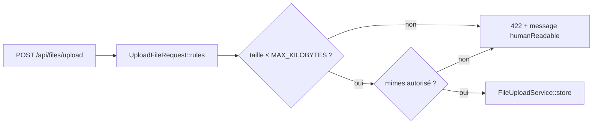

# Design — #576 : limite d'upload en kilo-octets, source unique

## Décision (solution unique, §6)

Introduire **une source unique typée** pour la limite d'upload, exprimée dans l'unité exacte
de la règle `max` de Laravel (le **kilo-octet**), et faire dériver de cette source :
1. la règle `max` des deux `FormRequest` ;
2. la représentation lisible « 30 MB » des messages d'erreur et de `getMaxFileSize()`.

### Preuve du comportement (Q14 — source citée)

Documentation officielle Laravel, section « Size Rule » de `validation.md` :

> « The size rule validates data based on its type: string length for strings, integer value
> for numbers, element count for arrays, and **file size in kilobytes for uploaded files.** »

Exemple officiel : `'image' => ['file', 'size:512']` valide un fichier de **512 kilo-octets**.
La règle `max` partage cette unité. Donc `max:31457280` = 31 457 280 Ko ≈ **30 Go**, et la
valeur correcte pour 30 Mo est `30 × 1024 = 30 720` Ko.
Source : https://github.com/laravel/docs/blob/13.x/validation.md

## Composant nouveau : `App\Support\Upload\UploadLimits`

Classe finale, sans état, à responsabilité unique (SRP) : détenir et exposer la limite.

```php
namespace App\Support\Upload;

final class UploadLimits
{
    /**
     * Taille maximale d'un fichier uploadé, en KILO-OCTETS.
     *
     * ⚠️ L'unité est le kilo-octet : c'est celle de la règle `max`/`size` de
     * Laravel pour un fichier (doc « Size Rule » : « file size in kilobytes »).
     * Écrite `30 * 1024` pour rendre visibles le « 30 Mo » et la conversion, et
     * empêcher la régression historique (#576 : `31457280` = 30 Mo en OCTETS,
     * interprété comme 30 Go en Ko).
     *
     * Doit rester ≤ `upload_max_filesize` / `post_max_size` côté PHP, sinon PHP
     * coupe avant la validation (relation documentée dans le guide de déploiement,
     * porté par #577).
     */
    // Constante NON typée : le projet cible `php: ^8.2` et les constantes de
    // classe typées sont 8.3+. `30 * 1024` reste inféré `int`.
    public const MAX_KILOBYTES = 30 * 1024; // 30 Mo = 30 720 Ko

    /** Fragment de règle Laravel prêt à l'emploi : « max:30720 ». */
    public static function maxRule(): string
    {
        return 'max:' . self::MAX_KILOBYTES;
    }

    /** Représentation lisible pour l'utilisateur : « 30 MB ». */
    public static function humanReadable(): string
    {
        return intdiv(self::MAX_KILOBYTES, 1024) . ' MB';
    }
}
```

Pourquoi une **constante `int`** et non une valeur de config (`config('uploads.max_kb')`) :
- La limite est un **invariant de sécurité** (protection anti-DOS disque). La rendre
  modifiable par variable d'environnement rouvrirait la porte à la régression que l'issue
  corrige (un ops peut remettre 30 Go). Un `const int` typé est le garde-fou le plus fort.
- PHPStan level 9 : `config()` renvoie `mixed` et imposerait des casts partout ; une constante
  `int` est typée à la source, zéro cast.
- La cohérence avec `php.ini` (`upload_max_filesize`) ne peut de toute façon pas être assurée
  par une valeur de config applicative — c'est une vérification de déploiement (documentée).

## Modifications des `FormRequest`

### `UploadFileRequest`
- Règle : `'file' => ['required','file', UploadLimits::maxRule(), 'mimes:...']`.
- Message : `'file.max' => 'Le fichier ne doit pas dépasser ' . UploadLimits::humanReadable()`.
- `getMaxFileSize()` : `return UploadLimits::humanReadable();` (dérive de la source unique).
- Docblock : corriger « 31457280 bytes » → « 30 720 Ko (30 Mo) ».

### `StoreChapterRequest`
- Règle : `'fichier' => ['sometimes','file', UploadLimits::maxRule(), 'mimes:pdf,doc,docx,ppt,pptx']`.
- Message : `'fichier.max' => 'Le fichier ne doit pas dépasser ' . UploadLimits::humanReadable()`.

Aucune autre règle des deux requests n'est touchée (R5.3).

## Flux de validation (inchangé hormis la borne)



## Stratégie de test (TDD)

Cas **RED** (échouent avec `max:31457280`, passent avec `max:30720`) ajoutés aux deux suites
de `FormRequest` :

| Test | Entrée | Attendu |
|---|---|---|
| fichier 40 Mo (40 960 Ko) | `UploadedFile::fake()->create('big.pdf', 40*1024, 'application/pdf')` | 422 |
| fichier 31 Mo (31 744 Ko) | `... 31*1024 ...` | 422 + `errors.file` |
| fichier 29 Mo (29 696 Ko) | `... 29*1024 ...` | ≠ 422 (accepté) |
| borne 30 Mo (30 720 Ko) | `... 30*1024 ...` | ≠ 422 (accepté) |
| borne 30 Mo + 1 Ko (30 721 Ko) | `... 30*1024+1 ...` | 422 |

Correction des tests existants mal étiquetés (`31457280` Ko = 30 Go commenté « 30 MB »,
`104857600` Ko = 100 Go commenté « 100 MB ») → valeurs KB réelles.

Test unitaire de `UploadLimits` : `MAX_KILOBYTES === 30720`, `maxRule() === 'max:30720'`,
`humanReadable() === '30 MB'` (garde-fou direct contre la régression numérique).

Note `UploadedFile::fake()->create($name, $sizeInKb)` : le 2ᵉ argument est en **kilo-octets**
(cohérent avec l'unité de la règle), ce qui rend l'assertion lisible et non ambiguë.

## Alternatives écartées (Q12)

1. **Builder fluent `File::types([...])->max('30mb')`** (Laravel 10+). Le suffixe `'30mb'`
   auto-documente l'unité et éliminerait l'ambiguïté au site d'appel. **Rejetée** : impose de
   remplacer `mimes:` par `->extensions()`/`->types()` dans les deux requests (changement de
   surface plus large que le correctif), et l'auto-documentation reste locale au site d'appel
   alors que la constante centralise ET documente à la source. L'issue prescrit `max:30720`.
2. **Valeur de configuration `config/uploads.php`**. **Rejetée** : voir « Pourquoi une
   constante » — invariant de sécurité + coût PHPStan `mixed`, sans bénéfice réel de cohérence
   php.ini.

## Critère d'invalidation (Q15)

Serait invalidé si : `UploadedFile::fake()->create('f', 30*1024)` était rejeté (borne trop
stricte), OU si un fichier de 40 Mo était accepté (borne toujours en octets), OU si PHPStan
signalait un `mixed` sur la nouvelle constante. Les tests ci-dessus couvrent ces trois cas.

## Projection 10× (Q13)

La limite est unitaire (par fichier), indépendante du nombre d'utilisateurs. À 200 000
utilisateurs, un envoi reste plafonné à 30 Mo → la surface d'attaque « saturation disque par
un envoi » passe de ~30 Go à 30 Mo par requête. Aucun état partagé, aucune contention.
