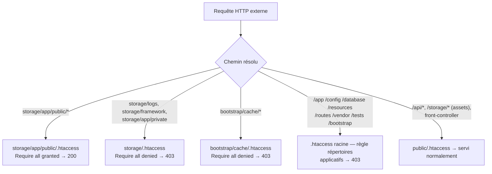

# Design — #577 : blocage HTTP de `storage/` indépendant du DocumentRoot

## Vue d'ensemble

Défense en profondeur, **4 couches**, aucune action serveur. On prolonge le mécanisme et le
style de #537 (protection `.htaccess` lue le long du chemin filesystem résolu, robuste au
préfixe de sous-répertoire, replis Apache 2.4/2.2).



## Décision structurante : pourquoi `storage/` n'est PAS dans la règle racine

L'énoncé de l'issue propose une règle racine unique
`^/(storage|app|bootstrap|config|database|resources|routes|vendor|tests)/`.
**On dévie volontairement sur deux points, pour cause de correction (Q1/Q2 self-critique) :**

1. **`storage` est retiré de la règle racine.** `/storage/…` est une **URL publique légitime**
   (symlink `public/storage` → `storage/app/public/`, cf. `config/filesystems.php:77`) qui sert
   les diapositives converties et les vidéos de chapitre, chargées directement par le navigateur.
   Le `.htaccess` racine est lu même en configuration nominale (mécanisme #537 : Apache remonte
   les `.htaccess` ancêtres du chemin filesystem résolu). Une règle racine `(…|storage|…)`
   répondrait donc **403 sur `/storage/slide.png`** → régression cassant l'affichage des cours.
   `storage/` est protégé à la place par un `.htaccess **dans** storage/` (couche 1), avec une
   **exception** pour `storage/app/public/` (couche 2).

2. **Ancrage `^(/[^/]+)?/` au lieu de `^/`.** Le `^/` de l'issue ne couvre que le DocumentRoot
   = racine appli ; il **rate `/lms-backend/app/…`** (DocumentRoot = `public_html`), qui est
   pourtant le scénario même de l'issue. On généralise à « répertoire nommé en 1er **ou** 2e
   segment » : `^(/[^/]+)?/(app|…)/`. On n'emploie **pas** le `(^|/)` de #537 (qui matcherait le
   nom **n'importe où** dans le chemin) car, contrairement aux fichiers-point, un nom comme
   `config` **pourrait** apparaître en profondeur d'une future route API (`/api/x/config/reset`)
   → `(^|/)` créerait un faux positif latent. L'ancrage 1er/2e segment couvre les deux formes de
   déploiement réelles sans ce risque (vérifié : aucune route actuelle ne commence par ces noms).

## Couche 1 — `storage/.htaccess` (deny)

```apache
# Défense en profondeur — issue #577 (suite de #537).
# storage/ contient les journaux (storage/logs), le cache/sessions/vues compilées
# (storage/framework) et les uploads PRIVÉS (storage/app/private). Aucun de ces
# chemins ne doit être accessible en HTTP direct. Ce fichier est DANS storage/,
# donc Apache le lit le long du chemin filesystem résolu quel que soit le
# DocumentRoot (protection indépendante de la config serveur — cf. #537).
# Exception : storage/app/public/ (assets publics servis par le symlink /storage)
# est ré-autorisé par storage/app/public/.htaccess.
<IfModule mod_authz_core.c>
    Require all denied
</IfModule>
<IfModule !mod_authz_core.c>
    Order allow,deny
    Deny from all
</IfModule>
```

## Couche 2 — `storage/app/public/.htaccess` (grant, non-régression R2)

```apache
# Exception au Require all denied de storage/.htaccess (#577).
# storage/app/public/ est la racine du disque « public » Laravel (storage:link) :
# diapositives PNG converties et vidéos de chapitre, servies publiquement via le
# symlink public/storage. On ré-autorise explicitement ce sous-arbre (la directive
# de la sous-arborescence l'emporte sur celle héritée de storage/.htaccess).
<IfModule mod_authz_core.c>
    Require all granted
</IfModule>
<IfModule !mod_authz_core.c>
    Order allow,deny
    Allow from all
</IfModule>
```

> Portée de l'exception : `storage/app/public/` est la racine du disque « public » Laravel —
> **tout** ce qui y est déposé est servi sans authentification via le symlink `/storage`. Le
> grant préserve le service des assets légitimement publics (diapositives, vidéos). Les uploads
> **privés génériques** (`FileUploadService`) vont sur le disque `local` (`storage/app/private/`),
> hors exception, donc couverts par le deny.
>
> ⚠️ **Dette de sécurité tracée (pré-existante, hors périmètre #577).** Le pipeline de conversion
> (`PdfConverter:58`, `WordConverter:67`/`:102`, `PowerPointConverter:75`) écrit les documents
> **originaux bruts** et le **HTML plein-texte** sur le disque `public` → lisibles sans contrôle
> d'accès via `/storage/chapters/{id}/original|html/…`. #577 (couche `.htaccess`) ne crée ni
> n'aggrave cette exposition (le symlink la servait déjà), mais ne la corrige pas : c'est une
> **issue de suivi** (déplacer originaux + HTML vers le disque `local` + download authentifié).
> Découverte par l'audit `spec-security` de #577.
>
> Source (Q14) : en Apache 2.4, l'autorisation d'un contexte per-directory plus spécifique
> **remplace** celle héritée du parent (les directives `Require` du répertoire le plus proche de
> la ressource s'appliquent) — c'est le mécanisme sur lequel repose le pattern `storage:link` de
> Laravel. Doc : [Apache `mod_authz_core` — `Require`](https://httpd.apache.org/docs/2.4/mod/mod_authz_core.html#require).

## Couche 3 — `bootstrap/cache/.htaccess` (deny)

Même contenu que la couche 1. `bootstrap/cache/` contient `config.php` / `routes.php` /
`services.php` compilés — `config.php` inclut les **secrets résolus** de `config:cache`
(credentials DB, tokens). Blocage HTTP direct obligatoire.

## Couche 4 — `.htaccess` racine, extension (R4)

On **ajoute** au fichier #537 (sans rien retirer) une règle pour les répertoires applicatifs
n'ayant aucune URL publique légitime. La règle des fichiers-point (#537) reste en tête.

```apache
# #577 : refuse les répertoires applicatifs (aucune URL publique légitime).
# storage EXCLU volontairement : /storage/ est public (symlink) — protégé par
# storage/.htaccess + exception storage/app/public/.htaccess. Ancrage 1er/2e
# segment : couvre /app/… (DocumentRoot=racine) ET /lms-backend/app/…
# (DocumentRoot=public_html) sans faux positif sur une route profonde.
RewriteCond %{REQUEST_URI} ^(/[^/]+)?/(app|bootstrap|config|database|resources|routes|vendor|tests)/ [NC]
RewriteRule ^ - [F,L]
```

Repli `<IfModule !mod_rewrite.c>` : `RedirectMatch 403 ^(/[^/]+)?/(app|bootstrap|config|database|resources|routes|vendor|tests)(/|$)`.

## `.cpanel.yml` (R5) — aucune modification

Le rsync `--exclude='.git' --exclude='.env*' --exclude='tests' --exclude='.claude'` **n'exclut
ni** les `.htaccess` **ni** `storage/`/`bootstrap/`. Les 4 fichiers sont donc transportés.
Vérifié — on ne touche pas `.cpanel.yml` (éviter tout risque sur le mécanisme de déploiement).
`tests/` est exclu du déploiement : le test PHPUnit de contenu (R7) n'a donc aucun impact prod.

## Documentation (R6) — `GUIDE_DEPLOIEMENT_PRODUCTION.md`

- §4 Sécurité : mentionner la défense en profondeur `storage/` + `bootstrap/cache/` + règle
  racine (indépendante du DocumentRoot).
- §5 Vérifications : ajouter `curl -I …/lms-backend/storage/logs/laravel.log` → **403** attendu,
  et `curl …/storage/<un asset public>` → **200** (non-régression R2).
- §4 : note **upload (coordination #576)** — la limite applicative 30 Mo n'est effective que si
  `upload_max_filesize`/`post_max_size` ≥ 30 Mo, sinon PHP coupe avant la validation.

## Tests (R7) — garde-fou de contenu, honnête

Un test PHPUnit lisant les `.htaccess` versionnés et vérifiant la présence des directives
protectrices (`Require all denied` dans `storage/`/`bootstrap/cache/`, `Require all granted` dans
`storage/app/public/`, règle des répertoires applicatifs + exclusion de `storage` + préservation
de la règle fichiers-point #537 dans le racine). **Ce test ne prouve pas** le comportement
d'Apache (non exécuté en CI) — il **garde contre une suppression/altération accidentelle** de la
protection versionnée. Limite déclarée explicitement (même posture que #537 §5, mais l'issue #577
demande de « tester ce qui est testable » : le contenu l'est, le comportement Apache non).

## Alternatives écartées (Q12)

1. **Règle racine unique incluant `storage` (proposition littérale de l'issue).** Rejetée :
   casse `/storage/` (assets publics légitimes). Voir « Décision structurante ».
2. **Un `.htaccess deny` par sous-dossier sensible** (`storage/logs/`, `storage/framework/`,
   `storage/app/private/`). Rejetée : plus de fichiers, et **rate tout futur sous-dossier** de
   `storage/`. Le deny au niveau `storage/` + grant ciblé `app/public/` est exhaustif et
   auto-adaptatif.
3. **Modifier le DocumentRoot / config Apache côté serveur.** Rejetée : nécessite un accès
   WHM/SSH (indisponible) et n'est pas versionné — exactement le défaut que ce correctif corrige.

## Critère d'invalidation (Q15)

Serait invalidé si, après déploiement : `curl -I …/storage/logs/laravel.log` renvoyait **200**
(protection inactive → vérifier `AllowOverride` du vhost et le DocumentRoot), OU si
`curl …/storage/<asset public>` renvoyait **403** (exception public cassée → régression R2), OU
si une route API légitime renvoyait 403 (faux positif de la règle racine → resserrer l'ancrage).

## Projection 10× (Q13)

Protection binaire (bloque ou non), sans état ni charge : un `.htaccess` statique est évalué par
Apache par requête, coût négligeable et constant. La question du volume 10× ne s'applique pas.
