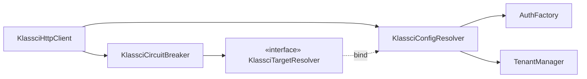

# Design — #578 · Circuit breaker KLASSCI cloisonné par cible

## 1. Racine du problème (Phase 1)

`KlassciCircuitBreaker` écrit/lit son état sous deux clés **constantes**. Le seul
consommateur runtime est `KlassciHttpClient` (vérifié : `SeanceExistenceBatchChecker`
ne fait que le **mentionner** en docblock, il ne l'appelle pas). Le breaker n'a
aujourd'hui **aucune** connaissance de la cible réseau qu'il protège, alors que la
cible varie par tenant (`KlassciConfigResolver::baseUrl()`).

Conséquence en multi-tenant :
- **Faux positif** : `reportFailure()` sur la cible de A ouvre la clé globale →
  `isOpen()` renvoie `true` pour B → 503 sur B qui va bien.
- **Faux négatif** : `reportSuccess()` sur la cible de B fait un `forget()`
  inconditionnel de la clé globale → efface le compteur d'échecs de A.

## 2. Solution (une seule — §6)

**Partitionner l'état du disjoncteur par empreinte de l'URL de base résolue.**

Chaque opération du breaker dérive un *jeton de partition* depuis la cible
courante, et suffixe ses deux clés de cache avec ce jeton. Deux cibles distinctes
= deux états indépendants ; même cible = état partagé (R3) ; pas de cible = repli
`default` (R4).

### 2.1 Nouvelle abstraction fine (R5)

`KlassciConfigResolver` est `final` (non mockable). Pour injecter « la source de
l'URL » dans le breaker **et** rester testable sans contournement (§1.6 L/I/D), on
introduit une interface à une seule méthode :

```php
interface KlassciTargetResolver
{
    /** URL de base KLASSCI résolue pour le contexte courant, ou null si indéterminée. */
    public function baseUrl(): ?string;
}
```

`KlassciConfigResolver implements KlassciTargetResolver` — la signature
`baseUrl(): ?string` existe déjà à l'identique, donc `implements` sans autre
changement de code. Le breaker dépend de l'**interface**, jamais du concret.

### 2.2 Absence de cycle



`KlassciConfigResolver` ne dépend **ni** de `KlassciCircuitBreaker` **ni** de
`KlassciHttpClient` (ses dépendances : `AuthFactory`, `TenantManager`, `Logger`).
Injecter le résolveur (via l'interface) dans le breaker n'introduit donc **aucun
cycle**.

### 2.3 Dérivation de la partition

```php
private function partition(): string
{
    $baseUrl = $this->target->baseUrl();

    if (! is_string($baseUrl) || trim($baseUrl) === '') {
        return 'default';                 // R4 — repli global
    }

    // Empreinte, jamais l'URL en clair (une base URL peut porter un hôte
    // sensible). sha256 = déterministe, sans collision réaliste sur le parc,
    // et sûr comme fragment de clé de cache (charset [0-9a-f]).
    return hash('sha256', $baseUrl);
}
```

- **Empreinte de la chaîne exacte résolue**, sans normalisation (pas de
  lower-case, pas de suppression du slash final). Direction *fail-safe* : ne
  jamais **fusionner** deux cibles distinctes (fusion = faux positif ré-introduit).
  Deux institutions au même `klassci_api_url` (chaîne identique) partagent
  naturellement la partition (R3).

### 2.4 Clés dérivées

| Avant | Après |
|---|---|
| `klassci:circuit:failures` | `klassci:circuit:{partition}:failures` |
| `klassci:circuit:open_until` | `klassci:circuit:{partition}:open_until` |

Le breaker calcule les deux clés à la demande via un petit helper interne
(`failuresKey()` / `openUntilKey()`), à partir du jeton retourné par `partition()`.

### 2.5 Stabilité intra-requête (R6.2)

`KlassciConfigResolver` résout `baseUrl()` **lazy + mémoïsé par instance**
(docblock existant : « singleton implicite par requête HTTP »). Pour garantir que
le breaker et le `KlassciHttpClient` visent la **même** partition dans une même
requête — et éviter une double résolution (2× guard Sanctum + tenant) — on lie le
résolveur en `scoped` (singleton par requête). C'est aussi l'intention documentée
du résolveur, aujourd'hui non honorée (auto-résolution transient).

## 3. Wiring DI (`AppServiceProvider::register()`)

```php
// Un seul résolveur partagé par requête (breaker ⇄ http client) : même cible,
// une seule résolution, cohérent avec l'intention « singleton par requête ».
$this->app->scoped(KlassciConfigResolver::class);

// Le breaker dépend de l'abstraction fine ; le concret est le résolveur.
$this->app->bind(KlassciTargetResolver::class, KlassciConfigResolver::class);
```

Sans ce binding, l'auto-résolution de `KlassciHttpClient → KlassciCircuitBreaker →
KlassciTargetResolver` échouerait (« interface non instanciable »).

## 4. Data model

Aucun changement de schéma. État uniquement en cache (comme aujourd'hui), sous des
clés désormais suffixées par partition. TTL inchangés (`window` / `cooldown`).

## 5. Gestion d'erreurs

- `baseUrl()` retournant `null`/vide n'est **pas** une erreur : c'est le cas de
  repli `default` (R4), déterministe et silencieux.
- Aucune exception nouvelle. Le contrat de `KlassciHttpClient` (503 via
  `KlassciUnavailableException::circuitOpen()`) est inchangé — seule la *portée*
  de l'ouverture change (par cible au lieu de global).

## 6. Stratégie de test (TDD, `tests/Unit`)

Double de test `FakeTargetResolver implements KlassciTargetResolver` retournant une
URL contrôlée (substituable sans contournement — §1.6 L). Store cache `array` réel
(pas de mock de cache — §5 « pas de DB mocks »).

| Cas | Vérifie | Critère |
|---|---|---|
| `failures_open_only_target_A` | 3 échecs sur A → `isOpen()` true pour A, **false pour B** | R1 |
| `success_on_B_preserves_A_counter` | ouverture A, puis succès B, puis 1 échec A → A ré-ouvre au 1er échec (compteur A non effacé) | R2 |
| `same_url_shares_breaker` | 3 échecs via résolveur A, lecture via résolveur B **de même URL** → ouvert | R3 |
| `null_url_uses_default_partition` | cible `null` → partition `default`, isolée des cibles réelles | R4 |
| `disabled_flag_still_honoured` | `circuit_breaker_enabled=false` → `reportFailure()` n'ouvre jamais | R6.1 |

Un test d'intégration léger complète côté `KlassciHttpClient` déjà couvert
(`KlassciHttpClientTest`) : mise à jour du helper `circuitBreaker()` pour injecter
le résolveur (contrat constructeur).

## 7. Alternatives écartées (Q12)

1. **Suffixer par `institution_id`** — rejeté : deux institutions peuvent partager
   un même serveur KLASSCI (cf. docblock #75 de `KlassciConfigResolver`) ; l'id
   sur-partitionne (chaque école aurait son propre disjoncteur même serveur
   commun → protection plus faible) et contredit R3. L'issue l'exclut explicitement.
2. **Passer `baseUrl` en paramètre à chaque méthode du breaker**
   (`isOpen(?string $url)`) — rejeté : l'issue prescrit une injection au
   constructeur ; disperse la responsabilité de dérivation chez chaque appelant et
   multiplie les points de faute (un appelant oubliant l'argument ré-introduit le
   bug global).
3. **Normaliser l'URL avant hash** (lowercase host, strip trailing `/`) — rejeté
   pour l'instant : le gain (fusionner `a.io` et `a.io/`) est marginal et le risque
   (fusionner deux cibles réellement distinctes) est un faux positif. Direction
   *fail-safe* = ne pas fusionner. Dette éventuelle si le parc montre des doublons
   de formatage — traçable, pas bloquante.

## 8. Test d'invalidation (Q15)

La solution est invalidée si un test à deux résolveurs d'URL **différentes**
montre que l'ouverture de l'un affecte l'autre — c'est-à-dire si la partition ne
sépare pas réellement les états. Le cas `failures_open_only_target_A` est
précisément ce test.

## 9. Projection 10× (Q13)

Parc cible : 20 → 200 institutions (10×), potentiellement quelques centaines de
serveurs KLASSCI distincts. Le partitionnement crée O(nb serveurs distincts) jeux
de clés cache (2 clés chacun, TTL courts `window`/`cooldown` ≤ 60 s). Empreinte
sha256 : espace 2^256, collision inobservable. Coût cache négligeable, aucune
réécriture nécessaire à l'échelle.
