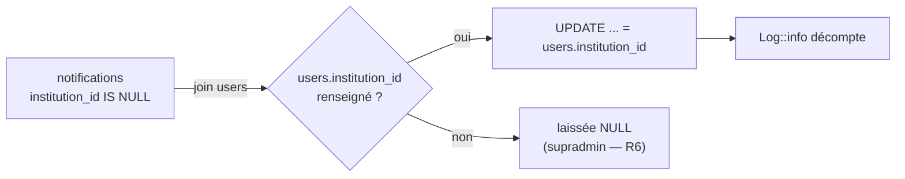

# Design — #579 · Faire porter `institution_id` par la notification à la source

## 1. Le correctif

`app/Services/Notification/NotificationDispatcher.php:34-41` :

```php
 return Notification::create([
     'user_id' => $user->id,
     'type' => $type,
     'title' => $title,
     'message' => $message,
     'data' => $data,
+    'institution_id' => $user->institution_id,
 ]);
```

`Notification::$fillable` contient déjà `institution_id` (`:37`) — rien à changer côté
modèle.

**Pourquoi une assignation explicite suffit** : le hook `creating` de
`BelongsToInstitution` (`:96-99`) respecte toute valeur déjà posée
(`array_key_exists('institution_id', $model->getAttributes())`), **y compris `null`**. Un
destinataire supradmin conserve donc `NULL`, sans que le tenant ambiant ne s'y substitue
(R4).

`sendToMany()` délègue à `send()` par utilisateur : le correctif couvre les fan-outs sans
modification supplémentaire.

`app/Console/Commands/NotifyUpcomingEvaluations.php:68` reçoit la même clé, le service
n'étant pas dans son chemin (voir requirements §5).

## 2. Migration de rattrapage

`database/migrations/2026_08_24_000001_backfill_notifications_institution_id.php`



Décisions :

- **`update` par jointure, pas de boucle Eloquent** : une seule requête, pas de N+1, et
  aucun événement de modèle déclenché (on répare des données, on ne recrée pas des lignes).
- **`withoutGlobalScope('institution')`** explicite : la migration tourne en CLI sans
  tenant ; s'appuyer sur le fail-open du trait marcherait mais journaliserait un
  avertissement trompeur à chaque exécution.
- **Décompte journalisé avant/après** (R5) : une migration de données muette est
  invérifiable a posteriori.
- **Irréversible par conception** : `down()` ne remet pas les `NULL`. Restaurer un bug
  n'est pas un rollback, et l'information d'origine (« était NULL ») n'a aucune valeur.
  `down()` est donc un no-op documenté.
- **Idempotente** : ne cible que `institution_id IS NULL` ; une seconde exécution ne touche
  rien.

## 3. Stratégie de test

| Test | Exigence | Statut initial |
|---|---|---|
| `test_notification_emitted_without_tenant_carries_the_recipient_institution` | R1 | **RED exécuté** |
| `test_notification_emitted_without_tenant_is_visible_to_its_recipient` | R2 | **RED exécuté** |
| `test_visio_job_notification_appears_in_the_recipient_api_listing` | R2 (cycle complet, job réel → endpoint HTTP) | à écrire |
| `test_unread_count_and_recent_widget_see_async_notifications` | R3 | à écrire |
| `test_supradmin_recipient_keeps_a_null_institution` | R4 | à écrire |
| `test_backfill_repairs_orphan_rows_and_leaves_supradmin_ones` | R5, R6 | à écrire |

Le point aveugle exact identifié par l'issue : les tests existants vérifiaient la
**création**, jamais la **visibilité**. Chaque test ci-dessus assert donc une **lecture**,
pas une écriture.

## 4. Alternatives écartées (Q12)

1. **Restaurer le tenant dans chaque émetteur** (pattern du job leçon). Rejeté comme
   solution *principale* : correct mais non structurel — chaque nouvel émetteur doit y
   penser, et l'oubli est silencieux (c'est précisément ainsi que le bug est né). Reste
   nécessaire par ailleurs pour scoper les **lectures** des émetteurs.
2. **Rendre le trait fail-closed (`throw` sans tenant).** Rejeté : casserait les trois
   usages légitimes documentés dans son docblock (tests `actingAs`, contrôleurs filtrant
   explicitement, jobs cross-tenant volontaires) — décision déjà tranchée en #565, hors
   périmètre.
3. **Rendre la colonne `NOT NULL`.** Rejeté : les destinataires supradmin n'ont
   légitimement pas d'institution, et une contrainte transformerait un bug d'invisibilité
   en erreur 500 à l'écriture.

## 5. Ce qui invaliderait ce design (Q15)

- Si une notification devait appartenir à l'institution **émettrice** plutôt qu'à celle du
  destinataire (ex. message inter-institutions). *Écarté* : `notifications.user_id` est le
  destinataire, et toute lecture part de lui.
- Si `users.institution_id` pouvait être obsolète par rapport au tenant réel du
  destinataire. *Écarté* : c'est la colonne qui définit le rattachement d'un utilisateur —
  `ResolveInstitution` la lit pour poser le tenant.
