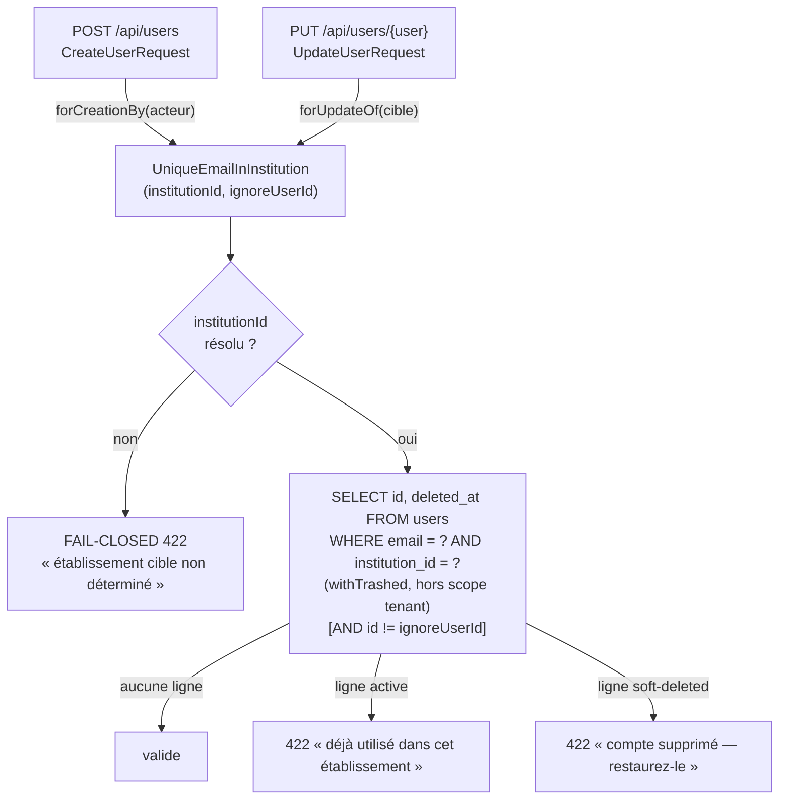

# Design — #580 : unicité de l'email PAR INSTITUTION

> Basé sur `requirements.md` (R1–R7). Périmètre : `app/Rules/`, `app/Http/Requests/CreateUserRequest.php`,
> `app/Http/Requests/UpdateUserRequest.php` + tests. Aucune migration, aucun contrôleur, aucun service.

## 1. Mesures préalables (pas d'intuition — §Engagement)

Quatre mesures exécutées sur la branche `fix/580-email-per-institution` (SQLite de test,
`php artisan test`) avant toute conception :

| # | Mesure | Résultat observé |
|---|---|---|
| P1 | `INSERT` d'un email déjà porté par une ligne **soft-deleted** de la même institution | `SQLSTATE[23000] UNIQUE constraint failed: users.email, users.institution_id` |
| P2 | Type de `$this->route('user')` dans `UpdateUserRequest::rules()` | `App\Models\User` (le binding EST substitué avant la résolution du FormRequest) |
| P3 | `POST /api/users` avec un email existant dans une **autre** institution | `422 {"errors":{"email":["Cet email est déjà utilisé."]}}` |
| P4 | `PUT /api/users/{id}` en renvoyant son **propre** email | `500 SQLSTATE[HY000]: no such column: name:"Mrs. Crystel Wuckert"` |

### Ce que P1 impose

L'index `users_email_institution_unique` **compte les lignes soft-deleted** (ni MySQL ni SQLite
n'ont d'index unique partiel). Une règle de validation qui les exclurait laisserait passer la
requête, et l'`INSERT` remonterait en **500**. Le comportement correct est donc de **les compter**
— comme le fait déjà `KlassciUserSynchronizer::findExistingUser()` via `withTrashed()`
(`:172-179`, commentaire explicite « sinon l'INSERT de secours violerait l'index unique »).

> **Conséquence assumée** : l'email d'un compte supprimé reste occupé. La « recréation légitime »
> passe par une **restauration**, pas par un nouvel `INSERT` — c'est le modèle déjà retenu par
> #566. Le correctif rend ce refus **explicite et actionnable** (message dédié) au lieu d'un
> « Cet email est déjà utilisé » opaque, mais il ne peut pas débloquer la recréation sans un
> endpoint de restauration (hors périmètre — dette n° 2 de `requirements.md`).

### Ce que P2 + P4 révèlent

`UpdateUserRequest:35` concatène un **modèle Eloquent** dans une chaîne de règle. `Model::__toString()`
(`Illuminate/Database/Eloquent/Model.php:2568`) sérialise en JSON, et `ValidationRuleParser::parseParameters`
(`:299`) découpe ce JSON avec `str_getcsv` : les paramètres de la règle deviennent du bruit.
`PUT /api/users/{id}` avec un champ `email` est donc **cassé à 100 %** aujourd'hui (`500`), et le
SQL en erreur contient le nom et l'email de la cible (PII en log). Ce défaut est **dans le
périmètre** de #580 (même ligne) et couvre le critère de fermeture n° 3 de l'issue.

## 2. Solution retenue

Une **règle de validation dédiée**, `App\Rules\UniqueEmailInInstitution`, câblée dans les deux
FormRequests via deux constructeurs nommés qui encodent la seule différence légitime entre les
deux cas.



### 2.1 Quelle institution ? (R1)

Le point non évident du problème : **l'institution à interroger n'est pas la même** selon
l'endpoint.

| Endpoint | Institution de la ligne concernée | Source |
|---|---|---|
| `POST /users` | celle que `BelongsToInstitution::creating` (`:108-122`) écrira, c'est-à-dire le tenant courant | l'acteur — `ResolveInstitution:116` dérive le tenant de `$token->tokenable->institution_id`, donc tenant ≡ institution de l'acteur sur tout chemin authentifié |
| `PUT /users/{user}` | celle de la **cible**, inchangée (`institution_id` n'est pas dans `rules()`, donc jamais dans `validated()`) | l'utilisateur cible du binding |

Pourquoi l'acteur et non `TenantManager` pour la création : les deux valent la même chose en
production (démonstration ci-dessus, `ResolveInstitution:116`), mais l'identité du porteur est
**disponible partout** — y compris sous `Sanctum::actingAs`, qui court-circuite le middleware.
Dépendre du middleware ferait dépendre une règle de validation d'un ordre d'exécution.

Pourquoi la **cible** et non l'acteur en mise à jour : c'est la seule source correcte quand
l'acteur est un `supradmin` plateforme (institution `NULL`) qui édite un compte de l'école B —
scoper sur l'acteur interrogerait le mauvais ensemble.

### 2.2 Pourquoi une classe de règle et non `Rule::unique(...)->where(...)`

L'issue propose littéralement `Rule::unique('users','email')->where(fn ($q) => $q->where('institution_id', $actor->institution_id))`.
Le SQL produit est **le bon pour le cas nominal**, et c'est la référence sémantique retenue.
Trois raisons de ne pas s'y arrêter :

1. **R5 (fail-closed)** — `DatabaseRule::where($col, null)` redirige vers `whereNull()`
   (`Illuminate/Validation/Rules/DatabaseRule.php:93-95`). Pour un compte plateforme, la règle
   dégénère silencieusement en `WHERE institution_id IS NULL` : elle valide contre un ensemble
   que **l'index base ne contraint pas** (deux `NULL` ne sont jamais égaux en SQL). Il faut
   **refuser**, ce qu'un objet `Unique` ne sait pas exprimer.
2. **R4 (message distinct)** — `Unique` n'émet qu'un seul message ; distinguer « compte actif » de
   « compte supprimé » demande de connaître la ligne trouvée.
3. **DRY (Q5)** — la décision de scope, la politique fail-closed et la sémantique soft-delete
   seraient dupliquées en closure dans deux FormRequests. Une classe les encode **une fois** et se
   teste unitairement.

Précédent interne identique : `App\Rules\AssignableRole` (dépendance injectée au constructeur,
fail-closed documenté, test unitaire dédié).

### 2.3 Alternatives écartées (Q12)

| Alternative | Raison du rejet |
|---|---|
| **A. `Rule::unique()->where()->ignore()` brut dans chaque FormRequest** | Cf. §2.2 : dégénère en `IS NULL` pour les comptes plateforme, message unique, closure dupliquée. |
| **B. Correction au niveau base** (index unique partiel excluant `deleted_at`, ou sentinelle `institution_id = 0`) | Hors périmètre (#580 ne porte aucune migration). MySQL n'a pas d'index partiel ; une sentinelle imposerait un backfill sur 30 tables et casserait la FK `RESTRICT` de #583. |
| **C. Service `UserEmailConflictGuard` appelé par `AdminController`**, calqué sur `KlassciEmailConflictGuard` | Sortirait une préoccupation de **validation** de la Form Request (§1.5), répondrait `409` là où le contrat de l'endpoint est `422`, et modifierait `AdminController` — hors périmètre, avec 3 fenêtres en parallèle sur le dépôt. |

### 2.4 Ce qui invaliderait cette conception (Q15)

- Si l'index base devenait **partiel** (PostgreSQL : `UNIQUE (email, institution_id) WHERE deleted_at IS NULL`),
  R4 s'inverserait et la règle devrait exclure les lignes supprimées (`->whereNull('deleted_at')`).
- Si un endpoint `POST /users/{id}/restore` était ajouté, le message R4 devrait pointer dessus.
- Si `institution_id` passait `NOT NULL` (suppression des comptes plateforme), la branche
  fail-closed R5 deviendrait morte et devrait être retirée.

## 3. Modèle de données

Aucun changement de schéma. La règle est l'image de l'index existant :

```
users_email_institution_unique  UNIQUE (email, institution_id)   -- lignes soft-deleted incluses
```

## 4. Requête émise

Une seule requête, uniquement quand `email` est présent dans la charge utile :

```sql
select "id", "deleted_at" from "users"
 where "email" = ? and "institution_id" = ? [and "id" <> ?]
 limit 1
```

Couverte par `users_email_institution_unique` (préfixe exact `(email, institution_id)`). Coût
identique à la règle `unique:` actuelle (un `count(*)` sur le même index) — §1.4 : pas de N+1,
une requête par requête HTTP. À 10× le volume (200 000 users / ~200 institutions), la sélectivité
de l'index composite est inchangée : lookup O(log n), pas de scan.

## 5. Gestion des erreurs

| Situation | Réponse | Message |
|---|---|---|
| Email libre dans l'institution | `201` / `200` | — |
| Email détenu par un compte **actif** de l'institution | `422` sur `email` | « Cet email est déjà utilisé dans cet établissement. » |
| Email détenu par un compte **supprimé** de l'institution | `422` sur `email` | « Cet email appartient à un compte supprimé de cet établissement. Restaurez ce compte au lieu d'en créer un nouveau. » |
| Institution cible indéterminable | `422` sur `email` | « L'établissement cible n'est pas déterminé : impossible de valider l'unicité de l'email. » |

Aucun message ne mentionne une autre institution (R6) ; aucun `$e->getMessage()` n'est exposé
(§1.2). La correction supprime au passage la fuite de PII de P4 (modèle sérialisé dans le SQL).

## 6. Stratégie de test

- **`tests/Unit/Rules/UniqueEmailInInstitutionTest.php`** — la règle isolée : email libre, doublon
  actif, doublon supprimé, exclusion de sa propre ligne, institution non résolue, email d'une
  autre institution ignoré, valeur non-string déléguée à la règle `email`.
- **`tests/Feature/Admin/AdminUserEmailUniquenessTest.php`** — bout en bout HTTP avec **Bearer réel**
  (pour que `ResolveInstitution` pose le tenant, comme `AdminUserTenantIsolationTest`) : R1 (2
  institutions), R2, R3 (P4 en régression), R4, R5 (supradmin plateforme), R6.
- **Non-régression (R7)** : `AdminUserResponseTest`, `AdminUserRoleEscalationTest`,
  `AdminUserTenantIsolationTest`, `UserSoftDeleteTest` rejoués verts.

Pattern AAA, deux institutions pour tout test multi-tenant (§5 « Tests »), aucun `sleep()`, aucun
mock de base.
