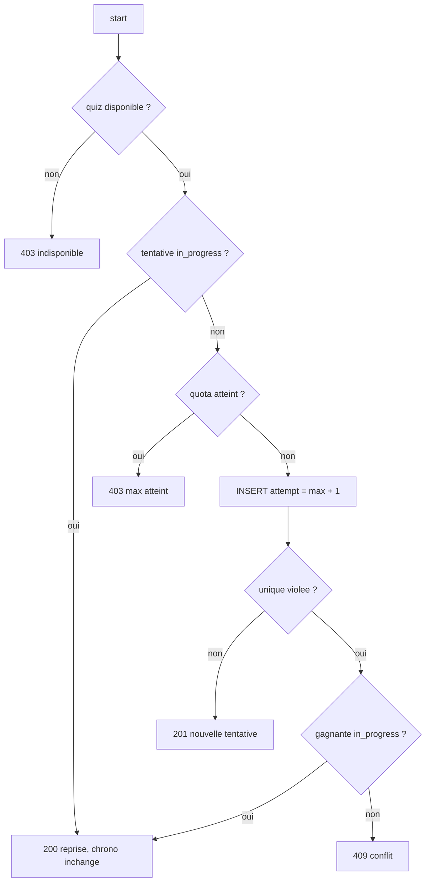

# #581 — Design

## 1. Réutilisation, pas duplication

Le mécanisme d'insertion sous filet d'unicité existe déjà : `AttemptConflictGuard`
(#540). Cette PR ne le réécrit pas, elle l'applique au troisième et dernier domaine
de tentatives. C'est la raison pour laquelle la branche est **empilée** sur
`fix/540-attempt-quota-race` plutôt que partie de `lms`.

Après cette PR, les trois domaines partagent exactement la même mécanique :

| Domaine | Espace de clés de l'index | Reprise ? |
|---|---|---|
| Évaluation | `(evaluation_id, klassci_etudiant_id, attempt)` | oui — tentative `en_cours` |
| Quiz | `(quiz_id, user_id, attempt_number)` | oui — tentative `in_progress` |
| Knowledge-check | `(knowledge_check_id, user_id, attempt_number)` | non — une soumission est atomique |

## 2. `QuizAccessService`

Trois évolutions, toutes sur des requêtes qui adressent l'espace de clés de
l'index — donc **sans** le global scope `institution` (mêmes raisons qu'en #540 §4bis :
l'index ignore `institution_id`, colonne nullable jamais backfillée).

- `attemptsCountForUser()` : compte désormais tout **sauf `abandoned`**. Une
  tentative ouverte a consommé un essai, comme dans un examen réel.
- `activeAttemptForUser()` *(nouveau)* : la tentative `in_progress` de l'étudiant.
- `canUserAttempt()` : vrai si une tentative est **reprenable** OU si le quota
  nominal n'est pas atteint.

> Le second terme de `canUserAttempt()` n'est pas cosmétique. Sans lui, un étudiant
> ayant une tentative en cours sur un quiz à `max_attempts = 1` verrait
> `user_can_attempt = false` dans la liste — l'interface lui annoncerait « plus de
> tentative » alors qu'il peut légitimement continuer la sienne. Le comptage seul
> ment sur ce cas précis.

## 3. `QuizAttemptStartSubmitService::startAttempt()`

Le payload est identique dans les trois issues de succès (`attempt`, `quiz`,
`questions`, `time_remaining`) : seuls le code HTTP et le message changent. Le
mélange des questions/réponses s'applique aussi à une reprise — le contraire
révélerait l'ordre d'origine à qui recharge la page.

`time_remaining` d'une reprise est calculé depuis le `started_at` **d'origine** :
c'est tout l'intérêt de reprendre plutôt qu'abandonner.

## 4. Ce qui n'est PAS touché

- `submitAttempt()` : il refuse déjà tout ce qui n'est pas `in_progress` (422).
  Une fois la reprise en place, les « vieux onglets » pointent sur la même
  tentative — la double soumission tombe naturellement en 422.
- `QuizAttemptTimerService::abandon()` : conservé, plus appelé par le démarrage.
  Il reste le geste explicite d'abandon (et le janitor reste le filet).
- Aucun nouveau statut de tentative (R5.1).

## 5. Dette signalée

- `QuizAccessService::bestAttemptForUser()` / `latestAttemptForUser()` /
  `finalizedAttemptsByQuiz()` restent scopés au tenant : une tentative héritée à
  `institution_id = NULL` y reste invisible. Défaut d'affichage antérieur, sans
  effet sur l'unicité — même arbitrage qu'en #540 pour
  `KnowledgeCheckAccessService::bestScore()`.
- L'index `quiz_attempts_quiz_id_user_id_attempt_number_index` double le préfixe de
  l'unique de mêmes colonnes → #541 / #549.
