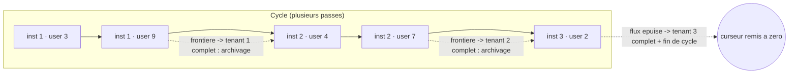
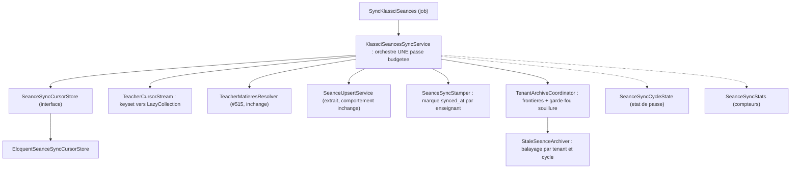
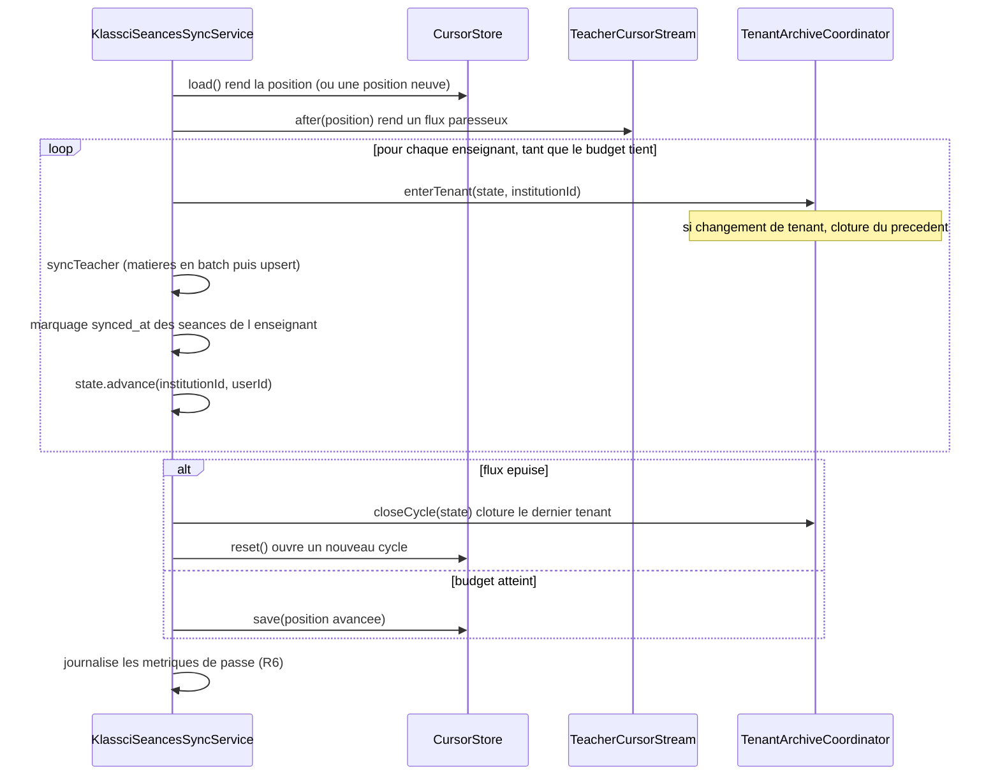

# Design — #582 · Reprise par curseur de la sync des séances

## 1. Décision structurante : ordonner par `(institution_id, id)`

Le curseur pourrait être un simple `user_id`. Il est volontairement **composite**
`(institution_id, user_id)`, et le parcours est ordonné par ce couple.

Conséquence décisive : **les enseignants d'un même tenant deviennent contigus**
dans le flux. La complétude d'un tenant se détecte alors en O(1) — c'est le
franchissement de frontière `institution_id` — au lieu d'exiger la connaissance
de l'ensemble de la population. C'est ce qui rend R4 réalisable sans passe
globale.

Le curseur persisté est initialisé **dans l'état de passe** comme « tenant
courant ». Une passe qui reprend après `(inst 1, user 9)` et rencontre
`(inst 2, user 4)` franchit donc bien la frontière, alors même que le tenant 1
n'a été parcouru qu'au cours de passes antérieures.

## 2. Décision structurante : archivage par marquage (mark & sweep)

L'implémentation actuelle accumule en mémoire `activeIdsByInstitution` puis
archive « tout ce qui n'est pas dedans ». Cette accumulation **ne survit pas à une
passe tronquée** : au redémarrage, seuls les enseignants restants alimenteraient
la liste, et les séances des enseignants déjà traités seraient archivées à tort.

On remplace par un marquage durable, porté par la base :

1. Colonne `seances.synced_at` — horodatage de la dernière confirmation par KLASSCI.
2. À la fin de chaque enseignant, un **unique** `UPDATE` marque ses séances.
3. À la complétude d'un tenant, on archive ses séances actives telles que
   `synced_at IS NULL OR synced_at < cycle_started_at`.

Mémoire O(1), résistant aux coupures, et `synced_at` devient un signal
d'exploitation utile en soi (« quand cette séance a-t-elle été confirmée ? »).

Le marquage passe par `toBase()->update()` (constructeur de requête sous-jacent)
et **non** par `Model::update()`, pour ne pas repousser `updated_at` : `updated_at`
doit rester « dernière modification de contenu », sémantique que
`SeanceCacheDataBuilder::applyTo()` protège déjà par son `isDirty()`.

## 3. Décision structurante : garde-fou anti-archivage-abusif (R5)

L'archivage est aujourd'hui **inerte** (aucune passe globale ne se termine). Le
corriger l'**active** — et active du même coup un défaut latent : si l'appel
KLASSCI d'un enseignant échoue, ses séances ne sont pas marquées et seraient
archivées en masse à la complétude du tenant.

On introduit donc un **ensemble de tenants « souillés »**, persisté avec le
curseur pour la durée du cycle : toute erreur enseignant/matière souille son
institution ; un tenant souillé n'est pas archivé pour ce cycle, et repart propre
au cycle suivant.

## 4. Modèle de données

### 4.1 `seances.synced_at`

| colonne | type | rôle |
|---|---|---|
| `synced_at` | `timestamp` nullable | dernière confirmation KLASSCI de la séance |

Index composite `(institution_id, is_active, synced_at)` : la requête de balayage
est exactement `institution_id = ? AND is_active = 1 AND (synced_at IS NULL OR
synced_at < ?)`.

`NULL` sur les lignes historiques est le comportement voulu : une séance encore
présente côté KLASSCI sera marquée avant la complétude de son tenant ; celles qui
restent à `NULL` sont précisément celles à archiver.

### 4.2 `seance_sync_cursors`

| colonne | type | rôle |
|---|---|---|
| `name` | `string(64)` unique | identifiant du curseur (`klassci_seances`) |
| `last_institution_id` | `bigint` nullable | composante tenant de la position |
| `last_user_id` | `bigint` nullable | composante enseignant de la position |
| `cycle_started_at` | `timestamp` | début du cycle courant (référence du balayage) |
| `tainted_institution_ids` | `json` | tenants souillés du cycle courant |

**Pas de clés étrangères, délibérément.** `last_institution_id` / `last_user_id`
sont une **position de balayage**, pas une référence : une FK `nullOnDelete`
rembobinerait tout un cycle à la suppression d'un utilisateur, et une FK
`restrict` empêcherait cette suppression. Le nom des colonnes (`last_*`) écarte
toute lecture comme colonne de tenant.

### 4.3 `users` — index de balayage

Index composite `(role, institution_id, id)` : rend le parcours ordonné +
positionné (keyset pagination) résoluble par index seul, sans tri de fichier.
Sans lui, à 200 000 utilisateurs, chaque passe trierait la population entière.

## 5. Architecture des collaborateurs

| classe | responsabilité unique |
|---|---|
| `SeanceSyncPosition` | valeur immuable : position + début de cycle + tenants souillés |
| `SeanceSyncCursorStore` | abstraction de persistance de la position (§1.6-D) |
| `EloquentSeanceSyncCursorStore` | implémentation sur `seance_sync_cursors` |
| `TeacherCursorStream` | construit la requête keyset et rend un flux paresseux |
| `SeanceSyncCycleState` | état mutable **d'une passe** (à l'image de `SeanceSyncStats`) |
| `TenantArchiveCoordinator` | détecte les frontières de tenant, applique R5, déclenche l'archivage |
| `SeanceSyncStamper` | marque `synced_at` en un `UPDATE` par enseignant |
| `SeanceUpsertService` | création/mise à jour d'une séance locale (extrait tel quel) |
| `StaleSeanceArchiver` | archive les séances non confirmées d'un tenant sur un cycle |
| `KlassciSeancesSyncService` | orchestration d'une passe : flux, budget, frontières, curseur, métriques |

**Pourquoi `SeanceUpsertService` est extrait** : `KlassciSeancesSyncService` était à
297 lignes sur les 300 autorisées (§1.1). L'ajout de l'orchestration curseur le
faisait déborder. L'extraction est **mécanique** (méthodes déplacées sans
changement de comportement), et elle clarifie la responsabilité du service :
*orchestrer une passe*, pas *projeter un payload*.

## 6. Déroulé d'une passe

**Clôture d'un tenant** = si souillé, renoncer et journaliser ; sinon
`StaleSeanceArchiver::archive(institutionId, cycleStartedAt, stats)`.

## 7. Gestion des erreurs

| situation | traitement |
|---|---|
| appel KLASSCI enseignant en échec | compté (`stats->errors`), tenant souillé, passe poursuivie |
| matière absente du batch (#515) | compté, tenant souillé, autres matières poursuivies |
| erreur d'upsert d'une séance | compté, tenant souillé, autres séances poursuivies |
| curseur illisible / absent | position neuve (début de cycle) — dégradation sûre |

Aucun message d'exception n'est exposé au client : la sync est un job, ses
messages vont au journal (§1.2).

## 8. Stratégie de test

| exigence | test |
|---|---|
| R1 disjonction | `SeanceSyncCursorTest::test_two_budget_bound_passes_process_disjoint_teachers` |
| R1 bouclage | `SeanceSyncCursorTest::test_cursor_wraps_to_the_first_teacher_once_the_list_is_exhausted` |
| R2 flux | `TeacherCursorStreamTest::test_stream_is_lazy_and_does_not_materialize_the_population` |
| R3 colonnes | `TeacherCursorStreamTest::test_query_only_references_existing_user_columns` |
| R4 par tenant | `SeanceSyncCursorTest::test_archives_a_tenant_as_soon_as_it_is_complete_without_waiting_for_others` |
| R5 souillure | `SeanceSyncCursorTest::test_does_not_archive_a_tenant_whose_teacher_failed_during_the_cycle` |
| R6 métriques | `SeanceSyncCursorTest::test_logs_pass_metrics_with_cursor_position_and_tenant_counters` |
| R7 non-régression | suites `KlassciSeancesSyncServiceTest`, `DrainBudgetTest`, `StaleSeanceArchiverTest` |

Le test R3 mérite un mot : le défaut §1.2 des requirements est **invisible sur
SQLite**. Le test extrait donc les identifiants de la requête générée et vérifie
que chacun est une colonne réelle de `users` — il échoue dès qu'une colonne
fantôme réapparaît, sans exiger un MySQL en CI.

## 9. Alternatives écartées (Q12)

1. **Curseur `user_id` simple + accumulation mémoire des identifiants actifs par
   tenant.** Rejeté : l'accumulation ne survit pas à une passe tronquée. La seule
   parade serait de renoncer à archiver tout tenant à cheval sur deux passes — ce
   qui réintroduit la famine à l'échelle du tenant dès qu'un tenant ne tient plus
   dans 45 s (≈ 75 enseignants). Échoue la règle §1.6 « tenir à 10× le volume ».
2. **Curseur en cache (`TenantScopedCache` / façade `Cache`).** Rejeté : le
   curseur est un état d'exploitation, pas un cache. `php artisan cache:clear`
   figure dans la procédure de déploiement — chaque déploiement rembobinerait le
   cycle et réaffamerait la queue de population. La table dédiée coûte le même
   prix (le store cache est lui-même `database` en production) et reste
   inspectable.
3. **Rembobiner le curseur au début du tenant en cours quand le budget tombe**
   (tenant traité de façon atomique). Rejeté pour la même raison que 1 : un tenant
   plus large que le budget ne se terminerait jamais.
4. **Paralléliser les appels HTTP entre enseignants.** Rejeté : hors périmètre, et
   cela réduirait la fréquence de la famine sans supprimer sa cause (le parcours
   repartirait toujours du début).

## 10. Test d'invalidation (Q15)

Ce design serait invalidé si :

- un tenant pouvait apparaître **deux fois** de façon non contiguë dans l'ordre
  `(institution_id, id)` — impossible, `institution_id` est la première clé de tri ;
- un enseignant pouvait changer d'`institution_id` **pendant** un cycle : il serait
  alors soit revisité, soit sauté. Conséquence bornée et sûre : revisité → double
  marquage (idempotent) ; sauté → ses séances ne sont pas marquées, mais son ancien
  tenant a déjà été clôturé et le nouveau le sera au cycle suivant. Le cas est rare
  (mutation d'établissement) et ne peut pas provoquer d'archivage à tort du tenant
  d'origine, déjà clos ;
- le volume de séances par tenant rendait l'`UPDATE` de marquage plus coûteux que
  l'accumulation mémoire — mesurable : 1 `UPDATE` par enseignant contre 1 ligne
  hydratée par séance active.
