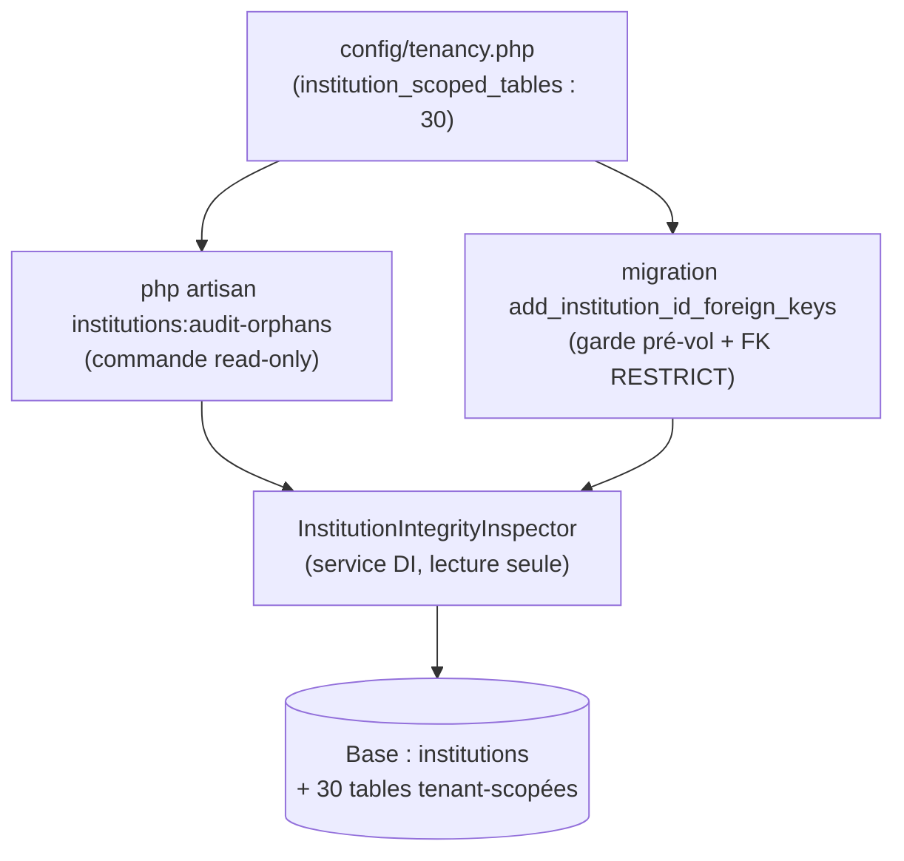

# Design — #583 · Clés étrangères manquantes sur `institution_id`

## Vue d'ensemble

Trois artefacts, une source de vérité, aucune duplication :



- **`config/tenancy.php`** — REQ-1. Liste unique des 30 tables portant
  `institution_id`, dérivée de la migration d'origine `2026_02_11_000002`. Toute
  nouvelle table tenant-scopée devra y être ajoutée **et** recevoir sa FK.
- **`InstitutionIntegrityInspector`** — service injectable (DIP §1.6-D), lecture
  seule, partagé par la commande (mesure) et la migration (garde pré-vol +
  idempotence). Utilise le **query builder brut** (`connection()->table()`),
  donc **aucun global scope** Eloquent ni scope soft-delete : on observe les
  lignes physiques, ce qui est exactement la sémantique d'une FK.
- **Commande `institutions:audit-orphans`** — REQ-2. N'appelle que des méthodes
  de lecture de l'inspecteur.
- **Migration FK** — REQ-3/4/5. Délègue la détection d'orphelins et
  l'introspection de FK à l'inspecteur.

## Composants

### `App\Services\Tenancy\InstitutionIntegrityInspector`

Injection : `Illuminate\Database\DatabaseManager` (résolu comme `db`, sans
facade). Le service tire sa connexion via `$this->db->connection()` et son
schema builder via `->getSchemaBuilder()`. Les tables inspectées sont **passées
en argument** (jamais lues depuis la config par le service) → service pur,
testable avec n'importe quel sous-ensemble.

Méthodes (chacune ≤ 40 lignes, SRP) :

| Méthode | Rôle |
|---|---|
| `scopedTablesPresent(array $tables): array` | Filtre les tables existantes portant `institution_id` (REQ-1). |
| `nullCount(string $table): int` | `WHERE institution_id IS NULL`. |
| `orphanCount(string $table): int` | `institution_id NOT NULL AND NOT EXISTS(SELECT 1 FROM institutions WHERE id = institution_id)`. |
| `report(array $tables): array` | `{table: {null, orphan}}` pour la commande. |
| `orphans(array $tables): array` | `{table: orphanCount}` limité aux tables > 0 (garde pré-vol). |
| `hasInstitutionForeignKey(string $table): bool` | Via `Schema::getForeignKeys()` natif Laravel 11+ (cross-engine, prouvé sous SQLite) — idempotence REQ-5. |

**Requête orpheline** (query builder, portable MySQL/SQLite) :

```php
$this->db->connection()->table($table)
    ->whereNotNull("$table.institution_id")
    ->whereNotExists(fn ($q) => $q->from('institutions')
        ->whereColumn('institutions.id', "$table.institution_id"))
    ->count();
```

### `App\Console\Commands\AuditInstitutionOrphans`

- Signature : `institutions:audit-orphans {--json}`.
- Lit `config('tenancy.institution_scoped_tables')`, appelle
  `$inspector->report($present)`, rend un tableau (colonnes : table, null,
  orphelins) et un total. `--json` pour consignation machine.
- **Read-only** : aucune écriture. Prouvé par un test qui écoute `DB::listen` et
  échoue si une requête `insert/update/delete/alter/drop/create` est émise.

### Migration `2026_08_15_140000_add_institution_id_foreign_keys`

```
up():
  present  = inspector.scopedTablesPresent(config tables)
  orphans  = inspector.orphans(present)
  if orphans not empty:
      throw RuntimeException(message explicite + renvoi vers audit-orphans)   # REQ-3, AVANT tout DDL
  foreach present as table:
      if inspector.hasInstitutionForeignKey(table): continue                  # REQ-5 idempotence
      Schema::table(table): foreign(institution_id)->references(id)
                            ->on(institutions)->restrictOnDelete()            # REQ-4
down():
  foreach inspector.scopedTablesPresent(config tables) as table:
      if inspector.hasInstitutionForeignKey(table):
          Schema::table(table): dropForeign([institution_id])
```

- L'inspecteur est résolu via `app(InstitutionIntegrityInspector::class)` — usage
  légitime du conteneur **dans une migration** (couche infrastructure, comme la
  facade `Schema` déjà employée par toutes les migrations ; hors couche métier
  soumise au §1.6-D).
- La garde s'exécute **avant** la première `Schema::table`, garantissant qu'aucun
  état partiel n'est laissé sous MySQL (DDL à commit implicite).

## Modèle de données

Aucune nouvelle table ni colonne. Ajout de 30 contraintes :

```
<table>.institution_id  ──FK ON DELETE RESTRICT──▶  institutions.id
(nullable conservé ; NULL accepté ; index institution_id existant réutilisé par MySQL)
```

## Gestion des erreurs

| Situation | Comportement |
|---|---|
| Orphelins présents à la migration | `RuntimeException` explicite (REQ-3), migration annulée, schéma intact. |
| FK déjà présente | Ignorée (REQ-5), pas de doublon. |
| Table déclarée mais absente | Ignorée (REQ-1). |
| INSERT `institution_id` inexistant | Rejet base (`QueryException` 23000) — prouvé par test. |
| DELETE institution peuplée | Rejet base (`RESTRICT`) — prouvé par test. |

## Stratégie de test (TDD)

1. **Unit** `InstitutionIntegrityInspectorTest` — seed valide/NULL/orphelin sur
   une table réelle ; asserte `nullCount`, `orphanCount`, `report`, `orphans`,
   `scopedTablesPresent` (table fantôme ignorée), `hasInstitutionForeignKey`.
2. **Feature** `InstitutionForeignKeyTest` — après migration (RefreshDatabase) :
   INSERT orphelin rejeté ; DELETE institution peuplée bloqué ; NULL accepté ;
   **les 30 tables** portent la FK (boucle sur la config).
3. **Feature** `InstitutionForeignKeyMigrationGuardTest` — `down()` de la
   migration, insertion d'un orphelin, `up()` → `RuntimeException` ; asserte
   qu'aucune FK n'a été (re)posée (garde AVANT DDL).
4. **Feature** `AuditInstitutionOrphansTest` — seed, `artisan('institutions:audit-orphans')`
   → codes + comptes ; `--json` parsable ; **aucune écriture** (DB::listen).

Multi-tenant : les tests créent ≥ 2 institutions pour distinguer valide vs
orphelin (§1.3).

## Décisions & alternatives (Q11/Q12/Q15)

- **Garde-et-abort vs auto-nettoyage** : auto-NULL des orphelins dans la migration
  reproduirait exactement la fuite cross-tenant de `SET NULL` (rejetée REQ-4) ;
  auto-DELETE perdrait des données. La garde qui **refuse** et délègue le
  nettoyage à une décision humaine informée par la mesure est le seul choix sans
  perte ni fuite. **Q15 — ce qui m'invaliderait** : si la mesure prod révélait 0
  orphelin sur toutes les tables, la garde serait un no-op inoffensif (coût nul) ;
  si elle en révélait, elle empêche précisément le désastre.
- **Config vs constante de classe** pour la liste : config retenu — pattern
  établi des libs multi-tenant (spatie/laravel-multitenancy, stancl/tenancy
  gardent leurs manifestes de tables en config), lisible par migration + commande
  sans instancier de classe.
- **Inspecteur partagé vs logique inline** : partagé — DRY (une seule définition
  de « orphelin ») + testabilité (unit sans passer par la migration).

## Périmètre différé (dette honnête)

Mesure prod + nettoyage réel + validation MySQL (#574) : cf. requirements.md
« Hors périmètre ». La garde REQ-3 est le filet qui rend le déploiement sûr même
avant ce nettoyage : la migration **refusera** de s'appliquer sur des données
sales plutôt que d'échouer à mi-parcours.
