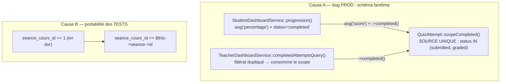

# Design — #608 · Divergences SQLite/MySQL : présences vidéo + dashboard étudiant

> Une seule solution est proposée (PRODUCTION_STANDARDS.md §6). Les alternatives
> sérieusement considérées sont listées en §5 avec leur raison de rejet (Q12).

## 1. Vue d'ensemble



Aucune migration, aucun changement de contrat d'API, aucun assouplissement de
`config/database.php:59 'strict' => true`.

---

## 2. Cause A — correctif applicatif

### 2.1 `QuizAttempt::scopeCompleted()` — nouvelle source unique (R3)

`app/Models/QuizAttempt.php` (+~15 lignes ; modèle à 150 lignes max §5 — les scopes y sont
explicitement à leur place).

```php
/**
 * Tentatives TERMINÉES par l'étudiant : soumises (en attente de correction
 * manuelle) ou corrigées.
 *
 * ⚠️ `status = 'completed'` N'EXISTE PAS dans le schéma
 * (`enum('in_progress','submitted','graded','abandoned')`). Tout filtre sur
 * cette valeur renvoie 0 ligne en silence sur les deux moteurs — c'est la
 * cause de #608 (dashboard étudiant) et du finding #364 (dashboard admin).
 * Ce scope est la SEULE définition du concept : ne pas la redupliquer.
 *
 * @param  Builder<QuizAttempt>  $query
 * @return Builder<QuizAttempt>
 */
public function scopeCompleted(Builder $query): Builder
{
    return $query->whereIn('status', self::COMPLETED_STATUSES);
}
```

avec `public const COMPLETED_STATUSES = ['submitted', 'graded'];` — la constante rend
l'ensemble testable et citable depuis un test sans dupliquer le littéral.

**Pourquoi un scope de modèle et pas un service ?** La règle §5 réserve aux modèles
« relations, casts, scopes » ; c'est exactement un prédicat de requête sur `quiz_attempts`,
sans dépendance ni logique métier. Un service supplémentaire injecté dans les deux
dashboards coûterait deux constructeurs modifiés (⇒ casse des `new Service(...)` des tests,
cf. `feedback_run_full_suite_before_push`) pour zéro substituabilité utile : il n'y a rien
à mocker dans un `whereIn`.

**Choix du nom.** `completed()` conserve le vocabulaire déjà établi
(`completedAttemptsQuery`, clé publique `total_attempts` « tentatives complétées »).
Le risque de le confondre avec la valeur fantôme `status='completed'` est neutralisé par
l'avertissement en tête de docblock — et surtout par le fait que le scope devient l'endroit
unique où un développeur va lire la définition.

### 2.2 `StudentDashboardService::progression()` (R1, R2)

`app/Services/Dashboard/StudentDashboardService.php:181-187` — deux lignes réécrites :

```php
-$totalQuizAttempts = QuizAttempt::where('user_id', $user->id)
-    ->where('status', 'completed')
-    ->count();
+$totalQuizAttempts = QuizAttempt::where('user_id', $user->id)->completed()->count();

-$averageQuizScore = QuizAttempt::where('user_id', $user->id)
-    ->where('status', 'completed')
-    ->avg('percentage') ?? 0;
+// `score` EST le pourcentage 0-100 (QuizGradingService.php:177,229) ; il n'existe
+// pas de colonne `percentage`. AVG ignore les NULL : les tentatives soumises non
+// encore corrigées ne faussent pas la moyenne.
+$averageQuizScore = QuizAttempt::where('user_id', $user->id)->completed()->avg('score') ?? 0;
```

Contrat de sortie **strictement identique** : mêmes clés, mêmes types
(`round((float) $averageQuizScore, 1)`). Seules les valeurs deviennent exactes au lieu
d'être `0` (ou 500).

`upcomingQuizzes()` (`:140`) porte le **même** filtre fantôme dans son
`whereDoesntHave('attempts', …)` (défaut A3, trouvé en revue). Il y consomme la
**constante** et non le scope :

```php
$query->where('user_id', $user->id)
    ->whereIn('status', QuizAttempt::COMPLETED_STATUSES);
```

Raison mesurée, pas esthétique : à l'intérieur d'une closure `whereDoesntHave`, Larastan
ne résout pas le modèle (`Builder<Model>`) — c'est le point aveugle déjà couvert par les
entrées de baseline de ce fichier pour `where('user_id', …)`. Écrire `->completed()` y
produit un `method.notFound` (mesuré), qu'il faudrait baseliner : **une nouvelle dette pour
du sucre syntaxique**. Un `@param Builder<QuizAttempt>` sur la closure a été essayé et ne
lève pas l'erreur (mesuré aussi). La constante donne le même invariant — une seule
définition — avec **zéro** nouvelle entrée de baseline. C'est pourquoi la constante, et non
le scope, est la source de vérité ; le scope n'en est que le raccourci.

### 2.3 `TeacherDashboardService::completedAttemptsQuery()` (R3)

Le littéral `['submitted', 'graded']` y est remplacé par `->completed()`. **Une ligne.**
Justification du dépassement de périmètre : laisser deux définitions indépendantes du même
concept est précisément le mécanisme qui a laissé dériver le dashboard étudiant. Le
changement est couvert par un test **déjà vert**
(`TeacherDashboardServiceTest::test_quiz_block_uses_real_columns_and_attempt_statuses`,
`total_attempts = 3`, `average_score = 70.0`) : toute erreur y serait immédiatement rouge.

`AdminDashboardService.php:128` n'est **pas** touché : son comportement inerte est figé par
un test de caractérisation volontaire (requirements §5).

---

## 3. Cause B — correctif des tests

Aucun code applicatif modifié. Dans les deux classes, la séance créée en `setUp()` est
conservée dans une propriété et son id réel est posté.

| Fichier | Changement |
|---|---|
| `tests/Feature/Requests/SyncAttendancesRequestTest.php` | `private Seance $seance;` en `setUp()` ; les 14 `'seance_cours_id' => 1` deviennent `$this->seance->id` |
| `tests/Feature/Performance/AttendancesSyncNoNPlusOneTest.php` | idem, 1 occurrence (`syncWith()`) |

Les 11 cas `422` n'ont pas besoin d'une séance existante (la validation coupe avant), mais
ils utilisent quand même l'id réel : garder un `1` en dur y réinstallerait le piège au
prochain refactor.

`test_invalid_seance_cours_id_type_returns_422` conserve `'not_integer'` (littéral
volontaire, c'est l'objet du test).

---

## 4. Stratégie de test

| Test | Nature | Prouve |
|---|---|---|
| `StudentDashboardServiceTest::test_quiz_block_uses_real_columns_and_attempt_statuses` | **NOUVEAU** (R7) | 3 tentatives (`submitted` sans score, `graded` 80, `graded` 60) → `total_attempts = 3`, `average_score = 70.0`. Échoue sur le code d'avant : 500 sous MySQL, `0/0` sous SQLite |
| `StudentDashboardServiceTest::test_quiz_block_ignores_other_students_and_unfinished_attempts` | **NOUVEAU** | `in_progress` / `abandoned` / tentative d'un autre étudiant exclues |
| `StudentDashboardServiceTest::test_quiz_block_is_neutral_without_any_attempt` | **NOUVEAU** | contrat préservé sans donnée : clés présentes, `0` / `0.0` |
| `StudentDashboardServiceTest::test_average_score_falls_back_to_zero_while_attempts_await_grading` | **NOUVEAU** | caractérise le cas limite assumé « 1 tentative — 0 % » avant correction (parité avec le dashboard enseignant) |
| `StudentDashboardServiceTest::test_upcoming_quizzes_excludes_quizzes_the_student_already_finished` | **NOUVEAU** | défaut A3 — rouge avant correctif (`['Quiz déjà passé', 'Quiz à faire']`) |
| `DashboardStudentResponseTest` (existant) | acceptance | R1 — enveloppe `{success, data}` intacte, 200 |
| `SyncAttendancesRequestTest` ×3 (existants) | acceptance | R4 |
| `AttendancesSyncNoNPlusOneTest` (existant) | acceptance | R4 + **R6** (invariant anti-N+1 #503 préservé) |
| `TeacherDashboardServiceTest` (existant, inchangé) | non-régression | R3 — le passage au scope ne change rien |

Le nouveau fichier suit la convention locale de `tests/Unit/Services/Dashboard/` (classe
`final`, `RefreshDatabase`, `TenantManager` posé en `setUp()`, service instancié
directement) — cf. `TeacherDashboardServiceTest`.

**Protocole de vérification** (R5) : les 5 tests d'acceptation sont lancés **dans un seul
processus** (`phpunit fichier1 fichier2 fichier3`), pas un par un — c'est l'ordonnancement
qui déclenche la dérive d'`AUTO_INCREMENT`. Un test vert en isolation ne prouverait rien.

---

## 5. Alternatives écartées (Q12)

1. **Ajouter une colonne `percentage` (migration) ou une valeur `completed` à l'ENUM.**
   Rejeté : `score` porte déjà exactement cette donnée (0-100) et `submitted`/`graded`
   couvrent déjà l'état « terminé ». On créerait une colonne dupliquée à maintenir en
   cohérence, plus une migration `ALTER TABLE` sur une table de volume, pour contourner
   une faute de frappe.
2. **Corriger uniquement `percentage` → `score` et laisser `status = 'completed'`.**
   Rejeté : le 500 disparaîtrait mais la requête resterait garantie sans résultat —
   `average_score` figé à 0 pour toujours. C'est traiter le symptôme (Q1), sur la ligne
   même qu'on édite.
3. **Retirer `ONLY_FULL_GROUP_BY` / passer `'strict' => false`.**
   Rejeté d'emblée : masquerait cette classe de bugs en production. Sans objet ici de
   toute façon — il n'y a aucun `GROUP BY` dans ces chemins.
4. **`RefreshDatabase` → `DatabaseMigrations`, ou `ALTER TABLE … AUTO_INCREMENT = 1` entre
   tests.** Rejeté : rendrait la suite considérablement plus lente (migrations complètes
   par test) pour rendre acceptable une mauvaise pratique — dépendre d'une valeur de clé
   auto-générée. La règle « un test ne suppose jamais un id » est la correction de fond.
5. **Écrire `completed_at` sur les tentatives pour filtrer dessus.** Rejeté : la colonne
   existe mais n'est écrite nulle part ; l'alimenter serait un changement de comportement
   applicatif (state machine des tentatives) sans rapport avec #608.

## 6. Ce qui invaliderait ce design (Q15)

- Si `score` n'était **pas** un pourcentage 0-100 → la moyenne changerait d'unité.
  *Vérifié* : `QuizGradingService.php:177` `($pointsEarned / $pointsPossible) * 100`,
  `:229` idem, colonne `decimal(5,2)`, et `passed = score >= quiz.passing_score` où
  `passing_score` vaut `50.00` par défaut.
- Si un client consommait `average_score` en s'appuyant sur le `0` permanent → rupture.
  *Écarté* : un `0` produit par un bug n'est pas un contrat, et le dashboard renvoie
  actuellement **500** en production — il n'y a aucun consommateur en état de marche.
- Si un autre test dépendait d'un id auto-incrémenté codé en dur → il tomberait sous MySQL.
  *Vérifié* : la jambe MySQL de #603 ne signale que ces 5 échecs après les 6 correctifs
  déjà mergés ; la vérification finale est le passage complet de la suite.

## 7. Impact scalabilité (Q13)

`->completed()` produit `status in ('submitted','graded')`, servi par l'index existant sur
`quiz_attempts.status` (`MUL`, cf. `DESCRIBE`) combiné à `user_id` (`MUL`). Le plan est
identique à celui du filtre d'égalité précédent — un `IN` à deux valeurs ne dégrade pas le
plan. À 10× le volume, le coût est celui d'un `avg()` sur les tentatives d'**un** étudiant,
borné par sa propre activité, pas par la taille de la table.
