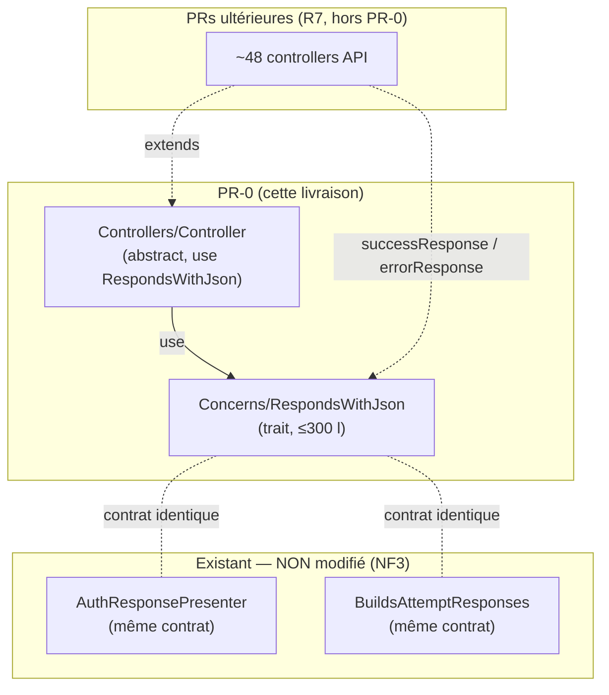

# Design — Unification des enveloppes de réponse JSON de l'API

> Spec-Driven Workflow — Phase 2 (Design). Couvre les Requirements approuvés ([requirements.md](requirements.md)).
> Solution **unique** ([PRODUCTION_STANDARDS §6](../../../PRODUCTION_STANDARDS.md#L186)).

## 1. Vue d'ensemble

On introduit un trait `RespondsWithJson` monté sur la classe `Controller` de base (aujourd'hui vide). Tout controller hérite alors de deux fabriques d'enveloppes typées — `successResponse()` et `errorResponse()` — qui produisent le **contrat canonique** dérivé d'`AuthResponsePresenter`.

PR-0 livre **uniquement** ce trait, son branchement et ses tests. Aucun controller n'est migré (R6).

## 2. Architecture



Le trait s'appuie sur le helper de présentation `response()` (couche vue), exactement comme `AuthResponsePresenter::successfulLocal()` le fait déjà — donc aucun écart avec le précédent du projet, et aucune dépendance instanciée par `new` ([NF2](requirements.md), [§1.6 D](../../../PRODUCTION_STANDARDS.md#L63)).

## 3. Fichiers

| Fichier | Action | Raison |
|---|---|---|
| `app/Http/Controllers/Concerns/RespondsWithJson.php` | **Créer** | Le trait. Dossier `Concerns/` = convention déjà en place (`Http/Requests/Concerns`, `Services/*/Concerns`, `Models/Concerns`). |
| `app/Http/Controllers/Controller.php` | **Modifier** | `use RespondsWithJson;` — branche le trait sur toute la hiérarchie. |
| `tests/Unit/Http/Controllers/Concerns/RespondsWithJsonTest.php` | **Créer** | Tests unitaires R5. |
| `app/Http/Controllers/API/Proxy/ProxyDashboardController.php` | **Modifier** | Résolution collision (R6.2 amendé) : supprimer le `private errorResponse()` redondant. Voir §3.1. |

### 3.1 Collision de visibilité héritée (découverte Phase 4)

`ProxyDashboardController::errorResponse()` est `private`. Une fois le trait monté sur le `Controller` de base, ce controller **hérite** d'un `errorResponse()` `protected` ; redéclarer une méthode héritée en visibilité réduite (`protected`→`private`) est un **fatal PHP** au chargement :

```
Access level to ProxyDashboardController::errorResponse() must be protected (as in class Controller) or weaker
```

Audit du codebase : **une seule** collision (aucun `successResponse`, aucun autre controller). Les **4 appels** (`L47, L53, L86, L92`) passent tous un status explicite (`401`) et le corps du helper est identique au trait → **suppression = zéro changement de comportement**. C'est aussi le premier gain de l'axe #1 (un doublon éliminé). Alternative écartée : passer le helper `protected` + aligner sa signature → conserverait une duplication, contraire au but.

> Choix du dossier : `Http/Controllers/Concerns` (et non `App\Http\Traits`) car le projet groupe déjà ses traits transverses dans des dossiers `Concerns/` proches de leur consommateur. Cohérence > préférence personnelle ([§Phase 3.2](../../../PRODUCTION_STANDARDS.md#L91)).

## 4. Contrat des méthodes

### 4.1 Signatures

```php
namespace App\Http\Controllers\Concerns;

use Illuminate\Http\JsonResponse;

trait RespondsWithJson
{
    /**
     * @param  mixed  $data   Payload métier (null si aucun) — la clé 'data' reste toujours présente (R2.3).
     * @param  array<string, mixed>  $meta  Métadonnées optionnelles ; clé 'meta' OMISE si vide (R2.1).
     */
    protected function successResponse(
        mixed $data = null,
        string $message = '',
        int $status = 200,
        array $meta = [],
    ): JsonResponse;

    /**
     * @param  array<string, mixed>  $errors  Détail structuré optionnel (ex. erreurs de validation) ;
     *                                         clé 'errors' OMISE si vide (R2.2). JAMAIS de getMessage() (R4).
     */
    protected function errorResponse(
        string $message,
        int $status = 400,
        array $errors = [],
    ): JsonResponse;
}
```

### 4.2 Construction du payload (logique exacte)

```php
// successResponse
$payload = [
    'success' => true,
    'message' => $message,
    'data'    => $data,        // présent même si null (R2.3)
];
if ($meta !== []) {
    $payload['meta'] = $meta;  // omis si vide (R2.1)
}
return response()->json($payload, $status);

// errorResponse
$payload = [
    'success' => false,
    'message' => $message,
];
if ($errors !== []) {
    $payload['errors'] = $errors; // omis si vide (R2.2)
}
return response()->json($payload, $status);
```

### 4.3 Table entrée → JSON (vérité du contrat)

| Appel | JSON produit | Status |
|---|---|---|
| `successResponse(['id' => 1], 'OK')` | `{"success":true,"message":"OK","data":{"id":1}}` | 200 |
| `successResponse()` | `{"success":true,"message":"","data":null}` | 200 |
| `successResponse($u, 'Créé', 201)` | `{...,"data":{...}}` | 201 |
| `successResponse($d, 'OK', 200, ['page' => 2])` | `{...,"data":{...},"meta":{"page":2}}` | 200 |
| `errorResponse('Interdit', 403)` | `{"success":false,"message":"Interdit"}` | 403 |
| `errorResponse('Invalide', 422, ['email' => ['requis']])` | `{"success":false,"message":"Invalide","errors":{"email":["requis"]}}` | 422 |

Cette table est le **golden contract** : les tests R5 l'assertent ligne par ligne.

## 5. Gestion d'erreur & sécurité

- `errorResponse()` n'accepte qu'un `string $message` métier et un `array $errors` structuré — **aucun** point d'entrée pour `$e->getMessage()` ([R4](requirements.md), [§1.2](../../../PRODUCTION_STANDARDS.md#L36)). La responsabilité de ne pas passer de détail technique reste au caller, mais la signature ne facilite aucune fuite.
- Statuts par défaut sûrs : succès 200, erreur 400. Le caller précise 201/403/404/422 explicitement.

## 6. Stratégie de test (R5)

Fichier : `tests/Unit/Http/Controllers/Concerns/RespondsWithJsonTest.php`, étend `Tests\TestCase` (le helper `response()` nécessite le conteneur Laravel ; pas de DB, pas de mock — conforme [§5 Tests](../../../PRODUCTION_STANDARDS.md#L177)).

Le trait est exercé via une **classe anonyme** qui l'utilise et expose les méthodes en public, puis on asserte `status()` + `getData(true)`.

| # | Cas | Assert |
|---|---|---|
| 1 | succès avec `data` | status 200, `success=true`, `data` égal |
| 2 | succès sans `data` (R2.3) | clé `data` présente et `null` |
| 3 | succès sans `meta` (R2.1) | clé `meta` **absente** |
| 4 | succès avec `meta` | `meta` présent et égal |
| 5 | succès status custom (201) | status 201 |
| 6 | erreur simple | status 400, `success=false`, pas de clé `errors` |
| 7 | erreur avec `errors` | `errors` présent et égal |
| 8 | erreur status custom (403/422) | status respecté |

## 7. Approche des migrations ultérieures (cadrage, hors PR-0)

Rappel pour mémoire (détaillé en Phase Tasks) : R7 impose le *test-first*. Séquence par domaine :
- **PR-1/PR-2** : controllers déjà couverts (Quiz, Chapter, Lesson, Forum, Evaluation…) → migration directe.
- **PR-3** : controllers sans test (Proxy*, Dashboard*, TeacherStats, Report, Search…) → test de caractérisation **puis** migration, même PR.

Aucune migration n'est faite en PR-0.

## 8. Risques & parades

| Risque | Parade |
|---|---|
| Le helper `response()` indisponible en test unitaire pur | Le test étend `Tests\TestCase` (conteneur booté). |
| Divergence future trait vs presenters existants | NF3 : presenters non modifiés ; la table §4.3 documente le contrat unique de référence. |
| Tentation de migrer des controllers « tant qu'on y est » | R6.2 : PR-0 strictement limitée ; revue de diff bloque tout controller modifié. |

## 9. Conformité standards

- [§1.1](../../../PRODUCTION_STANDARDS.md#L31) : trait court (≈ 40 l), base Controller trivial. ✅
- [§1.6 D](../../../PRODUCTION_STANDARDS.md#L63) : pas de `new`, pas de Facade en logique ; `response()` = helper de présentation (précédent `AuthResponsePresenter`). ✅
- [§1.3](../../../PRODUCTION_STANDARDS.md#L42) : 8 cas de test (happy + edges). ✅
- [§5](../../../PRODUCTION_STANDARDS.md#L151) : aucun controller métier touché ; pas de logique métier dans le trait. ✅
