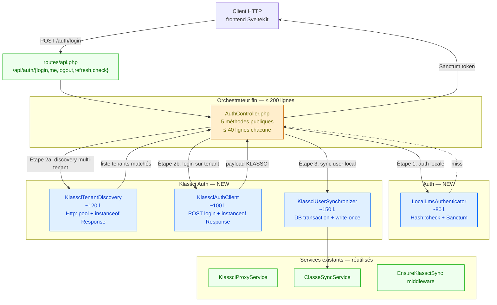
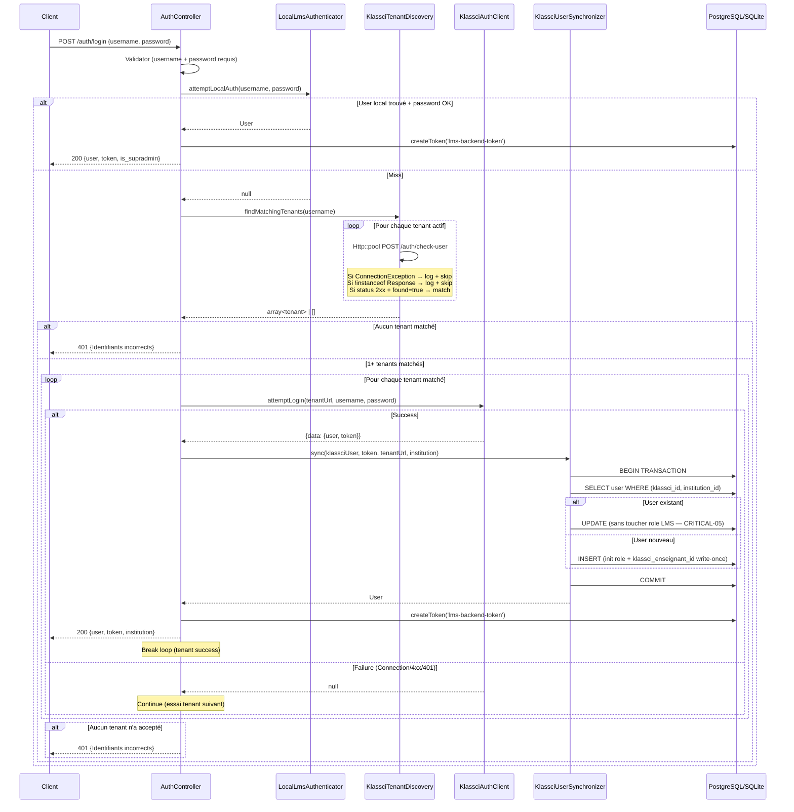

# AuthController refactor — Design

> Spec parent : [`requirements.md`](./requirements.md). Issue : [#120](https://github.com/ouedraogoissouf2012/lms_backend/issues/120).
>
> Suit le **pattern PERF-02** déjà éprouvé sur `KlassciProxyService` (PRs #136 + #137 mergées 2026-05-23). Architecture en collaborateurs DIP-friendly avec audits triple (security + architect + reviewer).

## 1. Architecture cible (Mermaid)



**Invariant central** : le flow login est strictement ordonné `LocalAuth → Discovery → KlassciAuth → UserSync`. Aucun saut. Chaque étape peut court-circuiter (success early) ou continuer (miss).

## 2. Responsabilités par collaborateur

### 2.1 `LocalLmsAuthenticator` (~80 lignes)

**Responsabilité unique** : authentification locale (compte LMS supradmin ou utilisateur déjà sync).

```php
final class LocalLmsAuthenticator
{
    public function __construct(
        private readonly HashContract $hasher,  // Illuminate\Contracts\Hashing\Hasher
        private readonly LoggerInterface $logger,
    ) {}

    public function attemptLocalAuth(string $identifier, string $password): ?User
    {
        $user = User::withoutGlobalScope('institution')
            ->where(fn ($q) => $q->where('email', $identifier)->orWhere('name', $identifier))
            ->first();

        if (!$user || !$user->password) {
            return null;
        }

        if (!$this->hasher->check($password, $user->password)) {
            return null;
        }

        $this->logger->info('Local LMS auth success', ['user_id' => $user->id]);
        return $user;
    }
}
```

**DI strict** : `Illuminate\Contracts\Hashing\Hasher` au lieu de `Hash::` facade (cf. §1.6 D du manifeste).

### 2.2 `KlassciTenantDiscovery` (~120 lignes)

**Responsabilité unique** : interroger TOUS les tenants KLASSCI configurés en parallèle pour trouver ceux qui connaissent l'identifier.

**FIX bug `successful()`** intégré :

```php
final class KlassciTenantDiscovery
{
    public function __construct(
        private readonly HttpFactory $http,
        private readonly LoggerInterface $logger,
    ) {}

    /**
     * @return array<int, array{code: string, api_base_url: string}>
     */
    public function findMatchingTenants(string $identifier): array
    {
        $tenants = $this->loadActiveTenants();
        if ($tenants === []) {
            return [];
        }

        $responses = $this->http->pool(function (Pool $pool) use ($tenants, $identifier) {
            return array_map(
                fn ($tenant) => $this->buildCheckUserRequest($pool, $tenant, $identifier),
                $tenants,
            );
        });

        return $this->filterMatchingResponses($tenants, $responses, $identifier);
    }

    private function filterMatchingResponses(array $tenants, array $responses, string $identifier): array
    {
        $matching = [];
        foreach ($tenants as $tenant) {
            $response = $responses[$tenant['code']] ?? null;

            // 🔑 FIX BUG : check instanceof avant d'appeler les méthodes
            if (!$response instanceof Response) {
                $this->logger->warning('KLASSCI tenant unreachable', [
                    'tenant' => $tenant['code'],
                    'reason' => $response::class ?? 'null',
                ]);
                continue;
            }

            if (!$response->successful()) {
                $this->logger->info('Tenant check-user non-2xx', [
                    'tenant' => $tenant['code'],
                    'status' => $response->status(),
                ]);
                continue;
            }

            $data = $response->json();
            if (($data['data']['found'] ?? false) === true) {
                $matching[] = $tenant;
            }
        }
        return $matching;
    }
}
```

### 2.3 `KlassciAuthClient` (~100 lignes)

**Responsabilité unique** : faire un `POST /auth/login` sur UN tenant donné, gérer les exceptions network.

**FIX bug** : check `instanceof Response` avant `->successful()` au site #2 (`AuthController:172`).

```php
final class KlassciAuthClient
{
    /**
     * @return array<string, mixed>|null  null si tenant down ou login refusé
     */
    public function attemptLogin(string $tenantUrl, string $username, string $password): ?array
    {
        try {
            $request = $this->buildAuthRequest();
            $response = $request->post($tenantUrl . '/auth/login', [
                'username' => $username,
                'password' => $password,
            ]);
        } catch (ConnectionException $e) {
            $this->logger->warning('KLASSCI tenant connection failed', [
                'tenant_url' => $tenantUrl,
                'error' => $e->getMessage(),
            ]);
            return null;
        }

        // 🔑 FIX BUG ligne 172 — check instanceof + successful
        if (!$response instanceof Response || !$response->successful()) {
            $this->logger->info('KLASSCI login refused or failed', [
                'tenant_url' => $tenantUrl,
                'status' => $response instanceof Response ? $response->status() : 'no-response',
            ]);
            return null;
        }

        $payload = $response->json();
        if (!is_array($payload) || ($payload['success'] ?? false) !== true) {
            return null;
        }

        return $payload;
    }
}
```

### 2.4 `KlassciUserSynchronizer` (~150 lignes)

**Responsabilité unique** : créer ou mettre à jour le `User` LMS à partir des données KLASSCI dans une DB transaction.

Logique extraite verbatim de `AuthController::syncUserFromKlassci()` (lignes 388-465). **Aucun changement comportemental** :
- Recherche par `(klassci_id, institution_id)` → fallback email
- Champs propagés au login (`klassci_id`, `name`, `email`, `klassci_role`, `klassci_token`, `klassci_data`, `last_klassci_sync`)
- Champs write-once à la création (`role` LMS — CRITICAL-05, `klassci_enseignant_id` — issue #119, `password = Hash::make(uniqid())`)
- Logs structurés préservés

Délègue `syncStudentClasses()` à `ClasseSyncService` existant (déjà injecté).

## 3. Flow détaillé — login



## 4. Décisions architecturales (§6 — Single Solution)

| Décision | Choix retenu | Alternative écartée | Raison |
|----------|--------------|---------------------|--------|
| Pattern d'extraction | 4 collaborateurs DIP-friendly + orchestrateur fin | `UserSynchronizationService` monolithique (proposé dans #120) | Cohérence avec PERF-02 PR #136 (qui a déjà 5 collaborateurs Klassci/). Évite de re-créer un god-service. |
| Fix bug `successful()` | Inclus dans le refactor (cohérent avec `KlassciBatchFetcher` PR #137) | PR de hotfix séparée | Le bug est structurel (mauvaise architecture). Le fixer hors du refactor laisserait l'anti-pattern. Single PR = single concern « architecture auth multi-tenant ». |
| Méthode `attemptLocalAuth` retourne `?User` | `?User` (null si miss) | `bool + setter` | Permet au controller de directement utiliser le User pour le token sans re-query. Plus simple, plus testable. |
| `KlassciAuthClient::attemptLogin` retourne `?array` | `?array` payload brut JSON | DTO typé | YAGNI : 1 seul caller (`AuthController`). DTO premature. |
| Fallback exception en log + null vs throw | Log + null | Throw `KlassciAuthException` | Conserve la sémantique « try next tenant » du code original. Throw casserait la boucle prématurément. |
| `HashContract` injecté vs `Hash::` facade | Contract injecté | Facade en code métier | §1.6 D du manifeste : « jamais de Facade en code métier ». Aussi : facilite le mock en test unit. |
| `HttpFactory` injecté vs `Http::` facade | `HttpFactory` injecté | Facade | Idem §1.6 D. Pattern identique à `KlassciHttpClient` PR #136. |
| `LoggerInterface` PSR-3 vs `Log::` facade | PSR-3 contract | Facade | Standard PSR + DIP. |
| Préserver `syncUserFromKlassci` ligne-par-ligne | Comportement strict | Refactor opportuniste | REQ-7 zero régression. Les invariants CRITICAL-05 + issue #119 sont sensibles, on ne les touche pas dans ce refactor. |
| Tests Mockery vs `Http::fake()` | `Mockery::mock` sur les contracts injectés | `Http::fake()` | Permet tests UNIT purs (sans bootstrap Laravel complet pour `LocalLmsAuthenticator` notamment). Plus rapide. |

## 5. Plan de migration (3 commits incrémentaux)

Pour faciliter la review, 1 PR avec 3 commits atomiques :

| Commit | Scope | Lignes net |
|--------|-------|------------|
| **C1** | NEW : 4 collaborateurs + tests unit (DI, pas encore utilisés par le controller) | +1000 net |
| **C2** | REFACTOR : `AuthController::login()` consomme les 4 collaborateurs. Méthodes privées `findTenantsForUser`/`syncUserFromKlassci`/`syncStudentClasses` SUPPRIMÉES | −400 net |
| **C3** | TESTS : ajouter test Feature `LoginCrashOnTenantDownTest` qui reproduit le bug pré-fix (avec mock ConnectionException) | +50 net |

Total net : ~+650 lignes (4 nouveaux fichiers + tests, AuthController réduit).

## 6. Risques identifiés & mitigations

| Risque | Probabilité | Impact | Mitigation |
|--------|-------------|--------|------------|
| **R1** : régression sur le flow login en prod | MOYENNE | HAUT | REQ-7 zero régression + 32 tests unit + tests Feature préservés |
| **R2** : invariants CRITICAL-05 cassés (escalade privilèges) | FAIBLE | CRITIQUE | `syncUserFromKlassci` extrait **ligne-par-ligne** (pas de refactor opportuniste). Audit `spec-security` obligatoire. Tests `KlassciRoleSeparationTest.php` (PR #118) doivent rester verts. |
| **R3** : invariants issue #119 cassés (IDOR évaluations) | FAIBLE | CRITIQUE | `klassci_enseignant_id` write-once préservé. Tests `KlassciEnseignantIdBackfillTest.php` (PR #122) doivent rester verts. |
| **R4** : `Http::pool()` continue de retourner ConnectionException → impossible à tester | NULLE (déjà reproduit) | NUL | Test Feature `LoginCrashOnTenantDownTest` mock `HttpFactory::pool` pour retourner directement `ConnectionException` |
| **R5** : Sanctum `createToken()` non mockable en test unit | FAIBLE | MOYEN | Tests intégration via `actingAs()` pour le flow Sanctum. Tests unit ne mockent que les collaborateurs. |
| **R6** : `withoutGlobalScope('institution')` mal compris par futur dev | MOYENNE | MOYEN | Docblock explicit dans `LocalLmsAuthenticator` expliquant la nécessité (supradmin cross-institution) |

## 7. Sécurité (audit anticipé `spec-security`)

### 7.1 Pas de fuite token dans les logs

Les logs des 4 collaborateurs (`logger->info`/`warning`/`error`) ne loggent JAMAIS :
- Le password brut
- Le `klassci_token` brut
- Le contenu du JSON `data` (qui contient le token KLASSCI)

Ils loggent uniquement : `tenant_code`, `user_id`, `status`, `error_message` (sans détail sensible).

Test garde : pattern existant `test_token_hash_is_not_logged_brutely` de `KlassciProxyServiceMemoTest.php` (PR #136) — à reproduire pour les nouveaux services.

### 7.2 Isolation cross-tenant préservée

`KlassciUserSynchronizer` cherche par `(klassci_id, institution_id)` — exactement comme l'original. Pas de lookup par URL (issue #75 préservé).

### 7.3 Préservation CRITICAL-05

`KlassciUserSynchronizer::sync()` :
- UPDATE branch : préserve `role` LMS (jamais écrit)
- CREATE branch : initialise `role` à `klassciRole` (initialisation autorisée, REQ-3 spec critical-05)

### 7.4 Préservation issue #119

CREATE branch initialise `klassci_enseignant_id` à partir de `klassci_data` JSON. UPDATE branch NE le touche JAMAIS (write-once garanti).

## 8. PHPStan / Larastan

### 8.1 Types stricts requis

```php
/** @return array<int, array{code: string, api_base_url: string}> */
public function findMatchingTenants(string $identifier): array;

/** @return array<string, mixed>|null */
public function attemptLogin(string $tenantUrl, string $username, string $password): ?array;

public function attemptLocalAuth(string $identifier, string $password): ?User;
```

### 8.2 Aucune baseline diff attendue

Le projet est à level 9. Les nouveaux fichiers doivent être strictement typés dès la création.

## 9. Lien avec les autres specs

| Spec | Lien |
|------|------|
| `.claude/specs/critical-05-klassci-role-separation/` | REQ-3 préservé verbatim |
| `.claude/specs/klassci-enseignant-id-separation/` | Write-once préservé verbatim |
| `.claude/specs/perf-02-klassci-batch-cache/` | Pattern 4 collaborateurs DIP-friendly reproduit |
| `.claude/specs/lms-data-controller-split/` | Précédent split de god-controller |
| REFACTORING_ROADMAP.md TIER 1 | Refactor identifié comme PERF-04 (logique métier → services) |

## 10. Effort & calendrier

| Phase | Effort | Cumul |
|-------|--------|-------|
| Phase 1 — Spec (cette doc) | 1h30 | 1h30 |
| Phase 2 — Impl C1 (4 collaborateurs + tests unit) | 3h | 4h30 |
| Phase 3 — Impl C2 (refactor AuthController) | 1h30 | 6h |
| Phase 4 — Impl C3 (test Feature regression) | 30min | 6h30 |
| Phase 5 — 3 audits + remediation | 2h | 8h30 |
| **Total** | | **~8h30** |

Répartissable sur 2-3 sessions.
