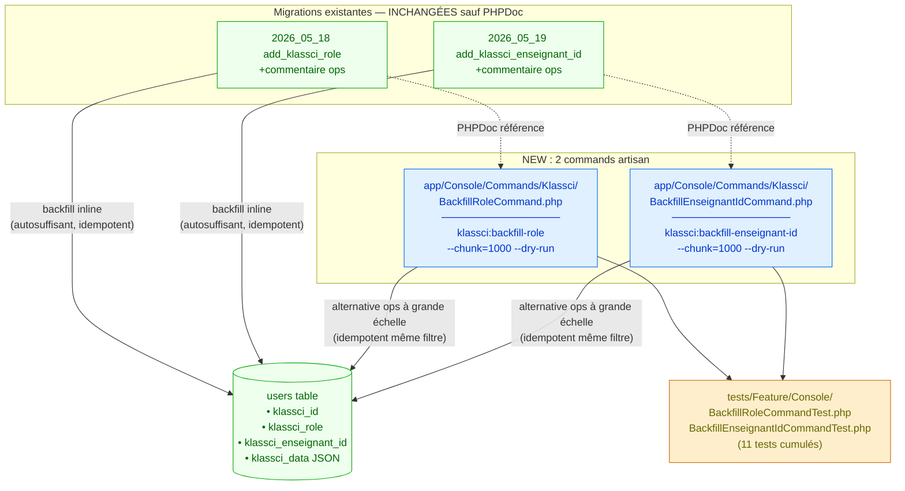

# Backfill command artisan — Design

> Spec parent : [`requirements.md`](./requirements.md). Issue : [#126](https://github.com/ouedraogoissouf2012/lms_backend/issues/126).
>
> Follow-up scale de #34 (PR #118 / `klassci_role`) et #119 (PR #122 / `klassci_enseignant_id`). Pure ajout de tooling ops — aucune modification de logique métier.

## 1. Architecture cible



**Invariant central** : les commands artisan reproduisent **EXACTEMENT** la logique du backfill inline des migrations correspondantes. Comportement runtime identique pour les 2 voies (migration inline ou command CLI). Permet :
- **Migrations** : déploiements ≤ 500k users (zero-config, backfill auto)
- **Commands** : déploiements > 500k users (CLI manuel post-migration, chunk ajustable, dry-run)
- **Récupération** : si un backfill inline crashe au déploiement, le command rejoue depuis l'état partiel sans dommage (idempotent)

## 2. Architecture des commands

### 2.1 Base commune (héritage Laravel Command)

Les 2 commands partagent :
- Extends `Illuminate\Console\Command`
- Options `--chunk={N}` (défaut 1000) et `--dry-run` (flag)
- Progress bar via `$this->output->createProgressBar()`
- Compteurs avant/après affichés via `$this->info()` / `$this->line()`
- Return `self::SUCCESS` (= 0) ou `self::FAILURE` (= 1)

### 2.2 Différences entre les 2 commands

| Aspect | `BackfillRoleCommand` | `BackfillEnseignantIdCommand` |
|---|---|---|
| Colonne cible | `klassci_role` | `klassci_enseignant_id` |
| Source | `users.role` (raw SQL `DB::raw('role')`) | `users.klassci_data->>'enseignant_id'` (PHP `json_decode`) |
| Filtre idempotence | `whereNotNull('klassci_id')` (pas de `whereNull('klassci_role')` car la migration originelle ne l'a pas — on garde la même sémantique = override always) | `whereNotNull('klassci_id')->whereNull('klassci_enseignant_id')` (idempotence stricte) |
| UPDATE par chunk | 1 seul UPDATE batch (`whereIn('id', ...)`) | N UPDATEs (un par user, car json_decode PHP-side) |
| Compteur "skipped" | N/A (toujours update si pas filtré) | OUI (users avec blob malformé ou sans `enseignant_id`) |

**Note sémantique** : la migration `klassci_role` n'a PAS de filtre `whereNull('klassci_role')` parce que la logique est `klassci_role = role` (toujours déterministe — un re-run écrit la même valeur). Le command préserve cette sémantique. Idempotence vérifiée par les TESTS (run 2× → 2ᵉ run écrit les mêmes valeurs, comportement identique).

## 3. Implémentation du `BackfillRoleCommand`

```php
<?php

declare(strict_types=1);

namespace App\Console\Commands\Klassci;

use Illuminate\Console\Command;
use Illuminate\Support\Facades\DB;

/**
 * Backfill `users.klassci_role` from `users.role` for KLASSCI-synced users.
 *
 * ## Issue #126 — préparation scale > 500k users
 *
 * Reproduit verbatim la logique de backfill inline de la migration
 * `2026_05_18_000001_add_klassci_role_to_users_table.php`. Permet une
 * exécution **hors-migration** à grande échelle (>500k users) sans bloquer
 * le pipeline de déploiement.
 *
 * ## Idempotence
 *
 * Filtre `whereNotNull('klassci_id')` aligné sur la migration originale.
 * La sémantique `klassci_role = role` est déterministe : un re-run écrit
 * la même valeur, aucun effet de bord.
 *
 * ## Usage
 *
 *   php artisan klassci:backfill-role             # défaut chunk=1000
 *   php artisan klassci:backfill-role --chunk=2000
 *   php artisan klassci:backfill-role --dry-run   # audit sans écriture
 *
 * @see app/Console/Commands/Klassci/BackfillEnseignantIdCommand.php (sister command)
 * @see database/migrations/2026_05_18_000001_add_klassci_role_to_users_table.php (migration source)
 */
final class BackfillRoleCommand extends Command
{
    protected $signature = 'klassci:backfill-role
                            {--chunk=1000 : Number of users per chunk}
                            {--dry-run : Show what would be updated without writing}';

    protected $description = 'Backfill users.klassci_role from users.role for KLASSCI-synced users (scale-out alternative to migration inline backfill).';

    public function handle(): int
    {
        $chunkSize = (int) $this->option('chunk');
        $dryRun    = (bool) $this->option('dry-run');

        if ($chunkSize < 1) {
            $this->error("Chunk size must be ≥ 1, got: {$chunkSize}");
            return self::FAILURE;
        }

        $total = DB::table('users')->whereNotNull('klassci_id')->count();

        $this->info(sprintf(
            'Backfilling klassci_role for %d users (chunk=%d%s)',
            $total,
            $chunkSize,
            $dryRun ? ', DRY-RUN' : '',
        ));

        if ($total === 0) {
            $this->info('Nothing to backfill.');
            return self::SUCCESS;
        }

        $bar     = $this->output->createProgressBar($total);
        $updated = 0;

        DB::table('users')
            ->whereNotNull('klassci_id')
            ->orderBy('id')
            ->chunkById($chunkSize, function ($users) use (&$updated, $dryRun, $bar) {
                if (!$dryRun) {
                    DB::table('users')
                        ->whereIn('id', $users->pluck('id'))
                        ->update(['klassci_role' => DB::raw('role')]);
                }
                $updated += $users->count();
                $bar->advance($users->count());
            });

        $bar->finish();
        $this->newLine();

        $this->info(($dryRun ? '[dry-run] ' : '') . "Updated {$updated} / {$total} users.");

        return self::SUCCESS;
    }
}
```

**LOC** : ~75 lignes (dont ~30 PHPDoc).

## 4. Implémentation du `BackfillEnseignantIdCommand`

```php
<?php

declare(strict_types=1);

namespace App\Console\Commands\Klassci;

use Illuminate\Console\Command;
use Illuminate\Support\Facades\DB;

/**
 * Backfill `users.klassci_enseignant_id` from `users.klassci_data['enseignant_id']`
 * for KLASSCI-synced users.
 *
 * ## Issue #126 — préparation scale > 500k users
 *
 * Reproduit verbatim la logique de backfill inline de la migration
 * `2026_05_19_000001_add_klassci_enseignant_id_to_users_table.php`. Permet une
 * exécution hors-migration à grande échelle (>500k users) sans bloquer
 * le pipeline de déploiement.
 *
 * ## Idempotence
 *
 * Filtre `whereNotNull('klassci_id')->whereNull('klassci_enseignant_id')` aligné
 * sur la migration originale. Une fois le backfill effectué, le 2ᵉ run trouve
 * 0 row à traiter et exit en `SUCCESS`.
 *
 * ## Skips (compteur "skipped")
 *
 * Un user est skippé silencieusement si son `klassci_data` :
 *   - est NULL ou vide
 *   - n'est pas un JSON valide (parsing échoue)
 *   - ne contient pas la clé `enseignant_id` (typique pour les étudiants)
 *   - contient `enseignant_id` non numérique
 *
 * ## Usage
 *
 *   php artisan klassci:backfill-enseignant-id
 *   php artisan klassci:backfill-enseignant-id --chunk=2000
 *   php artisan klassci:backfill-enseignant-id --dry-run
 *
 * @see app/Console/Commands/Klassci/BackfillRoleCommand.php (sister command)
 * @see database/migrations/2026_05_19_000001_add_klassci_enseignant_id_to_users_table.php (migration source)
 */
final class BackfillEnseignantIdCommand extends Command
{
    protected $signature = 'klassci:backfill-enseignant-id
                            {--chunk=1000 : Number of users per chunk}
                            {--dry-run : Show what would be updated without writing}';

    protected $description = 'Backfill users.klassci_enseignant_id from klassci_data["enseignant_id"] for KLASSCI-synced users (scale-out alternative).';

    public function handle(): int
    {
        $chunkSize = (int) $this->option('chunk');
        $dryRun    = (bool) $this->option('dry-run');

        if ($chunkSize < 1) {
            $this->error("Chunk size must be ≥ 1, got: {$chunkSize}");
            return self::FAILURE;
        }

        $total = DB::table('users')
            ->whereNotNull('klassci_id')
            ->whereNull('klassci_enseignant_id')
            ->count();

        $this->info(sprintf(
            'Backfilling klassci_enseignant_id for %d candidate users (chunk=%d%s)',
            $total,
            $chunkSize,
            $dryRun ? ', DRY-RUN' : '',
        ));

        if ($total === 0) {
            $this->info('Nothing to backfill (idempotence: already done).');
            return self::SUCCESS;
        }

        $bar     = $this->output->createProgressBar($total);
        $updated = 0;
        $skipped = 0;

        DB::table('users')
            ->whereNotNull('klassci_id')
            ->whereNull('klassci_enseignant_id')
            ->orderBy('id')
            ->chunkById($chunkSize, function ($users) use (&$updated, &$skipped, $dryRun, $bar) {
                foreach ($users as $u) {
                    $blob = is_string($u->klassci_data)
                        ? json_decode($u->klassci_data, true)
                        : (array) $u->klassci_data;

                    $enseignantId = is_array($blob) ? data_get($blob, 'enseignant_id') : null;

                    if (is_numeric($enseignantId)) {
                        if (!$dryRun) {
                            DB::table('users')
                                ->where('id', $u->id)
                                ->update(['klassci_enseignant_id' => (int) $enseignantId]);
                        }
                        $updated++;
                    } else {
                        $skipped++;
                    }

                    $bar->advance();
                }
            });

        $bar->finish();
        $this->newLine();

        $this->info(($dryRun ? '[dry-run] ' : '') . "Updated {$updated} / {$total} users (skipped {$skipped} — no enseignant_id in blob).");

        return self::SUCCESS;
    }
}
```

**LOC** : ~100 lignes (dont ~35 PHPDoc).

## 5. Modification des migrations existantes (REQ-3)

### 5.1 `2026_05_18_000001_add_klassci_role_to_users_table.php`

Insérer un commentaire au-dessus du `DB::table('users')->whereNotNull('klassci_id')...` ligne 40 :

```php
// NOTE (issue #126): Pour les déploiements à grande échelle (>500k users)
// où ce backfill inline risque un timeout, utiliser plutôt le command
// artisan dédié :
//     php artisan klassci:backfill-role --chunk=2000
// Le command est IDEMPOTENT (sémantique `klassci_role = role` déterministe).
DB::table('users')
    ->whereNotNull('klassci_id')
    ...
```

### 5.2 `2026_05_19_000001_add_klassci_enseignant_id_to_users_table.php`

Idem pour la migration enseignant_id, commentaire pointant vers `klassci:backfill-enseignant-id`.

**Aucun changement de logique** — pure documentation pour onboarding ops futur.

## 6. Tests Feature

### 6.1 Pattern de test

Pattern Laravel standard pour commands :

```php
$this->artisan('klassci:backfill-role', ['--chunk' => 100])
    ->expectsOutput('Backfilling klassci_role for 3 users (chunk=100)')
    ->assertExitCode(0);

self::assertSame('enseignant', User::find($teacher->id)->klassci_role);
```

### 6.2 Setup commun

`RefreshDatabase` + skip `pdo_pgsql` (cohérent avec le reste de la suite).

### 6.3 Tests `BackfillRoleCommandTest` (5 tests)

1. `test_backfill_copies_role_to_klassci_role_for_synced_users`
2. `test_backfill_skips_users_without_klassci_id`
3. `test_backfill_is_idempotent` (run 2× → 2ᵉ run écrit les mêmes valeurs)
4. `test_dry_run_does_not_write_to_db`
5. `test_returns_success_exit_code_on_normal_run` (couvert via `assertExitCode(0)` dans test #1)

### 6.4 Tests `BackfillEnseignantIdCommandTest` (6 tests)

1. `test_backfill_extracts_enseignant_id_from_blob`
2. `test_backfill_skips_users_without_enseignant_id_in_blob`
3. `test_backfill_is_idempotent` (run 2× → 2ᵉ run reports 0 candidates)
4. `test_dry_run_does_not_write_to_db`
5. `test_handles_malformed_klassci_data_gracefully` (klassci_data = 'invalid json' ou null)
6. `test_returns_success_exit_code_on_normal_run`

## 7. Implementation outline

| Step | Fichier | Action | LOC net |
|---|---|---|---|
| 1 | `app/Console/Commands/Klassci/BackfillRoleCommand.php` | NEW | +75 |
| 2 | `app/Console/Commands/Klassci/BackfillEnseignantIdCommand.php` | NEW | +100 |
| 3 | `database/migrations/2026_05_18_000001_add_klassci_role_to_users_table.php` | +commentaire ops 5 lignes | +5 |
| 4 | `database/migrations/2026_05_19_000001_add_klassci_enseignant_id_to_users_table.php` | +commentaire ops 5 lignes | +5 |
| 5 | `tests/Feature/Console/BackfillRoleCommandTest.php` | NEW — 5 tests | +150 |
| 6 | `tests/Feature/Console/BackfillEnseignantIdCommandTest.php` | NEW — 6 tests | +180 |

**Bilan** : net `+515 LOC`, dont 175 commands + 10 commentaires migrations + 330 tests. Code applicatif strictement additif (zéro modification de logique existante).

## 8. PHPStan

Aucune nouvelle violation attendue :
- Commands étendent `Illuminate\Console\Command` (typage Laravel standard)
- `DB::table(...)->chunkById(N, $callback)` est typé via Larastan generic stubs
- Le `is_string($u->klassci_data)` + `json_decode(...)` est null-safe par construction
- `is_numeric(...)` short-circuit empêche cast int sur non-numeric

## 9. Alternatives rejetées

### 9.1 Command universel paramétré `klassci:backfill {column}`

Option : un seul command avec param `--column=role|enseignant_id`.

**Rejeté** parce que :
- YAGNI à 2 occurrences
- Les 2 backfills ont des logiques fondamentalement différentes (UPDATE SQL simple vs JSON decode PHP)
- Maintenir un command avec branches conditionnelles `if ($column === ...) ` dégrade la lisibilité
- Pattern Laravel/community : un command = une responsabilité (cf. `migrate`, `migrate:fresh`, `migrate:reset` — séparés)

### 9.2 Retirer le backfill inline des migrations existantes

Option : extraire totalement vers les commands, supprimer le backfill inline.

**Rejeté** parce que :
- Casse l'autosuffisance des migrations (un `migrate` ne suffirait plus à arriver à l'état target)
- Sur les environnements actuels (dev, staging) le backfill inline a déjà tourné → impact zéro mais sur les nouveaux environnements (CI clean, futures écoles), il faudrait deux commandes
- Pas de gain — l'idempotence du command artisan permet de l'utiliser EN PLUS de la migration sans conflit

### 9.3 Jobs Laravel queue dispatché async (`Bus::dispatch(BackfillRoleJob::class)`)

Option : transformer le backfill en job queue Horizon.

**Rejeté pour cette PR** parce que :
- Out of scope ops basique (CLI manuel suffit)
- Ajoute une dépendance opérationnelle (Horizon doit être configuré + run)
- Le command CLI peut toujours être wrappé en job plus tard si besoin (`Bus::dispatch(new BackfillJob)` qui appelle `Artisan::call('klassci:backfill-role')`)
- 2 commands = 2 plus simples à maintenir / déboguer que 2 jobs + 1 dispatcher

### 9.4 SQL pur sans PHP `foreach` pour `klassci_enseignant_id`

Option : utiliser `UPDATE users SET klassci_enseignant_id = (klassci_data->>'enseignant_id')::int WHERE klassci_id IS NOT NULL AND klassci_enseignant_id IS NULL`.

**Rejeté** parce que :
- Casse la portabilité multi-DB (PG `->>` vs MySQL `JSON_EXTRACT` vs SQLite `json_extract`)
- Le projet support SQLite local + PG en CI/prod — pas de SQL non portable autorisé sans dialect adapter
- Le foreach PHP scale à 500k en O(n) avec progress bar — acceptable pour ops manuelle
- Si jamais le besoin émerge à 5M+, refactor vers SQL natif sera trivial (1 changement dans `BackfillEnseignantIdCommand::handle`)

### 9.5 Trait/base class commun aux 2 commands (`BackfillCommandBase`)

Option : extraire un parent abstrait avec `--chunk`, `--dry-run`, progress bar.

**Rejeté pour cette PR** parce que :
- 2 occurrences seulement = pas un anti-DRY suffisant pour justifier l'abstraction
- Les 2 commands ont déjà ~70-80% de code identique (signature, options, progress bar, exit codes)
- Si un 3ᵉ command émerge, considérer l'extraction. Aujourd'hui : 2 fichiers indépendants restent plus simples à lire
- Précédent dans le codebase : `EvaluationXxxRequest` ont eu une extraction (PR #129 trait `ChecksEvaluationOwnership`) seulement après 3 occurrences confirmées

## 10. Projection volume 10×

| Métrique | Aujourd'hui (~20k users) | 200k (10×) | 500k (25×) | 5M (250×) | Tient ? |
|---|---|---|---|---|---|
| `klassci:backfill-role` (UPDATE batch SQL) | <1s | ~5s | ~15s | ~3min | ✅ |
| `klassci:backfill-enseignant-id` (foreach PHP) | ~2s | ~30s | ~2min | ~30min | ✅ jusqu'à 5M, après → SQL natif (alternative §9.4) |
| Lock window sur `users` | <100ms par chunk | <100ms | <100ms | <100ms | ✅ chunkById préserve la latence |
| Progress bar overhead | trivial | trivial | trivial | trivial | ✅ |

**Aucun goulet** dans la fourchette de scale anticipée (20k → 500k). Au-delà de 5M : passer en SQL natif.

## 11. Critère d'invalidation (Q15 — manifest)

Cette solution est **à invalider et reconcevoir** SI :

1. **Volume > 5M users** → migrer vers SQL natif (alternative §9.4) ou Bus::batch parallèle.
2. **3ᵉ backfill émerge** → considérer extraction trait/base class (alternative §9.5).
3. **Table `users` est splittée** (par exemple `users_klassci` séparée) → adapter les filtres au nouveau schéma.
4. **Les colonnes `klassci_role` / `klassci_enseignant_id` deviennent calculées on-the-fly** (accessor Eloquent ou DB computed column) → les commands deviennent inutiles à supprimer.

Aucune de ces 4 conditions n'est connue aujourd'hui.

## 12. Cohérence avec PRODUCTION_STANDARDS

| § | Règle | Statut |
|---|---|---|
| §1.1 Zero God Code (300 lignes max) | Commands 75 + 100 LOC | PASS |
| §1.2 Sécurité Absolue | Aucun `getMessage()` exposé, aucun secret, aucun endpoint nouveau | PASS |
| §1.3 Tests Obligatoires | 11 tests Feature + idempotence + dry-run | PASS |
| §1.4 Performance Garantie | `chunkById` préserve la latence, scale projection §10 | PASS |
| §1.5 Validation systématique | N/A (CLI command, pas d'input HTTP) | N/A |
| §1.6 SOLID — SRP | 1 command = 1 backfill = 1 responsabilité | PASS |
| §1.6 SOLID — DIP | Pas de Facade injection, `DB::table` = idiome Laravel pour les ops batch | PASS (idiome accepté pour commands) |
| §1.6 DRY | 2 commands quasi-symétriques mais code 80% différent (SQL vs JSON). Trait commun rejeté (YAGNI à 2 occurrences) | PASS |
| §6 Une seule solution | 5 alternatives rejetées avec raison §9 | PASS |
