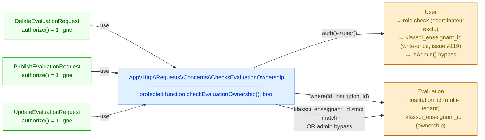

# ChecksEvaluationOwnership trait — Design

> Spec parent : [`requirements.md`](./requirements.md). Issue : [#125](https://github.com/ouedraogoissouf2012/lms_backend/issues/125).
>
> Précédents : invariants sécurité hérités de #119 (PR #122) et #124 (PR #128). Refactor pur — aucun changement de comportement runtime.

## 1. Architecture cible



**Invariants préservés** :
- Comportement runtime identique avant/après — refactor pur
- Sécurité héritée intacte : pattern de lecture `klassci_enseignant_id` (issue #119) + admin bypass + multi-tenant `institution_id`
- Coordinateurs toujours bloqués sur les 3 endpoints
- `users.klassci_enseignant_id === null` → 403 (issue #119 défense en profondeur)

## 2. Structure du trait

### 2.1 Fichier `app/Http/Requests/Concerns/ChecksEvaluationOwnership.php`

```php
<?php

declare(strict_types=1);

namespace App\Http\Requests\Concerns;

use App\Models\Evaluation;
use App\Models\User;

/**
 * Authorization check shared by `DeleteEvaluationRequest`, `PublishEvaluationRequest`,
 * and `UpdateEvaluationRequest`. Factorise 37 lignes dupliquées × 3 en un seul site.
 *
 * Issue #125 (refactor) — promesse honorée des audits spec-architect de PR #122 (#119)
 * et PR #128 (#124).
 *
 * ## Invariants sécurité hérités
 *
 * Le trait ne change PAS le comportement runtime des 3 FormRequests — il extrait
 * leur logique commune verbatim. Les invariants sécurité posés par les PRs
 * antérieures restent valides :
 *
 * - **Coordinateurs exclus** : les coordinateurs n'ont pas vocation à modifier
 *   des évaluations (décision business pré-existante).
 * - **Multi-tenant** : l'évaluation doit appartenir à l'institution du user
 *   authentifié (filtre `where('institution_id', $user->institution_id)`).
 * - **Ownership write-once (issue #119)** : la lecture passe par
 *   `$user->klassci_enseignant_id` (colonne dédiée write-once, jamais réécrite
 *   par re-sync KLASSCI), JAMAIS par le blob `klassci_data['enseignant_id']`
 *   qui serait vulnérable à un re-sync compromis.
 * - **Admin bypass** : `$user->isAdmin()` court-circuite le check d'ownership
 *   pour les rôles administratifs (admin, administrateur, superAdmin, supradmin).
 *
 * ## Usage
 *
 * ```php
 * final class DeleteEvaluationRequest extends FormRequest
 * {
 *     use \App\Http\Requests\Concerns\ChecksEvaluationOwnership;
 *
 *     public function authorize(): bool
 *     {
 *         return $this->checkEvaluationOwnership();
 *     }
 * }
 * ```
 *
 * @see \App\Http\Requests\DeleteEvaluationRequest
 * @see \App\Http\Requests\PublishEvaluationRequest
 * @see \App\Http\Requests\UpdateEvaluationRequest
 */
trait ChecksEvaluationOwnership
{
    /**
     * Returns true iff the authenticated user can act on the evaluation
     * referenced by `$this->route('id')`. False otherwise → 403.
     *
     * Ne dépend que de :
     * - `auth()->user()` (pattern FormRequest standard)
     * - `$this->route('id')` (resolved by FormRequest at runtime)
     */
    protected function checkEvaluationOwnership(): bool
    {
        /** @var User|null $user */
        $user = auth()->user();

        if (!$user) {
            return false;
        }

        // Coordinators are excluded from evaluation mutations by business rule.
        if ($user->role === 'coordinateur') {
            return false;
        }

        // Evaluation must exist and belong to user's institution.
        $evaluation = Evaluation::where('id', $this->route('id'))
            ->where('institution_id', $user->institution_id)
            ->first();

        if (!$evaluation) {
            return false;
        }

        // Ownership check (issue #119) — read from the write-once dedicated
        // column `users.klassci_enseignant_id` (never from the volatile blob).
        // Admin bypass: full role bypass (admin / supradmin / etc).
        if (!$user->isAdmin()) {
            $userKlassciEnseignantId = $user->klassci_enseignant_id;
            if ($userKlassciEnseignantId === null
                || $evaluation->klassci_enseignant_id !== $userKlassciEnseignantId) {
                return false;
            }
        }

        return true;
    }
}
```

### 2.2 Bilan structurel

| Avant | Après |
|---|---|
| 3 × 37 lignes `authorize()` dupliquées = **111 LOC** | 1 trait 60 LOC + 3 × 1 ligne = **63 LOC** |
| Modifier le pattern = toucher 3 fichiers | Modifier le pattern = toucher 1 fichier |
| Risque de divergence silencieuse | Pattern verrouillé par signature publique de trait |

Gain net : **−48 LOC** + amélioration maintenabilité majeure.

## 3. Migration des 3 FormRequests

### 3.1 Pattern de transformation (identique pour les 3)

**Avant** (exemple `DeleteEvaluationRequest`) :

```php
final class DeleteEvaluationRequest extends FormRequest
{
    public function authorize(): bool
    {
        $user = auth()->user();
        if (!$user) return false;
        if ($user->role === 'coordinateur') return false;

        $evaluation = \App\Models\Evaluation::where('id', $this->route('id'))
            ->where('institution_id', $user->institution_id)
            ->first();
        if (!$evaluation) return false;

        if (!$user->isAdmin()) {
            $userKlassciEnseignantId = $user->klassci_enseignant_id;
            if ($userKlassciEnseignantId === null
                || $evaluation->klassci_enseignant_id !== $userKlassciEnseignantId) {
                return false;
            }
        }

        return true;
    }

    public function rules(): array { return []; }
}
```

**Après** :

```php
use App\Http\Requests\Concerns\ChecksEvaluationOwnership;
use Illuminate\Foundation\Http\FormRequest;

final class DeleteEvaluationRequest extends FormRequest
{
    use ChecksEvaluationOwnership;

    public function authorize(): bool
    {
        return $this->checkEvaluationOwnership();
    }

    public function rules(): array { return []; }
}
```

### 3.2 PHPDocs nettoyées

Avant (extrait `DeleteEvaluationRequest`) :

```php
/**
 * Validates evaluation delete request (DELETE /api/evaluations/{id}).
 *
 * ## Purpose
 * Authorize deletion of evaluation.
 * Can only delete if no students have submitted yet (canBeEdited check).
 *
 * ## Authorization Model
 * 1. User authenticated
 * 2. User is NOT coordinateur
 * 3. Evaluation exists and belongs to user's institution
 * 4. Evaluation.canBeEdited() == true (checked by controller)
 */
```

Après :

```php
/**
 * Validates evaluation delete request (DELETE /api/evaluations/{id}).
 *
 * ## Purpose
 * Authorize deletion of evaluation.
 * Can only delete if no students have submitted yet (canBeEdited check is
 * performed by the controller, not here).
 *
 * ## Authorization
 * Delegated to {@see \App\Http\Requests\Concerns\ChecksEvaluationOwnership::checkEvaluationOwnership()}.
 * Identical behavior across Delete/Publish/UpdateEvaluationRequest (issue #125 refactor).
 */
```

Identique mutatis mutandis pour `PublishEvaluationRequest` et `UpdateEvaluationRequest`.

## 4. Stratégie de test

### 4.1 Tests Unit du trait

Pattern : créer une classe FormRequest **concrète de test** dans le fichier de test qui utilise le trait. Permet d'exercer le trait isolément sans dépendre des 3 FormRequests réels (chacun ayant ses `rules()` propres qui n'ont rien à voir avec l'authorize).

**Fichier** : `tests/Unit/Http/Requests/Concerns/ChecksEvaluationOwnershipTest.php`

**Squelette** :

```php
<?php

declare(strict_types=1);

namespace Tests\Unit\Http\Requests\Concerns;

use App\Http\Requests\Concerns\ChecksEvaluationOwnership;
use App\Models\Evaluation;
use App\Models\Institution;
use App\Models\User;
use Illuminate\Foundation\Http\FormRequest;
use Illuminate\Foundation\Testing\RefreshDatabase;
use Laravel\Sanctum\Sanctum;
use Tests\TestCase;

/**
 * Test du trait `ChecksEvaluationOwnership` via une classe FormRequest concrète
 * de test (`TestEvaluationOwnershipRequest`) déclarée ci-dessous. Permet d'exercer
 * le trait sans dépendre des 3 FormRequests réels.
 */
final class ChecksEvaluationOwnershipTest extends TestCase
{
    use RefreshDatabase;

    private Institution $institution;
    private Institution $otherInstitution;

    protected function setUp(): void
    {
        if (!extension_loaded('pdo_pgsql')) {
            self::markTestSkipped('PostgreSQL PDO driver not available (CI-only test).');
        }

        parent::setUp();

        $this->institution      = Institution::factory()->create(['slug' => 'school-a']);
        $this->otherInstitution = Institution::factory()->create(['slug' => 'school-b']);
    }

    // 8 tests REQ-4 ...
}

/**
 * Classe FormRequest concrète de test utilisée pour exercer le trait en isolation.
 * @internal
 */
final class TestEvaluationOwnershipRequest extends FormRequest
{
    use ChecksEvaluationOwnership;

    public function authorize(): bool
    {
        return $this->checkEvaluationOwnership();
    }
}
```

### 4.2 Comment exercer le trait

Le challenge : `auth()->user()` et `$this->route('id')` nécessitent un context HTTP. **Approche** : utiliser Laravel `Sanctum::actingAs` pour `auth()` et créer manuellement la FormRequest avec ses routes via `setRouteResolver` / `setContainer`.

**Helper privé** dans le test :

```php
private function runTraitWith(?User $user, ?int $evaluationId): bool
{
    if ($user !== null) {
        Sanctum::actingAs($user);
    }

    $request = TestEvaluationOwnershipRequest::create(
        "/test/evaluations/{$evaluationId}",
        'DELETE',
    );

    // Bind the route parameter — the trait reads $this->route('id')
    $route = new \Illuminate\Routing\Route(['DELETE'], '/test/evaluations/{id}', []);
    $route->bind($request);
    $route->parameters = ['id' => (string) $evaluationId];
    $request->setRouteResolver(fn () => $route);

    $request->setContainer(app());
    $request->setUserResolver(fn () => $user);

    return $request->authorize();
}
```

### 4.3 Régression Feature

Les tests Feature existants (`tests/Feature/Security/KlassciEnseignantIdSeparationTest.php` PR #122, `EvaluationOwnershipMassAssignmentTest.php` PR #128) exercent les 3 FormRequests réels via des routes HTTP. **Aucun changement attendu** : si la régression-suite reste verte, le refactor est correct.

## 5. PHPStan

Aucune nouvelle violation attendue :
- Le trait a un PHPDoc précis (`@var User|null $user` pour l'inférence)
- `Evaluation::where(...)` est typé par les modèles existants
- Les 3 FormRequests passent de `return bool;` à `return bool;` — signatures inchangées

Si baseline gonfle, investiguer (§1.2 manifeste — pas régénérer aveuglément).

## 6. Implementation outline

| Step | Fichier | Action | Lignes net |
|---|---|---|---|
| 1 | `app/Http/Requests/Concerns/ChecksEvaluationOwnership.php` | NEW — trait avec PHPDoc + `checkEvaluationOwnership()` | +75 |
| 2 | `app/Http/Requests/DeleteEvaluationRequest.php` | Use trait + `authorize()` 1-ligne + PHPDoc nettoyée | −30 |
| 3 | `app/Http/Requests/PublishEvaluationRequest.php` | Idem | −30 |
| 4 | `app/Http/Requests/UpdateEvaluationRequest.php` | Idem | −30 |
| 5 | `tests/Unit/Http/Requests/Concerns/ChecksEvaluationOwnershipTest.php` | NEW — 8 tests Unit | +220 |

**Bilan code applicatif** : `+75 − 30 × 3 = −15 LOC` net sur le code applicatif (réduction par DRY). Tests : `+220 LOC`. Net global : `~+205 LOC` mais code applicatif **plus court de 15 lignes**.

## 7. Alternatives rejetées

### 7.1 Composition via méthode statique `Evaluation::checkOwnership($user, $id): bool`

Option : ajouter une méthode statique sur le model.

**Rejeté** parce que :
- Statique sur Model viole la **DIP** (§1.6 D du manifeste) — le model ne devrait pas connaître la logique d'autorisation HTTP
- Pas idiomatique Laravel : les FormRequests sont l'endroit canonique pour l'autorisation HTTP
- Difficile à étendre si la logique d'autorisation devient asynchrone, basée sur le request, etc.

### 7.2 Class abstraite `EvaluationOwnershipFormRequest extends FormRequest`

Option : faire hériter les 3 FormRequests d'une classe abstraite intermédiaire.

**Rejeté** parce que :
- Laravel encourage les **traits** pour les comportements partagés sur FormRequest, pas les classes abstraites intermédiaires
- L'héritage limite la flexibilité (un FormRequest ne peut hériter que d'une classe) — un trait permet de composer plusieurs concerns
- Précédent : `App\Models\Traits\BelongsToInstitution` est un trait, pas une classe abstraite

### 7.3 Middleware HTTP dédié `ensure.evaluation.owner`

Option : créer un middleware Laravel qui s'applique à la route.

**Rejeté** parce que :
- Mélange responsabilités : un middleware HTTP a vocation à protéger une route, pas à exécuter une logique d'autorisation interne au request
- Le `$this->route('id')` est plus naturel dans un FormRequest
- La gestion d'erreur `403` est plus uniforme via le `authorize()` du FormRequest

### 7.4 Refactor + cache de l'éval déjà chargée (élimination N+1)

Option : faire que le trait expose `getCheckedEvaluation(): ?Evaluation` pour que les controllers puissent réutiliser sans re-query.

**Rejeté pour cette PR** parce que :
- Hors scope DRY chirurgical
- Pattern Laravel canonique : FormRequest pour authorize, Controller pour business logic — pas de couplage
- Issue follow-up séparée si la perf est jugée critique (probable à 200k users)

### 7.5 Refactor au-delà des 3 FormRequests (Quiz, Forum, Notification)

Option : étendre le pattern aux autres FormRequests qui ont des authorize similaires.

**Rejeté** parce que :
- Sémantiques d'ownership différentes : Quiz vérifie `klassci_etudiant_id`, Forum vérifie `klassci_user_id`, Notification vérifie `user_id` LMS pur
- Chaque domaine mérite son propre trait dédié (`ChecksQuizOwnership`, `ChecksForumOwnership`, etc.)
- Scope #125 explicite : 3 FormRequests Evaluation uniquement
- Ouvrir issues séparées si jugé utile

## 8. Projection volume 10×

| Métrique | Aujourd'hui | 10× (200k users) | Tient ? |
|---|---|---|---|
| Méthode `checkEvaluationOwnership` exécutée par requête | 1 par DELETE/PUT/POST publish | idem | ✅ |
| 1 SELECT `Evaluation::where(id, institution_id)` indexé | <1ms | <2ms | ✅ |
| 1 lookup attribut `$user->klassci_enseignant_id` | O(1) | O(1) | ✅ |
| Comparaison strict `!==` | O(1) | O(1) | ✅ |
| Overhead trait vs méthode inlinée | imperceptible (PHP method dispatch identique) | imperceptible | ✅ |

**Aucun goulet** introduit. Le refactor est **neutre** en performance (la méthode est inlinée par le runtime PHP, pas plus lent qu'avant).

## 9. Critère d'invalidation (Q15 — manifest)

Cette solution est **à invalider et reconcevoir** SI :

1. **Les checks d'autorisation des 3 FormRequests deviennent divergents** (par ex. seul `Delete` doit autoriser un admin, ou seul `Publish` doit refuser après une certaine heure). Dans ce cas, le trait devient un anti-pattern — restaurer les `authorize()` explicites. **Réversible** triviallement (le trait n'est utilisé qu'à 3 endroits).
2. **Un 4ᵉ FormRequest Eval émerge** (par ex. `ArchiveEvaluationRequest`, `LockEvaluationRequest`). Si tous suivent le même pattern, le trait est validé par les faits. Si la sémantique d'ownership diverge, créer un nouveau trait sibling.
3. **Le pattern d'authorize change drastiquement** (audit log obligatoire, nouvelle dimension de tenant). Mise à jour ponctuelle du trait → propagation automatique aux 3 FormRequests. C'est exactement le bénéfice ciblé. **Pas d'invalidation**.
4. **La règle « coordinateur ne peut pas modifier d'éval » est levée** (un coordinateur peut publier les évals de son département). REQ-1 trait doit être révisée. Mais ce serait un changement business, pas un problème de trait.

Aucune de ces 4 conditions n'est connue aujourd'hui.

## 10. Cohérence avec spec PRODUCTION_STANDARDS

| §  | Règle | Statut |
|---|---|---|
| §1.1 Zero God Code (300 lignes) | Trait 75 lignes, 3 FormRequests réduits | PASS |
| §1.2 Sécurité Absolue | Invariants sécurité hérités intacts | PASS |
| §1.3 Tests Obligatoires | 8 tests Unit + régression Feature 35 tests | PASS |
| §1.4 Performance | 0 nouveau N+1, neutre perf | PASS |
| §1.5 Validation systématique | FormRequests intacts pour validation, refactor sur `authorize()` uniquement | PASS |
| §1.6 SOLID — SRP | Trait = 1 raison de changer (logique d'ownership Eval) | PASS |
| §1.6 SOLID — DRY | 111 LOC duplication → 1 site | PASS amélioré |
| §1.6 SOLID — DIP | Pas de Facade ajoutée, pas de `new` | PASS |
| §6 Pas d'alternatives | 5 alternatives explicitement rejetées en §7 | PASS |
