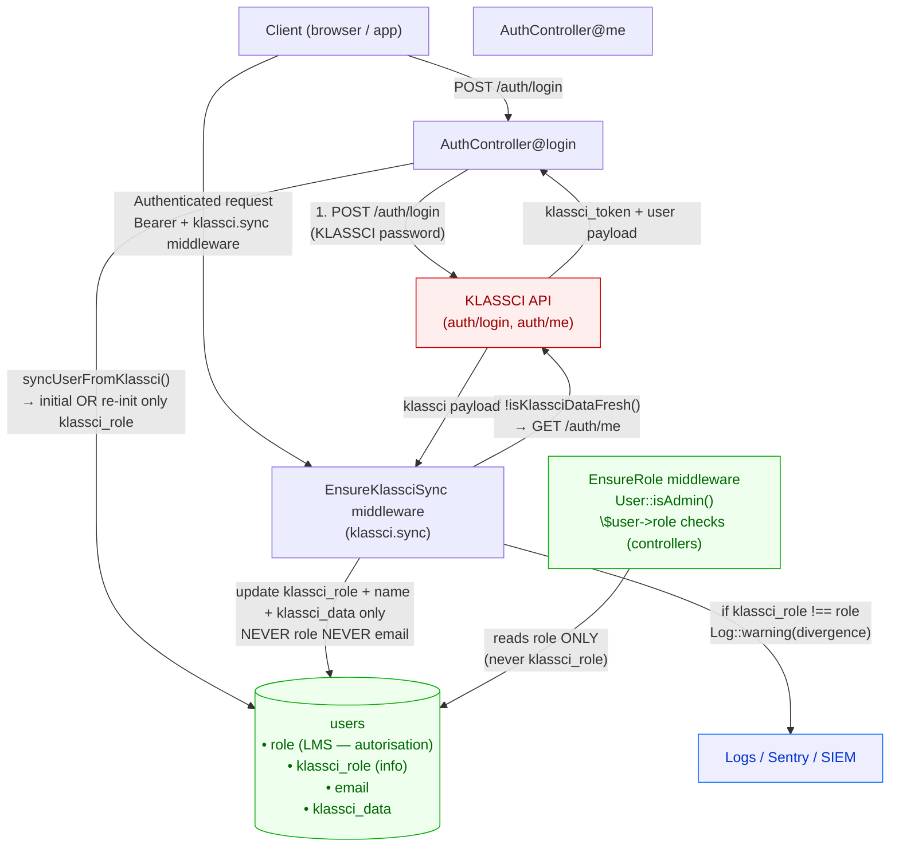
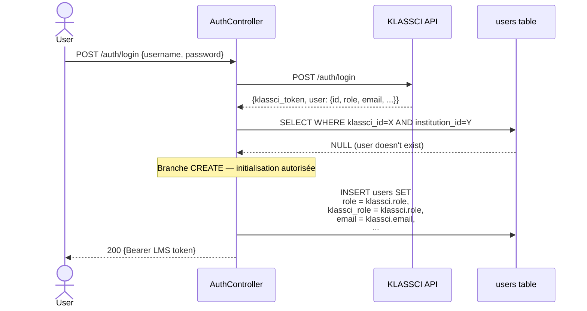
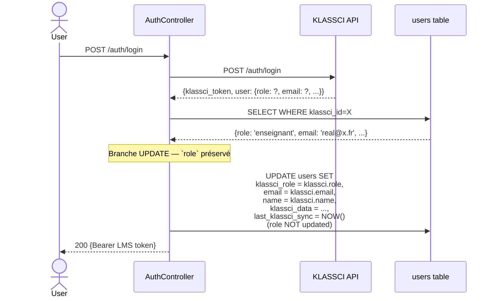
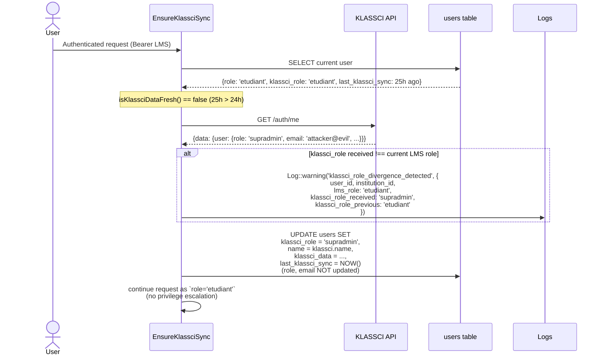
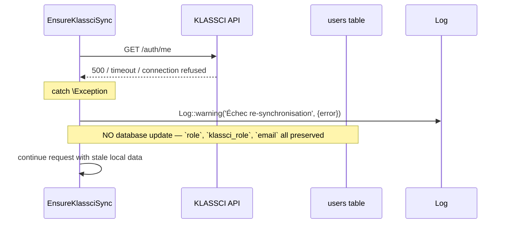

# CRITICAL-05 — Design

> Spec parent : [`requirements.md`](./requirements.md). Issue : [#34](https://github.com/ouedraogoissouf2012/lms_backend/issues/34).

## 1. Architecture cible



**Invariant central** : la colonne `users.role` n'est jamais écrite avec une valeur provenant de KLASSCI **après** la création initiale. Tous les chemins d'écriture sont audités :

| Site d'écriture | `role` écrit depuis KLASSCI ? | Justification |
|---|---|---|
| `AuthController::syncUserFromKlassci()` — branche CREATE | ✅ OUI (1ère fois uniquement) | Initialisation obligatoire d'un nouveau user |
| `AuthController::syncUserFromKlassci()` — branche UPDATE | ❌ NON | User existant, `role` LMS reste l'autorité |
| `EnsureKlassciSync::handle()` re-sync 24h | ❌ NON | Re-sync passive, vecteur d'escalade silencieuse |
| Administration LMS (futur) | ✅ OUI (via interface admin LMS, hors scope) | Action humaine auditée, hors flux KLASSCI |

## 2. Data model

### 2.1 Migration

```php
// database/migrations/2026_05_18_xxxxxx_add_klassci_role_to_users_table.php
Schema::table('users', function (Blueprint $table) {
    $table->string('klassci_role', 50)->nullable()->after('role');
    $table->index('klassci_role');
});

// Backfill: copy current role into klassci_role for KLASSCI-synced users
DB::table('users')
    ->whereNotNull('klassci_id')
    ->update(['klassci_role' => DB::raw('role')]);
```

**Pourquoi `string(50)` nullable et pas enum ?** YAGNI (§1.6) — pas de contrainte forte sur les valeurs. KLASSCI peut évoluer (ajouter `directeur`, `conseiller`, etc.) sans coordination ; un enum DB forcerait une migration synchrone à chaque évolution KLASSCI. La protection se fait côté autorisation (REQ-1, `role` LMS), pas côté ingestion.

**Pourquoi `index` ?** Permet de répondre rapidement à « combien d'utilisateurs ont une divergence `role !== klassci_role` ? » côté ops (audit SOC). Sans index, ce scan deviendrait coûteux à 200k users.

**Pourquoi `nullable` ?** Users locaux (non synchronisés KLASSCI — ex : seeder supradmin, comptes de service) n'ont pas de `klassci_id`. Backfill ciblé sur `whereNotNull('klassci_id')`, le reste reste NULL → comportement « no klassci context » explicite.

### 2.2 Model `User`

Ajout au `$fillable` et un PHPDoc `@property` :

```php
/**
 * @property string|null $klassci_role  Role reçu de KLASSCI (informatif).
 *                                       Ne JAMAIS utiliser pour autorisation — utiliser `role`.
 */
class User extends Authenticatable
{
    protected $fillable = [
        // ...existing...
        'klassci_role',  // ← ajouté juste après 'role'
    ];
}
```

Aucun cast spécial nécessaire (string natif). Aucune méthode `isKlassciAdmin()` ou similaire ajoutée — on veut que le code applicatif ne soit pas tenté de lire `klassci_role` pour des décisions.

## 3. Flux applicatifs détaillés

### 3.1 Sign-up initial (premier login)



### 3.2 Login d'un user existant



Note : `email` est **encore synchronisé au login** (cf. discussion section 4 sur le périmètre email). Au re-sync (3.3), email est figé.

### 3.3 Re-sync passive 24h via middleware



### 3.4 KLASSCI API failure pendant re-sync



Comportement préservé verbatim de l'implémentation actuelle (graceful degradation). Aucune information n'est perdue, l'utilisateur peut continuer à utiliser le LMS avec sa session courante.

## 4. Périmètre `email` — décision

`requirements.md` REQ-4 dit : « SHALL ne PAS mettre à jour `email` depuis le payload KLASSCI » au re-sync. REQ-3 (sign-up/login) ne mentionne pas email.

**Décision retenue** :

| Chemin | `email` mis à jour ? | Pourquoi |
|---|---|---|
| Sign-up initial (CREATE) | ✅ OUI | Initialisation, valeur de référence |
| Login user existant (UPDATE) | ✅ OUI | User actif sur sa session KLASSCI à cet instant ; si KLASSCI compromis ici, l'attaquant peut déjà tout faire via le token KLASSCI obtenu |
| Re-sync passive 24h | ❌ NON | Vecteur passif silencieux — un email substitué pourrait servir à intercepter des password-reset LMS |

Cette asymétrie est documentée explicitement dans le code via un commentaire au-dessus du `update()` du middleware.

## 5. Détection de divergence

### 5.1 Condition de log

```php
$incomingKlassciRole = $klassciUser['role'] ?? null;
$previousKlassciRole = $user->klassci_role;
$currentLmsRole      = $user->role;

if ($incomingKlassciRole !== null && $incomingKlassciRole !== $currentLmsRole) {
    Log::warning('klassci_role_divergence_detected', [
        'user_id'                => $user->id,
        'institution_id'         => $user->institution_id,
        'lms_role'               => $currentLmsRole,
        'klassci_role_received'  => $incomingKlassciRole,
        'klassci_role_previous'  => $previousKlassciRole,
        'is_escalation_attempt'  => $this->isEscalationAttempt($currentLmsRole, $incomingKlassciRole),
    ]);
}
```

Le flag `is_escalation_attempt` est `true` quand le rôle reçu de KLASSCI est *plus permissif* que le rôle LMS courant — facilite le filtrage SOC pour cibler les vrais cas suspects et écarter les divergences bénignes (ex : LMS=enseignant, KLASSCI=etudiant — pas une escalade, juste une désynchronisation côté KLASSCI).

### 5.2 Hiérarchie de permissivité

```php
private function isEscalationAttempt(?string $lmsRole, ?string $klassciRole): bool
{
    $hierarchy = [
        'etudiant'      => 1,
        'enseignant'    => 2,
        'coordinateur'  => 3,
        'admin'         => 4,
        'administrateur'=> 4,
        'superAdmin'    => 5,
        'supradmin'     => 5,
    ];
    $lms     = $hierarchy[$lmsRole] ?? 0;
    $klassci = $hierarchy[$klassciRole] ?? 0;

    return $klassci > $lms;
}
```

La hiérarchie est *interne au middleware* — elle ne sert qu'au logging et à la qualification du finding SOC, **jamais** à de l'autorisation.

## 6. Testing strategy

### 6.1 Unit tests (Mockery)

`tests/Unit/Middleware/EnsureKlassciSyncTest.php` :
- Mock `KlassciProxyService::get('auth/me')` retourne des payloads contrôlés
- Vérifier les UPDATEs de la DB en assertions explicites
- 10 scénarios listés dans REQ-6

### 6.2 Feature tests (RefreshDatabase + Sanctum::actingAs)

`tests/Feature/Security/KlassciRoleSeparationTest.php` :
- Tests bout-en-bout : token Sanctum réel, requête HTTP, vérification que le rôle LMS n'a pas bougé après re-sync
- Multi-tenant : institution A re-sync n'affecte pas institution B

### 6.3 Coverage de régression

Re-run de toutes les suites Feature LMS (50 tests existants) — aucun changement attendu. La modification est *additive* (nouvelle colonne, plus de restrictions sur les UPDATEs).

## 7. Implementation outline

| Step | Fichier | Action | Lignes estimées |
|---|---|---|---|
| 1 | `database/migrations/2026_05_18_xxxxxx_add_klassci_role_to_users_table.php` | NEW migration + backfill | ~35 |
| 2 | `app/Models/User.php` | Ajouter `klassci_role` au `$fillable` + PHPDoc `@property` | +3 |
| 3 | `app/Http/Middleware/EnsureKlassciSync.php` | Refactor `update()` : retirer `role`/`email`, ajouter `klassci_role` + détection divergence | ~40 modifs |
| 4 | `app/Http/Controllers/API/AuthController.php` | `syncUserFromKlassci()` : séparer branche CREATE (initialise les 2) vs UPDATE (préserve `role` LMS, MAJ `klassci_role`) | ~30 modifs |
| 5 | `tests/Unit/Middleware/EnsureKlassciSyncTest.php` | NEW 8 tests unitaires (Mockery) | ~250 |
| 6 | `tests/Feature/Security/KlassciRoleSeparationTest.php` | NEW 4 tests feature (multi-tenant, end-to-end) | ~180 |

Total estimé : ~540 lignes net (dont ~430 de tests). Le code applicatif change peu (~70 lignes), preuve que la modif est chirurgicale.

## 8. PHPStan

Aucune nouvelle violation attendue :
- Ajout de `klassci_role` au `$fillable` + PHPDoc `@property` permet à PHPStan de typer correctement les accès
- Refactor du middleware ne change pas les signatures
- Tests utilisent les patterns existants (RefreshDatabase, Sanctum, Mockery)

Si baseline gonfle de manière inattendue, investiguer ne pas régénérer aveuglément (§1.2 du manifeste).

## 9. Alternatives rejetées

### 9.1 Supprimer entièrement le mécanisme de re-sync 24h

Option : faire confiance au login initial et ne plus re-sync passivement.

**Rejeté** parce que :
- `name` et `klassci_data` doivent rester à jour pour l'affichage utilisateur et les rapports
- Les autres champs informatifs (avatar, permissions affichées) seraient figés à la 1ère connexion
- Casse l'UX : un utilisateur qui change de classe côté KLASSCI ne verrait pas le changement avant son prochain re-login (ce qui peut prendre des mois pour un enseignant)

### 9.2 Bloquer le request si `klassci_role` reçu est administratif et `role` LMS ne l'est pas

Option : Refuser la requête + revoke session si KLASSCI tente de pousser une escalade.

**Rejeté** parce que :
- Faux positifs : un user légitimement enseignant dans LMS pourrait avoir un rôle élevé côté KLASSCI (cas de SI multi-rôles) — bloquer casse l'usage légitime
- Une mitigation par log + détection passive (REQ-5) suffit : l'escalade reste **impossible** côté autorisation (REQ-1), donc le blocage ne protège contre rien de plus
- Augmente la surface de bugs (faux 401, sessions revoquées en cascade)

### 9.3 Stocker `klassci_role` dans `klassci_data` JSON sans colonne dédiée

Option : Lire `$user->klassci_data['role']` au lieu d'une colonne SQL.

**Rejeté** parce que :
- Pas d'index possible sur un champ JSON imbriqué (MySQL 5.7 / PostgreSQL — possible mais coûteux)
- Audit SOC plus difficile (SELECT WHERE klassci_role != role nécessite un JSON_EXTRACT)
- `klassci_data` est un blob volatile (KLASSCI peut changer son schéma) — coupler une donnée *de sécurité* à un blob non-versionné est risqué
- Coût d'une colonne dédiée : 50 bytes par user × 200k users = 10 MB stockage, négligeable

### 9.4 Migration de `role` vers `klassci_role` (renommer) au lieu d'ajouter

Option : `role` devient `klassci_role`, créer un nouveau `lms_role` pour LMS.

**Rejeté** parce que :
- Impact massif : ~50 consommateurs de `$user->role` à modifier dans tout le codebase (controllers, middlewares, policies)
- PR ingérable (>100 fichiers touchés) — viole §6 du manifeste (« meilleur > rapide » oui, mais aussi « PR ciblée »)
- Aucun gain sécuritaire vs la solution retenue (qui obtient la même invariance avec une PR de ~540 lignes)

### 9.5 Forcer la signature cryptographique du payload `auth/me` côté KLASSCI

Option : KLASSCI signe le payload, LMS vérifie une signature avant d'écrire.

**Rejeté** parce que :
- Nécessite une modification côté KLASSCI hors périmètre LMS
- Bonne idée pour le futur (sujet d'une spec dédiée si jamais on bouge le contrat KLASSCI), mais hors scope CRITICAL-05
- N'aurait toujours pas protégé contre un attaquant qui contrôle la clé privée KLASSCI

## 10. Projection volume 10×

| Métrique | Aujourd'hui | 10× (200k users, 100 tenants) | Tient ? |
|---|---|---|---|
| Migration `ALTER TABLE users ADD COLUMN` | ~1s sur 20k | ~10s sur 200k (offline) | ✅ acceptable (en fenêtre maintenance) |
| Backfill `UPDATE users SET klassci_role = role WHERE klassci_id IS NOT NULL` | ~1s | ~10s | ✅ avec batching (1000 rows/chunk si besoin) |
| Re-sync 24h par user (volume de logs `divergence_detected`) | <1/jour/user en moyenne (≤ 20k logs/jour) | ≤ 200k logs/jour | ✅ Sentry tier standard absorbé sans problème |
| Index `klassci_role` storage | ~1 MB | ~10 MB | ✅ négligeable |
| Lecture `$user->klassci_role` (jamais utilisée pour autorisation) | 0 lectures/sec en chemin chaud | 0 lectures/sec | ✅ |
| Lecture `$user->role` (chemin chaud autorisation) | Inchangée | Inchangée | ✅ |

**Goulet d'étranglement potentiel** : si la fréquence de re-sync augmente (passage de 24h à 1h, par exemple), le volume d'updates DB et de logs grossit proportionnellement. Pas un risque court terme — l'intervalle de 24h reste l'invariant côté `User::isKlassciDataFresh()`.

## 11. Critère d'invalidation (Q15 — manifest)

Cette solution est **à invalider et reconcevoir** SI l'une des hypothèses suivantes tombe :

1. **L'administration LMS doit pouvoir déléguer les rôles à KLASSCI** (KLASSCI redevient l'autorité unique). Dans ce cas, la solution proposée bloque les workflows légitimes ; il faut une autre approche (signature cryptographique KLASSCI + registre d'admins autorisés à pousser).
2. **Le payload KLASSCI commence à inclure plusieurs rôles par tenant** (`['enseignant', 'coordinateur']`). Le mapping `klassci_role string(50)` devient inadapté ; nécessite une table `user_klassci_roles`.
3. **Un audit légal/RGPD impose la cohérence stricte `email` LMS = `email` KLASSCI**. Dans ce cas, section 4 doit être revue pour autoriser le re-sync email (mais conserver l'invariant role).
4. **La fréquence des warnings `klassci_role_divergence_detected` explose** (>1k/jour avec `is_escalation_attempt=true`) → indication d'attaque en cours OU mauvaise hygiène des admins KLASSCI ; déclencher une investigation + potentiellement durcir REQ-5 vers un blocage automatique.

Aucun de ces 4 cas n'est connu aujourd'hui. La solution tient.
