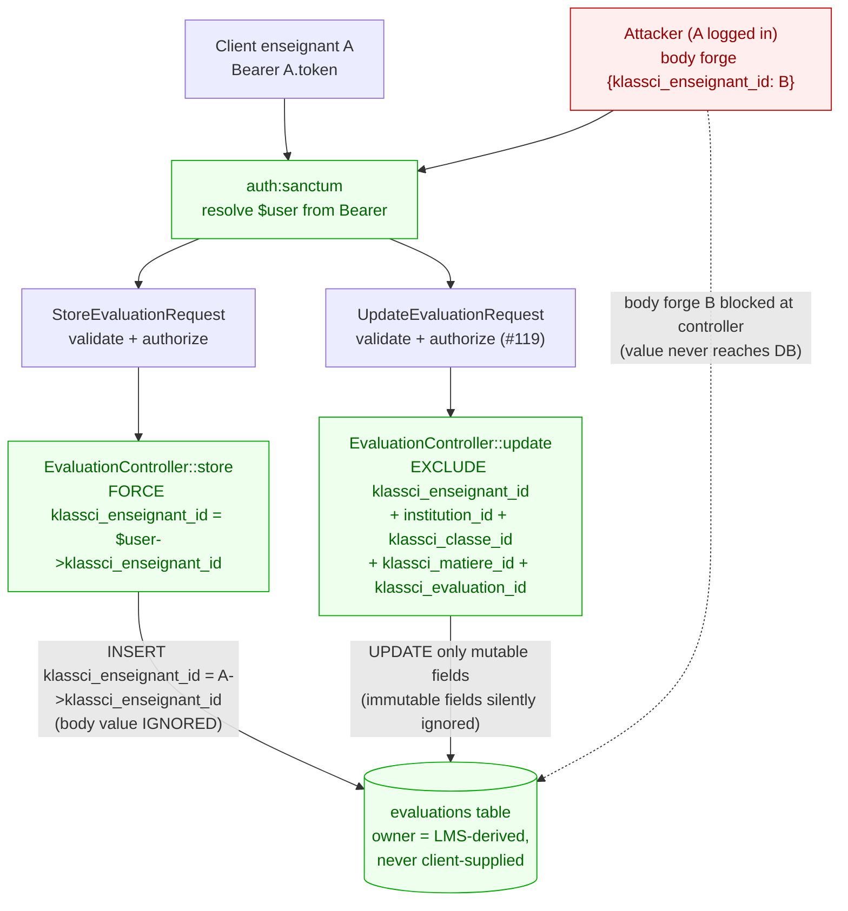
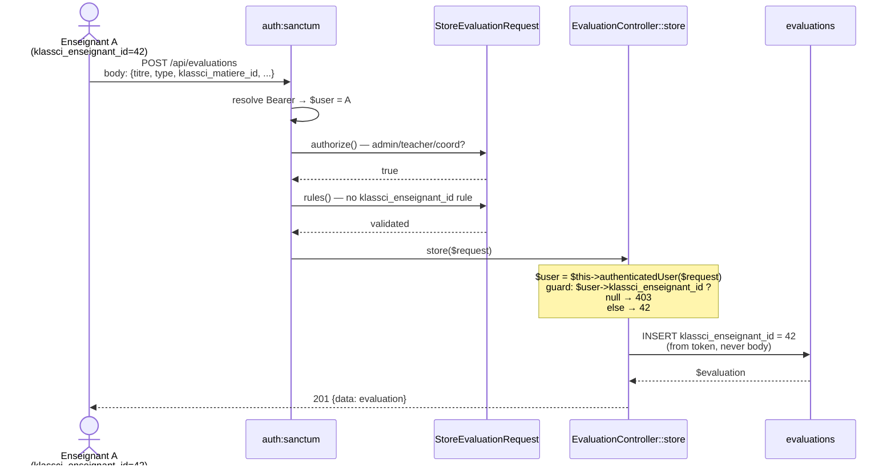
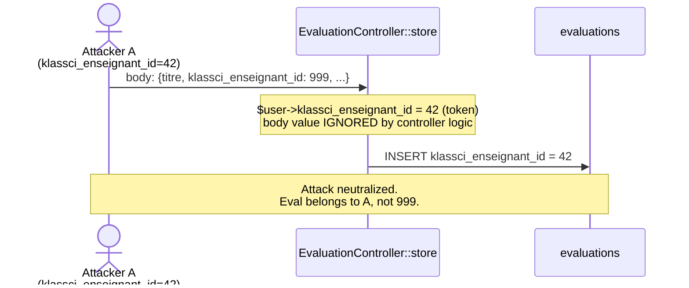
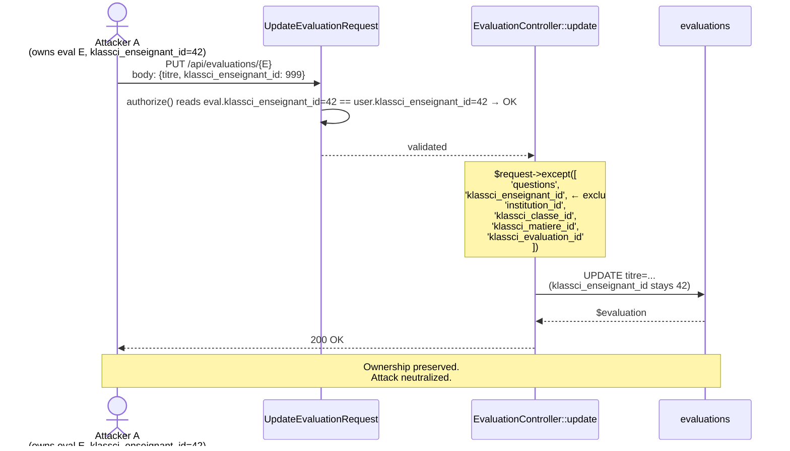

# Evaluation ownership mass-assignment — Design

> Spec parent : [`requirements.md`](./requirements.md). Issue : [#124](https://github.com/ouedraogoissouf2012/lms_backend/issues/124).
>
> Précédents : #34 (PR #118 `klassci_role`), #119 (PR #122 `klassci_enseignant_id` lecture), #123 (PR #127 `klassci_etudiant_id` from token). Cette PR ferme le dernier vecteur d'écriture/transfert d'ownership.

## 1. Architecture cible



**Invariant central** : `evaluations.klassci_enseignant_id` est dérivée **exclusivement** de `$user->klassci_enseignant_id` au CREATE et n'est **plus jamais modifiée** ensuite. Cinq autres champs d'identité (`institution_id`, `klassci_classe_id`, `klassci_matiere_id`, `klassci_evaluation_id`) sont également write-once post-create.

| Site d'écriture | `klassci_enseignant_id` source | Statut post-PR |
|---|---|---|
| `EvaluationController::store` | `$user->klassci_enseignant_id` (token) | ✅ forcé serveur |
| `EvaluationController::update` | (exclu de l'update) | ✅ immuable |
| `StoreEvaluationRequest::rules` | (règle retirée) | ✅ plus de validation côté client |
| Factories / seeders (tests, dev) | mass-assignment legit | ✅ `$fillable` préservé |
| Console / admin LMS (futur) | hors scope | À traiter via route admin dédiée si besoin |

## 2. Flux applicatifs détaillés

### 2.1 `POST /api/evaluations` — flux légitime



### 2.2 `POST /api/evaluations` — tentative d'attaque



### 2.3 `PUT /api/evaluations/{id}` — tentative de transfert d'ownership



## 3. Implementation outline

| Step | Fichier | Action | Lignes net |
|---|---|---|---|
| 1 | `app/Http/Requests/StoreEvaluationRequest.php` | Retirer la règle `'klassci_enseignant_id' => 'nullable|integer'` | −1 |
| 2 | `app/Http/Controllers/API/EvaluationController.php::store` | • Résolution `$user` au début + guard `$user->klassci_enseignant_id !== null` (sinon 403)<br>• Retirer `'klassci_enseignant_id'` du `$request->only([...])`<br>• Ajouter `'klassci_enseignant_id' => $user->klassci_enseignant_id` dans le array_merge → bloc serveur<br>• Commentaire WHY sécurité | ~+10 |
| 3 | `app/Http/Controllers/API/EvaluationController.php::update` | • Remplacer `$request->except(['questions'])` par `$request->except([...liste 6 champs immuables...])`<br>• Commentaire WHY listant les 5 champs d'identité protégés | ~+5 |
| 4 | `tests/Feature/Security/EvaluationOwnershipMassAssignmentTest.php` | NEW — 7 tests REQ-5 | +250 |

**Bilan code applicatif** : ~+14 lignes nettes (gain en sécurité + verbose comments). Tests : +250 lignes.

## 4. Détails de la modification `store`

### 4.1 Avant

```php
$evaluation = Evaluation::create(array_merge(
    $request->only([
        'klassci_matiere_id',
        'klassci_classe_id',
        'klassci_enseignant_id',   // ← VECTOR : client controls
        'klassci_evaluation_id',
        'titre',
        ...
    ]),
    [
        'matiere_nom' => $matiereNom,
        'classe_nom' => $classeNom,
    ]
));
```

### 4.2 Après

```php
// Issue #124 — sécurité : la propriété de l'évaluation est dérivée du token
// Sanctum, jamais du body. Un enseignant authentifié sans klassci_enseignant_id
// synchronisé (admin LMS local, compte service) n'a pas vocation à créer
// une évaluation — refus explicite avec 403.
$user = $this->authenticatedUser($request);
if ($user->klassci_enseignant_id === null) {
    return response()->json([
        'success' => false,
        'message' => 'Vous devez être un enseignant KLASSCI synchronisé pour créer une évaluation.',
    ], 403);
}

// [...lookup KLASSCI matiere_nom / classe_nom inchangé...]

$evaluation = Evaluation::create(array_merge(
    $request->only([
        'klassci_matiere_id',
        'klassci_classe_id',
        // 'klassci_enseignant_id' retiré — désormais forcé serveur
        'klassci_evaluation_id',
        'titre',
        ...
    ]),
    [
        'matiere_nom' => $matiereNom,
        'classe_nom' => $classeNom,
        'klassci_enseignant_id' => $user->klassci_enseignant_id,   // ← AUTORITÉ SERVEUR
    ]
));
```

**Note** : la résolution `$user` doit être faite **avant** le lookup KLASSCI (~25 lignes de code) car le guard 403 doit short-circuiter. C'est aussi DRY (le lookup existant utilise déjà `$user` un peu plus loin).

## 5. Détails de la modification `update`

### 5.1 Avant

```php
$evaluation->update($request->except(['questions']));
```

### 5.2 Après

```php
// Issue #124 — sécurité : les champs d'identité de l'évaluation sont write-once.
// Aucune mutation post-create. Si un client envoie ces champs au PUT,
// ils sont silencieusement ignorés (backward-compat).
$evaluation->update($request->except([
    'questions',
    'klassci_enseignant_id',   // ownership — REQ-1
    'institution_id',          // isolation tenant
    'klassci_classe_id',       // cible — immuable post-create
    'klassci_matiere_id',      // matière — immuable post-create
    'klassci_evaluation_id',   // référence KLASSCI — immuable post-create
]));
```

## 6. Détails de la modification `StoreEvaluationRequest`

### 6.1 Avant

```php
public function rules(): array
{
    return [
        'klassci_matiere_id' => 'required|integer',
        'klassci_classe_id' => 'required|integer',
        'klassci_enseignant_id' => 'nullable|integer',   // ← À RETIRER
        'klassci_evaluation_id' => 'nullable|integer',
        ...
    ];
}
```

### 6.2 Après

```php
public function rules(): array
{
    return [
        'klassci_matiere_id' => 'required|integer',
        'klassci_classe_id' => 'required|integer',
        // 'klassci_enseignant_id' retiré — issue #124 : dérivé du token serveur
        'klassci_evaluation_id' => 'nullable|integer',
        ...
    ];
}
```

Note : on ne retire **pas** `klassci_evaluation_id` car c'est une référence (foreign key vers KLASSCI), pas un identifiant d'ownership. Il peut être fourni légitimement par le client lorsque l'éval LMS est créée comme miroir d'une éval KLASSCI existante.

## 7. Modèle `Evaluation` — pas de changement de `$fillable`

REQ-4 préserve `klassci_enseignant_id` dans `$fillable` malgré la dette mass-assignment théorique. Justifié :
- 50+ tests Feature utilisent `Evaluation::factory()->create(['klassci_enseignant_id' => 42])` directement
- Les seeders dépendent du mass-assignment via factory states
- Solution `forceFill` côté code briserait le pattern Laravel idiomatique sans gain (la protection est déjà au niveau controller)
- Retirer du `$fillable` créerait des `Illuminate\Database\Eloquent\MassAssignmentException` dans les tests, nécessitant migration des factories — out of scope sécurité chirurgical

## 8. Testing strategy

Tests Feature Sanctum avec `RefreshDatabase`. Pas de tests unit nécessaires (la logique est triviale : substitution de source côté controller, exclusion côté update).

### 8.1 Fichier unique

`tests/Feature/Security/EvaluationOwnershipMassAssignmentTest.php` — 7 tests REQ-5 :

1. CREATE forces server-side (body forge ignored)
2. CREATE blocked for user without `klassci_enseignant_id`
3. CREATE silent ignore (avec/sans champ → résultat identique)
4. UPDATE cannot transfer ownership
5. UPDATE cannot change `institution_id`
6. UPDATE cannot change `klassci_classe_id`
7. UPDATE can still change legit fields (régression check)

### 8.2 Régression cross-suite

Re-run de :
- `tests/Feature/Security` — les 20 tests existants doivent passer
- `tests/Feature/LMS` — 50 tests existants
- Tests existants `EvaluationController` (s'il y en a) — à vérifier

## 9. Alternatives rejetées

### 9.1 Retirer `klassci_enseignant_id` du `$fillable` de `Evaluation`

Option : retirer la colonne du `$fillable`, écrire via `forceFill()` ou `$evaluation->klassci_enseignant_id = X; $evaluation->save()` côté code.

**Rejeté** parce que :
- Casse les 50+ tests Feature qui utilisent `Evaluation::factory()->create(['klassci_enseignant_id' => 42])`
- Force la migration des `UserFactory::teacher()`, seeders, et tests adjacents
- Aucun gain sécurité supplémentaire vs protection au niveau controller (qui est ce que `forceFill` contournerait de toute façon)
- Anti-pattern Laravel : `$fillable` est conçu pour les champs « assignables en masse depuis un Request » — ici, le risque vient du fait que le **controller passe `$request->only(...)` ou `$request->except(...)`** sans curation. C'est au controller de curer.

### 9.2 Whitelist au niveau Form Request avec règle `prohibited`

Option : `'klassci_enseignant_id' => 'prohibited'` dans `StoreEvaluationRequest` + `UpdateEvaluationRequest` → 422 si le client envoie le champ.

**Rejeté** parce que :
- Casse les anciens clients qui envoient le champ par habitude → 422 spurious
- Le silencieux ignore est plus tolérant et n'augmente pas le risque (le champ n'a plus aucun effet)
- Si on souhaite l'interdire strictement plus tard, c'est trivial (1 ligne)

### 9.3 Vérifier au controller `if ($request->klassci_enseignant_id !== $user->klassci_enseignant_id) return 422`

Option : refuser si le client envoie une valeur différente.

**Rejeté** parce que :
- Casse les clients qui envoient leur propre id par habitude (pas une attaque, juste un client mal codé)
- Le silencieux force-write est plus tolérant et atteint le même objectif sécuritaire
- Augmente la surface de bugs (un client envoyant le champ correctement déclenche pourtant des 422 si jamais le serveur lit un nouvelle valeur via re-sync entre-temps)

### 9.4 Ajouter une route admin dédiée `POST /admin/evaluations` pour création au nom d'un prof

Option : conserver le comportement actuel (lecture du body) sur une route admin avec `EnsureRole admin`.

**Rejeté pour cette PR** parce que :
- Aucun cas d'usage admin documenté nécessitant la création au nom d'un prof
- YAGNI : si le besoin émerge (cf. design.md §11 critère d'invalidation 1), ajouter une route propre sera trivial
- Préserver l'endpoint actuel pour les non-admin reste vulnérable au transfert d'ownership

### 9.5 Audit log structuré `Log::warning('attempted_ownership_forge')` quand body envoie un id différent

Option : logger les tentatives de forge pour détection SOC.

**Rejeté pour cette PR** parce que :
- Bruit potentiel si des anciens clients envoient le champ par habitude (volume de faux positifs élevé)
- Bénéfice limité : la protection est côté écriture, le log SOC n'apporte qu'un signal post-hoc
- Si volume anormal détecté en prod, ajouter le log dans une PR de suivi avec metrics

## 10. Projection volume 10×

| Métrique | Aujourd'hui | 10× (200k users, 100 tenants) | Tient ? |
|---|---|---|---|
| `POST /evaluations` throughput | ~5/min/tenant | ~500/min/tenant (rate-limit existant) | ✅ |
| Lecture `$user->klassci_enseignant_id` (1 fois CREATE) | trivial | trivial | ✅ |
| Guard `null check` (1 lookup attribut) | trivial | trivial | ✅ |
| Index sur `klassci_enseignant_id` (déjà existant) | ✅ | ✅ | ✅ |
| `except()` array hash lookup sur 6 clés | trivial | trivial | ✅ |

**Aucun goulet d'étranglement** introduit. La solution est plus *légère* qu'avant (moins de validation côté FormRequest, le mass-assignment va moins large côté UPDATE).

## 11. Critère d'invalidation (Q15 — manifest)

Cette solution est **à invalider et reconcevoir** SI :

1. **Cas légitime : admin LMS crée une évaluation au nom d'un enseignant** (prof absent, urgence). Dans ce cas, REQ-1 doit être révisée : autoriser `$request->klassci_enseignant_id` **uniquement si** `$user->isAdmin()`, avec audit log `evaluation_created_for_other_teacher`. **Mieux** : route admin dédiée `POST /admin/evaluations` avec `EnsureRole admin` (alternative §9.4 réactivée). Aucun cas connu.
2. **Workflow de réassignation d'ownership** est introduit (prof part de l'école, ses évaluations doivent être réassignées). Dans ce cas, REQ-2 doit être révisée : ajouter route admin `PATCH /admin/evaluations/{id}/reassign-owner` avec audit log. Pas de réassignation actuellement.
3. **La colonne `klassci_enseignant_id` change de sémantique** (multi-ownership, table de liaison). REQ-1/REQ-2 globalement à reconcevoir.
4. **Un endpoint d'import bulk de KLASSCI est ajouté** qui pousse des évals avec leur owner originel (sync KLASSCI → LMS). Dans ce cas, REQ-1 doit être révisée : autoriser body uniquement depuis cet endpoint via guard explicite (`$request->headers->get('X-KLASSCI-Sync') === <secret>` ou route dédiée + middleware). Aucun endpoint de ce type aujourd'hui.

Aucune de ces 4 conditions n'est connue.
