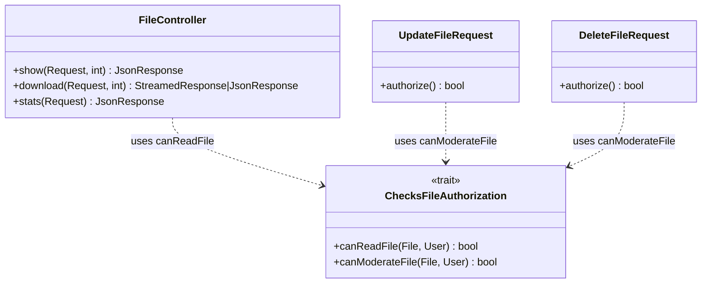

# Design — FileController IDOR cross-tenant fix

**Issue GitHub** : [#102](https://github.com/ouedraogoissouf2012/lms_backend/issues/102)
**Spec phase** : 2/3 (design)
**Date** : 2026-05-17

---

## 1. Architecture du fix



**`stats()` n'utilise pas le trait** — il a une logique différente (filtre query, pas authorize bool). Pattern inline comme `#98 Notifications stats`.

---

## 2. Trait `ChecksFileAuthorization`

Fichier : `app/Http/Requests/Concerns/ChecksFileAuthorization.php`

```php
namespace App\Http\Requests\Concerns;

use App\Models\File;
use App\Models\User;

/**
 * File action authorization with strict multi-tenant isolation.
 *
 * Why this trait (vs reusing ChecksForumAuthorization from PR #95):
 *   - Files have an `is_public` flag that grants read access intra-tenant.
 *     The Forum trait has no equivalent — adding a flag would force a leaky
 *     parameter on Forum FormRequests where it has no meaning.
 *   - Tasks: 2 methods (read vs moderate), file-specific semantics.
 *
 * Both methods follow the same defense-in-depth pattern as the Forum trait:
 *   1. Null check → deny
 *   2. supradmin role → allow (platform manager bypass)
 *   3. institution_id mismatch → deny
 *   4. owner / public / moderator → allow per method
 *   5. else → deny
 *
 * @see app/Http/Requests/Concerns/ChecksForumAuthorization.php (sibling trait)
 * @see .claude/specs/file-idor-cross-tenant/design.md §2
 */
trait ChecksFileAuthorization
{
    /**
     * Authorize READ access (show, download).
     * Grants access to:
     *   - supradmin (cross-tenant)
     *   - intra-tenant: owner OR public file OR admin
     */
    protected function canReadFile(?File $file, ?User $user): bool
    {
        if ($file === null || $user === null) {
            return false;
        }

        if ($user->role === 'supradmin') {
            return true;
        }

        if ($file->institution_id !== $user->institution_id) {
            return false;
        }

        if ($file->is_public === true) {
            return true;
        }

        if ($file->user_id === $user->id) {
            return true;
        }

        return in_array($user->role, ['admin', 'administrateur', 'superAdmin'], true);
    }

    /**
     * Authorize MODERATE access (update, destroy).
     * Grants access to:
     *   - supradmin (cross-tenant)
     *   - intra-tenant: owner OR admin
     * NOTE: is_public does NOT grant moderation rights.
     */
    protected function canModerateFile(?File $file, ?User $user): bool
    {
        if ($file === null || $user === null) {
            return false;
        }

        if ($user->role === 'supradmin') {
            return true;
        }

        if ($file->institution_id !== $user->institution_id) {
            return false;
        }

        if ($file->user_id === $user->id) {
            return true;
        }

        return in_array($user->role, ['admin', 'administrateur', 'superAdmin'], true);
    }
}
```

---

## 3. Application

### 3.1 `FileController::show()` — REQ-1

```php
public function show(Request $request, int $id): JsonResponse
{
    $file = File::with(['user:id,name,email,role', 'fileable'])->find($id);

    if (!$file) {
        return response()->json(['success' => false, 'message' => 'Fichier non trouvé'], 404);
    }

    if (!$this->canReadFile($file, $this->authenticatedUser($request))) {
        return response()->json(['success' => false, 'message' => 'Accès refusé'], 403);
    }

    $file->formatted_size = $file->getFormattedSize();
    $file->download_url = $file->getDownloadUrl();

    return response()->json(['success' => true, 'data' => $file]);
}
```

Le `extends AuthenticatedController` (PR #101) reste. On ajoute `use ChecksFileAuthorization;` dans la classe.

### 3.2 `FileController::download()` — REQ-1

Idem : remplace l'inline `!$user->isAdmin() && $file->user_id !== $user->id` par `!$this->canReadFile($file, $this->authenticatedUser($request))`.

### 3.3 `FileController::stats()` — REQ-3

```php
public function stats(Request $request): JsonResponse
{
    $caller = $this->authenticatedUser($request);
    $isSupradmin = $caller->role === 'supradmin';

    $applyScope = function ($query) use ($caller, $isSupradmin) {
        if ($isSupradmin) return $query;
        $query->where('institution_id', $caller->institution_id);
        if ($caller->isStudent()) {
            $query->where('user_id', $caller->id);
        }
        return $query;
    };

    // ... apply $applyScope to each query (5 calls like #98)
}
```

**Cache key** : namespaced per institution + student vs non-student :

```php
$cacheKey = $isSupradmin
    ? 'files_stats_global'
    : ($caller->isStudent()
        ? "files_stats_inst_{$caller->institution_id}_user_{$caller->id}"
        : "files_stats_inst_{$caller->institution_id}");
```

### 3.4 `UpdateFileRequest::authorize()` — REQ-2

```php
public function authorize(): bool
{
    $user = Auth::user();
    if (!$user instanceof User) return false;

    $file = $this->route('file');
    if (!$file instanceof File) return false;

    return $this->canModerateFile($file, $user);
}
```

### 3.5 `DeleteFileRequest::authorize()` — REQ-2

Identique à `UpdateFileRequest`.

---

## 4. Plan de tests

### 4.1 Tests unitaires du trait

Pattern identique à `ChecksForumAuthorizationTest` (PR #95). Cas (~14) :

| # | Méthode | Owner | Tenant | User | Public | Expected |
|---|---|---|---|---|---|---|
| T1 | canReadFile | null | null | null | n/a | false |
| T2 | canReadFile | obj | obj | null | false | false |
| T3 | canReadFile | obj | obj | supradmin | false | **true** |
| T4 | canReadFile | obj(own) | inst A | user inst A | false | **true** (owner) |
| T5 | canReadFile | obj | inst A | user inst A | **true** | **true** (public) |
| T6 | canReadFile | obj | inst A | etudiant inst A | false | false |
| T7 | canReadFile | obj | inst B | admin inst A | false | false (cross-tenant) |
| T8 | canReadFile | obj | inst A | admin inst A | false | **true** |
| T9 | canModerateFile | obj | inst A | etudiant inst A | **true** | false (public ≠ moderate) |
| T10 | canModerateFile | obj(own) | inst A | user inst A | false | **true** (owner) |
| T11 | canModerateFile | obj | inst A | admin inst A | false | **true** |
| T12 | canModerateFile | obj | inst B | admin inst A | false | false (cross-tenant) |
| T13 | canModerateFile | obj | inst B | supradmin | false | **true** |
| T14 | canModerateFile | obj | inst A | coordinateur inst A | false | false (coordinateur PAS dans liste) |

### 4.2 Tests d'intégration HTTP

#### `FileReadAuthorizationTest` (show + download, 7 cas each)

- Owner intra → 200
- Admin intra → 200
- Étudiant non-owner sur fichier public intra → 200
- Étudiant non-owner sur fichier non-public intra → 403
- Admin cross-tenant → 403/404
- Supradmin cross-tenant → 200

#### `FileStatsAuthorizationTest` (4 cas)

- Coordinateur/admin intra → comptages institution seulement
- Étudiant intra → comptages user uniquement (institution-scoped)
- Supradmin → comptages globaux
- Cache isolation entre institutions

#### `FileModerateAuthorizationTest` (update + destroy via gh PUT/DELETE, 5 cas each)

- Owner intra → 200
- Admin intra → 200
- Étudiant non-owner même sur fichier public intra → 403
- Admin cross-tenant → 403/404
- Supradmin → 200

---

## 5. Critères d'acceptation (10)

- **C1** : Trait `ChecksFileAuthorization` créé avec `canReadFile` et `canModerateFile`
- **C2** : `FileController::show()` + `::download()` utilisent `canReadFile`
- **C3** : `FileController::stats()` filtre tenant + cache per institution
- **C4** : `UpdateFileRequest` + `DeleteFileRequest` utilisent `canModerateFile`
- **C5** : Aucun `User::isAdmin()` dans les 5 méthodes ciblées
- **C6** : Tests unit (14 cas) + Feature HTTP (15+ cas)
- **C7** : PHPStan 0 errors hors baseline
- **C8** : 3 audits PASS (security strict obligatoire)
- **C9** : PR avec `closes #102`
- **C10** : `docs/SECURITY_CI.md` mis à jour

---

## 6. Risques actualisés

| # | Risque | Mitigation |
|---|---|---|
| R1 | `coordinateur` perd l'accès file moderation (régression) | À confirmer : actuellement le code ne mentionne pas `coordinateur` dans Files (seulement Forum/Quiz/Notifications) — donc PAS de régression. |
| R2 | Tests Feature skip locally sans `pdo_pgsql` — CI requis | Pattern Forum/Quiz/Notifications déjà appliqué |
| R3 | Cache `files_stats_*` invalidation : aucune existante, pas de risque |
| R4 | `is_public` reste un attribut sensible : audit a confirmé qu'il est uniquement pour la lecture |

---

## 7. Hors scope (rappel)

- Refactor `User::isAdmin()` projet-wide
- File-size FileController 316>200
- Migration `File::find` static vers DI
- Laravel Policies
- Rename `ChecksForumAuthorization` cosmétique
