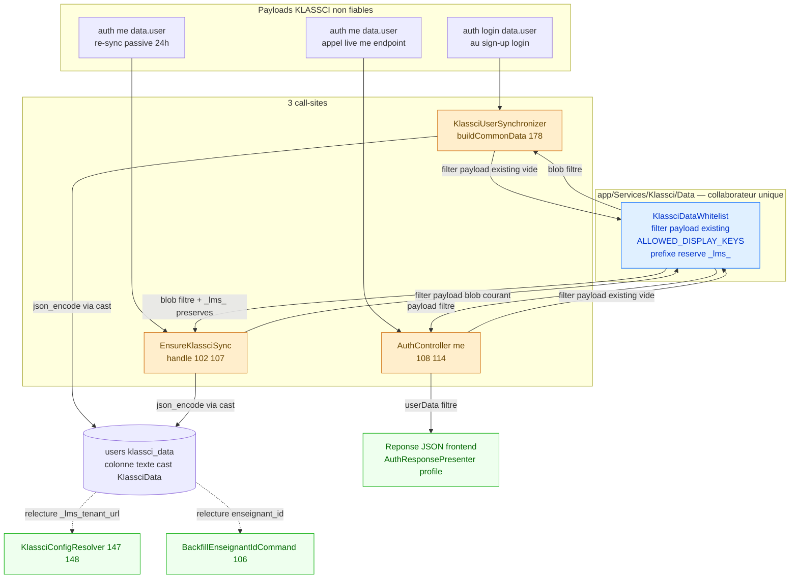
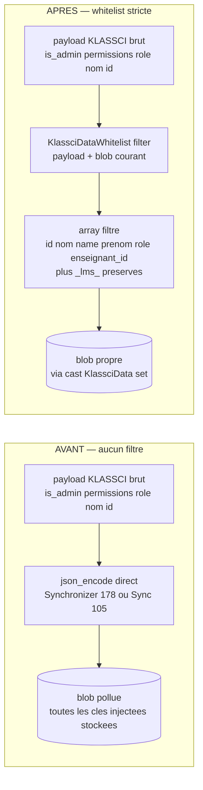
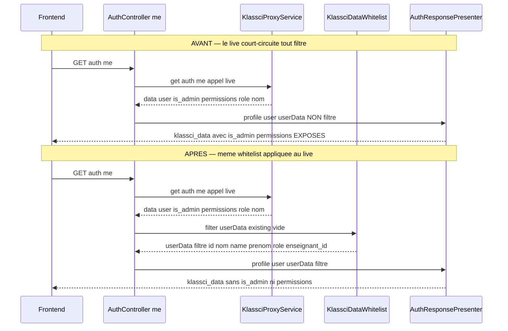
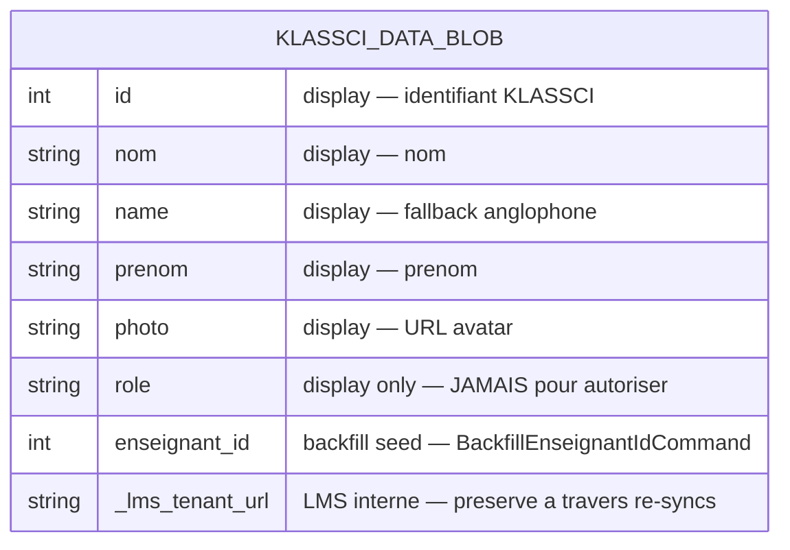

# Whitelist du blob `klassci_data` (cache display) — Design

> Spec parent : [`requirements.md`](./requirements.md) (REQ-1 à REQ-10, tests T1–T7). Issue : [#477](https://github.com/ouedraogoissouf2012/lms_backend/issues/477) · épique [#472](https://github.com/ouedraogoissouf2012/lms_backend/issues/472) · rattachée à [#470](https://github.com/ouedraogoissouf2012/lms_backend/issues/470). Branche : `fix/477-whitelist-klassci-data` (depuis `lms` à jour).
>
> **Nature de ce document : conception PROSPECTIVE d'une correction à réaliser en TDD.** Contrairement à la régularisation rétroactive de `seances-cache-hardening` (code déjà livré), le code de whitelist **n'existe pas encore**. Les `fichier:ligne` cités renvoient au **code existant** (audité par `Read` le 2026-08-03 sur `fix/477-whitelist-klassci-data`) que la solution devra modifier ou préserver. La stratégie de test (§7) décrit les tests **à écrire avant** l'implémentation (T1–T7).
>
> Suit le pattern **MANIFESTE_REFACTORING.md** : collaborateur DI unique à responsabilité unique, injecté aux call-sites, aucune Facade en code métier — même nature que `SeanceCacheDataBuilder` (#474) et `KlassciEnseignantIdResolver` (#119).

---

## 1. Vue d'ensemble

### 1.1 Le problème résolu

`users.klassci_data` (colonne texte, cast `App\Casts\KlassciData`, `User.php:55`) est un **cache display informationnel** écrasé **en bloc** à partir d'un payload KLASSCI **brut et non filtré**. Son docblock l'énonce sans ambiguïté (`KlassciData.php:13-20`) : « une instance KLASSCI compromise peut y pousser n'importe quoi ».

Trois points d'écriture/exposition manipulent aujourd'hui ce payload **sans aucune restriction de clés** :

| # | Point | Code réel | Défaut |
|---|-------|-----------|--------|
| Vecteur A₁ | Sign-up / login | `KlassciUserSynchronizer::buildCommonData()` `:178` : `json_encode(array_merge($klassciUser, ['_lms_tenant_url' => $tenantUrl]))` | payload KLASSCI brut + clé `_lms_*`, **aucun filtre** |
| Vecteur A₂ | Re-sync passive 24h | `EnsureKlassciSync::handle()` `:105` : `json_encode($klassciUser)` | payload `auth/me` d'un KLASSCI potentiellement compromis, **écrit tel quel** ; en prime **perd** `_lms_tenant_url` |
| Vecteur B | Réponse `/auth/me` | `AuthController::me()` `:108-114` → `AuthResponsePresenter::profile()` `:155-167` (`:165`) | payload **live** (appel `auth/me` en direct) placé **directement** dans la réponse JSON, **sans stockage ni filtre** |

Un KLASSCI compromis peut donc injecter `is_admin`, `permissions`, `role`, ou toute structure arbitraire, à la fois dans le **stockage local** (relu par `KlassciConfigResolver`, `BackfillEnseignantIdCommand`) et dans la **réponse frontend**.

**Objectif** : filtrer `klassci_data` contre une **whitelist stricte** (liste blanche) *avant* sérialisation (vecteur A) *et* avant exposition (vecteur B), de sorte que le blob/la réponse ne contienne **que** `{ clés d'affichage whitelistées } ∪ { clés _lms_* préservées }`. Tout le reste est **droppé silencieusement** (REQ-9 : la résilience du login/re-sync prime).

### 1.2 Invariant central — le cast ne peut pas porter la logique complète

Fait vérifié par lecture, qui **gouverne la décision d'architecture** (§6.1) :

- `KlassciData::set()` (`KlassciData.php:48-55`) ne reçoit que `$value` — **aucun accès au blob courant** du modèle. Il ne peut donc **pas** relire les `_lms_*` existants pour les préserver (REQ-3).
- Le vecteur B (`AuthController::me()` `:108-114`) construit `$userData` d'un **appel live** et le remet au presenter **sans jamais écrire en DB** → ne traverse **jamais** `set()`. Le cast est structurellement **aveugle** au vecteur B (REQ-6).

**Corollaire** : le point d'application unique du filtrage ne peut **pas** être le cast. Il doit être un collaborateur explicite, appelé aux **trois** sites (A₁, A₂, B), qui reçoit le blob courant en argument pour la préservation `_lms_*`. C'est l'option **B** tranchée en §6.1.

### 1.3 Cartographie des composants



**Principe de partition** : une **seule** classe `KlassciDataWhitelist` porte la whitelist (constante) et la logique de filtrage (`filter()`). Elle est injectée par constructeur aux trois call-sites. Aucune duplication (REQ-2, DRY §1.1). Le cast `KlassciData` reste inchangé dans son comportement (il continue de sérialiser/désérialiser) — il n'acquiert **aucune** logique de filtrage.

---

## 2. Diagrammes de flux — les deux vecteurs, avant / après

### 2.1 Vecteur A (stockage) — avant vs après



### 2.2 Vecteur B (réponse `/auth/me` live) — avant vs après



**Point clé (divergence #477, cf. requirements §« Divergence issue #477 vs code réel »)** : le vecteur B **ne lit pas** le blob stocké — il appelle KLASSCI en live (`AuthController.php:108`, vérifié). Filtrer le seul vecteur A **ne protégerait pas** le frontend. Le même collaborateur `filter()` est donc appelé sur le payload live avant `profile()`.

---

## 3. Le collaborateur `KlassciDataWhitelist`

### 3.1 Emplacement et forme

Nouveau fichier `app/Services/Klassci/Data/KlassciDataWhitelist.php` (voisin naturel de `KlassciConfigResolver` et du namespace `Klassci\Auth`). Classe `final`, **sans état**, **sans dépendance injectée** (fonction pure du couple `(payload, blob existant)`), donc **aucune Facade** (REQ-10.3, §1.6 D).

```php
final class KlassciDataWhitelist
{
    /**
     * Liste blanche des clés d'affichage KLASSCI conservées dans le blob.
     * Liste blanche stricte : toute clé absente d'ici est droppée (REQ-1).
     * NE JAMAIS ajouter une clé lue pour l'AUTORISATION (cf. docblock KlassciData).
     */
    public const ALLOWED_DISPLAY_KEYS = [
        'id', 'nom', 'name', 'prenom', 'photo', 'role', 'enseignant_id',
    ];

    /** Préfixe réservé LMS : les clés _lms_* existantes sont toujours préservées. */
    public const LMS_RESERVED_PREFIX = '_lms_';

    /**
     * @param  array<string, mixed>  $payload   Payload KLASSCI brut (data.user).
     * @param  array<string, mixed>  $existing  Blob klassci_data courant du user
     *                                          (pour préserver les _lms_*). [] si aucun.
     * @return array<string, mixed>  Blob filtré = clés d'affichage ∩ whitelist
     *                                          ∪ clés _lms_* de $existing.
     */
    public function filter(array $payload, array $existing = []): array;
}
```

### 3.2 Algorithme de `filter()` (≤ 40 lignes, §5)

Trois étapes, dans cet ordre (l'ordre garantit qu'un payload compromis ne peut pas écraser une `_lms_*` légitime) :

1. **Projection d'affichage** — ne conserver de `$payload` que les clés présentes dans `ALLOWED_DISPLAY_KEYS` :
   `array_intersect_key($payload, array_flip(self::ALLOWED_DISPLAY_KEYS))`.
   Effet : `is_admin`, `permissions`, `is_superuser`, `scopes`, et **toute clé arbitraire** sont droppées par défaut (liste blanche, REQ-1).
2. **Purge défensive des `_lms_*` venus du payload** — retirer du résultat de l'étape 1 toute clé préfixée `_lms_` (un KLASSCI compromis ne doit **jamais** pouvoir injecter/écraser une clé du namespace réservé LMS). En pratique `ALLOWED_DISPLAY_KEYS` ne contient aucun `_lms_*`, donc l'étape 1 les a déjà exclues ; cette purge est une **garde explicite** documentant l'invariant.
3. **Ré-application des `_lms_*` du blob existant** — pour chaque clé de `$existing` préfixée `LMS_RESERVED_PREFIX`, la (re)poser dans le résultat. C'est ce qui corrige le finding `_lms_tenant_url` perdu à la re-sync (REQ-3).

Le résultat est un `array` prêt à être affecté à `$user->klassci_data` (le cast `set()` le sérialise, `KlassciData.php:50-51`) pour le vecteur A, ou remis au presenter pour le vecteur B.

> **Pourquoi `filter()` renvoie un `array` et non une string JSON** : au vecteur A₁/A₂, l'affectation `'klassci_data' => $filtered` (array) laisse le **cast** sérialiser (source unique de sérialisation, `KlassciData::set()`), ce qui supprime les `json_encode` manuels des call-sites (REQ-2 alinéa IF). Au vecteur B, le presenter attend un `array` (`AuthResponsePresenter::profile(User, array $klassciData)`, `:155`). Un `array` sert donc les trois sites sans conversion.

### 3.3 Résilience (REQ-9)

`filter()` n'appelle aucune I/O, ne lance **aucune** exception sur entrée dégradée :

- `$payload` vide → étape 1 produit `[]`, étape 3 ré-ajoute les `_lms_*` de `$existing` → blob = `{ _lms_* }` au pire (jamais d'erreur).
- `$payload` avec valeurs non-scalaires sous une clé whitelistée (ex. `nom` = tableau) → **conservé tel quel** : la whitelist filtre les **clés**, pas les valeurs (hors scope requirements §« Validation de schéma »). Pas de crash.
- `$existing` vide (défaut) → aucune `_lms_*` à préserver, comportement nominal.
- `filter()` est appelé **hors** de tout `try/catch` structurellement nécessaire, mais reste couvert par les `try/catch` existants des call-sites (`EnsureKlassciSync:70-118`, `KlassciUserSynchronizer` transaction) — défense en profondeur.

Le comportement de `KlassciData::get()` (blob absent/malformé → `array` vide, `KlassciData.php:30-43`) est **inchangé** : `filter()` opère en amont, sur des arrays déjà décodés.

---

## 4. Câblage des trois call-sites

### 4.1 A₁ — sign-up / login (`KlassciUserSynchronizer`)

Injecter `KlassciDataWhitelist` au constructeur (`:44-53`, 8ᵉ dépendance DI, cohérent avec les 7 existantes). Dans `buildCommonData()` (`:169-182`), remplacer la ligne `:178` :

```php
// AVANT (:178)
'klassci_data' => json_encode(array_merge($klassciUser, ['_lms_tenant_url' => $tenantUrl])),

// APRÈS
'klassci_data' => $this->whitelist->filter(
    $klassciUser,
    ['_lms_tenant_url' => $tenantUrl],   // _lms_* à (ré)appliquer, ici l'URL tenant du login
),
```

- Le `_lms_tenant_url` du login est passé en `$existing` → l'étape 3 le pose dans le blob filtré. Comportement métier **identique** à l'`array_merge` d'origine, mais désormais **filtré**.
- `json_encode` manuel **supprimé** : l'affectation d'un `array` laisse le cast sérialiser (REQ-2). Aucun autre champ de `buildCommonData()` n'est touché — `role`/`email`/`klassci_role` restent gérés comme avant (REQ-7).

### 4.2 A₂ — re-sync passive 24h (`EnsureKlassciSync`)

Injecter `KlassciDataWhitelist` au constructeur (`:43-45`, 2ᵉ dépendance). Dans `handle()` (`:102-107`), **relire le blob courant** (pour REQ-3) et remplacer `:105` :

```php
// AVANT (:105)
'klassci_data' => json_encode($klassciUser),

// APRÈS — $user->klassci_data est déjà un array (cast get(), garanti même si malformé)
'klassci_data' => $this->whitelist->filter($klassciUser, $user->klassci_data),
```

- `$user->klassci_data` (accessor cast) renvoie le blob **courant** en `array` — l'étape 3 y récupère `_lms_tenant_url` (posé au sign-up) et le **préserve**. **Corrige le finding** : `_lms_tenant_url` ne sera plus perdu à la re-sync (REQ-3, test T2).
- `json_encode` manuel **supprimé** (cast). Les autres champs de l'`update()` (`name`, `klassci_role`, `last_klassci_sync`) et les invariants CRITICAL-05 (`role`/`email`/`klassci_enseignant_id` **jamais** re-syncés, `:92-107`) sont **intacts** (REQ-7).
- Résilience : l'`update()` reste dans le `try/catch` `:70-118` (log + continue). `filter()` ne lève pas → pas d'interruption du flux (REQ-9).

### 4.3 B — réponse `/auth/me` live (`AuthController`)

Injecter `KlassciDataWhitelist` au constructeur (`:39-48`, 9ᵉ dépendance). Dans `me()` (`:107-114`), filtrer `$userData` **avant** `profile()` :

```php
try {
    $klassciMe = $this->klassciService->get('auth/me');
    $userData  = is_array($klassciMe['data']['user'] ?? null) ? $klassciMe['data']['user'] : [];
} catch (\Exception) {
    $userData = [];
}

$userData = $this->whitelist->filter($userData);   // ← AJOUT : même whitelist, $existing = []

return $this->presenter->profile($user, $userData);
```

- `$existing` **volontairement vide** : le vecteur B est une **projection d'affichage live**, il n'a pas vocation à ré-exposer des `_lms_*` internes au frontend (elles n'ont aucun sens client). La réponse ne contient donc **que** les clés d'affichage whitelistées (REQ-6, test T4).
- `AuthResponsePresenter::profile()` **reste inchangé** (`:155-167`) : il reçoit un `$klassciData` déjà filtré. Aucune logique de sécurité dans le presenter (il reste un formateur pur) — le filtrage est en amont, au controller, cohérent avec la séparation HTTP ↔ métier.

---

## 5. Modèle de données — forme du blob filtré

### 5.1 Décision — liste exacte des clés whitelistées (REQ-1)

Le requirements laissait `photo` et l'arbitrage `id` vs `enseignant_id` ouverts. **Tranché ici** (constante `ALLOWED_DISPLAY_KEYS`, §3.1), avec le consommateur qui justifie chaque clé :

| Clé | Whitelist | Justification vérifiée (`fichier:ligne`) |
|-----|:---------:|------------------------------------------|
| `id` | ✅ | Identifiant KLASSCI affiché ; `UserFactory.php:41`. **≠ `enseignant_id`.** |
| `nom` | ✅ | Affichage nom ; consommé `KlassciUserSynchronizer:173`, `EnsureKlassciSync:103` ; `UserFactory.php:42`. |
| `name` | ✅ | Fallback anglophone de `nom` (`$klassciUser['nom'] ?? $klassciUser['name']`, `:173`, `:103`). |
| `prenom` | ✅ | Affichage prénom ; `UserFactory.php:43`. |
| `photo` | ✅ | **Décision : inclure.** URL avatar display. Non observé en back (purement frontend), mais inoffensif (filtrage de clé, pas de valeur) et attendu par le profil frontend. Coût nul, retrait ultérieur trivial (une entrée de constante). Par prudence display, on l'inclut plutôt que casser un avatar silencieusement. |
| `role` | ✅ | Affichage du libellé de rôle **display only**. ⚠️ **JAMAIS** pour autoriser (l'autorisation lit `users.role`, colonne dédiée, `User.php:19`). Inoffensif tant que la garde grep-able tient (REQ-8). Retirer casserait un affichage sans gain sécurité (requirements « Hors scope »). |
| `enseignant_id` | ✅ **non négociable** | **Consommateur critique** : `BackfillEnseignantIdCommand:106` (`data_get($blob, 'enseignant_id')`, clé **à plat**, vérifié). Aussi `UserFactory.php:44`, tests d'évaluation. ⚠️ backfill/seed only, jamais autorisation runtime (`User.php:22-23`, `ChecksEvaluationOwnership.php:29`). |
| `_lms_tenant_url` et tout `_lms_*` | ✅ (namespace réservé) | **Non négociable** : `KlassciConfigResolver:147-148` (`$user->klassci_data['_lms_tenant_url']`). Préservé via l'étape 3 de `filter()`, jamais via `ALLOWED_DISPLAY_KEYS` (préservation, pas projection). |
| `is_admin`, `permissions`, `is_superuser`, `scopes`, toute autre | ❌ **rejeté** | Aucun consommateur légitime. Cible directe du durcissement. Rejet **par défaut** (liste blanche). |

> `enseignant_id` et `_lms_tenant_url` sont figés par les consommateurs back vérifiés. `photo`/`role` sont des clés d'affichage **extensibles** trivialement (constante). Le principe (liste blanche stricte + préservation `_lms_*`) est, lui, non négociable.

### 5.2 Forme résultante du blob



Toute clé hors de ce schéma (injectée par un KLASSCI compromis) est **absente** du blob stocké (vecteur A) et de la réponse (vecteur B). `_lms_tenant_url` est présent au vecteur A (préservé), **absent** au vecteur B (projection display pure, §4.3).

### 5.3 Non-régression des consommateurs (REQ-4, REQ-5)

- **`KlassciConfigResolver::resolve()`** (`:147-148`) lit `$user->klassci_data['_lms_tenant_url']` en fallback tenant. Après filtrage, `_lms_tenant_url` reste présent pour tout user qui l'avait (préservé étape 3) → **aucune régression** (REQ-4). La migration silencieuse vers `klassci_tenant_url` (`:156-158`) continue de fonctionner.
- **`BackfillEnseignantIdCommand`** (`:106`) lit `data_get($blob, 'enseignant_id')`. `enseignant_id` étant whitelistée, elle survit au filtrage → backfill **inchangé** (REQ-5, test T3). Les tests d'ownership évaluation (`PublishEvaluationRequestTest`, `DeleteEvaluationRequestTest`) restent verts.

---

## 6. Décisions de conception

### 6.1 DÉCISION MAJEURE — point d'application : (A) cast vs (B) collaborateur DI → **B tranché**

| Critère | (A) Logique dans `KlassciData::set()` | (B) Collaborateur DI `KlassciDataWhitelist` |
|---------|---------------------------------------|---------------------------------------------|
| Couvre A₁ + A₂ (stockage) | ✅ (les 2 sites écrivent via le cast) | ✅ (injecté aux 2 sites) |
| **Couvre B (`/auth/me` live) — REQ-6** | ❌ **Non** : `me()` ne fait **aucune écriture DB** (`AuthController.php:108-114`), ne traverse **jamais** `set()`. Impossible par conception. | ✅ `filter()` appelé explicitement sur `$userData` avant `profile()` |
| **Préservation `_lms_*` — REQ-3** | ❌ **Non** : `set()` ne reçoit que `$value` (`KlassciData.php:48`), **aucun accès au blob courant** du modèle. Ne peut pas relire `_lms_tenant_url`. | ✅ `filter($payload, $existing)` reçoit le blob courant en argument (`$user->klassci_data`) |
| Testable en isolation (REQ-2/T7) | ⚠️ testable mais couplé à Eloquent (Model requis) | ✅ classe pure, testée sans DB (payload → array) |
| Point unique (DRY, REQ-2) | ✅ | ✅ |
| Impact `json_encode` manuel | Force la réécriture des 2 sites (REQ-2 alinéa IF) | Idem (les sites affectent un array) |

**Verdict : (B) — collaborateur DI `KlassciDataWhitelist`.** C'est la **seule** option qui couvre les trois vecteurs. (A) est **structurellement incapable** de couvrir REQ-6 (le live court-circuite le cast) **et** REQ-3 (le `set()` n'a pas le blob courant) — ces deux impossibilités sont vérifiées par lecture (`AuthController.php:108`, `KlassciData.php:48`), ce ne sont pas des préférences de style.

**Un hybride (cast pour A + helper pour B) est-il justifié ?** → **Non, sur-complexité écartée.** Il dupliquerait la whitelist en deux endroits (viole REQ-2/DRY : une whitelist dans le cast + une dans le helper live, deux sources à maintenir), **ou** ferait appeler le helper *depuis* le cast — mais le cast n'a alors toujours pas le blob courant pour REQ-3, donc A₂ devrait **quand même** relire l'existant à l'extérieur et passer un array au cast. On retombe sur (B) avec un cast intermédiaire inutile. La solution la plus simple **qui couvre tout** est (B) seul, cast inchangé. Conformément à la règle « meilleure architecture, pas la plus rapide » : (B) n'est pas le plus court à écrire, c'est le seul correct.

### 6.2 Autres décisions

| Décision | Choix retenu | Alternative écartée | Justification |
|----------|--------------|---------------------|---------------|
| Namespace réservé `_lms_*` (REQ-3) | Préservé via `$existing` passé à `filter()`, ré-appliqué en étape 3, **jamais** accepté depuis le payload (étape 2 purge) | Whitelister `_lms_tenant_url` en dur dans `ALLOWED_DISPLAY_KEYS` | Un préfixe réservé est **extensible** (futurs `_lms_*` sans toucher le code) et **sépare** projection (KLASSCI) et préservation (LMS interne). Whitelister `_lms_tenant_url` en dur laisserait un KLASSCI compromis **injecter** sa propre valeur de tenant → faille. Le préfixe + purge (étape 2) l'interdit. |
| `filter()` renvoie un `array` | Array (cast sérialise pour A, presenter consomme pour B) | Renvoyer une string JSON | Un array sert les 3 sites sans conversion, **supprime** les `json_encode` manuels (source unique de sérialisation = cast, REQ-2). |
| Vecteur B : `$existing = []` | Ne pas ré-exposer les `_lms_*` au frontend | Passer `$user->klassci_data` en `$existing` | Les `_lms_*` sont des **métadonnées internes** (URL tenant) sans valeur client ; les exposer élargirait la surface sans besoin. La réponse `/auth/me` = projection display pure. |
| `photo` incluse | Incluse (§5.1) | Exclure faute de preuve back | Filtrage de **clé** (pas de valeur) → coût nul ; casser un avatar silencieusement serait pire qu'inclure une clé display inoffensive. Retrait trivial si le frontend confirme l'inutilité. Débt tracée : « `photo` incluse par prudence, non prouvée back ». |
| Cast `KlassciData` inchangé | Aucune logique de filtrage ajoutée au cast | Déplacer le filtrage dans le cast | Cf. §6.1. Le cast garde son unique responsabilité (sérialisation ↔ désérialisation) — SRP. |

### 6.3 Compromis assumé / dette tracée

- **`photo` whitelistée sans consommateur back prouvé** (§5.1) : inclusion par prudence display. Risque nul (clé inoffensive). Bascule : si le frontend confirme ne pas l'utiliser, retirer l'entrée de la constante. Tracé ici, non masqué.
- **8ᵉ/9ᵉ dépendance DI** sur `KlassciUserSynchronizer` (7→8) et `AuthController` (8→9) : les deux orchestrateurs sont déjà des agrégateurs de collaborateurs assumés (docblocks `:14-41` et `:20-36`). Une dépendance de plus reste dans l'esprit du pattern ; aucun ne dépasse §1.1 (fichiers ≤ 300 l., cf. §8). Pas de dette réelle, signalé pour transparence.

---

## 7. Stratégie de test (TDD — écrits AVANT l'implémentation)

Le chantier est un **ajout de comportement** (filtrage), pas un refactor : les tests T1–T7 sont écrits **d'abord** (rouges), puis le code les fait passer. `KlassciRoleSeparationTest` (existant, 4 tests) est le harnais de non-régression (T5) et **ne doit pas être modifié** (REQ-7).

| # | Fichier (à créer, sauf T5) | Scénario | Assertion (REQ) |
|---|----------------------------|----------|-----------------|
| **T1** | `tests/Feature/Services/Klassci/KlassciDataWhitelistTest.php` (unitaire) | `filter()` d'un payload `re-sync` avec `is_admin`, `permissions`, `nom`, `id` | Résultat = **seulement** clés whitelistées ; `is_admin`/`permissions` **absents** (REQ-1) |
| **T2** | `tests/Feature/Security/KlassciDataResyncPreservesLmsKeysTest.php` (feature) | User sign-up (avec `_lms_tenant_url`) → re-sync 24h via route `klassci.sync` | `_lms_tenant_url` **toujours présent** dans `$user->klassci_data` post-re-sync (REQ-3, corrige le finding) |
| **T3** | même unitaire T1 + feature backfill | `filter()` d'un payload avec `enseignant_id` ; puis `BackfillEnseignantIdCommand` | `enseignant_id` **présent** post-filtrage ; backfill remplit `klassci_enseignant_id` (REQ-5) |
| **T4** | `tests/Feature/Auth/AuthMeResponseWhitelistTest.php` (feature) | `GET /auth/me`, `KlassciProxyService` mocké renvoyant `is_admin: true` en live | JSON `data.klassci_data` **sans** `is_admin`/`permissions`, avec clés display (REQ-6, vecteur B) |
| **T5** | `tests/Feature/Security/KlassciRoleSeparationTest.php` (**existant, inchangé**) | Les 4 tests CRITICAL-05 | **Verts sans modification** (REQ-7) |
| **T6** | unitaire T1 | `filter([])`, `filter(['nom' => ['array']])`, `filter($p, [])` | Aucune exception ; blob valide (au pire `{}` + `_lms_*`) (REQ-9) |
| **T7** | unitaire T1 + assertion d'unicité | Prouver que login (A₁) et re-sync (A₂) passent par la **même** `filter()` | Point de filtrage **unique** exercé par les 2 chemins (REQ-2) |

### 7.1 Détail des tests unitaires (`KlassciDataWhitelistTest`)

Classe `final`, **sans** `RefreshDatabase` (pur, pas de DB) — teste `filter()` en isolation (LSP/testabilité, §6.1) :

- `test_drops_non_whitelisted_keys` : `is_admin`, `permissions`, `is_superuser`, `scopes`, clé arbitraire → **tous droppés** (T1/REQ-1).
- `test_keeps_display_keys` : `id`, `nom`, `name`, `prenom`, `photo`, `role`, `enseignant_id` → **conservés** (T3/REQ-5).
- `test_preserves_existing_lms_keys` : `filter($payload, ['_lms_tenant_url' => 'https://x'])` → `_lms_tenant_url` présent (T2/REQ-3).
- `test_rejects_lms_keys_from_payload` : `filter(['_lms_tenant_url' => 'https://evil'], ['_lms_tenant_url' => 'https://real'])` → valeur = **`https://real`** (payload ne peut pas écraser le namespace réservé, étape 2+3).
- `test_empty_and_malformed_payload` : `filter([])`, `filter(['nom' => ['x']])` → aucune exception, array valide (T6/REQ-9).

### 7.2 Tests feature (vecteurs réels)

- **T2** réutilise le harnais de `KlassciRoleSeparationTest` (mock `KlassciProxyService::requestWithUserToken` → `auth/me`, route `/api/lms/seances/upcoming` protégée `klassci.sync`, `Sanctum::actingAs`) — pattern déjà éprouvé (`KlassciRoleSeparationTest.php:47-56, 125-160`). Crée le user avec `klassci_data` contenant `_lms_tenant_url`, déclenche la re-sync, assert la préservation.
- **T4** mocke `KlassciProxyService::get('auth/me')` (le vecteur B utilise `get()`, `AuthController.php:108`, **≠** `requestWithUserToken` du middleware) pour renvoyer `is_admin: true`, appelle `GET /api/auth/me`, assert `data.klassci_data` filtré.

### 7.3 Conformité CI (REQ-10.5)

`php artisan test` = 100 % vert ; PHPStan level 9 = 0 erreur **sans ajout de baseline** (le collaborateur est typé strict, `array<string,mixed>` en entrée/sortie).

---

## 8. Conformité PRODUCTION_STANDARDS (REQ-10, projetée)

| Contrôle | Cible | Preuve / marge |
|----------|-------|----------------|
| Fichiers ≤ 300 l. (§1.1) | Tous | `KlassciDataWhitelist` neuf ~50 l. ; `KlassciUserSynchronizer` 216→~218 ; `EnsureKlassciSync` 168→~170 ; `AuthController` 277→~280 ; `KlassciData` **71 inchangé** ; `AuthResponsePresenter` **226 inchangé** — tous < 300 (mesures `wc -l` requirements REQ-10.1) |
| Méthodes ≤ 40 l. (§5) | `filter()` ~15 l. ; les 3 call-sites modifient **une ligne** chacun dans des méthodes déjà conformes | §3.2, §4 |
| Aucune Facade ajoutée (§1.6 D) | `KlassciDataWhitelist` = classe pure, **0 dépendance** | §3.1. `EnsureKlassciSync` garde sa Facade `Log::` pré-existante (bordure middleware, hors scope, requirements REQ-10.3) — **aucune** nouvelle |
| PHPStan level 9 | 0 erreur, 0 baseline | types stricts entrée/sortie |
| DRY (REQ-2) | 1 seule `filter()`, injectée 3× | §1.3, §6.1 |

---

## 9. Conformité §5 / §1.1 / §1.6 et garde grep-able (REQ-8)

- **§5 (méthodes ≤ 40 l.)** : `filter()` ~15 l. ; modifications aux call-sites = 1 ligne. ✅
- **§1.1 (fichiers ≤ 300 l., SRP/DRY)** : nouveau collaborateur à responsabilité **unique** (filtrer) ; whitelist **centralisée** ; aucun fichier ne franchit 300 l. ✅
- **§1.6 D (DI strict, pas de Facade)** : collaborateur **sans** dépendance, injecté par constructeur aux 3 sites. ✅
- **Garde grep-able (REQ-8)** : à **conserver et compléter** —
  - `KlassciData.php:13-20` (docblock) : ajouter un renvoi vers `KlassciDataWhitelist` (« clés autorisées : voir `ALLOWED_DISPLAY_KEYS` ; namespace `_lms_*` préservé ; point d'application unique »).
  - `EnsureKlassciSync.php:98-101` (commentaire de garde) : mentionner que `klassci_data` est désormais **filtré par whitelist** avant écrasement.
  - `User.php:22-23` : la garde « Ne JAMAIS lire `klassci_data['enseignant_id']` pour autoriser » **reste** (inchangée). Le grep de garde (`ChecksEvaluationOwnership.php:29`) confirme qu'aucun consommateur d'autorisation ne lit le blob (vérifié §« Divergences » ci-dessous).

---

## 10. Divergences constatées entre requirements et code

Vérification systématique des `fichier:ligne` cités dans `requirements.md` contre le code lu (`Read` le 2026-08-03) :

1. **Vecteur B — `AuthController::me()`** : le requirements cite `AuthController.php:108-114` et affirme un **appel live** (`$this->klassciService->get('auth/me')`) qui ne lit **pas** le blob stocké. **Confirmé** par lecture (`:108-109`). La divergence #477 (l'issue croyait à une relecture du blob) est **réelle** et déjà documentée dans le requirements — le design la close en filtrant le live (§4.3). **Concordance parfaite** entre requirements et code.

2. **`AuthResponsePresenter::profile()`** : requirements cite `:155-167`, passthrough `klassci_data` en `:165`. **Confirmé** exactement (`:155-167`, `:165`). Le presenter attend un `array` (`array $klassciData`, `:155`) → `filter()` renvoyant un array est directement compatible.

3. **`KlassciConfigResolver`** : requirements cite `:147-148` (`$user->klassci_data['_lms_tenant_url']`). **Confirmé** (`:147-148`). Le finding « `_lms_tenant_url` perdu à la re-sync » est **confirmé** par lecture : `EnsureKlassciSync:105` écrit `json_encode($klassciUser)` **seul** (sans `_lms_*`), tandis que `KlassciUserSynchronizer:178` le pose au sign-up. La correction (§4.2) est donc justifiée.

4. **`BackfillEnseignantIdCommand`** : requirements cite `:106` (`data_get($blob, 'enseignant_id')`). **Confirmé** (`:106`) — `enseignant_id` lue **à plat** à la racine du blob → doit être whitelistée à plat (fait, §5.1).

5. **Consommateurs d'autorisation du blob (garde REQ-8)** : `grep klassci_data` sur `app/**` confirme qu'**aucun** consommateur d'autorisation ne lit `User.klassci_data` — seuls `KlassciConfigResolver` (`_lms_tenant_url`), `BackfillEnseignantIdCommand` (`enseignant_id`, backfill), `AuthResponsePresenter` (display) le lisent, et `ChecksEvaluationOwnership.php:29` documente de **ne pas** le lire. **La whitelist display est donc suffisante** (aucune promotion en colonne dédiée requise — cf. requirements « Critère d'invalidation » #1, non déclenché).

6. **Homonymie hors périmètre** : `Matiere.klassci_data` / `Classe.klassci_data` (`Matiere.php:44`, `Classe.php:39`, `ClasseSyncService:222`, `MatiereSyncService:113`) sont des colonnes **distinctes sur d'autres modèles**, cast `'array'` natif, **hors scope** #477 (le chantier ne touche que `User.klassci_data`). Signalé pour éviter toute confusion lors de l'implémentation : **ne pas** appliquer la whitelist à ces modèles.

**Conclusion** : aucune divergence bloquante. La seule « divergence » (vecteur B live) est **anticipée** par le requirements et **traitée** par le design (REQ-6, §4.3). Tous les autres `fichier:ligne` concordent avec le code lu.

---

**Does the design look good? If so, we can move on to the implementation plan.**
