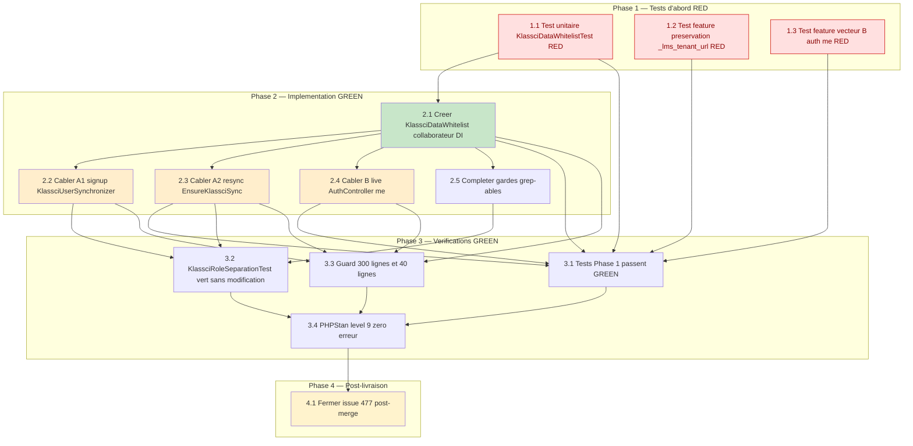

# Whitelist du blob `klassci_data` (cache display) — Plan d'implémentation

> Spec parent : [`requirements.md`](./requirements.md) (REQ-1 à REQ-10, tests T1–T7) + [`design.md`](./design.md).
> Issue : [#477](https://github.com/ouedraogoissouf2012/lms_backend/issues/477) · épique [#472](https://github.com/ouedraogoissouf2012/lms_backend/issues/472) · rattachée à [#470](https://github.com/ouedraogoissouf2012/lms_backend/issues/470). Branche de travail : `fix/477-whitelist-klassci-data` (depuis `lms` à jour).
>
> **Nature de ce document : plan d'implémentation PROSPECTIF (TDD).** Le code de whitelist **n'existe pas encore** : c'est un vrai développement à réaliser. Toutes les tâches sont donc **à faire `[ ]`**. Les `fichier:ligne` cités renvoient au **code existant** (audité par lecture le 2026-08-03) que la solution modifiera ou préservera.
>
> **Ordre TDD strict** : les tests d'abord (RED — ils échouent tant que `KlassciDataWhitelist` et son câblage n'existent pas), puis l'implémentation (GREEN), puis les vérifications transversales. Chaque tâche trace le(s) requirement(s) qu'elle satisfait.
>
> Suit le pattern **MANIFESTE_REFACTORING.md** : collaborateur DI unique à responsabilité unique, injecté aux 3 call-sites, aucune Facade en code métier — même nature que `SeanceCacheDataBuilder` (#474) et `KlassciEnseignantIdResolver` (#119). Décision d'architecture : option **B** (collaborateur DI), la seule couvrant les 3 vecteurs (design §6.1).

---

## Phase 1 — Tests d'abord (RED)

**Scope** : écrire les tests avant tout code de production. Le test unitaire (1.1) et les tests feature (1.2, 1.3) échouent tant que `KlassciDataWhitelist` n'existe pas et que les 3 call-sites ne sont pas câblés. `KlassciRoleSeparationTest` (existant, 4 tests) sert de harnais de non-régression (vérifié en Phase 3, T5) et **ne doit jamais être modifié**.

- [ ] 1.1 Écrire le test unitaire `tests/Feature/Services/Klassci/KlassciDataWhitelistTest.php` — classe pure, sans DB, échoue tant que `KlassciDataWhitelist` n'existe pas
  - Classe `final`, **sans** `RefreshDatabase` (fonction pure du couple `(payload, existing)`, testée en isolation, design §7.1) ; instancier `new KlassciDataWhitelist()` sans conteneur
  - `test_drops_non_whitelisted_keys` : `filter(['is_admin' => true, 'permissions' => [...], 'is_superuser' => true, 'scopes' => [...], 'foo' => 'bar', 'nom' => 'X', 'id' => 1])` → résultat **sans** `is_admin`/`permissions`/`is_superuser`/`scopes`/`foo` ; **avec** `nom`/`id` (liste blanche stricte, T1/REQ-1)
  - `test_keeps_display_keys` : `filter(['id' => 1, 'nom' => 'a', 'name' => 'b', 'prenom' => 'c', 'photo' => 'u', 'role' => 'prof', 'enseignant_id' => 42])` → les **7** clés conservées (T3/REQ-5)
  - `test_preserves_existing_lms_keys` : `filter(['nom' => 'X'], ['_lms_tenant_url' => 'https://x'])` → `_lms_tenant_url` **présent** avec sa valeur (T2/REQ-3, étape 3)
  - `test_rejects_lms_keys_from_payload` : `filter(['_lms_tenant_url' => 'https://evil'], ['_lms_tenant_url' => 'https://real'])` → valeur finale = **`https://real`** (le payload ne peut PAS écraser le namespace réservé — étapes 2 purge + 3 ré-application, T7/REQ-1)
  - `test_empty_and_malformed_payload` : `filter([])` → `[]` (ou `_lms_*` de `$existing`) ; `filter(['nom' => ['array', 'imbriqué']])` → `nom` conservé tel quel, **aucune exception** (la whitelist filtre les clés, pas les valeurs) ; `filter($p, [])` → comportement nominal (T6/REQ-9)
  - _Requirements: REQ-1, REQ-2, REQ-3, REQ-5, REQ-9_

- [ ] 1.2 Écrire le test feature de préservation `_lms_tenant_url` `tests/Feature/Security/KlassciDataResyncPreservesLmsKeysTest.php` — vecteur A₂, corrige le finding, échoue tant que le câblage 2.3 n'existe pas
  - Harnais calqué sur `KlassciRoleSeparationTest` (`:47-56, 125-160`) : `Mockery::mock(KlassciProxyService::class)`, `shouldReceive('requestWithUserToken')->with($token, 'auth/me', ...)` renvoyant un payload `data.user`, `$this->app->instance(KlassciProxyService::class, $proxy)`, `Sanctum::actingAs($user)`
  - Créer un user dont `klassci_data` contient `_lms_tenant_url` (posé au sign-up, comme `KlassciUserSynchronizer:178`), avec `last_klassci_sync` daté > 24h pour déclencher la re-sync passive
  - `test_resync_preserves_lms_tenant_url` : atteindre une route protégée par le middleware `klassci.sync` pour déclencher `EnsureKlassciSync::handle()`, le mock `auth/me` renvoyant un payload KLASSCI **sans** `_lms_tenant_url` (et avec des clés injectées `is_admin`) → après re-sync, `$user->fresh()->klassci_data['_lms_tenant_url']` **toujours présent** avec sa valeur d'origine, et `is_admin` **absent** (T2/REQ-3, REQ-1)
  - _Requirements: REQ-3, REQ-1_

- [ ] 1.3 Écrire le test feature du vecteur B `tests/Feature/Auth/AuthMeResponseWhitelistTest.php` — réponse `/auth/me` live, échoue tant que le câblage 2.4 n'existe pas
  - Mocker `KlassciProxyService::get('auth/me')` (le vecteur B utilise `get()`, `AuthController.php:108` — **≠** `requestWithUserToken` du middleware) pour renvoyer `data.user` contenant `is_admin => true`, `permissions => [...]`, plus des clés display (`nom`, `id`, `role`)
  - `Sanctum::actingAs($user)`, `GET /api/auth/me`
  - `test_auth_me_response_klassci_data_is_whitelisted` : la réponse JSON `data.klassci_data` **ne contient pas** `is_admin` ni `permissions`, **contient** les clés display whitelistées (T4/REQ-6, vecteur B)
  - _Requirements: REQ-6_

---

## Phase 2 — Implémentation (GREEN)

**Scope** : créer le collaborateur `KlassciDataWhitelist`, puis le câbler aux **trois** call-sites (A₁ login, A₂ re-sync, B live), en supprimant les `json_encode` manuels des deux sites de stockage (le cast `KlassciData` sérialise). Le cast `KlassciData` reste **inchangé** dans son comportement (design §6.1). Compléter enfin les gardes grep-ables (REQ-8).

- [ ] 2.1 Créer `app/Services/Klassci/Data/KlassciDataWhitelist.php` (collaborateur DI, classe pure, ~50 lignes, aucune Facade, aucune dépendance)
  - Classe `final`, **sans état**, **sans dépendance injectée** (fonction pure de `(payload, existing)`, donc **aucune Facade**, §1.6 D / REQ-10.3)
  - `public const ALLOWED_DISPLAY_KEYS = ['id', 'nom', 'name', 'prenom', 'photo', 'role', 'enseignant_id']` avec docblock « liste blanche stricte, NE JAMAIS ajouter une clé lue pour l'AUTORISATION » (design §3.1, §5.1)
  - `public const LMS_RESERVED_PREFIX = '_lms_'` — namespace réservé LMS
  - `public function filter(array $payload, array $existing = []): array` (≤ 15 lignes, §5), typée `array<string, mixed>` en entrée/sortie (PHPStan level 9), en **3 étapes ordonnées** (l'ordre garantit qu'un payload compromis ne peut pas écraser une `_lms_*` légitime, design §3.2) :
    - Étape 1 — projection d'affichage : `array_intersect_key($payload, array_flip(self::ALLOWED_DISPLAY_KEYS))` → drop de toute clé hors whitelist (REQ-1)
    - Étape 2 — purge défensive : retirer du résultat toute clé préfixée `LMS_RESERVED_PREFIX` venue du payload (garde explicite documentant l'invariant — un KLASSCI compromis ne peut jamais injecter un `_lms_*`, design §3.2 étape 2)
    - Étape 3 — ré-application : pour chaque clé de `$existing` préfixée `LMS_RESERVED_PREFIX`, la (re)poser dans le résultat → préserve `_lms_tenant_url` (REQ-3)
  - `filter()` ne lève **aucune** exception sur entrée dégradée (payload vide/partiel, valeur non-scalaire sous clé whitelistée, `existing` vide) — REQ-9
  - _Requirements: REQ-1, REQ-2, REQ-3, REQ-9, REQ-10_

- [ ] 2.2 Câbler A₁ — sign-up / login dans `app/Services/Klassci/Auth/KlassciUserSynchronizer.php`
  - Injecter `KlassciDataWhitelist` au constructeur (`:44-53`, 8ᵉ dépendance DI, 7→8, cohérent avec les 7 existantes) via `private readonly KlassciDataWhitelist $whitelist`
  - Dans `buildCommonData()` (`:169-182`), remplacer la ligne `:178` : `'klassci_data' => $this->whitelist->filter($klassciUser, ['_lms_tenant_url' => $tenantUrl])` — le `_lms_tenant_url` du login passé en `$existing` (étape 3 le pose), comportement métier identique à l'`array_merge` d'origine mais désormais **filtré**
  - Supprimer le `json_encode` manuel : l'affectation d'un `array` laisse le cast `KlassciData::set()` sérialiser (source unique de sérialisation, REQ-2 alinéa IF)
  - Ne toucher **aucun** autre champ de `buildCommonData()` — `role`/`email`/`klassci_role` restent gérés comme avant (REQ-7)
  - _Requirements: REQ-1, REQ-2, REQ-3, REQ-7_

- [ ] 2.3 Câbler A₂ — re-sync passive 24h dans `app/Http/Middleware/EnsureKlassciSync.php`
  - Injecter `KlassciDataWhitelist` au constructeur (`:43-45`, 2ᵉ dépendance DI) via `private readonly KlassciDataWhitelist $whitelist`
  - Dans `handle()` (`:102-107`), remplacer la ligne `:105` : `'klassci_data' => $this->whitelist->filter($klassciUser, $user->klassci_data)` — `$user->klassci_data` (accessor cast) renvoie le blob **courant** en `array` ; l'étape 3 y récupère `_lms_tenant_url` et le **préserve** (corrige le finding, REQ-3, T2)
  - Supprimer le `json_encode` manuel (le cast sérialise, REQ-2)
  - Ne modifier **aucun** invariant CRITICAL-05 (`:92-107`) : `role`/`email`/`klassci_enseignant_id` jamais re-syncés, `klassci_role` informatif, `name`/`last_klassci_sync` intacts (REQ-7)
  - Résilience : l'`update()` reste dans le `try/catch` `:70-118` (log + continue) ; `filter()` ne lève pas → pas d'interruption du flux (REQ-9)
  - _Requirements: REQ-1, REQ-2, REQ-3, REQ-7, REQ-9_

- [ ] 2.4 Câbler B — réponse `/auth/me` live dans `app/Http/Controllers/API/AuthController.php`
  - Injecter `KlassciDataWhitelist` au constructeur (`:39-48`, 9ᵉ dépendance DI, 8→9) via `private readonly KlassciDataWhitelist $whitelist`
  - Dans `me()` (`:107-114`), après la construction de `$userData` (payload live filtré/gardé), ajouter `$userData = $this->whitelist->filter($userData)` **avant** `return $this->presenter->profile($user, $userData)` — `$existing` **volontairement vide** (projection display pure, les `_lms_*` internes n'ont aucun sens client, design §4.3 / §6.2)
  - Ne **pas** modifier `AuthResponsePresenter::profile()` (`:155-167`) : il reçoit un `$klassciData` déjà filtré et reste un formateur pur (aucune logique de sécurité dans le presenter)
  - _Requirements: REQ-6_

- [ ] 2.5 Compléter les gardes grep-ables (documentation défensive, REQ-8)
  - `app/Casts/KlassciData.php:13-20` (docblock) : ajouter un renvoi vers `KlassciDataWhitelist` — « clés autorisées : voir `ALLOWED_DISPLAY_KEYS` ; namespace `_lms_*` préservé ; point d'application unique = `KlassciDataWhitelist::filter()` »
  - `app/Http/Middleware/EnsureKlassciSync.php:98-101` (commentaire de garde) : mentionner que `klassci_data` est désormais **filtré par whitelist** (`KlassciDataWhitelist`) avant écrasement
  - Laisser **inchangée** la garde `User.php:22-23` (« Ne JAMAIS lire `klassci_data['enseignant_id']` pour autoriser ») — elle reste valide
  - _Requirements: REQ-8_

---

## Phase 3 — Vérifications (les tests RED passent GREEN)

**Scope** : confirmer que les tests de la Phase 1 passent au vert, que la non-régression sécurité tient sans modifier le harnais existant, et que les invariants PRODUCTION_STANDARDS (REQ-10) sont satisfaits.

- [ ] 3.1 Confirmer que les tests de la Phase 1 passent GREEN
  - `KlassciDataWhitelistTest` (5 tests : drops non-whitelisted, keeps display keys, preserves `_lms_*`, rejects `_lms_*` from payload, empty/malformed) tous verts (T1/T3/T6/T7)
  - `KlassciDataResyncPreservesLmsKeysTest` vert : `_lms_tenant_url` préservé après re-sync, `is_admin` droppé (T2)
  - `AuthMeResponseWhitelistTest` vert : `data.klassci_data` sans `is_admin`/`permissions`, avec clés display (T4)
  - _Requirements: REQ-1, REQ-3, REQ-6, REQ-9_

- [ ] 3.2 Confirmer la non-régression CRITICAL-05 sans modifier le harnais
  - Exécuter `tests/Feature/Security/KlassciRoleSeparationTest.php` (4 tests : `test_initial_sync_initializes_both_roles`, `test_login_does_not_overwrite_role_when_user_exists`, `test_resync_route_does_not_grant_admin_to_etudiant_when_klassci_lies`, `test_multi_tenant_isolation_on_resync`) → **verts SANS aucune modification** du fichier (T5/REQ-7)
  - Confirmer que les consommateurs non-régressent : `KlassciConfigResolver` lit toujours `_lms_tenant_url` (REQ-4), `BackfillEnseignantIdCommand` lit toujours `enseignant_id` (REQ-5) — via les assertions des tests concernés
  - _Requirements: REQ-4, REQ-5, REQ-7_

- [ ] 3.3 Vérifier le guard « fichiers ≤ 300 lignes / méthodes ≤ 40 lignes » (§1.1 / §5)
  - `KlassciDataWhitelist.php` ~50 lignes ; `KlassciUserSynchronizer.php` 216→~218 ; `EnsureKlassciSync.php` 168→~170 ; `AuthController.php` 277→~280 ; `KlassciData.php` 71 **inchangé** ; `AuthResponsePresenter.php` 226 **inchangé** — tous < 300
  - `filter()` ~15 lignes ; les 3 câblages modifient une portion réduite de méthodes déjà conformes — toutes méthodes ≤ 40 lignes
  - _Requirements: REQ-10_

- [ ] 3.4 Vérifier PHPStan level 9 = 0 erreur, aucune entrée de baseline ajoutée
  - `KlassciDataWhitelist` typé strict `array<string, mixed>` en entrée/sortie ; aucune Facade en code métier du collaborateur (§1.6 D) ; `EnsureKlassciSync` conserve sa Facade `Log::` pré-existante (bordure middleware, hors scope) sans en ajouter
  - `php artisan test` = 100 % vert (REQ-10.5)
  - _Requirements: REQ-10_

---

## Phase 4 — Post-livraison

- [ ] 4.1 Post-merge : fermer l'issue #477 après merge de la PR
  - Cocher la checklist de l'issue, documenter dans la PR la divergence de portée traitée (Vecteur B — filtrage du live `/auth/me`, au-delà de la lettre de #477)
  - _Requirements: Critère d'acceptation global #11_

---

## Diagramme de dépendances des tâches

_Légende : rouge = test RED devant échouer avant l'implémentation, vert = nouveau collaborateur, orange = câblage des call-sites, jaune = action post-livraison._
