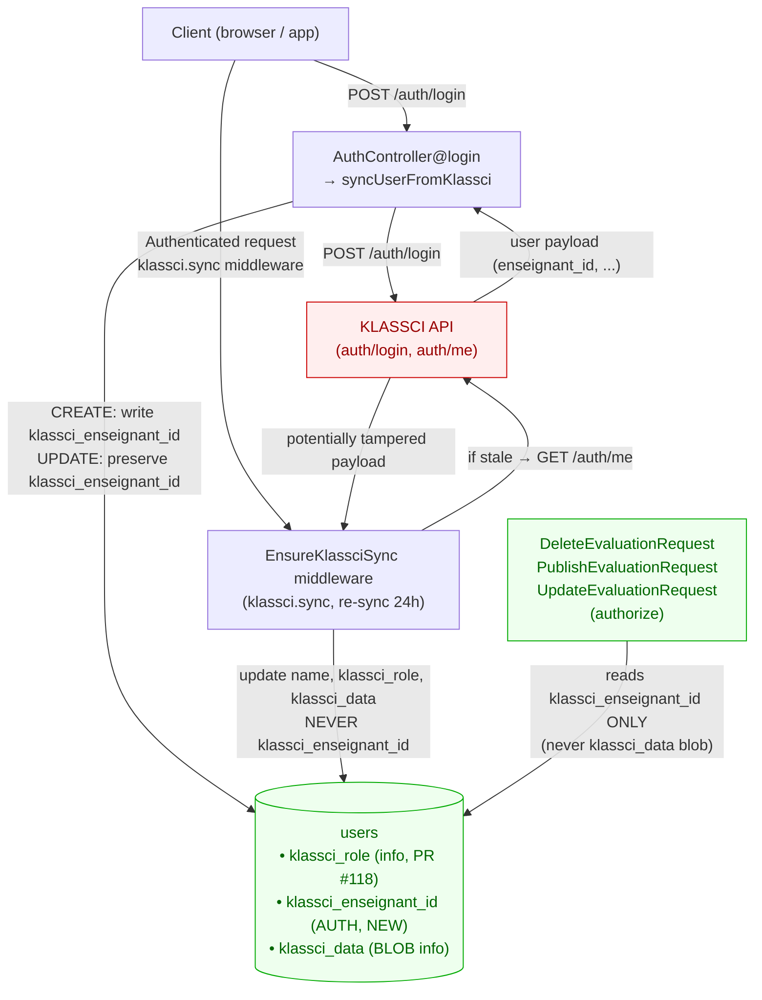
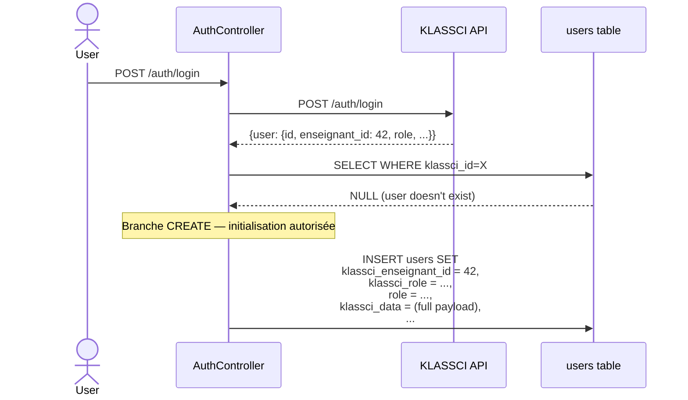
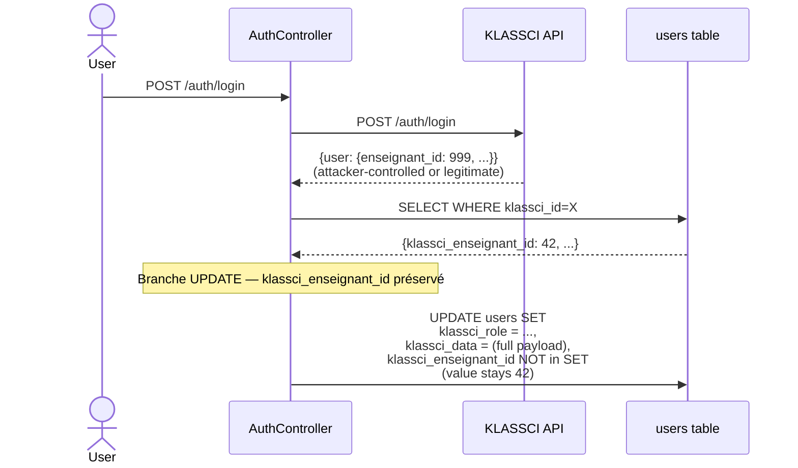
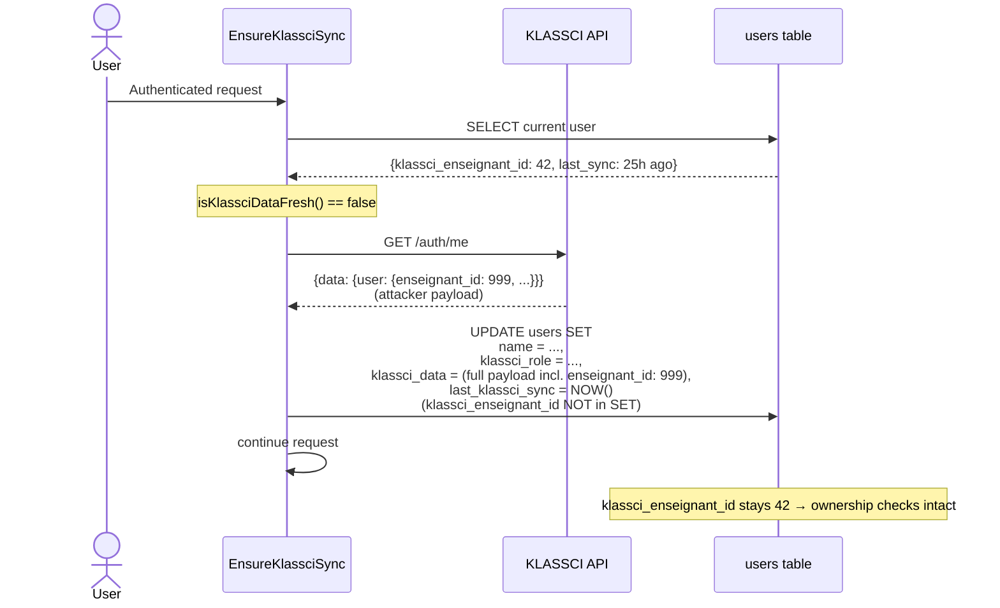
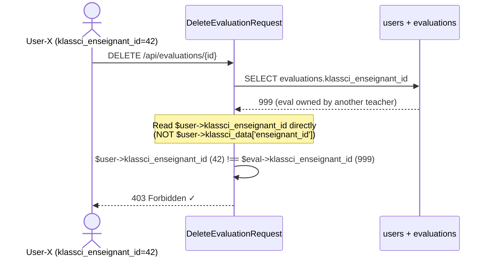

# klassci_enseignant_id separation — Design

> Spec parent : [`requirements.md`](./requirements.md). Issue : [#119](https://github.com/ouedraogoissouf2012/lms_backend/issues/119). Précédent : PR [#118](https://github.com/ouedraogoissouf2012/lms_backend/pull/118) (CRITICAL-05, pattern identique sur `role`).

## 1. Architecture cible



**Invariant central** : `users.klassci_enseignant_id` est écrit **une seule fois** (CREATE au sign-up KLASSCI initial). Tous les autres sites d'écriture sont audités :

| Site d'écriture | `klassci_enseignant_id` écrit ? | Justification |
|---|---|---|
| `AuthController::syncUserFromKlassci()` — branche CREATE | ✅ OUI (1ère fois uniquement) | Initialisation obligatoire ; user contrôle activement son compte KLASSCI à ce moment |
| `AuthController::syncUserFromKlassci()` — branche UPDATE | ❌ NON | User existant — l'identité enseignant est figée |
| `EnsureKlassciSync::handle()` re-sync 24h | ❌ NON | Re-sync passive, vecteur d'attaque silencieuse |
| Administration LMS (futur) | ⚠️ Cas exceptionnel manuel | Hors scope — viendra avec une UI admin auditée |

## 2. Data model

### 2.1 Migration

```php
// database/migrations/2026_05_18_000002_add_klassci_enseignant_id_to_users_table.php
public function up(): void
{
    // Idempotent guard.
    if (Schema::hasColumn('users', 'klassci_enseignant_id')) {
        return;
    }

    Schema::table('users', function (Blueprint $table) {
        $table->unsignedBigInteger('klassci_enseignant_id')->nullable()->after('klassci_role');
        $table->index('klassci_enseignant_id');
    });

    // Backfill from the existing `klassci_data['enseignant_id']` blob path.
    // Batched to keep the lock window short on the users table at 200k+ scale
    // (cf. PR #118 precedent, design.md §10).
    DB::table('users')
        ->whereNotNull('klassci_id')
        ->orderBy('id')
        ->chunkById(1000, function ($users) {
            foreach ($users as $u) {
                $blob = is_string($u->klassci_data) ? json_decode($u->klassci_data, true) : (array) $u->klassci_data;
                $enseignantId = data_get($blob, 'enseignant_id');
                if (is_numeric($enseignantId)) {
                    DB::table('users')->where('id', $u->id)->update([
                        'klassci_enseignant_id' => (int) $enseignantId,
                    ]);
                }
            }
        });
}

public function down(): void
{
    Schema::table('users', function (Blueprint $table) {
        $table->dropIndex(['klassci_enseignant_id']);
        $table->dropColumn('klassci_enseignant_id');
    });
}
```

**Pourquoi `unsignedBigInteger` ?** Cohérent avec les autres colonnes `klassci_enseignant_id` du schéma (`evaluations.klassci_enseignant_id`, `seances.klassci_enseignant_id`, vérifié grep) qui sont des `BIGINT`. L'identité KLASSCI est un `BIGINT` côté serveur amont.

**Pourquoi `nullable` ?** Pas tous les users ont un contexte enseignant : étudiants, comptes admin LMS locaux (sans `klassci_id`), comptes service. `NULL` signifie « pas d'identité enseignant connue » → check d'ownership échoue → 403 sécurisé.

**Pourquoi `indexée` ?** Permet des requêtes futures de réconciliation ops (`SELECT WHERE klassci_enseignant_id = ? AND institution_id = ?`). Coût stockage ~50 bytes × 200k users = 10 MB, négligeable.

**Pourquoi backfill par foreach explicite et pas `DB::raw('JSON_EXTRACT(...)')` ?** Compatibilité multi-DB (SQLite local, MySQL prod, PostgreSQL CI). Le JSON path syntax diffère entre dialectes ; un `foreach` PHP est portable et la performance est acceptable pour un one-shot backfill (à 200k users, ~20s en transaction, exécuté en fenêtre maintenance).

### 2.2 Model `User`

```php
/**
 * @property int|null $klassci_enseignant_id  ID enseignant dans KLASSCI.
 *                                            Initialisé au sign-up ; jamais réécrit par re-sync.
 *                                            Source d'autorité unique pour les checks
 *                                            d'ownership enseignant. Ne JAMAIS lire
 *                                            `klassci_data['enseignant_id']` pour l'autorisation.
 */
protected $fillable = [
    // ...existing...
    'klassci_role',
    'klassci_enseignant_id',   // ← juste après klassci_role
    // ...existing...
];
```

Aucun cast spécial. Aucune méthode `isOwnerOfEvaluation()` ajoutée (anti-tentation : ce check doit rester dans les FormRequests pour ne pas masquer le contrôle de sécurité dans le modèle).

## 3. Flux applicatifs détaillés

### 3.1 Sign-up initial (premier login)



### 3.2 Login d'un user existant (potentiel attacker scenario)



### 3.3 Re-sync passive 24h



### 3.4 FormRequest authorize (post-PR)



## 4. Périmètre du blob `klassci_data` — décision

`requirements.md` REQ-4 dit : « THE middleware SHALL continuer à écrire `klassci_data` (blob informationnel) comme aujourd'hui ».

**Décision retenue** : on garde le blob écrasable au re-sync **car** :
- Plusieurs champs informatifs légitimement variables s'y trouvent (`avatar`, `permissions`, `nom`, `prenom`, `admin_data`, `etudiant_data`, etc.) — ils doivent rester à jour pour l'affichage et les rapports
- Sortir l'unique champ d'autorité (`enseignant_id`) vers une colonne dédiée suffit à fermer le vecteur d'attaque sur les évaluations
- Une fois cette PR mergée, **plus aucun consommateur d'autorisation** ne lira le blob (vérifié par grep dans REQ-1)

**Risque résiduel** : si un futur PR ré-introduit `data_get($user->klassci_data, 'XXX_id')` pour un check d'autorisation, le pattern d'attaque revient. **Mitigation** : ajouter un commentaire de garde dans le PHPDoc de `User::$klassci_data` (cf. section 7).

## 5. Migration des 3 FormRequests

Patch unique appliqué à chacun des 3 fichiers :

```diff
 // Check ownership: only the assigned enseignant can modify
-$userKlassciEnseignantId = data_get($user->klassci_data, 'enseignant_id');
+$userKlassciEnseignantId = $user->klassci_enseignant_id;
 if (!$user->isAdmin() && $evaluation->klassci_enseignant_id !== $userKlassciEnseignantId) {
     return false;
 }
```

**Note de typage** : `$evaluation->klassci_enseignant_id` est `int|null` (BIGINT nullable) sur le model `Evaluation`. `$user->klassci_enseignant_id` post-PR est également `int|null` (BIGINT nullable). La comparaison `!==` strict reste correcte. Aucun cast supplémentaire nécessaire.

**Comportement avec `NULL` des deux côtés** : `null !== null` est `false`, donc le `if` ne déclenche pas le `return false` → autorize() pourrait passer. Mais ce cas est protégé en amont :
- `$evaluation->klassci_enseignant_id` est `NOT NULL` au CREATE (cf. `StoreEvaluationRequest::rules`)
- `$user->klassci_enseignant_id` peut être `NULL` (étudiant, admin LMS local) — auquel cas le user n'a pas à passer le check de toute façon, ET les coordinateurs et étudiants sont déjà bloqués par les early returns (`$user->role === 'coordinateur'` retourne `false` en amont)

Néanmoins, **par défense en profondeur**, on ajoutera un guard explicite :

```php
$userKlassciEnseignantId = $user->klassci_enseignant_id;
if (!$user->isAdmin()) {
    if ($userKlassciEnseignantId === null || $evaluation->klassci_enseignant_id !== $userKlassciEnseignantId) {
        return false;
    }
}
```

## 6. Testing strategy

### 6.1 Unit tests (Mockery)

`tests/Unit/Middleware/EnsureKlassciSyncTest.php` (existing, +1 test) :
- `test_resync_does_not_overwrite_klassci_enseignant_id` : ajoute la 10ᵉ assertion sur les tests existants

### 6.2 Feature tests (RefreshDatabase + Sanctum::actingAs)

`tests/Feature/Security/KlassciEnseignantIdSeparationTest.php` (NEW) :
- 9 tests couvrant REQ-7 #1, #2, #3, #4, #5, #6, #7, #9, #10

`tests/Feature/Security/KlassciEnseignantIdBackfillTest.php` (NEW, minimal) :
- 1 test pour REQ-7 #8 — backfill migration : créer user avec `klassci_data['enseignant_id']=42` et `klassci_enseignant_id NULL`, ré-exécuter la migration, asserter colonne populated

### 6.3 Coverage de régression

Re-run de `tests/Feature/Forum`, `tests/Feature/Quiz`, `tests/Feature/Notifications`, `tests/Feature/LMS` — aucun changement attendu. Les 3 FormRequests changent leur source de lecture mais conservent leur sémantique d'authorize pour les workflows légitimes.

## 7. Implementation outline

| Step | Fichier | Action | Lignes |
|---|---|---|---|
| 1 | `database/migrations/2026_05_18_000002_add_klassci_enseignant_id_to_users_table.php` | NEW migration + backfill chunked | ~55 |
| 2 | `app/Models/User.php` | Ajouter `klassci_enseignant_id` au `$fillable` + PHPDoc `@property` + **commentaire de garde** sur `klassci_data` PHPDoc | +6 |
| 3 | `app/Http/Controllers/API/AuthController.php` | Branche CREATE : ajouter `'klassci_enseignant_id' => $klassciUser['enseignant_id'] ?? null` ; branche UPDATE : ne PAS inclure | +3 |
| 4 | `app/Http/Middleware/EnsureKlassciSync.php` | **Aucun changement** — REQ-4 stipule de ne PAS toucher au champ, ce qui est déjà le cas par défaut (le `$user->update([...])` actuel ne le mentionne pas) | 0 |
| 5 | `app/Http/Requests/DeleteEvaluationRequest.php` | Remplacer ligne 45 + guard nullable | ~3 |
| 6 | `app/Http/Requests/PublishEvaluationRequest.php` | Idem | ~3 |
| 7 | `app/Http/Requests/UpdateEvaluationRequest.php` | Idem ligne 50 | ~3 |
| 8 | `tests/Unit/Middleware/EnsureKlassciSyncTest.php` | +1 test resync-no-overwrite-enseignant-id | +20 |
| 9 | `tests/Feature/Security/KlassciEnseignantIdSeparationTest.php` | NEW (9 tests) | ~350 |
| 10 | `tests/Feature/Security/KlassciEnseignantIdBackfillTest.php` | NEW (1 test) | ~50 |

Total estimé : ~490 lignes (dont ~420 tests). Code applicatif : ~70 lignes (très chirurgical).

## 8. PHPStan

Aucune nouvelle violation attendue :
- `@property int|null $klassci_enseignant_id` permet à PHPStan de typer correctement les accès
- Les 3 FormRequests passent de `data_get(mixed, string): mixed` (laxiste) à `$user->klassci_enseignant_id` (typé `int|null`) — PHPStan deviendra **plus précis** sur ces sites

Si baseline gonfle de manière inattendue, investiguer (pas régénérer aveuglément — §1.2 du manifeste).

## 9. Alternatives rejetées

### 9.1 Stocker `klassci_enseignant_id` dans `klassci_data` mais protéger le re-sync avec un diff sélectif

Option : le middleware EnsureKlassciSync décode `klassci_data` reçu, retire la clé `enseignant_id` de la version reçue, et écrit le blob purifié.

**Rejeté** parce que :
- Stocker une donnée d'autorité dans un blob JSON non-indexable empêche les audits SOC efficaces (impossible de répondre vite à « combien de users ont `klassci_enseignant_id = X` »)
- Le mécanisme « purge sélective » est fragile : un nouveau champ d'autorité ajouté à KLASSCI demandera une purge supplémentaire — pattern fragile, viole l'open/closed (§1.6 O)
- Précédent CRITICAL-05 a établi le pattern « colonne dédiée » avec succès → cohérence architecturale

### 9.2 Ajouter une signature cryptographique sur le payload `auth/me` côté KLASSCI

Option : KLASSCI signe le payload, LMS vérifie une signature avant d'écrire.

**Rejeté** parce que :
- Nécessite une modification côté KLASSCI hors périmètre LMS
- Bonne idée pour le futur (spec dédiée si on bouge le contrat KLASSCI), mais hors scope #119
- N'aurait toujours pas protégé contre un attaquant qui contrôle la clé privée KLASSCI

### 9.3 Étendre `klassci_role` (PR #118) pour englober tous les champs d'autorité

Option : créer une enum `KlassciAuthFields` qui liste les champs sortis du blob (role, enseignant_id, et futurs).

**Rejeté** parce que :
- YAGNI : on n'a aujourd'hui que 2 champs d'autorité (`role` migré PR #118, `enseignant_id` migré ici). Une enum pour 2 valeurs est over-engineering
- Si un 3ᵉ champ d'autorité émerge, la refactorisation vers une enum se fera à ce moment-là — pas avant

### 9.4 Refactor des 3 FormRequests vers un trait `ChecksEvaluationOwnership`

Option : extraire la logique d'authorize dupliquée 3× vers un trait commun.

**Rejeté pour cette PR** (pas définitivement) parce que :
- Mélange un fix sécurité avec un refactor DRY → diff plus difficile à auditer
- Le refactor mérite sa propre PR avec sa propre justification (cf. spec design.md §11 du manifeste : « périmètre chirurgical »)
- À ouvrir en issue refactor séparée post-merge

### 9.5 Bloquer entièrement le re-write de `klassci_data` au re-sync

Option : `EnsureKlassciSync` ne touche plus jamais à `klassci_data`.

**Rejeté** parce que :
- Casse l'UX : `klassci_data['avatar']`, `permissions`, `admin_data` doivent rester à jour
- Le blob redevient un cache display ; aucun risque d'autorisation post-PR (vérifié par grep dans REQ-1)
- Bloquer entièrement est plus conservateur, mais inutilement restrictif

## 10. Projection volume 10×

| Métrique | Aujourd'hui (20k users) | 10× (200k users, 100 tenants) | Tient ? |
|---|---|---|---|
| `ALTER TABLE users ADD COLUMN` | ~1s | ~10s (offline) | ✅ fenêtre maintenance |
| Backfill `foreach chunkById(1000)` | ~2s | ~20-30s | ✅ acceptable en maintenance |
| Index `klassci_enseignant_id` storage | ~1 MB | ~10 MB | ✅ négligeable |
| Index lookup pour ownership check | <1ms à 20k | <2ms à 200k (BTREE log scan) | ✅ |
| Volume d'écritures sur la colonne | 1 par sign-up KLASSCI (très rare) | 1 par sign-up | ✅ trivial |
| Pression sur `klassci_data` blob | Inchangée | Inchangée | ✅ |

**Goulet d'étranglement potentiel** : le backfill nécessite de décoder le JSON `klassci_data` en PHP pour chaque user. À 200k users × ~5kB par blob = 1 GB de I/O. Acceptable si exécuté en fenêtre maintenance avec un job dédié plutôt qu'inline dans la migration. **Mitigation** : à très grande échelle (>500k users), splitter le backfill en command artisan séparée (`php artisan klassci:backfill-enseignant-id --chunk=1000`). Pas un risque court terme.

## 11. Critère d'invalidation (Q15 — manifest)

Cette solution est **à invalider et reconcevoir** SI l'une des hypothèses suivantes tombe :

1. **`klassci_data['enseignant_id']` devient légitimement variable** côté KLASSCI (refactor backend où l'enseignant_id peut changer après mariage / changement matricule). Dans ce cas, le write-once devient inadapté ; il faut un mécanisme de re-binding manuel via UI admin LMS (audit trail), pas un re-write automatique au re-sync.
2. **Le payload KLASSCI commence à inclure plusieurs `enseignant_id`** (user enseignant dans plusieurs établissements partagés). Le mapping `BIGINT` simple devient inadapté ; nécessite une table `user_klassci_enseignant_roles` avec institution_id.
3. **Un audit RGPD ou métier impose la cohérence stricte `klassci_data['enseignant_id']` = `users.klassci_enseignant_id`**. Auquel cas la précédence et un job de réconciliation doivent être documentés.
4. **Découverte d'un 3ᵉ ou 4ᵉ champ d'autorité dans `klassci_data`** (`klassci_data['admin_data']['institution_id']` par exemple) → réviser globalement l'architecture pour extraire systématiquement les champs sensibles vers leurs colonnes dédiées (potentiellement via une enum `KlassciAuthFields`).

Aucun de ces 4 cas n'est connu aujourd'hui. La solution tient.
