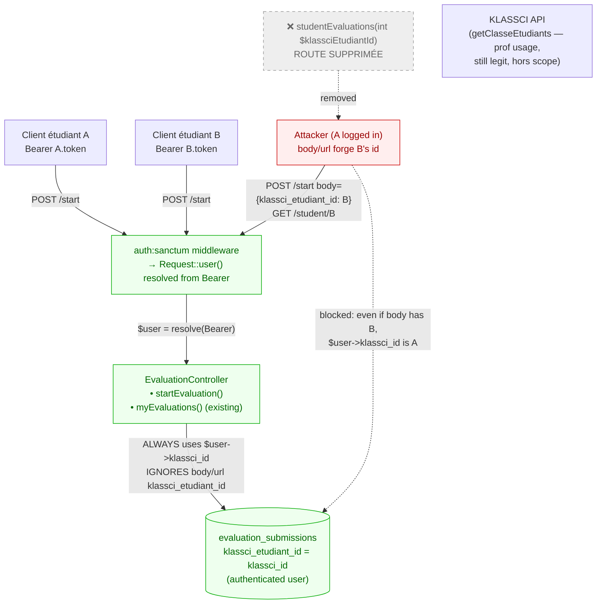
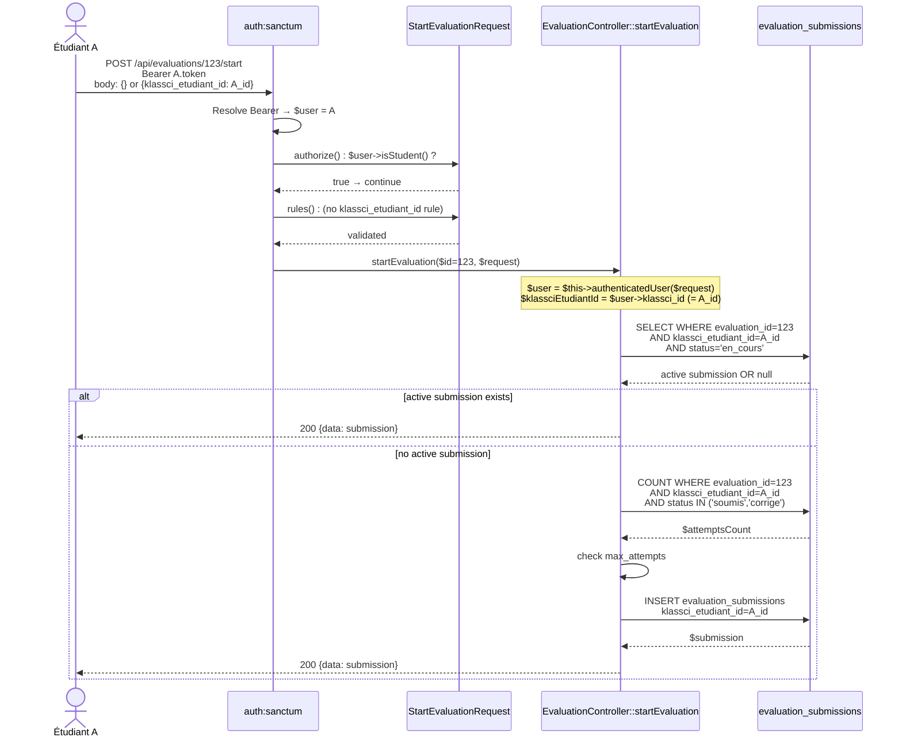
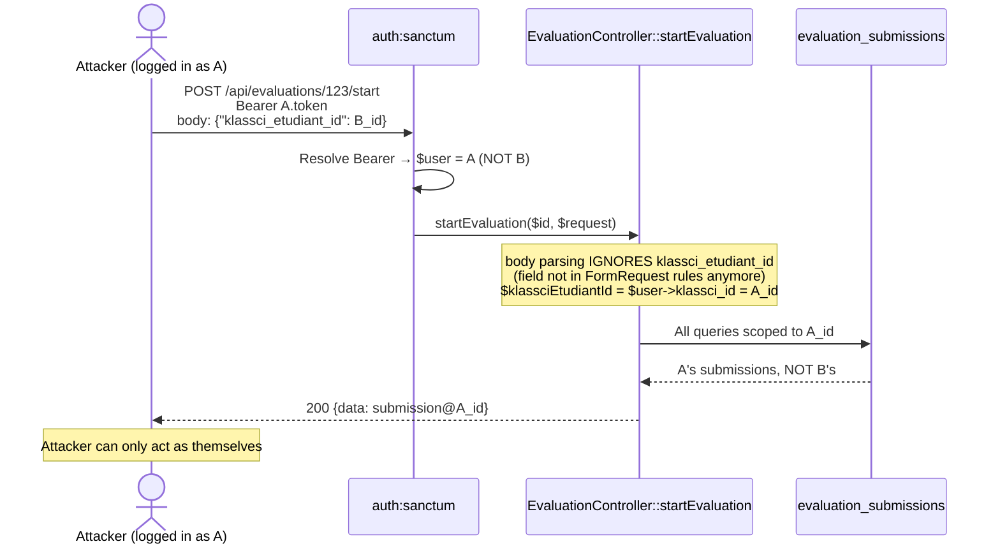
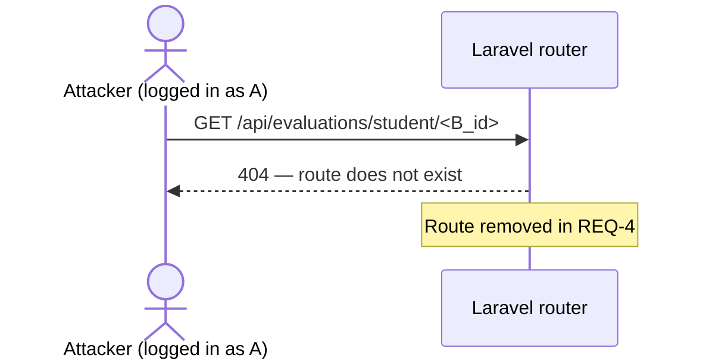

# klassci_etudiant_id from token — Design

> Spec parent : [`requirements.md`](./requirements.md). Issue : [#123](https://github.com/ouedraogoissouf2012/lms_backend/issues/123). Précédents : #34 (PR #118 — `klassci_role`), #119 (PR #122 — `klassci_enseignant_id`).

## 1. Architecture cible



**Invariant central** : la valeur de `klassci_etudiant_id` utilisée dans `evaluation_submissions` est **toujours** dérivée de `$user->klassci_id` (où `$user` vient du token Sanctum), **jamais** du body ou de l'URL. Tous les sites d'écriture et de lecture-par-identité sont audités :

| Site | Source de `klassci_etudiant_id` | Statut post-PR |
|---|---|---|
| `startEvaluation` ligne 715 (lookup active submission) | `$user->klassci_id` | ✅ migré |
| `startEvaluation` ligne 731 (count attempts) | `$user->klassci_id` | ✅ migré |
| `startEvaluation` ligne 746 (create submission) | `$user->klassci_id` | ✅ migré |
| `studentEvaluations` ligne 415-595 | (méthode supprimée) | ✅ supprimée |
| Route `/api/evaluations/student/{klassciEtudiantId}` | (route supprimée) | ✅ supprimée |
| `myEvaluations` (existant, hors scope) | `$user->klassci_id` | ✅ déjà sûr |
| Lignes 68, 849, 1542, LMSMatieres, LMSVisio | `$user->klassci_id` | ✅ déjà sûr |
| Lignes 1228, 1240 (vue prof par classe) | `$userLocal->klassci_id` + `KlassciProxyService::getClasseEtudiants` (token prof) | ✅ déjà sûr (legit) |

## 2. Flux applicatifs détaillés

### 2.1 `POST /api/evaluations/{id}/start` — flux étudiant légitime



### 2.2 Tentative d'attaque — body forge



### 2.3 Tentative d'attaque — URL `/student/{klassciEtudiantId}`



## 3. Implementation outline

| Step | Fichier | Action | Lignes net |
|---|---|---|---|
| 1 | `app/Http/Requests/StartEvaluationRequest.php` | • Retirer la règle `klassci_etudiant_id` + 3 messages associés<br>• Modifier `authorize()` pour exiger `auth()->user()?->isStudent() === true` (au lieu de `auth()->check()`) | ~−10 |
| 2 | `app/Http/Controllers/API/EvaluationController.php::startEvaluation` | • Signature : `Request` → `StartEvaluationRequest`<br>• Supprimer le `Validator::make` inline (lignes 624-633)<br>• Remplacer `$klassciEtudiantId = $request->klassci_etudiant_id` par `$klassciEtudiantId = $user->klassci_id` (déplacer la résolution `$user` AVANT son utilisation) | ~−10 net |
| 3 | `app/Http/Controllers/API/EvaluationController.php::studentEvaluations` | • **Supprimer entièrement** la méthode (~180 lignes, 415-595) | −180 |
| 4 | `routes/api.php:641` | • **Supprimer** la route `Route::get('evaluations/student/{klassciEtudiantId}', ...)` | −2 |
| 5 | `tests/Feature/Security/KlassciEtudiantIdFromTokenTest.php` | NEW — 6 tests REQ-6 | +220 |

**Bilan code applicatif** : net −200 lignes (suppression dead code + simplification). Tests : +220 lignes. Net global : ~+20 lignes pour fix sécurité **HIGH**.

## 4. Détails de migration

### 4.1 Connexion `StartEvaluationRequest` à la route

Avant (route déclare `Request`, FormRequest existe mais n'est jamais invoqué) :

```php
// routes/api.php:647 (unchanged)
Route::post('evaluations/{id}/start', [EvaluationController::class, 'startEvaluation'])
    ->middleware('throttle:60,1');
```

```php
// EvaluationController.php:601
public function startEvaluation(int $id, Request $request): JsonResponse
```

Après :

```php
// EvaluationController.php
public function startEvaluation(int $id, StartEvaluationRequest $request): JsonResponse
```

Laravel résout le type-hint automatiquement — pas besoin de modifier la route. Le `authorize()` du FormRequest s'exécute avant la méthode du controller. Si l'utilisateur n'est pas étudiant, Laravel retourne `403` automatiquement avant que `startEvaluation` soit appelé.

### 4.2 Ordre de résolution `$user` dans `startEvaluation`

Aujourd'hui, `$user = $this->authenticatedUser($request)` est appelé **dans le bloc try** ligne 639, après le `Validator::make` (lignes 624-633) qui lit `$request->klassci_etudiant_id`. Post-PR, il faut déplacer la résolution `$user` AU DÉBUT de la méthode :

```php
public function startEvaluation(int $id, StartEvaluationRequest $request): JsonResponse
{
    $user = $this->authenticatedUser($request);
    $klassciEtudiantId = $user->klassci_id;

    $evaluation = Evaluation::find($id);
    if (!$evaluation || !$evaluation->is_published) { ... }

    $isPracticeMode = $evaluation->isTerminee();
    // ... (reste inchangé sauf les 3 occurrences de $klassciEtudiantId qui pointent désormais sur $user->klassci_id)
}
```

### 4.3 Suppression `studentEvaluations`

La méthode `studentEvaluations` (lignes 415-595, ~180 lignes) fait essentiellement le même travail que `myEvaluations` (ligne 638 routes — qui n'a pas été inspectée mais l'analyse du nom + grep suggère le même comportement). **Étape de vérification dans tasks** : avant de supprimer, lire `myEvaluations` pour confirmer qu'il couvre tous les besoins legit.

Si `myEvaluations` couvre tout → suppression directe.
Si `myEvaluations` manque quelque chose → renommer `studentEvaluations` en `myEvaluations` et retirer le param URL.

**Décision** : on **vérifie** d'abord (étape 6.1 tasks), puis on **supprime** seulement si confirmé que `myEvaluations` couvre tout.

## 5. Périmètre des sites legit (audit confirmation)

`requirements.md` REQ-5 liste les sites où `klassci_etudiant_id` reste utilisé légitimement. Vérifications source :

| Ligne | Code | Source de l'ID | Status |
|---|---|---|---|
| 68 | `where('klassci_etudiant_id', $user->klassci_id)` | token | ✅ déjà safe |
| 437 | `'klassci_etudiant_id' => $klassciEtudiantId` (log seulement) | variable post-fix = `$user->klassci_id` | ✅ post-fix safe |
| 560 | `where('klassci_etudiant_id', $klassciEtudiantId)` | dans `studentEvaluations` (à supprimer) | N/A — méthode supprimée |
| 715, 731, 746 | `where/where/'klassci_etudiant_id' =>` | dans `startEvaluation` post-fix = `$user->klassci_id` | ✅ post-fix safe |
| 790 | `'klassci_etudiant_id' => $user->klassci_id` | token (déjà safe) | ✅ déjà safe |
| 849 | `where('klassci_etudiant_id', $user->klassci_id)` | token | ✅ déjà safe |
| 1000 | `'etudiant_id' => $submission->klassci_etudiant_id` | model déjà chargé | ✅ legit (display) |
| 1228 | `where('klassci_etudiant_id', $userLocal->klassci_id)` | view prof par classe — `$userLocal` vient de `User::where('email', ...)->first()` après lookup KLASSCI | ✅ legit (prof aggregation) |
| 1240 | `where('klassci_etudiant_id', $etudiant['id'])` | view prof — `$etudiant` vient de `KlassciProxyService::getClasseEtudiants` (token PROF) | ✅ legit (prof aggregation) |
| 1329, 1340-41 | `$submission->klassci_etudiant_id` (display) | model déjà chargé | ✅ legit (display) |
| 1409 | `$submission->klassci_etudiant_id` (display) | model déjà chargé | ✅ legit (display) |
| 1542 | `where('klassci_etudiant_id', $user->klassci_id)` | token | ✅ déjà safe |

**LMSMatieresController.php:298, 321** : `where('klassci_etudiant_id', $user->klassci_id)` ✅ safe.
**LMSVisioController.php:505** : `'klassci_etudiant_id' => $user->klassci_id` ✅ safe.

Conclusion : aucun autre site ne nécessite de modification. La surface du fix est strictement bornée aux 4 changements ci-dessus.

## 6. Tests strategy

Tous les tests sont des **Feature tests** Sanctum (RefreshDatabase) — le scénario d'attaque demande un flux HTTP complet avec auth. Pas d'unit tests nécessaires (la logique métier est triviale : remplacement de source). Les tests bouclent sur :

1. **Body ignoré** : authentifié A, body forge B → submission créée avec klassci_etudiant_id=A
2. **Active submission scoping** : A a en_cours, body forge B → reprise de la submission de A
3. **Role guard** : enseignant POST → 403 avant même d'atteindre le controller
4. **Max attempts scoping** : A a 3 soumissions, body forge B (qui a 0) → 403 (compte de A utilisé)
5. **Route 404** : GET `/api/evaluations/student/<X>` → 404 (route supprimée)
6. **myEvaluations OK** : GET `/api/evaluations/student` → 200 + body concerne A

Fichier unique : `tests/Feature/Security/KlassciEtudiantIdFromTokenTest.php`.

## 7. PHPStan

Aucune nouvelle violation attendue :
- `StartEvaluationRequest` type-hint dans la signature : Laravel résout le FormRequest, PHPStan le sait
- Suppression de `studentEvaluations` : retire 180 lignes, potentielle baisse baseline (à observer)
- `$user->klassci_id` est `int|null` (déjà typé via PHPDoc User) → aucun mismatch

## 8. Breaking changes côté client

| Endpoint | Avant | Après | Breaking ? |
|---|---|---|---|
| `POST /api/evaluations/{id}/start` body | `{ "klassci_etudiant_id": <required> }` | (champ ignoré) | **Non breaking** — anciens clients qui envoient le champ continuent à fonctionner, leur valeur n'a juste plus d'effet. Réponse identique en surface. |
| `POST /api/evaluations/{id}/start` rôle | tout authentifié | étudiant uniquement (REQ-3 `authorize` strict) | **Potentiellement breaking** si un admin/coordinateur tentait de démarrer une éval pour debug. Aucun cas connu — à signaler en PR body. |
| `GET /api/evaluations/student/{klassciEtudiantId}` | 200 with submissions | 404 (route supprimée) | **Breaking** — mais Q15 documente que la route était inutile (`myEvaluations` couvre tout). |

À documenter dans le PR body (section "Breaking changes").

## 9. Alternatives rejetées

### 9.1 Garder `klassci_etudiant_id` dans le body mais valider `=== $user->klassci_id`

Option : ajouter une règle de validation `'klassci_etudiant_id' => 'required|integer|in:' . auth()->user()->klassci_id`.

**Rejeté** parce que :
- Sécurité par redondance plutôt que par conception — fragile si la règle est oubliée dans un futur endpoint
- Augmente la surface d'attaque : un client malveillant pourrait deviner le `klassci_id` correct dans 99% des cas (ils sont numériques séquentiels)
- N'élimine pas le besoin pour le client d'envoyer une info qu'il n'a pas à envoyer
- Le pattern « source unique du token » est universellement plus sûr (cf. OWASP Cheat Sheet — Authorization)

### 9.2 Garder la route `/student/{klassciEtudiantId}` mais ajouter une autorisation `$user->isAdmin() || $klassciEtudiantId === $user->klassci_id`

Option : conserver la route avec une vérif explicite.

**Rejeté** parce que :
- `myEvaluations` (sans param) existe déjà et est la source canonique pour qu'un étudiant lise ses propres évals
- Aucun frontend documenté ne consomme la route avec param
- Préserver la route ajoute du code mort sécurisé après audit — pollution
- Supprimer purement et simplement est plus sûr (« what's not there can't be exploited »)

### 9.3 Renommer le route `/student/{klassciEtudiantId}` en `/admin/student/{klassciEtudiantId}` avec `EnsureRole` admin

Option : conserver l'endpoint pour les admins légitimes.

**Rejeté** parce que :
- Aucun besoin métier admin documenté de récupérer les évals d'un étudiant *via cet endpoint* (les admins ont déjà la liste des évals + la liste des étudiants)
- YAGNI : pas de demande explicite, pas de cas d'usage clair
- Si le besoin émerge, ajouter une nouvelle route admin propre sera trivial (REQ-1 critère d'invalidation point 2 prévoit ce cas)

### 9.4 Bloquer le body `klassci_etudiant_id` côté FormRequest avec une règle `'klassci_etudiant_id' => 'prohibited'`

Option : refuser explicitement le champ (`422` si présent).

**Rejeté** parce que :
- Anciens clients qui envoient le champ par habitude recevront un `422`, casser leur UX inutilement
- Le comportement « champ ignoré silencieusement » est plus tolérant et n'augmente pas le risque (le champ n'a plus aucun effet)
- Si on souhaite l'interdire strictement plus tard, c'est trivial (1 ligne dans rules)

### 9.5 Migrer `klassci_etudiant_id` colonne en `klassci_user_id` (cohérence terminologique)

Option : renommer la colonne pour clarifier la sémantique.

**Rejeté** parce que :
- Hors scope sécurité — refactor de nommage massif (rename column users + evaluations + esbtp_attendance + 10+ controllers)
- Le code post-PR sera sémantiquement clair via `$user->klassci_id` comme source unique
- Le risque de PR ingérable est élevé (>30 fichiers touchés)
- À traiter dans une issue refactor terminologique séparée si réel besoin

## 10. Projection volume 10×

| Métrique | Aujourd'hui | 10× (200k users, 100 tenants) | Tient ? |
|---|---|---|---|
| `POST /start` throughput | ~10/min/tenant | ~1k/min/tenant (rate-limit `throttle:60,1` côté Sanctum) | ✅ rate-limiter préserve |
| Lecture `$user->klassci_id` (1ère fois) | trivial — déjà chargé via Sanctum | trivial | ✅ |
| Query `where klassci_etudiant_id` | index présent (vérifié migration originale `evaluation_submissions`) | index présent | ✅ |
| Suppression `studentEvaluations` impact | −180 lignes, 0 consommateur après audit | idem | ✅ pas d'impact perf |
| FormRequest validation | trivial | trivial | ✅ |

**Aucun goulet d'étranglement** introduit. La solution est plus *légère* qu'avant (moins de validation, moins de code dans le controller).

## 11. Critère d'invalidation (Q15 — manifest)

Cette solution est **à invalider et reconcevoir** SI l'une des hypothèses suivantes tombe :

1. **Cas légitime : prof/coordinateur démarre une éval au nom d'un étudiant** (saisie manuelle salle d'examen, admin pour étudiant en difficulté technique). Dans ce cas, REQ-2 doit être révisée : autoriser `klassci_etudiant_id` dans le body **uniquement si** `$user->isAdmin() || $user->isCoordinator()`, avec audit log structuré `Log::warning('evaluation_started_for_other_user', [...])` pour traçabilité.
2. **Un frontend mobile/legacy/intégration externe consomme `/api/evaluations/student/{klassciEtudiantId}`** pour un usage admin. Détectable post-merge via logs 404. Si oui : créer une route admin propre `/admin/evaluations/student/{klassciEtudiantId}` avec `EnsureRole` admin, plutôt que de restaurer l'ancienne route.
3. **L'identité Sanctum n'est plus considérée fiable** (tokens partagés, session impersonation autorisée par décision business). Dans ce cas, toute la stratégie « token = source unique d'identité » s'effondre, bien au-delà de #123.
4. **Le `klassci_id` user-side devient non-unique** (un user authentifié peut être plusieurs étudiants KLASSCI — improbable mais possible si KLASSCI multi-school). Dans ce cas, il faut une logique de sélection explicite côté client + une table `user_klassci_etudiant_links`.

Aucun de ces 4 cas n'est connu aujourd'hui. La solution tient.
