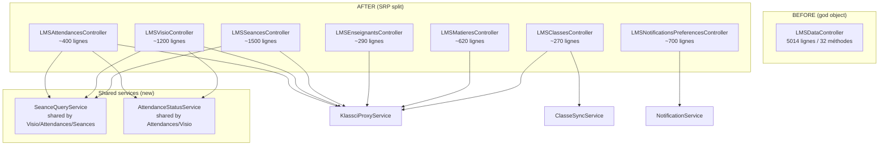

# Design — LMSDataController split (god object refactor)

**Spec phase** : 2/3 (design)
**Date** : 2026-05-17

---

## 1. Investigation pré-design : couplage interne

### 1.1 Méthodes privées utilisées

| Helper privé | Ligne | Caller(s) | Domaine concerné |
|---|---|---|---|
| `determineAttendanceStatus()` | L3355 | L3213 (dans `getVisioParticipants`) | Attendances / Visio |
| `getMatieresEnrichiesForEnseignant()` | L4172 | L4050 (dans `getEnseignantsFromKlassci`) | Matieres / Enseignants |
| `getSeanceDataFromKlassci()` | L4494 | L2061 (dans `toggleVisioSeance`) | Séances |

### 1.2 Couplage cross-domaine via méthode publique

**`seanceDetails()` (L1505, public) est appelée 3× comme helper interne** (anti-pattern JSON encode/decode) :

| Caller | Ligne | Domaine appelant | Domaine appelé |
|---|---|---|---|
| `getVisioParticipants` | L3099 | Visio | Séances |
| `getVisioParticipants` | L3124 | Visio | Séances |
| `getAttendanceHistory` | L4623 | Attendances | Séances |

**Pattern actuel** :
```php
$response = $this->seanceDetails($id, $request); // returns JsonResponse
$data = json_decode($response->getContent(), true); // anti-pattern
if ($data['success']) { ... }
```

C'est un **anti-pattern double** :
- DRY violé (logique métier dispersée)
- Performance gaspillée (encode JSON puis decode inutile)
- Couplage anti-architectural (Controller appelle Controller)

### 1.3 Services injectés au constructeur

```php
public function __construct(
    private KlassciProxyService $klassciService,
    private NotificationService $notificationService,
    private ClasseSyncService $classeSyncService,
) {}
```

Chaque controller extrait devra injecter ses propres dépendances (sub-set).

---

## 2. Solution architecturale (best, pas fastest)

### 2.1 Diagramme — Architecture cible



### 2.2 Nouveau service : `SeanceQueryService`

**Pourquoi** : éliminer le couplage `seanceDetails()` appelé cross-controller.

**Fichier** : `app/Services/SeanceQueryService.php`

**Responsabilité** : encapsuler la logique métier de récupération des détails d'une séance (incluant participants), en retournant un **Array typé** (pas de JsonResponse).

```php
namespace App\Services;

class SeanceQueryService
{
    public function __construct(
        private KlassciProxyService $klassciService,
    ) {}

    /**
     * Returns: ['seance' => [...], 'participants' => ['students' => [...]], ...]
     * Throws on resolution errors (caller handles).
     */
    public function getSeanceDetailsArray(int $seanceId, User $user): array { /* ... */ }

    /**
     * Returns programmation array or null if unavailable.
     */
    public function getProgrammation(int $seanceId, User $user): ?array { /* ... */ }
}
```

**Refactor du controller `LMSSeancesController::seanceDetails`** :
```php
public function seanceDetails(int $seanceId, Request $request): JsonResponse
{
    $user = $this->authenticatedUser($request);
    try {
        $data = $this->seanceQuery->getSeanceDetailsArray($seanceId, $user);
        return response()->json(['success' => true, 'data' => $data]);
    } catch (\Throwable $e) {
        return response()->json(['success' => false, 'message' => '...'], 500);
    }
}
```

**Usage par les autres controllers** :
```php
// LMSVisioController::getVisioParticipants
$prog = $this->seanceQuery->getProgrammation($seanceId, $user);
// no more json_encode/decode round-trip
```

### 2.3 Nouveau service : `AttendanceStatusService`

**Pourquoi** : `determineAttendanceStatus()` est appelée par Attendances ET Visio. Doit être partagée.

**Fichier** : `app/Services/AttendanceStatusService.php`

**Responsabilité** : calculer le statut de présence (present/late/absent/excused) basé sur des paramètres temporels.

```php
namespace App\Services;

class AttendanceStatusService
{
    /**
     * @return array{status: string, percentage: float, ...}
     */
    public function determine(
        ?float $percentage,
        ?\DateTimeInterface $joinedAt,
        ?\DateTimeInterface $leftAt,
        ?string $heureDebut,
        ?string $heureFin,
        ?string $visioStatus = null,
    ): array { /* ... */ }
}
```

### 2.4 Mapping final méthodes → controllers + services

| Controller | Méthodes | Services injectés |
|---|---|---|
| **LMSClassesController** | classeDetails, classeEtudiants | `KlassciProxyService`, `ClasseSyncService` |
| **LMSMatieresController** | matiereDetails, adminMatieresList, myMatieres | `KlassciProxyService` + helper privé `getMatieresEnrichiesForEnseignant` (interne) |
| **LMSEnseignantsController** | getEnseignantsFromKlassci, (getEnseignants si pas dead) | `KlassciProxyService` + `getMatieresEnrichiesForEnseignant` (à voir) |
| **LMSSeancesController** | upcomingSeances, seanceDetails, seanceParticipants, validateParticipant, toggleVisioSeance, myTeachingSeances, myClassesSeances, hideSeance, unhideSeance, getSeancesHistory, deleteSeance | `KlassciProxyService`, `SeanceQueryService`, helper privé `getSeanceDataFromKlassci` |
| **LMSVisioController** | activateVisio, deactivateVisio, startVisio, endVisio, joinVisio, getVisioParticipants, leaveVisio, heartbeatVisio | `KlassciProxyService`, `SeanceQueryService`, `AttendanceStatusService` |
| **LMSAttendancesController** | syncAttendancesFromVideoSession, getAttendanceHistory, getSeanceAttendances | `KlassciProxyService`, `SeanceQueryService`, `AttendanceStatusService` |
| **LMSNotificationsPreferencesController** | getNotificationPreferences, sendSessionReminder | `NotificationService`, `KlassciProxyService` |

### 2.5 Namespace et structure

```
app/Http/Controllers/API/
├── LMS/
│   ├── LMSClassesController.php
│   ├── LMSMatieresController.php
│   ├── LMSEnseignantsController.php
│   ├── LMSSeancesController.php
│   ├── LMSVisioController.php
│   ├── LMSAttendancesController.php
│   └── LMSNotificationsPreferencesController.php
└── LMSDataController.php  ← supprimé en Phase C
```

Namespace : `App\Http\Controllers\API\LMS\LMSClassesController` etc.

### 2.6 Résolution REQ-4 (route conflict `/seances/{seanceId}/participants`)

**Analyse** :
- `seanceParticipants` (LMSDataController L965) : retourne les **participants autorisés** d'une séance (étudiants inscrits à la classe).
- `getVisioParticipants` (L3058) : retourne les **participants visio actuellement connectés**.

Sémantique différente, même URL → bug. **Décision design** :
- `seanceParticipants` reste sur `GET /lms/seances/{seanceId}/participants` (sémantique "participants autorisés")
- `getVisioParticipants` migre vers `GET /lms/seances/{seanceId}/visio-participants` (nouvelle URL distincte)

**Impact frontend** : `lms-frontend` doit être mis à jour pour utiliser la nouvelle URL `visio-participants`. Coordination avec frontend nécessaire.

**Validation** : avant la PR G (Visio), confirmer avec l'utilisateur si :
- A) Frontend appelle bien l'une ou l'autre URL (à vérifier via grep dans le frontend)
- B) Si une seule URL est appelée, l'autre méthode est dead code → supprimer

### 2.7 Décision REQ-5 (dead code `getEnseignants`)

**Analyse** :
- `getEnseignants` (L3854) : pas de route, pas d'appelant interne.
- `getEnseignantsFromKlassci` (L4106) : routée + utilise probablement le helper `getMatieresEnrichiesForEnseignant`.

**Décision design** : **supprimer `getEnseignants` en PR B**. Si plus tard un besoin émerge, on le rajoutera proprement.

---

## 3. Ordre des PRs (Phase B)

Critères de tri :
- **Indépendance** : controllers sans dépendance cross sont prioritaires
- **Taille** : plus petit d'abord (pour roder le pattern)
- **Risque** : Visio en dernier (route conflict + couplage SeanceQueryService)

| # | PR | Méthodes | Effort | Bloque-t-il les autres ? |
|---|---|---|---|---|
| **A** | LMSClassesController | 2 | ~3h | Non, indépendant |
| **B** | LMSEnseignantsController (+ delete getEnseignants) | 1-2 | ~2h | Partage `getMatieresEnrichiesForEnseignant` avec C — voir |
| **C** | LMSMatieresController (+ helper `getMatieresEnrichiesForEnseignant`) | 3 | ~3h | Doit être avant B si helper partagé |
| **C'** | (alt) Faire C avant B, B utilise le helper de C via import | | | |
| **D** | LMSNotificationsPreferencesController | 2 | ~3h | Indépendant |
| **E** | Création `SeanceQueryService` + tests | 0 (service only) | ~3h | Bloque F, G, H |
| **F** | LMSSeancesController | 11 | ~6h | Dépend de E |
| **G** | Création `AttendanceStatusService` + tests | 0 (service only) | ~2h | Bloque H, I |
| **H** | LMSAttendancesController | 3 | ~4h | Dépend de E + G |
| **I** | LMSVisioController + résolution REQ-4 | 8 | ~6h | Dépend de E + G + résolution conflit routes |

**Ordre final** :
1. A (Classes) — pilote pour valider le pattern
2. C (Matieres) — autonome
3. B (Enseignants) — réutilise helper de C
4. D (Notifications) — autonome
5. E (SeanceQueryService) — préparatoire
6. G (AttendanceStatusService) — préparatoire
7. F (Seances)
8. H (Attendances)
9. I (Visio + résolution REQ-4)
10. **Phase C cleanup** : supprimer `LMSDataController.php`

= **10 PRs séquentielles** (au lieu de 7+1 dans l'estimation initiale).

---

## 4. Critères d'acceptation (12)

- **C1** : 7 nouveaux controllers créés dans `app/Http/Controllers/API/LMS/`
- **C2** : 2 nouveaux services partagés (`SeanceQueryService`, `AttendanceStatusService`)
- **C3** : Chaque controller étend `AuthenticatedController`
- **C4** : Aucun appel `$this->method()` cross-controller (le couplage passe par services)
- **C5** : Aucun `$this->seanceDetails($id, $req)` en helper interne (anti-pattern JSON encode/decode éliminé)
- **C6** : Routes mises à jour (`routes/api.php`), URLs/methods/middlewares préservés sauf REQ-4 (frontend coordination)
- **C7** : `LMSDataController.php` supprimé en Phase C
- **C8** : PHPStan 0 errors hors baseline + baseline réduite (~-58 sur LMSData + bénéfices `@property` éventuels)
- **C9** : Aucun `User::isAdmin()` ambigu introduit (audit chaque migration)
- **C10** : Tests Feature HTTP minimum par controller (REQ-6)
- **C11** : 3 audits PASS par PR (workflow §A)
- **C12** : `docs/SECURITY_CI.md` + `docs/REFACTORING_ROADMAP.md` mis à jour

---

## 5. Risques actualisés

| # | Risque | Mitigation |
|---|---|---|
| R1 | Couplage interne `seanceDetails` casse les controllers dépendants | Résolu par `SeanceQueryService` (PR E avant F/H/I) |
| R2 | Route conflict `/participants` (REQ-4) | Résolu par renommage `/visio-participants` en PR I, coordination frontend |
| R3 | `getMatieresEnrichiesForEnseignant` partagé Matieres/Enseignants | Placer dans `LMSMatieresController` privé, ou extraire en `MatiereEnrichmentService` si beauté requise. Décision en PR C. |
| R4 | Bugs latents `isAdmin()`/`isEnseignant()` style Batches 8/9 | Audit chaque méthode au passage. Si découvert, fix in-place + ticket follow-up. |
| R5 | Frontend casse à cause renommage route REQ-4 | Coordination frontend obligatoire avant merge PR I |
| R6 | Tests Feature HTTP cassent en CI (db migrations) | Skip `pdo_pgsql` pattern déjà utilisé |
| R7 | Baseline PHPStan pollue avec entrées parasites (anti-pattern Batches 8/9) | Vérifier chaque baseline régénéré avant commit |
| R8 | Effort sous-estimé | 10 PRs × ~3-6h = 30-60h, soit 1-2 semaines. OK. |

---

## 6. Hors scope (rappel)

- Repository pattern / Service Layer général (refactor architectural plus large)
- Laravel Policies
- Sub-split de `LMSSeancesController` (1500 l) et `LMSVisioController` (1200 l) — follow-up tickets si nécessaire
- Réécriture de logique métier (sauf bugs révélés)
- Migration frontend (autre projet `lms-frontend`)

---

## 7. Plan complet de la Phase B

Voir tasks.md (phase 3) pour la décomposition checkbox par checkbox.

---

## 8. Effort estimé révisé

- Phase 1 (spec) : 1 jour (en cours)
- Phase 2 (10 PRs) : ~1 PR / jour = **10 jours ouvrables**
- Phase 3 (cleanup) : 0.5 jour
- **Total : ~2 semaines ouvrables**

Cohérent avec un refactor de cette ampleur. Le pattern est éprouvé (12 PRs livrées dans cette session, plus l'éxpérience FileConversionService #79).

---

## 9. Alternatives rejetées (Q12 audit)

### 9.1 Extraction atomique (1 PR par controller, suppression immédiate)

**Approche** : pour chaque controller extrait, supprimer immédiatement les méthodes de `LMSDataController` dans le même PR (pas de doublon temporaire).

**Pourquoi rejetée** :
- Rollback complexe : si une PR Phase B casse en production, on doit re-merger toute la suite ou revert un commit qui touche `LMSDataController` + nouveau controller + routes.
- Diff plus gros par PR (suppression + ajout simultanés). Plus difficile à reviewer.
- Aucun bénéfice mesurable vs le doublon temporaire (qui est inerte car les routes ne pointent plus dessus).

**Mitigation alternative adoptée** : marquer les méthodes orphelines de `LMSDataController` `@deprecated` dans le même PR que l'extraction (cf. Q5 audit). Évite la "modification fantôme" sans introduire la complexité du rollback atomique.

### 9.2 Action classes (single-responsibility callable classes)

**Approche** : remplacer chaque méthode controller par une classe `ClasseDetailsAction` invokable.

**Pourquoi rejetée pour cette spec** :
- Refactor architectural beaucoup plus large (impacterait toutes les API routes, pas seulement LMSData).
- Pas de précédent dans le projet (les autres controllers utilisent le pattern méthode-controller standard).
- Ce serait un refactor distinct, à traiter dans une autre spec.

À reconsidérer dans un futur ticket si l'équipe décide d'adopter ce pattern globalement.

### 9.3 Thin controller + service métier (Service Layer complet)

**Approche** : pour chaque méthode, extraire la logique métier dans un service injecté (`ClasseQueryService`, `ClasseEnrollmentService`), le controller ne fait que du HTTP plumbing.

**Pourquoi rejetée pour cette spec** :
- Pour PR A (pilote) : on doit prouver d'abord la mécanique du contrat HTTP préservé avant d'ajouter une couche service.
- Pour les PRs suivantes (Matieres, Enseignants, etc.) : le refactor service est partiellement adopté (cf. §2.2 `SeanceQueryService` et §2.3 `AttendanceStatusService` extraits **uniquement** quand le couplage cross-controller le justifie).
- Service Layer complet partout = refactor architectural orthogonal qui mérite sa propre spec.

À reconsidérer dans un futur ticket "Service Layer adoption" si la base de code grossit.

---

## 10. Projection volume (Q13 audit)

### 10.1 Coût par requête actuel

`classeDetails` effectue **5 appels HTTP séquentiels** vers KLASSCI par requête :
1. `GET /classes/{id}?with=filiere,niveau`
2. `GET /classes/{id}/etudiants`
3. `GET /emploi-temps?classe_id={id}&...`
4. `GET /evaluations` (FULL liste, puis filtre in-memory)
5. `GET /matieres?filiere_id={fid}&niveau_id={nid}` (conditionnel)

Latence par appel ≈ 100-300ms (LAN) → **500ms-1500ms par appel `classeDetails` total**.

### 10.2 Projection 10× volume

Hypothèse actuelle : ~5 institutions × 10 enseignants × 5 consultations/jour de `classeDetails` = **~250 appels/jour** = pic ~5 appels/min.

À 10× volume (50 institutions × 100 enseignants × 5 consultations/jour) = **~25 000 appels/jour** = pic ~50-200 appels/min selon distribution.

**Goulot d'étranglement anticipé** : étape 4 (`GET /evaluations` full liste puis filtre in-memory). Si KLASSCI a 10× plus d'évaluations à 10× volume, le payload grossit linéairement → bande passante saturée + memory pressure côté API LMS.

**Action recommandée** (hors scope cette spec, ticket follow-up) :
- Côté KLASSCI : ajouter le filtre serveur-side `GET /evaluations?classe_id=X`
- Côté API LMS : caché Redis sur les `classeDetails` avec TTL 5 min (suffisant pour les consultations enseignant)

**Décision pour cette spec** : refactor pure-extraction préserve le comportement actuel. La projection est documentée comme dette technique tracée pour un PR de performance ultérieur. Ne bloque pas ce split (qui est l'archi, pas la perf).

---

## 11. Critère d'invalidation (Q15 audit)

La stratégie "extraction + doublon temporaire + cleanup en Phase C" sera revue et potentiellement abandonnée si l'un des critères suivants se réalise :

1. **Bug de divergence** : si un commit modifie une méthode dans `LMSDataController` (legacy/dépréciée) après son extraction, traitant cette version comme la production. Le `@deprecated` (cf. Q5 mitigation) doit empêcher cela ; si la prévention échoue, switch vers extraction atomique pour les PRs restantes.

2. **Durée de Phase B > 4 semaines** : si l'extraction de tous les controllers prend > 4 semaines, le doublon vit trop longtemps et le risque de divergence augmente. Switch vers extraction atomique + accélération du planning.

3. **Refus utilisateur des PRs** : si le user refuse 2+ PRs consécutivement (rejet sécurité, dérive architecturale), revue de la spec entière avec re-design Phase 2.

4. **Échec audit sécurité bloquant non corrigeable** : si une PR Phase B fait apparaître un finding HIGH non corrigeable dans le scope du PR, escalade en spec sécurité séparée avant de continuer Phase B.

Ces critères sont mesurables, datés et actionnables. Pas de dogme.
