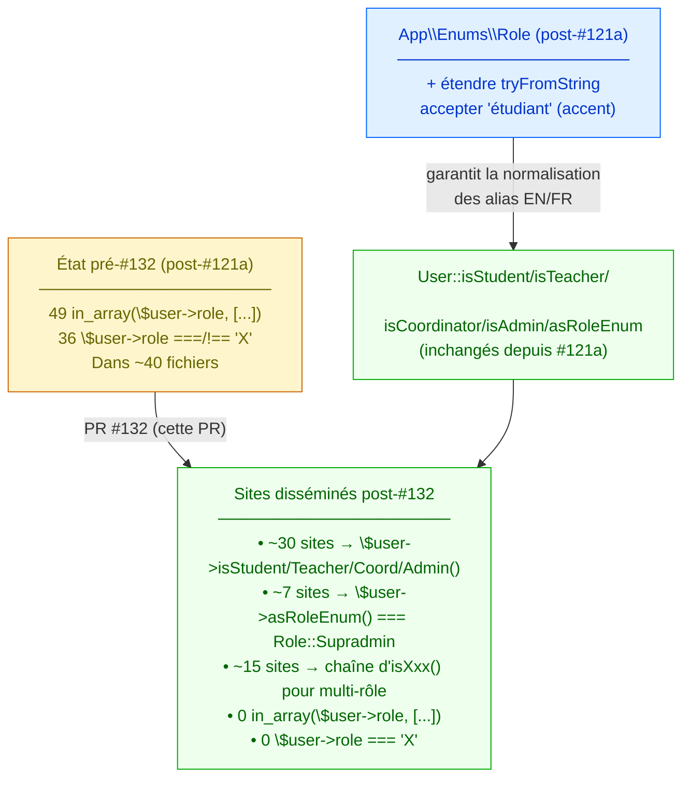

# Migrate role checks to enum — Design

> Spec parent : [`requirements.md`](./requirements.md). Issue : [#132](https://github.com/ouedraogoissouf2012/lms_backend/issues/132).
>
> Follow-up #121b de #121 (PR #130). Refactor pur mécanique sur ~40 fichiers + 1 extension de l'enum pour alias `'étudiant'`.

## 1. Architecture cible



**Invariant central** : post-#132, **aucun site applicatif ne lit `$user->role` brut** pour de l'autorisation. Tous les checks passent par les helpers `User::isXxx()` ou directement l'enum `Role`. Les seules occurrences acceptables sont :
- Lecture en lecture seule (log, JSON response payload)
- Le helper `User::asRoleEnum()` lui-même

## 2. Inventaire précis des sites (discovery exhaustive)

### 2.1 Fichiers concernés (par catégorie)

**Controllers (6 fichiers)** :
- `app/Http/Controllers/API/AuthController.php` — 1 site (`=== 'supradmin'`)
- `app/Http/Controllers/API/EvaluationController.php` — 1 site (`=== 'coordinateur'`)
- `app/Http/Controllers/API/FileController.php` — 1 site (`=== 'supradmin'`)
- `app/Http/Controllers/API/NotificationsController.php` — 1 site (`=== 'supradmin'`)
- `app/Http/Controllers/API/SearchController.php` — 8 sites (mix `in_array` + `===`)
- `app/Http/Controllers/API/TeacherStatsController.php` — 1 site (`in_array`)

**Controllers LMS (4 fichiers)** :
- `app/Http/Controllers/API/LMS/LMSAttendancesController.php` — 3 sites (`===`)
- `app/Http/Controllers/API/LMS/LMSMatieresController.php` — 4 sites (mix)
- `app/Http/Controllers/API/LMS/LMSNotificationsPreferencesController.php` — 1 site (`in_array`)
- `app/Http/Controllers/API/LMS/LMSSeancesController.php` — 6 sites (mix)
- `app/Http/Controllers/API/LMS/LMSVisioController.php` — 2 sites (mix)

**Services (1 fichier)** :
- `app/Services/SeanceQueryService.php` — 4 sites (mix)

**Concerns Traits (3 fichiers)** :
- `app/Http/Requests/Concerns/ChecksEvaluationOwnership.php` — 1 site (`=== 'coordinateur'`)
- `app/Http/Requests/Concerns/ChecksFileAuthorization.php` — 4 sites (mix)
- `app/Http/Requests/Concerns/ChecksForumAuthorization.php` — 1 site (`=== 'supradmin'`)

**FormRequests (~25 fichiers)** :
Liste complète (couvre les patterns standard auth admin/teacher) :
- `ActivateVisioRequest`, `AuthorizeServiceRequest`, `BulkImportUsersRequest`, `ChangeRoleRequest`
- `ConnectServiceRequest`, `CreateNotificationRequest`, `CreateUserRequest`
- `DeactivateVisioRequest`, `DeleteConfigurationRequest`, `DeleteSeanceRequest`, `DeleteUserRequest`
- `DisableUserRequest`, `DisconnectServiceRequest`, `EnableUserRequest`, `EndVisioRequest`
- `ExportUsersRequest`, `GenerateActivityReportRequest`, `GenerateAttendanceReportRequest`
- `GenerateGradesReportRequest`, `GetActivityTrendsRequest`, `GetConfigurationRequest`
- `GetPendingTasksRequest`, `GetRecentUsersRequest`, `GetSystemMetricsRequest`, `GetTeacherStatsRequest`
- `HideSeanceRequest`, `ResetPasswordRequest`, `StartVisioRequest`, `StoreEvaluationRequest`
- `StoreQuizRequest`, `SyncNotesToKlassciRequest`, `SyncToKlassciRequest`, `TestServiceConnectionRequest`
- `ToggleVisioSeanceRequest`, `UnhideSeanceRequest`, `UpdateConfigurationRequest`
- `UpdateInstitutionSettingsRequest`, `UpdateUserRequest`, `ViewAuditLogRequest`, `ViewUserDetailsRequest`

**Total** : ~**40 fichiers**, **85 sites** précis.

### 2.2 Distribution par pattern

| Pattern | Fréquence | Remplacement |
|---|---|---|
| `in_array(...role, ['superAdmin'])` (1 valeur, FormRequests admin globaux) | 7 | `$x->asRoleEnum() === Role::Supradmin` |
| `in_array(...role, ['coordinateur', 'superAdmin'])` (admin élargi) | 11 | `$x->isCoordinator() \|\| $x->isAdmin()` |
| `in_array(...role, ['coordinateur', 'superAdmin', 'admin'])` (variant) | 6 | identique au-dessus (isAdmin couvre `admin` ET `superAdmin`) |
| `in_array(...role, ['enseignant', 'teacher'])` (simple teacher) | 5 | `$x->isTeacher()` |
| `in_array(...role, ['etudiant', 'student'])` (simple student) | 3 | `$x->isStudent()` |
| `in_array(...role, ['etudiant', 'étudiant', 'student'])` (1 site spécifique) | 1 | `$x->isStudent()` (via REQ-1 enum extension) |
| `in_array(...role, ['enseignant', 'teacher', 'coordinateur', ...])` (mix) | 5 | combinaison `isXxx()` |
| `in_array(...role, ['admin', 'administrateur', 'superAdmin'])` (admin 3 variants) | 2 | `$x->isAdmin()` |
| `$x->role === 'enseignant'` (seul) | 7 | `$x->isTeacher()` |
| `$x->role === 'etudiant'` (seul) | 4 | `$x->isStudent()` |
| `$x->role === 'coordinateur'` (seul) | 3 | `$x->isCoordinator()` |
| `$x->role === 'supradmin'` (seul) | 5 | `$x->asRoleEnum() === Role::Supradmin` |
| `$x->role === 'superAdmin'` (seul, FormRequest) | 7 | `$x->asRoleEnum() === Role::Supradmin` |
| `$x->role === 'étudiant' \|\| $x->role === 'student'` (SearchController) | 2 | `$x->isStudent()` |
| `$x->role !== 'enseignant' && $x->role !== 'teacher'` | 1 | `!$x->isTeacher()` |
| `$x->role !== 'etudiant' && $x->role !== 'student'` | 2 | `!$x->isStudent()` |

## 3. Extension de l'enum pour alias `'étudiant'`

### 3.1 Modification de `Role::tryFromString`

```diff
 public static function tryFromString(?string $value): ?self
 {
     return match ($value) {
-        'etudiant', 'student'         => self::Etudiant,
+        'etudiant', 'student', 'étudiant' => self::Etudiant,
         'enseignant', 'teacher'       => self::Enseignant,
         'coordinateur', 'coordinator' => self::Coordinateur,
         'admin', 'administrateur'     => self::Admin,
         'supradmin', 'superAdmin'     => self::Supradmin,
         default                       => null,
     };
 }
```

### 3.2 PHPDoc mise à jour

Ajouter `'étudiant'` (avec accent) à la liste documentée des alias `Role.php:14-23` :

```php
 *  - 'etudiant'      ou 'student'        ou 'étudiant' (avec accent) → Role::Etudiant
```

### 3.3 Test Unit additionnel

Dans `tests/Unit/Enums/RoleTest.php`, modifier ou étendre :

```php
public function test_try_from_string_accepts_accented_etudiant_alias(): void
{
    self::assertSame(Role::Etudiant, Role::tryFromString('étudiant'));
}
```

(Test dédié pour la traçabilité du fix REQ-1.)

## 4. Stratégie de migration par catégorie de fichier

### 4.1 FormRequests simples — pattern uniforme `authorize()`

La plupart des FormRequests admin ont un `authorize()` ultra-court qui suit le pattern :

```php
public function authorize(): bool
{
    return auth()->check() && in_array(auth()->user()->role, ['superAdmin']);
}
```

Migration :

```php
public function authorize(): bool
{
    return auth()->user()?->asRoleEnum() === Role::Supradmin;
}
```

Note : on retire `auth()->check()` car `?->` rend la chaîne null-safe. Plus concis et type-safe.

**Fichiers concernés** : 25+ FormRequests (~30 lignes touchées totales). Import `use App\Enums\Role;` requis.

### 4.2 Controllers + Services — patterns mixtes

Diversité plus grande. Approche cas par cas en suivant les patterns du tableau §2.2.

**Cas spécial `SearchController`** (8 sites — le plus complexe) : a 4 instances de `=== 'enseignant'` + 4 instances de `in_array([..., 'coordinateur', 'superAdmin'])`. Approche : refactor du fichier en bloc avec import unique de `Role` puis migration ligne par ligne.

### 4.3 Concerns Traits — précaution maximale

Les 3 traits dans `app/Http/Requests/Concerns/` sont des chemins critiques sécurité (utilisés par les FormRequests Forum, File, Evaluation). Migration **uniquement** vers `User::isXxx()` ou `Role::X` (jamais de fallback string).

### 4.4 EXCEPTION : 4 sites où `$user->role === 'supradmin'` est PRÉSERVÉ strict (NE PAS migrer)

**Découvert pendant l'audit `spec-security`** : la migration vers `$user->asRoleEnum() === Role::Supradmin` ÉLARGIT le check à `'superAdmin'` (intra-tenant admin) via `tryFromString` qui normalise les deux alias vers la même case `Role::Supradmin`. Or 4 sites ont une **distinction délibérée** :

- `'supradmin'` (lowercase) = **cross-tenant platform manager** — bypass tenant isolation autorisé
- `'superAdmin'` (camelCase) = **intra-tenant institution admin** — DOIT rester confiné à son institution

Cette distinction est documentée dans :
- `EnsureRole::userHasRole()` L107-108 (la source canonique)
- `.claude/specs/forum-idor-cross-tenant/design.md` §50-51
- `.claude/specs/file-idor-cross-tenant/design.md` §2
- PR #95 (CRITICAL-95 IDOR Forum), PR #103 (#102 IDOR File), PR #100 (#98 cross-tenant Notifications)

**Sites EXCLUS de la migration** (préservent `$user->role === 'supradmin'`) avec commentaire de garde explicite :

| Fichier | Ligne | Raison |
|---|---|---|
| `ChecksForumAuthorization.php` | check #1 dans `authorizeAction` | bypass tenant isolation forum mutations — strict 'supradmin' only |
| `ChecksFileAuthorization.php` | check #1 dans `canReadFile` | bypass tenant isolation file READ — strict 'supradmin' only |
| `ChecksFileAuthorization.php` | check #1 dans `canModerateFile` | bypass tenant isolation file MODERATE — strict 'supradmin' only |
| `CreateNotificationRequest.php` | bypass tenant isolation pour notification create | strict 'supradmin' only |

**Pattern de garde** appliqué à chaque site :

```php
// Intentional: strict lowercase `'supradmin'` only — l'enum `Role::Supradmin`
// normaliserait aussi `'superAdmin'` (intra-tenant admin) via `tryFromString`,
// ce qui briserait la distinction délibérée du trait (cf. PR #XX / issue #YY).
// NE PAS migrer vers `asRoleEnum()` (#132 spec design.md §4.4).
if ($user->role === 'supradmin') {
    return true;
}
```

**Critère d'invalidation** (Q15 du manifest) — si jamais un alias `'supradmin'`/`'superAdmin'` doit être uniformisé côté DB (migration data + normalisation), ces 4 sites devront être révisés.

**Cas spécifique `ChecksFileAuthorization.php:74,101`** :
```php
return in_array($user->role, ['admin', 'administrateur', 'superAdmin'], true);
```
La liste exclut **délibérément** `'supradmin'` (variant FR). Mais l'enum normalise `'supradmin'` vers `Role::Supradmin` qui est aussi `isAdmin()`. Si on remplace par `$user->isAdmin()`, on ÉLARGIT le check au variant `'supradmin'`. **Bug fix** : si la DB stocke `'supradmin'`, le code original aurait dû le matcher mais ne le faisait pas. Documenter dans le commit.

## 5. Pièges et bug fixes documentés

### 5.1 Pièges à éviter

1. **Variant `'étudiant'` (accent)** : REQ-1 étend l'enum AVANT migration. Sans ça, les 2 sites `SearchController:74,103` et `LMSSeancesController:457` perdent la couverture.
2. **`$user->role !== 'X' && $user->role !== 'Y'`** : devient `!$user->isStudent()` ou `!$user->isTeacher()`. Attention à la logique (De Morgan) — `!($A || $B)` ≡ `!A && !B`, donc `!$user->isXxx()` est équivalent.
3. **Comparaisons avec `auth()->user()` (potentiellement null)** : ajouter `?->` pour null-safety. Le code original avec `in_array(auth()->user()->role, ...)` planterait si user null, mais Laravel utilisateur de FormRequest garantit user authentifié à ce stade.

### 5.2 Bug fixes silencieux (à documenter dans commit)

1. **`SearchController.php:74,103`** : checks `=== 'étudiant' || === 'student'` ne couvraient PAS `'etudiant'` sans accent (qui est le format canonique). Post-migration : `$user->isStudent()` couvre les 3 (`etudiant`, `étudiant`, `student`).
2. **`ChecksFileAuthorization.php:74,101`** : check `['admin', 'administrateur', 'superAdmin']` excluait `'supradmin'`. Post-migration : `$user->isAdmin()` inclut `'supradmin'`.
3. **`EvaluationController.php:1481`** : `=== 'coordinateur'` ne couvrait pas `'coordinator'` (alias EN). Post-migration : `$user->isCoordinator()` couvre les 2.

Ces 3 fixes corrigent des bugs latents d'incohérence d'alias entre sites du codebase.

## 6. Implementation outline

| Step | Catégorie | Fichiers | LOC net |
|---|---|---|---|
| 1 | Enum extension | `app/Enums/Role.php`, `tests/Unit/Enums/RoleTest.php` | +5 |
| 2 | FormRequests admin | 25 fichiers (`AuthorizeServiceRequest`, `BulkImportUsersRequest`, etc.) | ~−25 LOC (lignes plus courtes) |
| 3 | Controllers `Search`, `Auth`, `File`, `Notifications` | 4 fichiers | ~−5 LOC |
| 4 | Controllers LMS (`LMSMatieres`, `LMSSeances`, `LMSVisio`, `LMSAttendances`, `LMSNotifications`) | 5 fichiers | ~−10 LOC |
| 5 | Services + Concerns | `SeanceQueryService.php`, 3 traits | ~−5 LOC |
| 6 | Controllers `Evaluation`, `TeacherStats` + autres FormRequests visio (`Activate/End/Start/ToggleVisio`, `Hide/UnhideSeance`, `DeleteSeance`, `StoreEvaluation`, `StoreQuiz`, `SyncNotes/SyncToKlassciRequest`) | 8 fichiers | ~−15 LOC |

**Bilan code applicatif** : ~**−55 LOC net** (le remplacement de `in_array($x->role, ['a', 'b', 'c'])` (1 longue ligne) par `$x->isXxx()` ou chaîne d'isXxx() est légèrement plus court).

**Bilan total** : ~+5 LOC enum + 30 LOC tests Unit/spec ; ~−55 LOC code applicatif = net **−20 LOC**.

## 7. Stratégie de test

### 7.1 Tests Unit additionnels

- 1 test Unit `Role::tryFromString('étudiant') === Role::Etudiant` (REQ-8)

### 7.2 Régression Feature (existante)

Toutes les suites pré-existantes (~91 tests cumulés) DOIVENT rester vertes :
- `tests/Unit/Enums/RoleTest.php` (9 + 1 nouveau)
- `tests/Unit/Middleware/EnsureKlassciSyncTest.php` (10)
- `tests/Feature/Security/*` (28)
- `tests/Feature/Models/UserRoleHelpersTest.php` (4)
- `tests/Feature/LMS/*` (50)
- Autres (Quiz, Forum, Notifications, Files) : indéfini mais couvert

### 7.3 Pas de tests Feature additionnels pour la migration

Refactor pur = comportement runtime préservé. Les tests existants suffisent comme régression-net. Ajouter de nouveaux tests serait redondant.

## 8. Risques

| Risque | Probabilité | Mitigation |
|---|---|---|
| Régression silencieuse sur 1 site spécifique | Faible | Régression-suite ~91 tests, audit grep final, mapping de patterns documenté |
| Faux fix sur alias non-attendu (par ex. élargir `=== 'enseignant'` à `'teacher'` casse un cas business) | Très faible | Aucun cas business connu où on doit distinguer FR vs EN ; les alias EN sont des artefacts de sync KLASSCI |
| Diff PR trop volumineux pour audit | Modéré | ~40 fichiers mais chaque diff est 1-3 lignes. Total ~150 lignes modifiées. Acceptable. |
| Conflit de merge avec une PR concurrente | Faible | Aucune PR en cours sur ces fichiers post-#130 |

## 9. Alternatives rejetées

### 9.1 Découper en plusieurs PRs (par catégorie de fichier)

Option : PR 132a (FormRequests), PR 132b (Controllers), PR 132c (Concerns).

**Rejeté** parce que :
- État intermédiaire bizarre (`User::isAdmin()` utilisé dans certains fichiers, `in_array(...)` dans d'autres)
- Multiplication des cycles audit/review pour un refactor mécanique homogène
- Précédent : PR #129 trait `ChecksEvaluationOwnership` = même approche mono-PR sur 3 fichiers — extrapolable

### 9.2 Conserver les checks `in_array` mais juste ajouter le commentaire `// TODO #121b`

Option : ne rien migrer, documenter la dette.

**Rejeté** parce que :
- Aucun gain ; la dette reste
- Le bénéfice DRY de #121a est seulement partiellement réalisé
- Va à l'encontre de l'esprit du manifeste (« meilleure architecture ≠ plus rapide »)

### 9.3 Étendre l'enum avec un helper `Role::isAdminOrCoordinator()` etc.

Option : créer des helpers composés au niveau enum pour les patterns récurrents (`coord || admin`, `teacher || coord || admin`, etc.).

**Rejeté** parce que :
- Inflate la surface API de l'enum
- Plus de méthodes = plus à apprendre/maintenir
- Les `$user->isXxx() || $user->isYyy()` chaînés sont déjà lisibles
- Si un pattern apparaît >5 fois, considérer l'extraction. Aujourd'hui : aucun pattern composé n'apparaît >11 fois (le `coord+admin`), mais déjà capté par `isCoordinator() || isAdmin()` clair.

### 9.4 Migration mécanique avec sed/script PHP-CS-Fixer

Option : automatiser la migration via un rector ou sed.

**Rejeté** parce que :
- Les patterns varient légèrement (espaces, ordre des alias, parenthèses)
- Risque de faux positifs/négatifs sur un script
- Le refactor manuel permet d'identifier les bug fixes silencieux au passage (cf. §5.2)

### 9.5 Modifier le `EnsureRole` middleware pour utiliser l'enum

Option : profiter de la migration pour refactoriser le middleware Laravel `role:admin,enseignant` syntax.

**Rejeté** parce que :
- Le middleware parse des strings de routes (`role:enseignant,coordinateur`) qui sont écrites en config Laravel
- Refactor du middleware demanderait de changer aussi la signature des routes (`->middleware('role:enseignant')` devient quoi ?)
- Sortie du scope chirurgical, à traiter dans une issue dédiée si vraiment utile

## 10. Projection volume 10×

| Métrique | Aujourd'hui | 10× (200k users) | Tient ? |
|---|---|---|---|
| Appels `$user->isXxx()` par requête | ~2-3 | ~2-3 | O(1), neutre vs `in_array` |
| Évaluation `match` PHP 8.x | ~50ns | ~50ns | trivial |
| Chaînes `isStudent() \|\| isAdmin()` | ~150ns | ~150ns | trivial |

**Aucun goulet** introduit. Le refactor est neutre en perf voire légèrement plus rapide (match O(1) vs `in_array` qui itère sur le tableau).

## 11. Critère d'invalidation (Q15 — manifest)

Cette solution est **à invalider et reconcevoir** SI :

1. **Un test Feature régresse** lors de la migration d'un site → comportement non runtime-équivalent. Revenir au cas par cas, possiblement préserver le check original avec commentaire `// Intentional: enum mapping insufficient here`.
2. **Un alias inconnu de l'enum est découvert** lors du grep → étendre l'enum AVANT de migrer le site. (Cas anticipé pour `'étudiant'` accent → REQ-1.)
3. **La DB contient des valeurs de rôle non listées par les alias** (à vérifier `SELECT DISTINCT role FROM users` si possible). Si oui, étendre l'enum ou laisser le check original avec justification.
4. **Le pattern de remplacement crée une régression sémantique subtile** (par ex. un endpoint admin élargi accidentellement à un alias non-désiré). Auditer cas par cas, préserver le comportement strict si demandé.

Aucune de ces 4 conditions n'est anticipée aujourd'hui mais à vérifier pendant l'implémentation.

## 12. Cohérence avec PRODUCTION_STANDARDS

| § | Règle | Statut |
|---|---|---|
| §1.1 Zero God Code | Net −20 LOC, aucun fichier ne grossit significativement | PASS |
| §1.2 Sécurité Absolue | Refactor pur, comportement runtime préservé, 3 bug fixes documentés | PASS+ (corrige des bugs latents) |
| §1.3 Tests Obligatoires | +1 test Unit, 91+ tests pré-existants restent verts | PASS |
| §1.4 Performance | Match O(1) vs `in_array` itération, neutre voire +rapide | PASS |
| §1.5 Validation systématique | N/A (refactor interne) | N/A |
| §1.6 SOLID — DRY | 100% du DRY post-#121 capté | PASS atteint |
| §1.6 SOLID — DIP | Pas de Facade ajoutée, pas de `new` | PASS |
| §6 Une seule solution | 5 alternatives rejetées avec raison | PASS |
