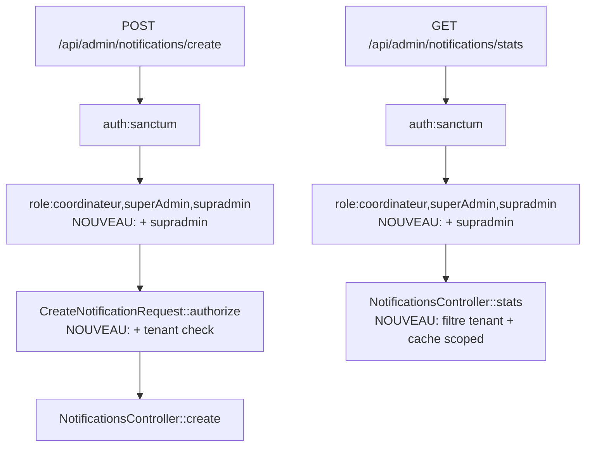

# Design — NotificationsController cross-tenant fix

**Issue GitHub** : [#98](https://github.com/ouedraogoissouf2012/lms_backend/issues/98)
**Spec phase** : 2/3
**Date** : 2026-05-17

---

## 1. Décision R1 résolue

Le requirements R1 listait 2 options pour `supradmin` :
- A) Ajouter `supradmin` au middleware route → bypass cross-tenant légitime
- B) Retirer REQ-2/REQ-5 → supradmin n'a pas accès du tout

**Choix : Option A**, justifié par :
- Cohérence avec les fixes #95 (Forum IDOR) et #96 (Quiz IDOR) où `supradmin` est cross-tenant légitime
- `EnsureRole.php:107-114` définit `supradmin` comme bypass total
- Sans accès aux notifications stats/create, un supradmin ne peut pas faire son travail de gestionnaire plateforme

Conséquence : modifier `routes/api.php` L735 pour ajouter `supradmin` au middleware `role:`.

---

## 2. Architecture du fix



### 2.1 `CreateNotificationRequest::authorize()`

**Avant** :
```php
public function authorize(): bool
{
    $user = auth()->user();
    if (!$user) return false;
    return in_array($user->role, ['coordinateur', 'superAdmin']);
}
```

**Après** :
```php
public function authorize(): bool
{
    $user = auth()->user();
    if (!$user) return false;

    // Role check (supradmin added for platform-manager access)
    if (!in_array($user->role, ['coordinateur', 'superAdmin', 'supradmin'])) {
        return false;
    }

    // Supradmin bypasses tenant isolation by design
    if ($user->role === 'supradmin') return true;

    // Tenant check: target user must be in the same institution
    $targetUserId = $this->input('user_id');
    if (!is_numeric($targetUserId)) return false;

    $targetUser = \App\Models\User::find((int) $targetUserId);
    if ($targetUser === null) return false;

    return $targetUser->institution_id === $user->institution_id;
}
```

**Pourquoi ne PAS utiliser le trait `ChecksForumAuthorization`** : le trait est conçu autour de "owner + tenant + moderator roles" — il n'y a pas d'ownership ici (action de création, pas accès à ressource existante). Le pattern serait forcé et masquerait l'intention.

### 2.2 `NotificationsController::stats(Request $request)`

**Avant** :
```php
public function stats()
{
    $cacheKey = 'notifications_stats_admin';

    $stats = Cache::remember($cacheKey, 300, function () {
        $totalNotifications = DB::table('notifications')->count();
        // ... (pas de filtre)
    });
}
```

**Après** :
```php
public function stats(Request $request)
{
    $user = $this->authenticatedUser($request);
    $isSupradmin = $user->role === 'supradmin';

    // Cache key includes institution_id for non-supradmin (prevents cross-tenant leak)
    $scope = $isSupradmin ? 'global' : "inst_{$user->institution_id}";
    $cacheKey = "notifications_stats_admin_{$scope}";

    $stats = Cache::remember($cacheKey, 300, function () use ($isSupradmin, $user) {
        $applyTenantFilter = function ($query) use ($isSupradmin, $user) {
            if (!$isSupradmin) {
                $query->where('institution_id', $user->institution_id);
            }
            return $query;
        };

        $totalNotifications = $applyTenantFilter(DB::table('notifications'))->count();
        $unreadNotifications = $applyTenantFilter(DB::table('notifications'))
            ->whereNull('read_at')->count();
        $last24h = $applyTenantFilter(DB::table('notifications'))
            ->where('created_at', '>=', Carbon::now()->subDay())->count();
        $last7days = $applyTenantFilter(DB::table('notifications'))
            ->where('created_at', '>=', Carbon::now()->subDays(7))->count();
        $byType = $applyTenantFilter(DB::table('notifications'))
            ->select('type', DB::raw('count(*) as count'))
            ->groupBy('type')
            ->get();

        return [
            'total' => $totalNotifications,
            'unread' => $unreadNotifications,
            'read' => $totalNotifications - $unreadNotifications,
            'last_24h' => $last24h,
            'last_7days' => $last7days,
            'by_type' => $byType,
        ];
    });

    return response()->json(['success' => true, 'data' => $stats]);
}
```

**Notes** :
- Le `$applyTenantFilter` closure évite la duplication de `->where('institution_id', ...)` sur 5 queries
- Le cache key inclut l'institution → pas de fuite cross-tenant
- `$this->authenticatedUser($request)` réutilise le helper `AuthenticatedController` (PR #83) déjà appliqué via Batch 6 (#97)

### 2.3 `routes/api.php` L735

**Avant** :
```php
Route::middleware(['auth:sanctum', 'role:coordinateur,superAdmin'])->prefix('admin/notifications')->group(function () {
    Route::post('/create', [NotificationsController::class, 'create']);
    Route::get('/stats', [NotificationsController::class, 'stats']);
});
```

**Après** :
```php
Route::middleware(['auth:sanctum', 'role:coordinateur,superAdmin,supradmin'])->prefix('admin/notifications')->group(function () {
    Route::post('/create', [NotificationsController::class, 'create']);
    Route::get('/stats', [NotificationsController::class, 'stats']);
});
```

Note : `EnsureRole::userHasRole()` (L107-108) accorde déjà à `supradmin` un bypass implicite — donc cet ajout est défensif mais non strictement nécessaire en runtime. Reste utile pour clarté en lecture statique de la route.

---

## 3. Plan de tests

### 3.1 Tests HTTP `CreateNotificationAuthorizationTest`

| # | Caller role | Caller tenant | Target tenant | Result |
|---|---|---|---|---|
| T1 | coordinateur | A | A | 200 |
| T2 | coordinateur | A | B | **403** |
| T3 | superAdmin | A | A | 200 |
| T4 | superAdmin | A | B | **403** |
| T5 | supradmin | (null) | A | 200 |

### 3.2 Tests HTTP `StatsAuthorizationTest`

| # | Caller role | Caller tenant | Visible institutions |
|---|---|---|---|
| T1 | coordinateur | A | A uniquement (filtre + cache scoped) |
| T2 | superAdmin | A | A uniquement |
| T3 | supradmin | (null) | toutes (filtre absent) |
| T4 | cache isolation | A puis B | clés cache distinctes (pas de fuite) |

---

## 4. Critères d'acceptation (8)

- **C1** : `CreateNotificationRequest::authorize()` réécrit avec tenant check + supradmin bypass
- **C2** : `NotificationsController::stats(Request $request)` réécrit avec filtre tenant + cache key par institution + supradmin bypass
- **C3** : `routes/api.php` L735 inclut `supradmin` dans `role:`
- **C4** : Aucun appel à `User::isAdmin()` dans les modifs
- **C5** : Tests HTTP : 5 cas `create` + 4 cas `stats` (9 cas total)
- **C6** : PHPStan 0 errors hors baseline
- **C7** : 3 audits PASS (security strict obligatoire)
- **C8** : PR ouverte vers `lms` avec `closes #98`

---

## 5. Risques actualisés

| # | Risque | Mitigation |
|---|---|---|
| R1 | `supradmin` ajout au middleware route élargit l'accès | Cohérent avec pattern projet (#95, #96). Documenté. |
| R2 | Cache cold-start après deploy | Acceptable (recalc d'1 requête, low impact) |
| R3 | Tenant check fait 1 query DB extra dans `authorize` | Acceptable (1 SELECT id par requête, pas de N+1) |
| R4 | Le `targetUser->institution_id` peut être null (utilisateur sans institution) | Géré : `!== $user->institution_id` matchera correctement si l'un des deux est null |

---

## 6. Hors scope (rappel)

- DI `User::findOrFail` (§1.6 D) — ticket séparé
- DI `Notification::create` static — ticket séparé
- File-size NotificationsController 264>200 — ticket séparé

---

## 7. Estimation effort

- `CreateNotificationRequest::authorize` modif : ~10 min
- `NotificationsController::stats` modif : ~15 min
- `routes/api.php` modif : ~2 min
- Tests HTTP : ~45 min
- 3 audits + commit + PR : ~30 min

**Total** : ~1h45.
