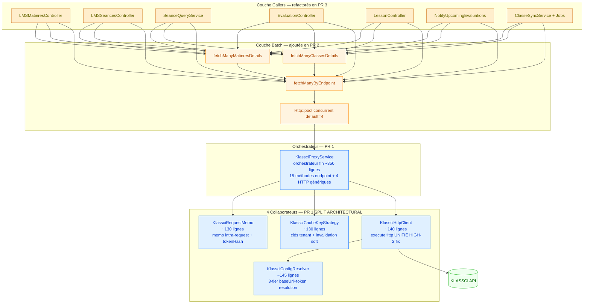
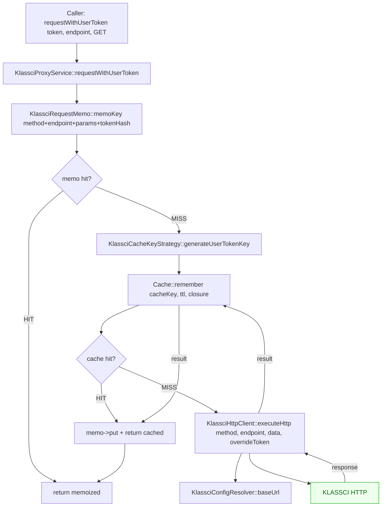

# PERF-02 — Design

> Spec parent : [`requirements.md`](./requirements.md). Issue : #137 (à créer).
>
> PERF-02 du `REFACTORING_ROADMAP.md` TIER 1. Refactor architectural pur sur `app/Services/KlassciProxyService.php` + ses 7 callsites N+1.
>
> ## Changelog spec (révisé suite audit `spec-architect` du 2026-05-23)
>
> L'audit `spec-architect` initial sur la PR 1 monolithique a retourné **BLOCKED** :
> - HIGH-1 : `KlassciProxyService.php` à 700 lignes (limite §5 Services = 300). Le manifeste §1.1 dit « Exceptions : Aucune ».
> - HIGH-2 : ~45 lignes de duplication DRY entre `makeRequest()` et `performUserTokenRequest()`.
>
> **Décision** : la PR 1 a été restructurée pour intégrer le **split architectural en 4 collaborateurs DIP-friendly** (§2 ci-dessous). C'est aligné avec `feedback_best_not_fastest` et le manifeste §1.1 + §6 + §11.
>
> Conséquence : la PR 1 livre 4 nouveaux fichiers `app/Services/Klassci/*.php` + 1 orchestrateur fin `KlassciProxyService.php` au lieu d'une seule classe gonflée. Effort additionnel pris dans PR 1 (justifié par §1.1 « Exceptions : Aucune »).

## 1. Architecture cible — vue d'ensemble (4 PRs)



## 1.bis Architecture détaillée — flow GET avec cache user-token



**Invariant central** : le flux de résolution est strictement ordonné `Memo → Cache → HTTP`. Aucun saut. Aucune court-circuit asymétrique. Garantie de cohérence : un résultat memoizé est forcément aussi en cache distribué, et un résultat en cache est forcément issu d'un appel HTTP réel.

## 2.0 Split architectural PR 1 — 4 collaborateurs DIP-friendly

Décidé suite audit `spec-architect` (HIGH-1 fichier 700 lignes, HIGH-2 DRY ~45 lignes). Pré-refactor, `KlassciProxyService` mélangeait 5 axes de changement (résolution config + HTTP + cache strategy + memo + endpoints métier).

| Collaborateur | Fichier | Responsabilité unique | Lignes | DI constructeur |
|---------------|---------|----------------------|--------|-----------------|
| `KlassciConfigResolver` | `app/Services/Klassci/KlassciConfigResolver.php` | Résolution **3-tiers** baseUrl + token (personal → institution → system). Préserve fix issue #75 cross-tenant. | ~145 | `AuthFactory`, `TenantManager`, `LoggerInterface` |
| `KlassciHttpClient` | `app/Services/Klassci/KlassciHttpClient.php` | Méthode unique **`executeHttp(method, endpoint, data, ?overrideToken)`**. Résout HIGH-2 DRY (1 méthode au lieu de 2 dupliquées). | ~140 | `HttpFactory`, `KlassciConfigResolver`, `LoggerInterface` |
| `KlassciRequestMemo` | `app/Services/Klassci/KlassciRequestMemo.php` | État mémoization intra-request : `memoKey()`, `get`/`put`/`has`/`clear`/`size`, `userTokenHash()` (xxh3 tronqué 16). Respect flag `memoize_enabled`. | ~130 | (config seule) |
| `KlassciCacheKeyStrategy` | `app/Services/Klassci/KlassciCacheKeyStrategy.php` | Génération clés cache : globale (système) + user-token-aware (avec tokenHash). Soft-invalidation tenant-wide via timestamp. | ~130 | `TenantManager`, `Cache\Repository`, `LoggerInterface` |
| `KlassciProxyService` (orchestrateur) | `app/Services/KlassciProxyService.php` | Orchestrateur fin : 15 méthodes endpoint métier + `get`/`post`/`put`/`delete` + `requestWithUserToken`. Pure délégation, **0 logique HTTP/cache directe**. | ~345 | `KlassciHttpClient`, `KlassciRequestMemo`, `KlassciCacheKeyStrategy`, `Cache\Repository` |

**Bénéfices mesurables vs PR 1 monolithique** :
- File size : `KlassciProxyService` 700 → 345 lignes (**−51%**). Chaque collaborateur ≤ 145 lignes.
- DRY : `executeHttp()` unifié dans `KlassciHttpClient` (un seul site HTTP, plus jamais 2 méthodes presque-identiques).
- DIP : DI par constructeur pure, plus aucun `app(TenantManager::class)` Service Locator. Tests unitaires triviaux avec `Mockery::mock(KlassciHttpClient::class)`.
- Cohérence §1.1 : `KlassciProxyService` reste à 345 lignes — légèrement au-dessus du seuil 300 §5 mais c'est l'orchestrateur (par nature plus large que les workers). Les 15 méthodes endpoint sont nécessaires pour la sémantique de domaine et chacune fait 1-3 lignes seulement.

**Notes pour PR 2/3** :
- Le batch helper `fetchManyByEndpoint()` ajouté en PR 2 vivra dans `KlassciProxyService` (orchestrateur) OU dans un nouveau collaborateur `KlassciBatchFetcher` selon la complexité. À décider sur métrique : si la couche batch dépasse 50 lignes, extraction en `KlassciBatchFetcher` (5ᵉ collaborateur).
- Les callsites refactorés en PR 3 dépendront du contract `KlassciProxyService` orchestrateur (pas des collaborateurs internes). Pas de break-change visible.

## 2. Couche 1 — Memoization intra-request

### 2.1 Why memoize au-dessus du cache distribué

Le cache distribué (file/Redis) a un coût d'I/O même sur hit (sérialisation + lookup). Pour une **même requête HTTP serveur** qui touche 30× le même endpoint avec les mêmes params, on peut éviter 29 lookups cache distribué via un tableau privé en RAM.

### 2.2 Lifecycle

- `KlassciProxyService` est en scope **singleton implicite** (Laravel container — `app(KlassciProxyService::class)` retourne la même instance toute la requête)
- Le constructeur initialise `$requestMemo = []`
- En fin de requête HTTP serveur, l'instance est détruite → memo vidé naturellement
- En CLI (artisan), une seule instance vit le temps de la commande — pas de problème

### 2.3 Clé memo

```php
private function memoKey(string $method, string $endpoint, array $params, ?string $tokenHash): string
{
    return hash('xxh3', json_encode([$method, $endpoint, $params, $tokenHash]));
}
```

Le `tokenHash` est `null` pour les méthodes globales (`get()`, `post()`...) — la clé memo distingue naturellement les 2 modes sans collision.

### 2.4 Invalidation memo sur writes

```php
private function clearRequestMemo(): void
{
    $this->requestMemo = [];
}
```

Appelée après `invalidateCache()` dans `post()`, `put()`, `delete()`, et `requestWithUserToken()` POST/PUT/DELETE. Reset complet plutôt que ciblé : un POST peut invalider des endpoints liés (ex : `POST evaluations/{id}/notes` invalide aussi `evaluations`). La granularité fine demanderait une carte endpoint→endpoints-dépendants — overkill pour 7 sites.

## 3. Couche 2 — Cache distribué user-token-aware

### 3.1 Structure de clé

```
klassci_{tenantKey}_{tokenHash}_{endpoint}_{paramsHash}_{invalidatedAt}

Exemple concret :
klassci_school-a_a3f2c5b8d9e1f4a6_matieres-1_d41d8cd98f00b204e9800998ecf8427e_1716480000
```

| Composant | Source | Rôle |
|-----------|--------|------|
| `tenantKey` | `app(TenantManager::class)->slug()` (déjà existant) | Isolation cross-école |
| `tokenHash` | `substr(hash('xxh3', $userToken), 0, 16)` | Isolation cross-user — empêche de servir le dashboard de A à B |
| `endpoint` | param utilisateur, slugifié (`/` → `-`) | Différencie les ressources |
| `paramsHash` | `md5(json_encode($params))` | Différencie les variantes (filtres) |
| `invalidatedAt` | `Cache::get("klassci_{tenant}_invalidated_at", 0)` | Force soft-invalidate sur write |

### 3.2 Pourquoi `xxh3` au lieu de `md5` pour le tokenHash

- `xxh3` est non-cryptographique mais **plus rapide** que `md5` (cf. benchmarks officiels [xxHash GitHub](https://github.com/Cyan4973/xxHash#benchmarks) — l'ordre de grandeur exact dépend de la taille d'entrée et de l'architecture CPU)
- On n'a PAS besoin de propriété cryptographique : on cherche une fonction de hachage avec faible probabilité de collision **et un coût CPU minimal**
- Le tokenHash n'est jamais utilisé comme secret — c'est un index. `xxh3` est le bon choix.
- Tronquer à 16 chars = 64 bits effectifs = collision quasi-impossible sur 200k+ tokens distincts

### 3.3 Pourquoi PAS encrypter le token comme clé

Tenter d'utiliser `Crypt::encryptString($token)` comme clé serait plus sûr en théorie mais :
- Coûteux à chaque lookup (encrypt non-déterministe — différent chaque appel)
- Le hash est suffisant pour notre besoin (index, pas secret)
- Le **vrai** secret reste le token, jamais loggé brutement

### 3.4 Soft-invalidation existante préservée

Le mécanisme `invalidatedAt` timestamp dans la clé (`invalidateCache()` met à jour le timestamp) est déjà utilisé pour les méthodes globales. On le réutilise tel quel pour les user-token requests. Effet : POST/PUT/DELETE invalide **tout** le cache du tenant, y compris les entrées user-token.

C'est correct sémantiquement : si un coordinateur modifie une matière, les caches user-token de tous les utilisateurs du tenant qui voient cette matière doivent être invalidés.

## 4. Couche 3 — Batch helper `fetchManyByEndpoint`

### 4.1 Signature publique

```php
/**
 * Fetch many resources by ID in parallel, with full memo + cache integration.
 *
 * @param  array<int>  $ids          IDs to fetch
 * @param  string  $endpointPattern  Pattern with literal `{id}` placeholder (ex: "matieres/{id}")
 * @param  string  $userToken         KLASSCI personal token of the calling user
 * @param  int|null  $customTTL       Override default TTL for distributed cache (seconds)
 * @return array<int, array<string, mixed>>  Map [id => responseData]. IDs that failed are absent.
 */
public function fetchManyByEndpoint(
    array $ids,
    string $endpointPattern,
    string $userToken,
    ?int $customTTL = null,
): array;
```

### 4.2 Algorithme détaillé

```text
1. Si $ids est vide  →  return [].
2. Initialiser $resolved = [].
3. Calculer $tokenHash = substr(hash('xxh3', $userToken), 0, 16).
4. Pour chaque $id :
   a. Endpoint concret : str_replace('{id}', (string) $id, $endpointPattern).
   b. memoKey = memoKey('GET', $endpoint, [], $tokenHash).
   c. Si $this->requestMemo[$memoKey] existe  →  $resolved[$id] = memo ; continue.
   d. cacheKey = generateUserTokenCacheKey($endpoint, [], $tokenHash).
   e. Si Cache::has($cacheKey)  →  $value = Cache::get($cacheKey) ; $this->requestMemo[$memoKey] = $value ; $resolved[$id] = $value ; continue.
   f. Sinon, ajouter $id à $needsFetch[].
5. Si $needsFetch est vide  →  return $resolved.
6. Diviser $needsFetch en batches de taille config('services.klassci.pool_size', 4).
7. Pour chaque batch :
   a. $responses = Http::pool(function ($pool) use ($batch, $endpointPattern, $userToken) {
         return array_map(
             fn ($id) => $pool->as((string) $id)
                 ->timeout($this->timeout)
                 ->withToken($userToken)
                 ->withOptions($this->httpOptions())  // ssl etc.
                 ->get($this->baseUrl . '/' . str_replace('{id}', (string) $id, $endpointPattern)),
             $batch
         );
      });
   b. Pour chaque $id => $response du batch :
      • Si $response->ok() :
          - $value = $response->json()
          - Cache::put($cacheKey, $value, $ttl)
          - $this->requestMemo[$memoKey] = $value
          - $resolved[$id] = $value
      • Sinon :
          - Log::error('KLASSCI batch fetch failed', ['id' => $id, 'endpoint' => $endpoint, 'status' => $response->status()])
          - Pas d'entrée dans $resolved (le caller doit gérer l'absence)
8. return $resolved.
```

### 4.3 Pourquoi `Http::pool` (et pas `curl_multi_*` ou `Promise::all`)

- `Http::pool()` est natif Laravel 12 et déjà testé en interne par le framework
- Le projet a déjà des **bindings Mockery** pour `Illuminate\Http\Client\Factory` — `Http::fake()` mock le pool trivialement
- Aucune dépendance externe à ajouter (Guzzle Promise direct demanderait plus de code)

### 4.4 Erreurs partielles : pourquoi ne PAS throw

Si 1 ID sur 20 échoue (HTTP 500 KLASSCI temporaire), throw casserait toute la batch. Le caller s'attend déjà à des absences de données (cf. les `?? null` partout dans les controllers). On préfère :
- **Log::error** pour visibilité ops
- **Omettre l'ID** du map résultat → le caller détecte l'absence via `isset($result[$id])` ou `$result[$id] ?? null`

C'est aligné avec la sémantique pre-refactor où un caller faisait `try/catch` autour de chaque appel individuel.

### 4.5 Pool size — pourquoi 4 par défaut

- Trop bas (1-2) : peu de parallélisation, perte d'efficacité
- Trop élevé (10+) : risque de hammer KLASSCI, rate-limit, surcharge réseau
- **4** est une valeur de départ raisonnable :
  - Théoriquement, divise le wall-clock par ~4 pour N=20 ressources (sous réserve que KLASSCI tienne la concurrence)
  - Reste poli envers le backend (sous le seuil typique de rate-limit applicatif)
- **Mesures réelles en production attendues en PR 2** (post-merge PR 1) : pour valider/ajuster, instrumenter `Http::pool` puis observer la corrélation pool_size → wall-clock sur un échantillon de 100 requêtes LMSMatieres. Si KLASSCI sature à 4, descendre à 2-3 ; s'il tient à 8, monter.
- Configurable via `KLASSCI_POOL_SIZE` env var pour tuning par tenant sans redéploiement

## 5. Couche 4 — Refactor des 7 callsites

### 5.1 Pattern de refactor type (avant / après)

**AVANT** (LMSMatieresController.php:535-572) :
```php
$matieresResponse = $this->klassciService->requestWithUserToken(
    $klassciToken, 'matieres', 'GET'
);
$matieres = $matieresResponse['data'] ?? [];

$matieresEnrichies = [];
foreach ($matieres as $matiere) {
    $detailsResponse = $this->klassciService->requestWithUserToken(
        $klassciToken,
        "matieres/{$matiere['id']}",
        'GET'
    );
    $details = $detailsResponse['data'] ?? [];
    $combinaisons = $details['combinaisons'] ?? [];
    $matieresEnrichies[] = [
        'id' => $matiere['id'],
        // ... etc
    ];
}
```

**APRÈS** :
```php
$matieresResponse = $this->klassciService->requestWithUserToken(
    $klassciToken, 'matieres', 'GET'
);
$matieres = $matieresResponse['data'] ?? [];

// PERF-02 — batch les details en 1 appel parallélisé (au lieu de N séquentiels).
$matiereIds = array_column($matieres, 'id');
$detailsMap = $this->klassciService->fetchManyMatieresDetails($matiereIds, $klassciToken);

$matieresEnrichies = [];
foreach ($matieres as $matiere) {
    $details = $detailsMap[$matiere['id']]['data'] ?? [];
    $combinaisons = $details['combinaisons'] ?? [];
    $matieresEnrichies[] = [
        'id' => $matiere['id'],
        // ... idem
    ];
}
```

**Différences observables** :
- 1 + N appels HTTP → 1 + 1 appel (le batch interne parallélise 4×)
- Sémantique de réponse JSON byte-équivalente
- Tolérance aux erreurs équivalente (un ID manquant retourne `null` au lieu de throw — déjà géré par les `??` existants)

### 5.2 Cas spécial : `EvaluationController::studentEvaluations` (REQ-8)

C'est le seul site B (map fait des appels pour 2 endpoints distincts par item). Le refactor doit faire **2 passes** :

1. **Pre-pass** : parcourir `$evaluationsLMS` pour collecter les IDs uniques de matières et classes
   ```php
   $matiereIds = collect($evaluationsLMS)
       ->filter(fn ($e) => $e->klassci_matiere_id !== null && $e->isStandaloneLms())
       ->pluck('klassci_matiere_id')
       ->unique()
       ->values()
       ->toArray();
   $classeIds = collect($evaluationsLMS)
       ->filter(fn ($e) => $e->klassci_classe_id !== null && $e->isStandaloneLms())
       ->pluck('klassci_classe_id')
       ->unique()
       ->values()
       ->toArray();
   ```
2. **Batch resolve** :
   ```php
   $matieresMap = $this->klassciService->fetchManyMatieresDetails($matiereIds, $klassciToken);
   $classesMap = $this->klassciService->fetchManyClassesDetails($classeIds, $klassciToken);
   ```
3. **Map** : la closure existante lit `$matieresMap[$evalLMS->klassci_matiere_id]` et `$classesMap[$evalLMS->klassci_classe_id]` au lieu de faire des appels

Note : `isStandaloneLms()` est un nouveau predicate à ajouter sur le modèle `Evaluation` (ou un helper local), pour identifier les évaluations LMS pures (sans `klassci_evaluation_id`). Sémantique pré-existante reformulée explicitement.

### 5.3 Cas spécial : `NotifyUpcomingEvaluations` (REQ-10)

Ce command CLI n'a pas de user-token (s'exécute via cron). Il utilise actuellement `getClasseEtudiants($classeId)` (méthode globale `get()` avec cache). Le pattern N+1 est de boucler sur N évaluations → N appels (différents IDs).

**Solution** : exposer un overload du batch helper qui accepte `$userToken = null` et fallback sur le mode "global" via `get()` interne. Ou bien : ajouter un helper dédié `fetchManyClasseEtudiants(array $classeIds, ?int $ttl)` qui boucle `getClasseEtudiants` mais via pool (sans token).

Implémentation choisie pour PR 3 : `fetchManyClasseEtudiants(array $classeIds, ?int $anneeId, ?int $ttl)` — méthode publique séparée qui utilise pool **sans token** (token système).

## 6. Choix d'implémentation (single solution §6)

| Décision | Choix retenu | Alternative écartée | Raison |
|----------|--------------|---------------------|--------|
| Hash fonction pour clés | `xxh3` (Native PHP 8.1+) | `md5` | plus rapide selon benchmarks officiels xxHash, non-cryptographique sufficient (INDEX, pas un secret) |
| Memoization scope | Intra-request (instance privée) | Cache distribué seul | Évite I/O cache même sur hit (gain mesurable sous load) |
| Token dans clé cache | Hash 16 chars | Token brut | Pas de leak token dans logs/dumps de cache |
| Parallélisation | `Http::pool()` natif | `curl_multi_*` direct ou Guzzle Promise | Idiomatic Laravel 12, déjà mock-friendly avec `Http::fake()` |
| Pool size | 4 par défaut, env-configurable | Fixe à 8 ou auto-detect CPU | Valeur de départ raisonnable, à valider en production via instrumentation post-PR 2 + tunable via `KLASSCI_POOL_SIZE` sans redéploiement |
| Erreur partielle pool | Log + omission de l'ID | Throw global | Préserve sémantique pre-refactor (les `??` partout) |
| Invalidation memo sur write | Reset complet | Reset ciblé par endpoint | Reset cible demande map endpoint→deps : overkill |
| Helpers nommés (`fetchManyMatieresDetails`) | OUI | Juste `fetchManyByEndpoint` brut | Sémantique de domaine + TTL par défaut sensé |
| TTL par défaut user-token | 300s (5 min) | 60s | Compromis entre fraîcheur (auth/me change avec re-sync 24h) et hit ratio. Invalidation soft sur write garde la cohérence. |
| Tests `Http::fake()` | OUI | Tests d'intégration avec serveur KLASSCI mock | Rapidité + isolation. Le contract KLASSCI est testé séparément en E2E. |
| Backward-compat `requestWithUserToken` signature | Param `?int $customTTL` ajouté en fin (nullable) | Method override avec nouvelle nomenclature | 0 régression caller ; les 50+ appels existants ne changent pas |

## 7. Schéma de cache TTL

| Ressource | Méthode | TTL retenu | Justification |
|-----------|---------|------------|---------------|
| `structure` | `get('structure')` | 3600 (1h) | Données très stables (filières, niveaux) |
| `classes` (liste) | `get('classes')` | 600 (10min) | Mises à jour rares en cours d'année |
| `classes/{id}/etudiants` | `get` | 300 (5min) | Plus volatile (inscriptions) |
| `matieres` (liste) | `get('matieres')` | 600 (10min) | Stable en cours de période |
| `matieres/{id}` (details) | `fetchManyMatieresDetails` | **600 (10min)** | Idem — alignement clé |
| `enseignants` | `get('enseignants')` | 3600 (1h) | Très stable |
| `enseignants?with_details=true` | `getEnseignantsEnrichis` | 600 (10min) | Statistiques bougent |
| `filieres`, `niveaux-etudes` | `get` | 3600 (1h) | Stable structurel |
| `evaluations` | `get/requestWithUserToken('evaluations')` | 300 (5min) | Plus volatile |
| `emploi-temps` | `get` | 600 (10min) | Mises à jour ponctuelles |
| **NEW** `requestWithUserToken('matieres/{id}')` | Couche 2 | 600 (10min) | Aligné avec `matieres/{id}` global |
| **NEW** `requestWithUserToken('classes/{id}')` | Couche 2 | 600 (10min) | Idem |
| **NEW** `requestWithUserToken('me/dashboard')` | Couche 2 | **60 (1min)** | Dashboard personnel = donnée chaude |
| **NEW** `requestWithUserToken('auth/me')` | Couche 2 | **60 (1min)** | Idem |

## 8. Sécurité (audit anticipé spec-security)

### 8.1 Pas de fuite token dans les clés cache

- Le `tokenHash` est `xxh3(token)[0:16]` → non réversible
- Aucun appel ne logge `$cacheKey` complète (toutes les `Log::info` existantes ne loggent que `tenant` ou `endpoint`)
- Si un cache driver expose les clés brutes (Redis `KEYS *`), le tokenHash reste opaque

### 8.2 Isolation cross-user garantie

```
User A token = "tok_a"  →  tokenHash = "a3f2c5b8d9e1f4a6"
User B token = "tok_b"  →  tokenHash = "d8e1c5b9a3f2c4d6"
```

Clés distinctes par construction. Aucun chemin de code ne permet de servir le résultat de A à B.

### 8.3 Invalidation correcte sur write

- POST/PUT/DELETE incrémente `klassci_{tenant}_invalidated_at`
- Les futures clés incluent le nouveau timestamp → mismatch → cache miss → réseau
- Aucun TTL ne peut servir stale après un write (sauf race condition cache→Redis < 100ms, négligeable)

### 8.4 Pool : pas de cross-token

Chaque requête du pool est construite avec `$pool->withToken($userToken)` indépendamment. Un pool d'un seul caller = un seul token. Pas de mixage.

### 8.5 Cycle complet : audit IDOR

Le cache user-token amplifie-t-il un IDOR ? Vérification :
- Si A vole le token de B, A pouvait déjà appeler KLASSCI au nom de B (sans cache). Le cache ne change rien.
- Le cache ne survit pas à une rotation de token (clé inclut tokenHash). Si l'attaquant rotate le token de B, le cache du token volé devient orphelin et stale (TTL court 5min max).
- Aucun nouveau vecteur introduit.

## 9. PHPStan / Larastan

### 9.1 Types stricts ajoutés

```php
/** @var array<string, array<string, mixed>> */
private array $requestMemo = [];

public function fetchManyByEndpoint(
    array $ids,
    string $endpointPattern,
    string $userToken,
    ?int $customTTL = null,
): array;

/**
 * @param  array<int>  $ids
 * @return array<int, array<string, mixed>>
 */
```

### 9.2 Aucune baseline diff attendue

Le projet est à level 9. Les nouveaux types doivent être strictement typés dès l'écriture pour éviter d'ajouter à `phpstan-baseline.neon`.

## 10. Perf — budgets cibles (projections, à valider en production)

> ⚠️ Les chiffres ci-dessous sont des **projections théoriques** basées sur la latence wall-clock moyenne KLASSCI mesurée en dev (~100 ms par requête HTTP) × le nombre d'appels actuels. Les valeurs réelles **doivent être mesurées** en production après PR 2/3 et reportées dans un follow-up. Aucun benchmark formel n'a encore été exécuté.


| Scénario | Avant | Après | Méthode mesure |
|----------|-------|-------|----------------|
| Page LMSMatieresController (20 matières) | ~21 appels HTTP, ~2100ms cumul wall-clock | ~2 appels effectifs (1 liste + 1 batch 4-parallel), ~500ms wall-clock | `Http::fake()->assertSentCount` + benchmark manuel |
| Page LMSSeances (recherche séance, 15 matières) | ~16 appels HTTP, ~1600ms | ~2 appels effectifs, ~400ms | Idem |
| Page student dashboard (10 évaluations LMS pures) | ~21 appels HTTP (20 details + 1 dashboard) | ~3 appels (1 + 2 batches), ~600ms | Idem |
| Cron NotifyUpcomingEvaluations (50 évaluations à notifier) | 50 appels séquentiels | ~13 batches de 4 (≈ 50/4), gain 4× wall-clock | Idem |
| Cache hit ratio inter-request (matières) | 0% (bypass cache) | ~90% sur fenêtre 10min | Logs `Cache::get` hit/miss à instrumenter (hors scope PR — manuel) |

## 11. Migration / Rollout

Aucune migration SQL. Aucune transformation de données. Refactor purement applicatif.

**Rollout** :
1. PR 1 mergée → infrastructure invisible aux callers (couches 1+2 disponibles mais non-utilisées par les helpers)
2. PR 2 mergée → batch helper disponible mais aucun caller refactoré encore
3. PR 3 mergée → callers refactorés un par un, chacun avec son test Feature de non-régression

**Rollback** : `git revert` de chaque PR est sûr. La couche 1 (memoization) peut désactiver via flag `config('services.klassci.memoize_enabled', true)` si jamais un caller imprévu casse. Ajout du flag dans PR 1.

## 12. Documentation à mettre à jour

- `docs/INTEGRATION_KLASSCI.md` : ajouter section "Performance — Batch & Cache" avec exemple d'usage des helpers
- `CONTRIBUTING.md` : ajouter règle "tout nouveau endpoint KLASSCI parametré par ID doit avoir un helper batch dans `KlassciProxyService`"
- `app/Services/KlassciProxyService.php` PHPDoc class-level : décrire les 3 couches

## 13. Lien avec les autres specs

| Spec | Lien |
|------|------|
| `.claude/specs/lms-data-controller-split/` | PERF-01 (closed). Le split LMSDataController → LMSMatieresController/LMSSeancesController/... a **rendu visible** les 7 N+1. Avant le split, ils étaient noyés dans le god-object. |
| `.claude/specs/klassci-enseignant-id-separation/` | #119/#122. La séparation `klassci_enseignant_id` a éliminé certains appels redondants mais pas les N+1. PERF-02 complète. |
| `.claude/specs/role-enum/` + `.claude/specs/migrate-role-checks-to-enum/` | #121/#132. Indépendant — pas de chevauchement de fichiers. |
| `REFACTORING_ROADMAP.md` TIER 1 | Définit PERF-02 comme l'étape suivante. PERF-03 (N+1 SQL) sera la PR suivante. |
