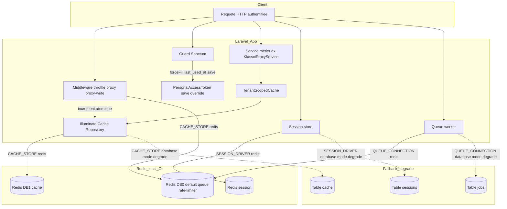
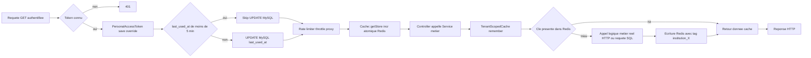
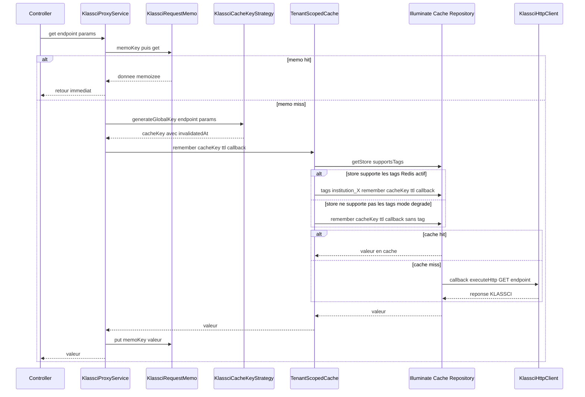
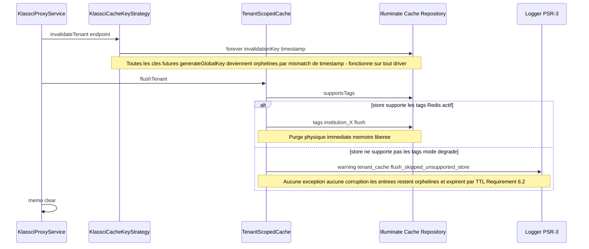
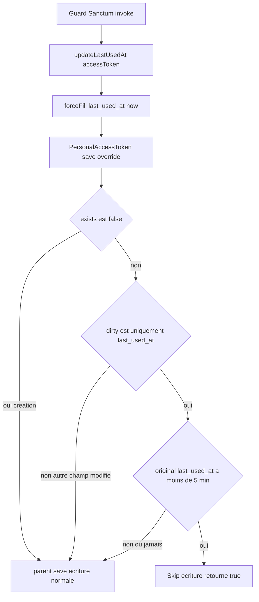

# Design Document

## Overview

Cette spec bascule le runtime cache / session / queue / rate-limiter de `database` vers `redis` en local et en CI, sans toucher à la production (bloquée par #367, cf. Requirement 9). Le terrain est en grande partie déjà préparé par le code existant :

- `config/database.php:130-166` déclare déjà un bloc `redis` complet, avec une connexion `cache` dédiée (`REDIS_CACHE_DB=1`, distincte de `default` DB=0) — **Requirement 1.4 déjà satisfait par le code actuel**, aucune modification requise.
- `config/database.php:132` résout déjà `REDIS_CLIENT` avec fallback `phpredis` — **Requirement 1.1 déjà satisfait**.
- `composer.json:16` déclare déjà `predis/predis: ^3.2` — **Requirement 1.3 déjà satisfait** (bascule client sans changement de code, cf. `config/database.php:132`).
- 14 fichiers de service (recensement précis ci-dessous, contre 10 annoncés par `requirements.md`) injectent déjà `Illuminate\Contracts\Cache\Repository` via le constructeur — **Requirement 10.1 (DIP sur le cache) déjà respecté par convention établie du projet**, aucune Facade `Cache::` n'existe dans le code métier (`app/`).

Le design se concentre donc sur ce qui **manque réellement** :

1. Une capacité neuve d'invalidation par tag multi-tenant (Requirement 4), absente du code actuel.
2. Le throttle de `last_used_at` sur Sanctum (Requirement 5).
3. La correction d'un bug de configuration de test latent qui invalide silencieusement la bascule (phpunit.xml).
4. L'instrumentation CI/tests pour valider les Requirements 1, 6, 7, 8 en local/CI uniquement.
5. Le mode dégradé documenté (Requirement 6).

Toute étape de déploiement VPS, bascule `.env` de production ou mesure k6 en production reste explicitement **hors périmètre** (Requirement 9) : ce design ne produit aucune procédure de déploiement, seulement du code, de la configuration locale/CI et des tests.

## Architecture

### System Architecture Diagram



### Data Flow Diagram



## Components and Interfaces

### `App\Services\Cache\TenantScopedCacheInterface` (nouveau)

**Responsibilities**
- Fournir aux services métier une façade de cache lecture-à-travers (`remember`) scopée au tenant courant, injectable et substituable (LSP), sans exposer aux consommateurs le détail « le store actif supporte ou non les tags ».
- Exposer une opération d'invalidation `flushTenant()` qui purge physiquement les entrées de l'institution courante quand le store le permet, et se dégrade sans erreur sinon (Requirement 4.5 / 6.2).

**Interfaces**
```php
interface TenantScopedCacheInterface
{
    public function remember(string $key, int $ttl, \Closure $callback): mixed;
    public function flushTenant(): void;
}
```

**Dependencies** : aucune — interface pure, dépendance des services métier (`KlassciProxyService`).

### `App\Services\Cache\TenantScopedCache` (nouveau, implémentation)

**Responsibilities**
- Écrire chaque entrée cache avec le tag `institution_{id}` (ou `institution_none` si aucun tenant résolu — Requirement 4.4) quand `supportsTags()` retourne `true`.
- Résoudre le tenant courant via `TenantManager` (jamais `app(TenantManager::class)`, cohérent avec le style déjà en place dans `SystemMetricsService`).
- Journaliser (PSR-3, jamais `Log::`) un avertissement explicite quand `flushTenant()` est appelé alors que le store ne supporte pas les tags, puis retourner sans effet — **jamais** de flush global de repli (cf. décision détaillée plus bas).

**Interfaces** : implémente `TenantScopedCacheInterface`.

**Dependencies**
```php
public function __construct(
    private readonly \Illuminate\Cache\Repository $cache,   // classe concrete, cf. justification ci-dessous
    private readonly TenantManager $tenantManager,
    private readonly LoggerInterface $logger,
) {}
```

**Justification du type concret `Illuminate\Cache\Repository` au lieu du contrat `Illuminate\Contracts\Cache\Repository`** — lecture du code source Laravel 12.0 confirmée :
- `Illuminate\Contracts\Cache\Repository` (l'interface utilisée partout ailleurs dans le projet, ex. `KlassciCacheKeyStrategy.php:8`) ne déclare **que** `pull/put/add/increment/decrement/forever/remember/sear/rememberForever/forget/getStore` — **ni `tags()` ni `supportsTags()`**.
- Ces deux méthodes n'existent que sur la classe concrète `Illuminate\Cache\Repository` (`supportsTags()` : `return method_exists($this->store, 'tags');`, méthode `public`).
- Injecter le contrat interface ici casserait PHPStan (méthode absente de l'interface) ou forcerait un cast non typé.
- Décision : `TenantScopedCache` est la **frontière d'adaptation** entre le contrat générique du framework et la capacité spécifique « tags » — au même titre que `KlassciHttpClient` est la frontière qui encapsule Guzzle. Le reste du code métier (`KlassciProxyService`) ne dépend, lui, que de `TenantScopedCacheInterface` : la règle D (Dependency Inversion, `PRODUCTION_STANDARDS.md:63`) reste respectée à l'endroit où elle compte — dans le code métier, pas dans la classe d'adaptation elle-même.
- Binding nécessaire (le conteneur ne peut pas résoudre `Illuminate\Cache\Repository` par réflexion — son constructeur attend un `Store` non bindé) : ajouté dans `AppServiceProvider::register()`, à la suite du binding `ShellExecutorInterface` déjà présent (`app/Providers/AppServiceProvider.php:29`), selon le même style :
```php
$this->app->bind(\Illuminate\Cache\Repository::class,
    fn ($app) => $app->make(\Illuminate\Contracts\Cache\Repository::class));
$this->app->bind(TenantScopedCacheInterface::class, TenantScopedCache::class);
```
Les deux résolvent la **même instance singleton** (le store par défaut selon `config('cache.default')`) : aucune divergence de configuration possible entre les deux type-hints.

### `App\Services\KlassciProxyService` (modifié)

**Responsibilities** (inchangé pour le reste) : orchestrateur fin ; seul le collaborateur de cache change.

**Interfaces** : `get()`, `requestWithUserToken()` appellent désormais `$this->tenantCache->remember($cacheKey, $ttl, $callback)` au lieu de `$this->cache->remember(...)` (`app/Services/KlassciProxyService.php:99` et `:182`). `invalidateCache()` (`:201-205`) appelle en plus `$this->tenantCache->flushTenant()` après `$this->cacheKeys->invalidateTenant($endpoint)`.

**Dependencies** : `CacheRepository $cache` remplacé par `TenantScopedCacheInterface $tenantCache` dans le constructeur (`:71`).

### `App\Services\Klassci\KlassciCacheKeyStrategy` (modifié — normalisation, pas de refonte)

**Responsibilities** (inchangées) : génération de clé + soft-invalidation par timestamp — **ce pattern reste la mécanique d'invalidation principale**, car il est driver-agnostic par construction (fonctionne déjà en mode dégradé `database`, satisfait nativement Requirement 6.2 pour ce composant). Le tagging Redis ajouté par `TenantScopedCache` est un **complément** (purge mémoire physique immédiate), pas un remplacement.

**Changement ciblé (Requirement 2.2)** : `generateGlobalKey()` (`:54-61`) n'applique actuellement **aucune** normalisation de l'`$endpoint` avant de l'interpoler dans la clé, alors que `generateUserTokenKey()` (`:73-81`) le fait déjà (`str_replace('/', '-', $endpoint)`, ligne 78). C'est une incohérence réelle du code actuel (pas un risque Redis — les clés Redis sont binary-safe et la longueur reste bornée par le hash md5 des params) : on aligne `generateGlobalKey()` sur le même `endpointSlug` pour garantir un format de clé homogène et déterministe indépendamment du store, et documenter explicitement que Requirement 2.2 est satisfait par construction (pas de caractère ni de longueur incompatible avec Redis).

**Dependencies** : inchangées.

### `App\Models\PersonalAccessToken` (modifié)

**Responsibilities** : ajoute le throttle d'écriture `last_used_at` (Requirement 5), au point d'entrée exact où Sanctum écrit ce champ.

**Localisation exacte de l'écriture (lecture du code source `laravel/sanctum` v4.3.1, pinné dans `composer.lock`)** :
- `Laravel\Sanctum\Guard::__invoke()` : `if ($this->trackLastUsedAt) { $this->updateLastUsedAt($accessToken); }` (`$trackLastUsedAt` par défaut `true`).
- `Laravel\Sanctum\Guard::updateLastUsedAt()` : `$accessToken->forceFill(['last_used_at' => now()])->save();` — appelé sur l'instance de `App\Models\PersonalAccessToken` (déjà enregistrée via `Sanctum::usePersonalAccessTokenModel(PersonalAccessToken::class)`, `app/Providers/AppServiceProvider.php:45`), à **chaque** requête authentifiée, sans condition de fréquence.
- La classe parente `Laravel\Sanctum\PersonalAccessToken` ne définit **aucune** méthode dédiée au throttle — le cast `'last_used_at' => 'datetime'` existe déjà.

**Interfaces** : override de `save(array $options = [])`.

**Dependencies** : aucune nouvelle — logique auto-portée sur les attributs Eloquent (`isDirty`, `getDirty`, `getOriginal`), zéro dépendance au cache Redis (ce composant fonctionne **identiquement** en mode dégradé `database`, car il n'agit que sur l'attribut chargé en mémoire, pas sur un store cache).

### `App\Providers\AppServiceProvider` (modifié)

**Responsibilities** : ajout des deux bindings cache décrits ci-dessus dans `register()`.

## Data Models

### Contrat `TenantScopedCacheInterface`

```php
interface TenantScopedCacheInterface
{
    /**
     * @param \Closure(): mixed $callback
     */
    public function remember(string $key, int $ttl, \Closure $callback): mixed;

    public function flushTenant(): void;
}
```

### Format de tag institution

`institution_{id}` où `{id}` est l'entier `TenantManager::id()` (jamais le slug — l'id est stable, le slug peut théoriquement changer ; cohérent avec `Cache::tags(["institution_X"])` du `requirements.md:11`). Absence de tenant résolu → tag `institution_none`, isolé des tenants réels (Requirement 4.4).

### `App\Models\PersonalAccessToken` — invariant du throttle

| Condition | Comportement |
|---|---|
| `$this->exists === false` (création de token) | `save()` standard, jamais throttlé — un nouveau token n'a pas d'`original last_used_at`. |
| `array_keys($this->getDirty()) !== ['last_used_at']` (un autre champ change en même temps) | `save()` standard — le throttle ne s'applique **qu'à** l'écriture isolée produite par `Guard::updateLastUsedAt()`. |
| `array_keys($this->getDirty()) === ['last_used_at']` ET `getOriginal('last_used_at')` < 5 min | Écriture **ignorée**, `save()` retourne `true` sans requête SQL. |
| Idem mais ≥ 5 min (ou `null`) | `save()` standard — écriture persistée. |

## Business Process

### Bascule de cache d'un service métier — GET via `KlassciProxyService`



### Invalidation tenant-wide après une écriture (POST/PUT/DELETE)



### Throttle `last_used_at` sur requête authentifiée



## Error Handling

- **Erreurs Redis (connexion, timeout, échec d'écriture)** — jamais de `$e->getMessage()` brut au client (Requirement 10.3, déjà la convention du projet, cf. `LMSEnseignantsController.php:106-117` et `PRODUCTION_STANDARDS.md` checklist pré-commit). `TenantScopedCache` ne catch **pas** ces exceptions elle-même : elles remontent au gestionnaire d'exception central de l'application (`app/Exceptions/Handler.php`, déjà audité PR #42 « Critical 02/exception handler v2 ») qui les traduit en réponse générique. Aucune nouvelle logique de traduction d'erreur n'est introduite ici — réutilisation du mécanisme existant, pas de duplication.
- **`flushTenant()` sur store sans support des tags** — jamais d'exception (`BadMethodCallException` sinon levée par `Illuminate\Cache\Repository::tags()`), toujours un `warning` loggé puis retour silencieux. Décision tranchée pour Requirement 4.5 : **ignorer silencieusement plutôt qu'invalider plus largement**, car « invalider plus largement » signifierait réintroduire exactement le `Cache::flush()` global que `CONTRIBUTING.md:258` interdit — la dégradation ne doit jamais escalader vers un rayon d'action plus large que ce qui était demandé. Cohérent avec Requirement 6.2 (« sans provoquer d'erreur fatale ni de corruption d'état »).
- **Mode dégradé `database` et tags** — même chemin de code que ci-dessus : `supportsTags()` retourne `false` pour `Illuminate\Cache\DatabaseStore` (vérifié dans le code source Laravel 12.0 : `class DatabaseStore implements LockProvider, Store` — n'étend pas `TaggableStore`, ne définit pas `tags()`). Aucune branche de code séparée n'est nécessaire pour le mode dégradé : c'est la **même** condition `supportsTags()` qui couvre à la fois « store non-taggable en prod redis absent » et « store `database` explicitement choisi ».
- **Sanctum throttle — accès à `getOriginal()` sur un modèle jamais persisté** — couvert par la condition `$this->exists === false` avant tout accès à `getOriginal('last_used_at')`, pas de nullable-access non gardé.

## Testing Strategy

### Correction préalable — bug de configuration de test latent

`phpunit.xml:43` définit `<env name="CACHE_DRIVER" value="array"/>`. **`CACHE_DRIVER` n'est pas la variable lue par `config/cache.php:18`** (`env('CACHE_STORE', 'database')` sur Laravel 12 — `CACHE_DRIVER` est le nom historique pré-Laravel 11). Aucun `.env.testing` n'existe dans le repo (vérifié). Conséquence concrète : cette ligne est **morte** — la suite de tests actuelle (locale et CI, `.github/workflows/security.yml:287-327`, aucun service Redis, aucun override `CACHE_STORE` au niveau job) tourne aujourd'hui sur `CACHE_STORE=database` par défaut (fallback silencieux de `config/cache.php:18`), jamais sur `array` comme l'intention du fichier le suggérait.

Correction : remplacer par le nom de variable correct, avec `database` comme valeur par défaut **sans** `force` — PHPUnit ne réécrit une variable d'environnement déjà présente dans le process que si `force="true"` est posé (vérifié dans la doc PHPUnit 11.5). Ce choix rend `database` la valeur par défaut d'un `php artisan test` nu (= le mode dégradé du Requirement 6, testable sans rien installer), tout en laissant un export shell explicite (`CACHE_STORE=redis`, etc., posé par le job CI ou par le développeur) prendre le dessus pour la jambe Redis — sans avoir à dupliquer `phpunit.xml`.

```xml
<env name="CACHE_STORE" value="database"/>
<env name="SESSION_DRIVER" value="database"/>
<env name="QUEUE_CONNECTION" value="database"/>
```

### CI — deux jambes (Requirement 7.1 / 7.2)

`.github/workflows/security.yml`, job `tests` (ligne 287) transformé en matrice à deux entrées :

| Leg | `CACHE_STORE` / `SESSION_DRIVER` / `QUEUE_CONNECTION` | Service additionnel |
|---|---|---|
| `redis` | `redis` | `services: redis: image: redis:7-alpine`, exposé `127.0.0.1:6379` |
| `database` | `database` (= défaut phpunit.xml, pas d'override nécessaire) | aucun |

Les deux jambes doivent passer à 100% (Requirement 7.1, 7.2). Le service `redis` est démarré inconditionnellement par la matrice GitHub Actions (coût négligeable) ; seule la jambe `redis` s'y connecte réellement.

### Requirement 8 — zéro requête SQL sur `cache` / `sessions` / `jobs`

Ajout dans `tests/TestCase.php` (à la suite de `disableKlassciMiddleware()`, même fichier, sous 300 lignes) d'un helper basé sur `DB::listen` :

```php
protected function assertNoQueriesAgainstTables(array $tables, \Closure $action): void
{
    $matched = [];
    DB::listen(function ($query) use ($tables, &$matched) {
        foreach ($tables as $table) {
            if (str_contains(strtolower($query->sql), strtolower($table))) {
                $matched[] = $query->sql;
            }
        }
    });

    $action();

    self::assertSame([], $matched, 'Requête(s) SQL inattendue(s) sur ' . implode(',', $tables) . ' : ' . implode(' | ', $matched));
}
```

Utilisé par un nouveau test `tests/Feature/Performance/RedisRuntimeNoMysqlQueriesTest.php` : authentifie un utilisateur (token Sanctum déjà `last_used_at` récent pour ne pas polluer la mesure via le throttle lui-même — cf. Data Models), force `CACHE_STORE=redis` / `SESSION_DRIVER=redis` (via `config()->set` en `setUp`, skip si `phpredis`/`predis` non connectable en environnement d'exécution — `markTestSkipped` explicite, jamais un échec silencieux), appelle un endpoint GET authentifié réel (liste des séances, cohérent avec l'exemple du `requirements.md:107`), et vérifie `assertNoQueriesAgainstTables(['cache', 'sessions', 'jobs'], fn () => ...)`. Réutilise le pattern déjà en place dans le repo (`RefreshDatabase`, `Institution::factory()`, `TenantManager::set()`) vu dans `tests/Feature/KlassciCacheInvalidationTest.php` et `tests/Feature/AdminAnalyticsCacheIsolationTest.php`.

### Requirement 4 — isolation A/B par tags

Nouveau `tests/Feature/Cache/TenantScopedCacheIsolationTest.php`, style identique à `AdminAnalyticsCacheIsolationTest.php` (2 `Institution::factory()`, A et B) :
- `test_flush_tenant_purges_only_the_current_institution_tag` — écrit une clé taguée pour A et une pour B (store `array`, qui supporte les tags), appelle `flushTenant()` sous le tenant A, vérifie que la clé de A a disparu et celle de B est intacte.
- `test_flush_tenant_on_untaggable_store_does_not_throw_and_leaves_entries` — force `CACHE_STORE=database` en `setUp` (le seul moyen d'exercer réellement la branche `supportsTags() === false`, `array` supportant les tags), appelle `flushTenant()`, vérifie l'absence d'exception ET que l'entrée existante reste lisible (pas de corruption, Requirement 6.2), et vérifie qu'un `warning` a été loggé (`Log::shouldReceive` ou logger fake injecté).

Unitaire complémentaire `tests/Unit/Services/Cache/TenantScopedCacheTest.php` (Requirement 7.5, nominal + edge sur la classe publique nouvellement introduite) : mock `Illuminate\Cache\Repository` (Mockery) pour les deux branches `supportsTags()` true/false, sans dépendre d'un vrai store.

### Requirement 5 — throttle `last_used_at`

Nouveau `tests/Unit/Models/PersonalAccessTokenLastUsedThrottleTest.php` :
- `test_save_skips_write_when_last_used_less_than_five_minutes_ago` — crée un token, fixe `last_used_at` à `now()->subMinutes(2)` en base, `forceFill(['last_used_at' => now()])->save()`, relit en base (`fresh()`), assert que la valeur stockée est restée `now()->subMinutes(2)` (pas d'écriture).
- `test_save_writes_when_last_used_at_least_five_minutes_ago` (cas limite exact à 5:00 et > 5 min) — même scénario avec `subMinutes(5)->subSecond(1)`, assert que la nouvelle valeur est bien persistée.
- `test_save_is_never_throttled_on_token_creation` — un `createToken()` frais doit toujours persister son premier `last_used_at`.

### Requirement 6.4 — suite fonctionnelle complète en mode dégradé

Aucun test dédié supplémentaire n'est nécessaire au-delà de la jambe CI `database` (ci-dessus) : elle **est** la preuve d'exécution du Requirement 6.4, sur l'intégralité de la suite existante (cache, session, queue, rate-limiter), pas seulement sur les tests neufs de cette spec.

### Requirement 9 — statut de validation explicite

Chaque test et chaque section de documentation produits par cette spec (README des tests, `docs/DEPLOYMENT_OPS.md` §8 ajoutée, cf. Migration Strategy) porte la mention **« validé en local/CI uniquement, non validé en production — bloqué par #367 »**, jamais présentée comme un critère de production satisfait.

## Migration Strategy — non-régression des clés de cache existantes (Requirement 2)

### Recensement réel (14 fichiers, pas 10)

Lecture exhaustive de `grep -rn "CacheRepository" app/` : `KlassciProxyService.php`, `Klassci/KlassciCacheKeyStrategy.php`, `Klassci/KlassciBatchFetcher.php`, `AdminAnalytics/SystemMetricsService.php`, `AdminAnalytics/ActivityTrendsService.php`, `AdminAnalytics/PendingTasksService.php`, `Search/SearchHistoryService.php`, `Search/GlobalSearchService.php`, `Notification/NotificationQueryService.php`, `Notification/NotificationMutationService.php`, `File/FileQueryService.php`, `Institution/InstitutionQueryService.php`, `Institution/InstitutionCrudService.php`, `Scheduler/SchedulerHeartbeat.php`. Tous injectent déjà `Illuminate\Contracts\Cache\Repository` — **la bascule `CACHE_STORE=database → redis` ne touche AUCUN de ces 13 fichiers non modifiés par ailleurs par cette spec** : le conteneur résout le même contrat vers un store différent, de façon totalement transparente. Seul `KlassciProxyService.php` est modifié, pour recevoir `TenantScopedCacheInterface` au lieu de `CacheRepository` (raison fonctionnelle : tagging, pas migration de store).

### Écart constaté avec `requirements.md`

`app/Http/Controllers/API/LMS/LMSEnseignantsController.php:80` (cité dans `requirements.md:40` comme un des « 10 fichiers ») utilise en réalité `App\Models\LmsEnseignantCache::store()` — un **modèle Eloquent** adossé à la table `lms_enseignants_cache` (scopé `institution_id` via `BelongsToInstitution`), pas la façade `Cache::` ni `CacheRepository`. C'est un cache applicatif persistant délibéré (audit, TTL 10 min géré manuellement en colonne `expires_at`), architecturalement indépendant de `CACHE_STORE`. **Ce fichier est hors périmètre de cette spec** — la bascule Redis ne le concerne pas, et le documenter comme tel évite une fausse impression de couverture.

### Ordre et risques

1. **Aucune migration de clé n'est nécessaire** pour les 13 fichiers `CacheRepository` inchangés — le format de clé ne dépend que de leur propre code (slug tenant, ids), jamais du store sous-jacent. Le risque théorique du Requirement 2.3 (lire une clé écrite par `database` après bascule vers `redis`) est nul par construction : les deux stores ont des backends physiquement disjoints, donc **toute lecture après bascule est un cache miss garanti**, jamais une erreur — c'est le comportement `remember()` standard de Laravel (miss → callback ré-exécuté), aucun code défensif à ajouter.
2. **Ordre de livraison recommandé** (une seule spec/PR compacte, cohérent avec `PRODUCTION_STANDARDS.md` Phase 2-3) : (a) fix `phpunit.xml` + CI matrice — rend le reste vérifiable immédiatement ; (b) `TenantScopedCacheInterface`/`TenantScopedCache` + binding `AppServiceProvider` + tests unitaires — composant neuf, isolé, zéro risque de régression sur l'existant tant qu'il n'est pas branché ; (c) branchement dans `KlassciProxyService` + normalisation `KlassciCacheKeyStrategy::generateGlobalKey` + tests d'isolation A/B ; (d) throttle `PersonalAccessToken::save()` + tests ; (e) test `Requirement 8` zéro-SQL ; (f) documentation `docs/DEPLOYMENT_OPS.md`.
3. **Dette tracée explicitement** : `Klassci/KlassciBatchFetcher.php:59` écrit aussi dans le cache KLASSCI (`$this->cache->put($meta['cacheKey'], ...)`, ligne 231) en dehors du chemin `TenantScopedCache` — ces entrées ne seront pas taguées, donc pas purgées physiquement par `flushTenant()` (elles restent orphelines jusqu'à expiration TTL, exactement le comportement **actuel**, donc aucune régression introduite). Bascule de ce fichier vers `TenantScopedCacheInterface` volontairement **exclue** de cette spec pour respecter le principe d'une décision par périmètre (le batch fetcher a sa propre boucle d'écriture par lot, câblage différent) — à traiter dans un fast-follow si le besoin de purge physique s'y fait sentir.

### Documentation du mode dégradé (Requirement 6.3)

Ajout d'une section `## 8. Bascule Redis — mode dégradé database (issue #381 / spec redis-runtime)` dans `docs/DEPLOYMENT_OPS.md`, à la suite du §7 « Dépannage rapide » déjà présent, décrivant : la procédure de repli (positionner `CACHE_STORE`/`SESSION_DRIVER`/`QUEUE_CONNECTION=database`, aucune modification de code), la limitation fonctionnelle assumée (perte de la purge physique par tag — `flushTenant()` devient un no-op loggé, la seule invalidation restante est le versioning par timestamp déjà en place pour KLASSCI), et le rappel explicite du statut Requirement 9 : **« validé en local/CI uniquement — la bascule production reste bloquée par #367, non résolue »**.
