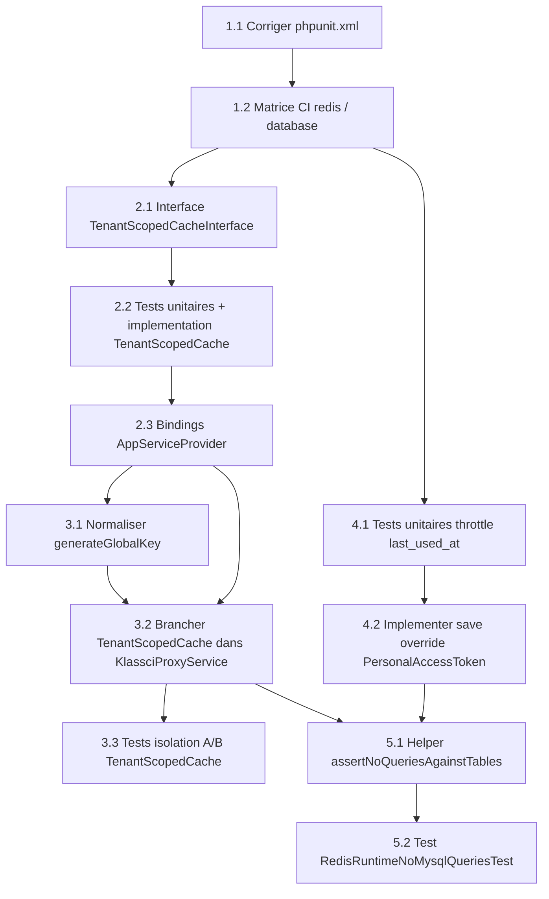

# Plan d'implémentation

Ce plan convertit `design.md` (approuvé) en tâches de code exécutables par un agent codeur, en mode TDD, dans l'ordre de livraison défini par la section « Migration Strategy » de `design.md` (a → e). Aucune tâche de déploiement VPS, de bascule `.env` production ou de mesure k6 réelle n'est incluse (Requirement 9, hors périmètre).

**Décision sur la documentation opérationnelle** : la section « Migration Strategy » de `design.md` prévoit une étape (f) d'ajout d'une section §8 dans `docs/DEPLOYMENT_OPS.md`. Cette étape est **exclue** de ce plan de tâches : chaque tâche de ce document doit avoir un objectif clair de *code* (écrire/modifier/tester du code), et la rédaction d'une procédure opérationnelle en Markdown n'en est pas un — c'est un livrable de documentation, explicitement hors du format autorisé ici. Elle devra être traitée séparément, hors de ce tasks.md.

---

- [x] 1. Fiabiliser la configuration de test et instrumenter la CI en matrice Redis / database
  - Rend vérifiable tout le reste du plan avant d'écrire la moindre ligne de code métier (design.md, Migration Strategy, étape a).
  - _Requirements: 6.1, 6.4, 7.1, 7.2_

  - [x] 1.1 Corriger la variable d'environnement de cache dans `phpunit.xml`
    - Remplacer `<env name="CACHE_DRIVER" value="array"/>` (`phpunit.xml:43`) par trois lignes `<env name="CACHE_STORE" value="database"/>`, `<env name="SESSION_DRIVER" value="database"/>`, `<env name="QUEUE_CONNECTION" value="database"/>`, sans attribut `force`, afin qu'un export shell (`CACHE_STORE=redis`, etc.) prenne le dessus sans dupliquer le fichier.
    - Ne pas ajouter `force="true"` : PHPUnit ne doit réécrire ces variables que si elles ne sont pas déjà positionnées par l'environnement d'exécution (CI ou shell développeur).
    - Vérifier par une exécution locale de `php artisan test` (sans variable d'environnement exportée) que la suite tourne bien en mode dégradé `database` par défaut et passe à 100 % (preuve du Requirement 6.4 sur la suite existante).
    - _Requirements: 6.1, 6.4, 7.2_

  - [x] 1.2 Transformer le job `tests` de `.github/workflows/security.yml` en matrice à deux jambes `redis` / `database`
    - Modifier le job `tests` (`.github/workflows/security.yml:287-327`) pour ajouter une `strategy: matrix: leg: [redis, database]`.
    - Jambe `redis` : positionner `CACHE_STORE=redis`, `SESSION_DRIVER=redis`, `QUEUE_CONNECTION=redis` dans `env:` du step `Run PHPUnit suite`, et déclarer un service `redis: image: redis:7-alpine` exposé sur `127.0.0.1:6379` ; ajouter au step `Prepare sqlite test database` (ou un step dédié) l'attente de disponibilité du service avant de lancer PHPUnit.
    - Jambe `database` : aucun override d'environnement nécessaire (valeurs par défaut de `phpunit.xml` corrigées en tâche 1.1).
    - Les deux jambes doivent exécuter `vendor/bin/phpunit --no-coverage` et réussir à 100 %.
    - _Requirements: 1.2, 6.4, 7.1, 7.2_

- [x] 2. Créer l'abstraction `TenantScopedCache` (interface, implémentation, tests unitaires, câblage DI)
  - Composant neuf et isolé (design.md, Migration Strategy, étape b) : zéro risque de régression sur l'existant tant qu'il n'est pas branché dans `KlassciProxyService` (tâche 3).
  - _Requirements: 4.1, 4.2, 4.3, 4.4, 4.5, 10.1, 10.2_

  - [x] 2.1 Définir l'interface `App\Services\Cache\TenantScopedCacheInterface`
    - Créer `app/Services/Cache/TenantScopedCacheInterface.php` avec les deux méthodes `remember(string $key, int $ttl, \Closure $callback): mixed` et `flushTenant(): void`, conformément au contrat de `design.md` (section « Data Models »).
    - Documenter en PHPDoc que cette interface est la seule dépendance de cache que le code métier (ex. `KlassciProxyService`) doit connaître — jamais l'implémentation concrète.
    - _Requirements: 4.1, 4.2, 10.1_

  - [x] 2.2 Écrire les tests unitaires `TenantScopedCacheTest` puis implémenter `TenantScopedCache` pour les faire passer
    - Créer `tests/Unit/Services/Cache/TenantScopedCacheTest.php` : mocker `Illuminate\Cache\Repository` (Mockery) pour couvrir séparément la branche `supportsTags() === true` (le `remember()` doit passer par `tags(["institution_{id}"])`) et la branche `supportsTags() === false` (le `remember()` doit être appelé sans tag) ; couvrir aussi `flushTenant()` dans les deux branches (appel `tags([...])->flush()` si supporté, no-op + log `warning` sinon) ; couvrir le cas tenant non résolu (`TenantManager` renvoie `null` → tag `institution_none`, Requirement 4.4).
    - Implémenter `app/Services/Cache/TenantScopedCache.php` (implémente `TenantScopedCacheInterface`), constructeur `(private readonly \Illuminate\Cache\Repository $cache, private readonly TenantManager $tenantManager, private readonly LoggerInterface $logger)`, méthode privée de résolution du tag `institution_{id}` / `institution_none`, et logique `supportsTags()` conforme à `design.md` (section « Components and Interfaces », classe `TenantScopedCache`).
    - Faire passer tous les tests de `TenantScopedCacheTest` sans dépendre d'un vrai store cache (uniquement des doubles Mockery).
    - _Requirements: 4.1, 4.2, 4.4, 4.5, 7.5, 10.1, 10.2_

  - [x] 2.3 Enregistrer les bindings du conteneur dans `AppServiceProvider::register()`
    - Ajouter dans `app/Providers/AppServiceProvider.php::register()` (à la suite du binding `ShellExecutorInterface` existant, `app/Providers/AppServiceProvider.php:29`) : `$this->app->bind(\Illuminate\Cache\Repository::class, fn ($app) => $app->make(\Illuminate\Contracts\Cache\Repository::class));` puis `$this->app->bind(\App\Services\Cache\TenantScopedCacheInterface::class, \App\Services\Cache\TenantScopedCache::class);`.
    - Vérifier (test unitaire ou assertion dans un test existant du provider, ou instanciation via `app()` dans un test) que `app(TenantScopedCacheInterface::class)` résout bien une instance de `TenantScopedCache` sans erreur de résolution du constructeur.
    - _Requirements: 4.1, 10.1_

- [x] 3. Brancher `TenantScopedCache` dans `KlassciProxyService` et normaliser `KlassciCacheKeyStrategy`
  - Câblage réel du composant neuf dans le code métier existant + correction de l'incohérence de normalisation de clé (design.md, Migration Strategy, étape c).
  - _Requirements: 2.1, 2.2, 2.3, 4.1, 4.2, 4.3, 4.5_

  - [x] 3.1 Écrire le test de régression sur `generateGlobalKey()` puis normaliser `KlassciCacheKeyStrategy`
    - Ajouter au test existant ou créer un test unitaire ciblé sur `App\Services\Klassci\KlassciCacheKeyStrategy::generateGlobalKey()` (`app/Services/Klassci/KlassciCacheKeyStrategy.php:54-61`) qui vérifie qu'un `$endpoint` contenant un `/` produit une clé où le `/` est remplacé par `-` (même transformation que `generateUserTokenKey()`, `app/Services/Klassci/KlassciCacheKeyStrategy.php:78`).
    - Modifier `generateGlobalKey()` pour appliquer `str_replace('/', '-', $endpoint)` avant interpolation dans la clé retournée, alignant son format sur `generateUserTokenKey()`.
    - Faire passer le test ajouté ainsi que les tests existants sur `KlassciCacheKeyStrategy` (`tests/Feature/KlassciCacheInvalidationTest.php`) sans régression sur le format de clé pour les endpoints sans `/`.
    - _Requirements: 2.2_

  - [x] 3.2 Remplacer `CacheRepository` par `TenantScopedCacheInterface` dans le constructeur de `KlassciProxyService`
    - Modifier `app/Services/KlassciProxyService.php:71` : remplacer le paramètre `private readonly CacheRepository $cache` par `private readonly TenantScopedCacheInterface $tenantCache`, retirer l'import `Illuminate\Contracts\Cache\Repository` devenu inutile, ajouter l'import `App\Services\Cache\TenantScopedCacheInterface`.
    - Mettre à jour l'appel dans `get()` (`app/Services/KlassciProxyService.php:99`) : `$this->cache->remember(...)` devient `$this->tenantCache->remember(...)`.
    - Mettre à jour l'appel dans `requestWithUserToken()` (`app/Services/KlassciProxyService.php:182`) : même remplacement `$this->cache->remember(...)` → `$this->tenantCache->remember(...)`.
    - Modifier `invalidateCache()` (`app/Services/KlassciProxyService.php:201-205`) pour ajouter `$this->tenantCache->flushTenant();` après l'appel existant à `$this->cacheKeys->invalidateTenant($endpoint);`, avant `$this->memo->clear();`.
    - _Requirements: 4.1, 4.2, 4.3, 10.1_

  - [x] 3.3 Écrire les tests d'isolation multi-tenant A/B pour `TenantScopedCache` branché
    - Créer `tests/Feature/Cache/TenantScopedCacheIsolationTest.php` avec deux `Institution::factory()` (A et B), suivant le style de `tests/Feature/AdminAnalyticsCacheIsolationTest.php`.
    - Test `test_flush_tenant_purges_only_the_current_institution_tag` : écrire une clé taguée pour l'institution A et une pour l'institution B (store `array`, qui supporte les tags), appeler `flushTenant()` sous le tenant A résolu via `TenantManager::set()`, vérifier que la clé de A a disparu et que celle de B reste lisible.
    - Test `test_flush_tenant_on_untaggable_store_does_not_throw_and_leaves_entries` : forcer `CACHE_STORE=database` en `setUp()` (seul moyen d'exercer réellement `supportsTags() === false`), appeler `flushTenant()`, vérifier l'absence d'exception, vérifier que l'entrée existante reste lisible (pas de corruption), et vérifier qu'un `warning` a été loggé (logger fake injecté ou `Log::shouldReceive`).
    - _Requirements: 4.2, 4.5, 6.2, 7.3_

- [x] 4. Réduire la fréquence d'écriture de `last_used_at` via un throttle sur `PersonalAccessToken`
  - Élimine l'écriture MySQL systématique à chaque requête authentifiée (design.md, Migration Strategy, étape d).
  - _Requirements: 5.1, 5.2, 5.3, 5.4_

  - [x] 4.1 Écrire les tests unitaires du throttle avant l'implémentation
    - Créer `tests/Unit/Models/PersonalAccessTokenLastUsedThrottleTest.php` avec trois cas : `test_save_skips_write_when_last_used_less_than_five_minutes_ago` (token existant, `last_used_at` fixé à `now()->subMinutes(2)` en base, puis `forceFill(['last_used_at' => now()])->save()`, assertion via `fresh()` que la valeur stockée reste `now()->subMinutes(2)`) ; `test_save_writes_when_last_used_at_least_five_minutes_ago` (même scénario avec `subMinutes(5)->subSecond(1)`, assertion que la nouvelle valeur est persistée) ; `test_save_is_never_throttled_on_token_creation` (un `createToken()` frais doit toujours persister son premier `last_used_at`).
    - Ces trois tests doivent échouer avant l'implémentation de la tâche 4.2 (comportement actuel : écriture systématique, pas de throttle).
    - _Requirements: 5.1, 5.2, 7.4, 7.5_

  - [x] 4.2 Implémenter l'override `save()` avec throttle 5 minutes dans `PersonalAccessToken`
    - Modifier `app/Models/PersonalAccessToken.php` : ajouter une méthode `public function save(array $options = [])` qui, avant d'appeler `parent::save($options)`, retourne `true` sans écriture si et seulement si `$this->exists === true`, `array_keys($this->getDirty()) === ['last_used_at']`, et `$this->getOriginal('last_used_at')` n'est pas `null` et est postérieur à `now()->subMinutes(5)`.
    - Dans tous les autres cas (création, autre champ modifié en même temps, seuil de 5 minutes atteint ou dépassé, `last_used_at` original `null`), déléguer normalement à `parent::save($options)`.
    - Faire passer les trois tests de la tâche 4.1 sans les modifier.
    - _Requirements: 5.1, 5.2, 5.3, 5.4, 10.1_

- [x] 5. Vérifier automatiquement l'absence de requêtes SQL superflues sur `cache` / `sessions` / `jobs`
  - Preuve automatisée, en local/CI, de l'objectif de réduction de charge (design.md, Migration Strategy, étape e).
  - _Requirements: 8.1, 8.2, 8.3_

  - [x] 5.1 Ajouter le helper `assertNoQueriesAgainstTables()` dans `tests/TestCase.php`
    - Ajouter dans `tests/TestCase.php` (actuellement 21 lignes, largement sous 300 lignes) une méthode protégée `assertNoQueriesAgainstTables(array $tables, \Closure $action): void` qui enregistre un listener `DB::listen`, exécute `$action()`, collecte toute requête SQL dont le texte contient (insensible à la casse) un des noms de table fournis, puis fait échouer l'assertion si la liste collectée n'est pas vide (message d'erreur listant les requêtes fautives).
    - _Requirements: 8.1, 8.3_

  - [x] 5.2 Écrire le test `RedisRuntimeNoMysqlQueriesTest` exerçant un GET authentifié réel
    - Créer `tests/Feature/Performance/RedisRuntimeNoMysqlQueriesTest.php` : dans `setUp()`, forcer `config()->set('cache.default', 'redis')` et `config()->set('session.driver', 'redis')` (ou variables d'environnement équivalentes), et `markTestSkipped()` explicitement si aucune connexion Redis n'est joignable dans l'environnement d'exécution (jamais un échec silencieux).
    - Authentifier un utilisateur via un token Sanctum dont `last_used_at` est déjà récent (pour ne pas polluer la mesure via le throttle de la tâche 4.2), suivant le pattern `RefreshDatabase` + `Institution::factory()` + `TenantManager::set()` déjà utilisé dans `tests/Feature/KlassciCacheInvalidationTest.php`.
    - Appeler un endpoint GET authentifié réel de l'application (ex. liste des séances) à l'intérieur d'un appel à `$this->assertNoQueriesAgainstTables(['cache', 'sessions', 'jobs'], fn () => ...)` (helper de la tâche 5.1), et vérifier que l'assertion passe (zéro requête SQL sur ces trois tables).
    - _Requirements: 8.1, 8.2, 8.3_

---

## Diagramme de dépendances entre tâches

