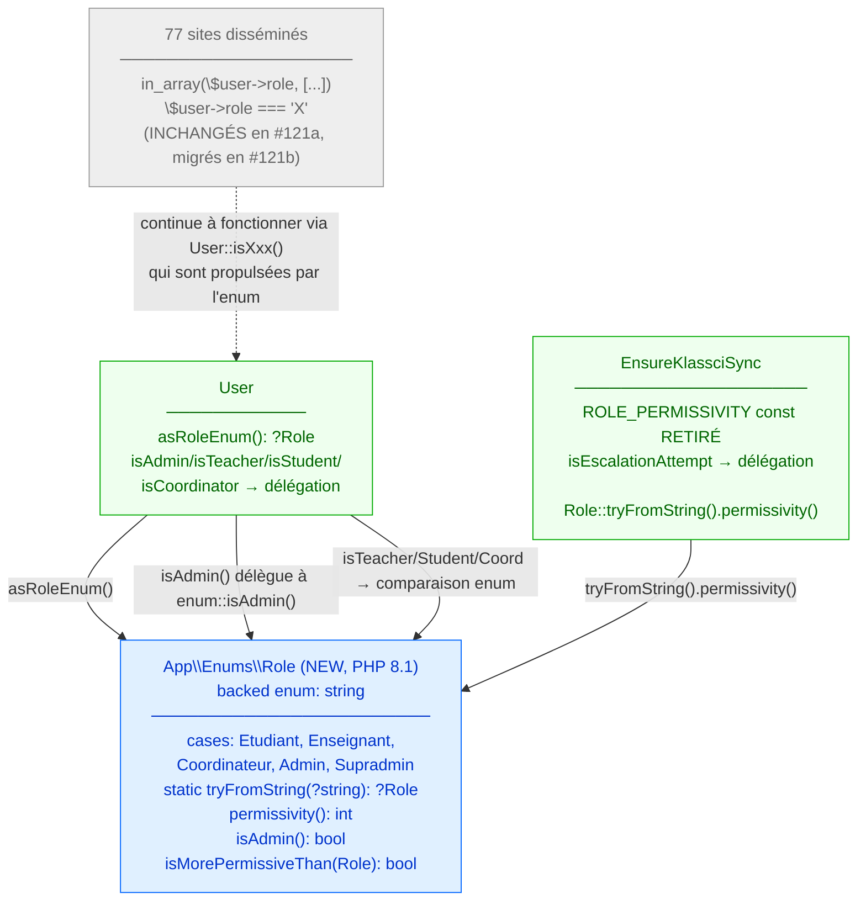

# Role enum — Design

> Spec parent : [`requirements.md`](./requirements.md). Issue : [#121](https://github.com/ouedraogoissouf2012/lms_backend/issues/121).
>
> Précédents : refactor pur DRY, comportement runtime strictement préservé. Migration en **2 PRs** : #121a (cette PR — enum + 2 sites racine) + #121b (follow-up — 77 sites disséminés).

## 1. Architecture cible



**Invariant central** : la liste des rôles + leurs alias EN/FR + leur hiérarchie sont **définis exactement à 1 endroit** (`App\Enums\Role`). Les 2 sites racine (`User::isXxx()` et `EnsureKlassciSync::isEscalationAttempt()`) consomment l'enum. Les 77 sites disséminés restent inchangés mais voient le bénéfice via la délégation des méthodes `User::isXxx()`.

| Site | Avant #121a | Après #121a |
|---|---|---|
| `App\Enums\Role` | n'existe pas | source de vérité unique |
| `User::isAdmin/isTeacher/isStudent/isCoordinator` | listes chaînes hardcodées | délégation enum |
| `EnsureKlassciSync::ROLE_PERMISSIVITY` | const 10 entrées | retiré, délégation enum |
| 77 sites `in_array/===` disséminés | listes hardcodées | inchangés (PR #121b) |

## 2. Implémentation de l'enum

### 2.1 Fichier `app/Enums/Role.php`

```php
<?php

declare(strict_types=1);

namespace App\Enums;

/**
 * Source de vérité unique pour les rôles utilisateurs LMS.
 *
 * Issue #121 — Centralise les rôles, leurs alias EN/FR et leur hiérarchie de
 * permissivité. Pattern PHP 8.1 backed enum.
 *
 * ## Alias EN/FR acceptés par `tryFromString`
 *
 * La colonne DB `users.role` peut historiquement contenir n'importe lequel
 * de ces variants (selon la convention KLASSCI au moment du sync). Pour
 * éviter une migration data invasive, l'enum accepte tous les alias
 * connus en lecture, et normalise vers la case canonique FR.
 *
 *  - 'etudiant'      ou 'student'        → Role::Etudiant
 *  - 'enseignant'    ou 'teacher'        → Role::Enseignant
 *  - 'coordinateur'  ou 'coordinator'    → Role::Coordinateur
 *  - 'admin'         ou 'administrateur' → Role::Admin
 *  - 'supradmin'     ou 'superAdmin'     → Role::Supradmin
 *
 * ## Surface API
 *
 * L'enum n'expose PAS `isTeacher/isStudent/isCoordinator` — ces helpers
 * restent sur le model `User` pour cohérence avec `User::isAdmin()` (qui est
 * la 4ᵉ méthode du model). L'enum ne fournit que `isAdmin()` car le concept
 * « administratif » a une définition élargie (`Admin` + `Supradmin`).
 *
 * ## Migration progressive (issue #121)
 *
 *  - **PR #121a (current)** : 2 sites racine refactorés (User helpers +
 *    EnsureKlassciSync). 77 sites disséminés inchangés — fonctionnent via
 *    les méthodes `User::isXxx()` qui sont désormais propulsées par l'enum.
 *  - **PR #121b (follow-up)** : migration des 77 sites disséminés vers
 *    `$user->isXxx()` ou `$user->asRoleEnum() === Role::X`.
 *
 * @see \App\Models\User::asRoleEnum
 * @see \App\Http\Middleware\EnsureKlassciSync::isEscalationAttempt
 */
enum Role: string
{
    case Etudiant     = 'etudiant';
    case Enseignant   = 'enseignant';
    case Coordinateur = 'coordinateur';
    case Admin        = 'admin';
    case Supradmin    = 'supradmin';

    /**
     * Convertit un string brut (DB ou payload KLASSCI) en case enum,
     * en acceptant les alias EN/FR. Retourne `null` si la valeur n'est
     * pas reconnue (jamais d'exception — fail-soft).
     */
    public static function tryFromString(?string $value): ?self
    {
        return match ($value) {
            'etudiant', 'student'                  => self::Etudiant,
            'enseignant', 'teacher'                => self::Enseignant,
            'coordinateur', 'coordinator'          => self::Coordinateur,
            'admin', 'administrateur'              => self::Admin,
            'supradmin', 'superAdmin'              => self::Supradmin,
            default                                => null,
        };
    }

    /**
     * Hiérarchie de permissivité (1 = moins permissif, 5 = le plus).
     * Utilisée par `EnsureKlassciSync` pour qualifier les findings de
     * divergence de rôle (cf. issue #34 / PR #118).
     */
    public function permissivity(): int
    {
        return match ($this) {
            self::Etudiant     => 1,
            self::Enseignant   => 2,
            self::Coordinateur => 3,
            self::Admin        => 4,
            self::Supradmin    => 5,
        };
    }

    /**
     * Retourne true pour `Admin` et `Supradmin`, false pour les 3 autres.
     */
    public function isAdmin(): bool
    {
        return $this === self::Admin || $this === self::Supradmin;
    }

    /**
     * Retourne true ssi le rôle actuel est strictement plus permissif que
     * l'autre. Utilisé par le middleware pour qualifier les tentatives
     * d'escalade silencieuse (cf. issue #34 PR #118).
     */
    public function isMorePermissiveThan(self $other): bool
    {
        return $this->permissivity() > $other->permissivity();
    }
}
```

### 2.2 Bilan structurel de l'enum

| Métrique | Valeur |
|---|---|
| LOC trait | ~110 (dont ~70 PHPDoc) |
| Cases | 5 |
| Méthodes publiques | 4 (`tryFromString`, `permissivity`, `isAdmin`, `isMorePermissiveThan`) |
| Dépendances | 0 (aucun import) |
| Couplage | aucun — value object pur |

## 3. Migration `User` model

### 3.1 Avant

```php
public function isTeacher(): bool {
    return $this->role === 'enseignant' || $this->role === 'teacher';
}
public function isCoordinator(): bool {
    return $this->role === 'coordinateur' || $this->role === 'coordinator';
}
public function isStudent(): bool {
    return $this->role === 'etudiant' || $this->role === 'student';
}
public function isAdmin(): bool {
    return in_array($this->role, ['admin', 'administrateur', 'superAdmin', 'supradmin']);
}
```

### 3.2 Après

```php
use App\Enums\Role;

// ...

public function asRoleEnum(): ?Role
{
    return Role::tryFromString($this->role);
}

public function isTeacher(): bool
{
    return $this->asRoleEnum() === Role::Enseignant;
}

public function isCoordinator(): bool
{
    return $this->asRoleEnum() === Role::Coordinateur;
}

public function isStudent(): bool
{
    return $this->asRoleEnum() === Role::Etudiant;
}

public function isAdmin(): bool
{
    return $this->asRoleEnum()?->isAdmin() ?? false;
}
```

### 3.3 Comportement runtime — preuve de l'équivalence

| Input `$this->role` | `isTeacher()` avant | `isTeacher()` après |
|---|---|---|
| `'enseignant'` | true | `tryFromString → Enseignant; ===` true |
| `'teacher'` | true | `tryFromString → Enseignant; ===` true |
| `'etudiant'` | false | `tryFromString → Etudiant; ===` false |
| `null` | false (`null === 'enseignant'` false) | `tryFromString(null) → null; null === Enseignant` false |
| `'inconnu'` | false | `tryFromString('inconnu') → null; null === Enseignant` false |

Idem pour `isStudent`, `isCoordinator`, `isAdmin`. **Comportement runtime strictement préservé.**

## 4. Migration `EnsureKlassciSync`

### 4.1 Avant (PR #118)

```php
private const ROLE_PERMISSIVITY = [
    'etudiant'       => 1,
    'student'        => 1,
    'enseignant'     => 2,
    'teacher'        => 2,
    'coordinateur'   => 3,
    'coordinator'    => 3,
    'admin'          => 4,
    'administrateur' => 4,
    'superAdmin'     => 5,
    'supradmin'      => 5,
];

private function isEscalationAttempt(?string $lmsRole, ?string $klassciRole): bool
{
    $lmsLevel     = self::ROLE_PERMISSIVITY[$lmsRole] ?? 0;
    $klassciLevel = self::ROLE_PERMISSIVITY[$klassciRole] ?? 0;
    return $klassciLevel > $lmsLevel;
}
```

### 4.2 Après

```php
use App\Enums\Role;

// ROLE_PERMISSIVITY const SUPPRIMÉE (10 lignes)

private function isEscalationAttempt(?string $lmsRole, ?string $klassciRole): bool
{
    $lmsLevel     = Role::tryFromString($lmsRole)?->permissivity() ?? 0;
    $klassciLevel = Role::tryFromString($klassciRole)?->permissivity() ?? 0;
    return $klassciLevel > $lmsLevel;
}
```

### 4.3 Comportement runtime — preuve de l'équivalence

| Inputs `(lmsRole, klassciRole)` | Avant (ROLE_PERMISSIVITY) | Après (enum) |
|---|---|---|
| `('etudiant', 'supradmin')` | `1 vs 5` → `true` | `1 vs 5` → `true` |
| `('teacher', 'admin')` | `2 vs 4` → `true` | `Enseignant.permissivity=2 vs Admin.permissivity=4` → `true` |
| `('admin', 'etudiant')` | `4 vs 1` → `false` | `4 vs 1` → `false` |
| `(null, 'admin')` | `0 vs 4` → `true` | `0 vs 4` → `true` |
| `('inconnu', 'supradmin')` | `0 vs 5` → `true` | `0 vs 5` → `true` |

**Comportement runtime strictement préservé** — validé par les 10 tests Unit existants `EnsureKlassciSyncTest`.

## 5. Implementation outline

| Step | Fichier | Action | LOC net |
|---|---|---|---|
| 1 | `app/Enums/Role.php` | NEW — enum 5 cases + 4 méthodes + PHPDoc complet | +110 |
| 2 | `app/Models/User.php` | Add `use App\Enums\Role;` + `asRoleEnum()` + refacto 4 méthodes `isXxx()` | ~−5 (gain 2-line methods) |
| 3 | `app/Http/Middleware/EnsureKlassciSync.php` | Retire `ROLE_PERMISSIVITY` const + refacto `isEscalationAttempt` + `use App\Enums\Role;` | ~−10 |
| 4 | `tests/Unit/Enums/RoleTest.php` | NEW — 9 tests Unit pure de l'enum | +180 |
| 5 | `tests/Feature/Models/UserRoleHelpersTest.php` | NEW — 1 test Feature régression model | +60 |

**Bilan code applicatif** : ~+95 LOC net (l'enum apporte 110 LOC, les 2 sites racine perdent 15 LOC). Tests : +240 LOC. La PR est **chirurgicale** (5 fichiers).

## 6. Testing strategy

### 6.1 Tests Unit pure de l'enum

`tests/Unit/Enums/RoleTest.php` utilise `PHPUnit\Framework\TestCase` (pas `Tests\TestCase`) car l'enum n'a aucune dépendance DB/HTTP. **Pas de `RefreshDatabase`**, **pas de `pdo_pgsql` requis** → ces tests s'exécutent en local sans skip.

Structure :

```php
<?php
declare(strict_types=1);
namespace Tests\Unit\Enums;

use App\Enums\Role;
use PHPUnit\Framework\TestCase;

final class RoleTest extends TestCase
{
    public function test_cases_have_expected_canonical_values(): void { ... }
    public function test_try_from_string_returns_canonical_for_fr_input(): void { ... }
    public function test_try_from_string_normalizes_en_aliases(): void { ... }
    public function test_try_from_string_normalizes_admin_aliases(): void { ... }
    public function test_try_from_string_returns_null_for_invalid(): void { ... }
    public function test_permissivity_returns_expected_levels(): void { ... }
    public function test_is_admin_returns_true_for_admin_and_supradmin_only(): void { ... }
    public function test_is_more_permissive_than(): void { ... }
    public function test_is_more_permissive_than_same_role_returns_false(): void { ... }
}
```

9 tests, ~180 LOC.

### 6.2 Test Feature régression du model

`tests/Feature/Models/UserRoleHelpersTest.php` — vérifie que `User::isAdmin/isTeacher/isStudent/isCoordinator()` retournent les bons booléens pour les 10 alias historiques + cas null/invalid. Nécessite DB (factory User), donc Feature avec `RefreshDatabase` et skip `pdo_pgsql`.

Structure :

```php
<?php
declare(strict_types=1);
namespace Tests\Feature\Models;

use App\Models\User;
use Illuminate\Foundation\Testing\RefreshDatabase;
use Tests\TestCase;

final class UserRoleHelpersTest extends TestCase
{
    use RefreshDatabase;

    public function test_user_helpers_handle_all_canonical_and_alias_roles(): void
    {
        $cases = [
            ['etudiant',      'student' => true,  'teacher' => false, 'coord' => false, 'admin' => false],
            ['student',       'student' => true,  'teacher' => false, 'coord' => false, 'admin' => false],
            ['enseignant',    'student' => false, 'teacher' => true,  'coord' => false, 'admin' => false],
            // ... 10 lignes ...
        ];
        // assertions
    }
}
```

1 test piloté par data provider mental, ~60 LOC.

### 6.3 Régression cross-suite

Les tests pré-existants suivants exercent indirectement les méthodes `User::isXxx()` ou `EnsureKlassciSync` :
- `tests/Unit/Middleware/EnsureKlassciSyncTest.php` (10 tests #118) — preuve middleware OK
- `tests/Feature/Security/*` (28 tests cumulés) — preuve `isAdmin()` etc. OK
- `tests/Feature/LMS/*` (50 tests) — régression LMS générale

**Aucune modification attendue** sur ces tests.

## 7. PHPStan

Aucune nouvelle violation attendue :
- L'enum est typé strictement (PHP 8.1 backed enum)
- `asRoleEnum(): ?Role` est typé
- Les comparaisons `=== Role::X` sont type-safe
- `tryFromString(?string): ?self` accepte le null
- Pas de `mixed` ni de `array<string, mixed>` ajouté

PHPStan peut **vérifier au type-checking** que `Role::X` est une valeur valide — un dev qui tape `Role::Hacker` aura une erreur statique. Gain net.

## 8. Alternatives rejetées

### 8.1 Cast Eloquent `'role' => Role::class` sur User

Option : utiliser le `$casts` Laravel pour caster automatiquement `users.role` en `Role`.

**Rejeté** parce que :
- Casserait la rétrocompatibilité — la DB contient des alias EN (`student`, `teacher`, `superAdmin`, `administrateur`) qui ne sont **pas** des valeurs canoniques de l'enum
- `Role::from('student')` lèverait une `ValueError`
- Migration de données invasive nécessaire (UPDATE de toutes les lignes pour normaliser en FR canonique) — risque downtime + perte de données si erreur
- `User::asRoleEnum()` helper est plus flexible : accepte les alias historiques sans casser la DB

À ré-évaluer dans une PR ops dédiée si la DB est un jour normalisée.

### 8.2 Méthode `Role::isTeacher/isStudent/isCoordinator()` sur l'enum

Option : exposer les 4 helpers booléens sur l'enum directement, supprimer ceux sur `User`.

**Rejeté** parce que :
- Inflate la surface API de l'enum (4 méthodes en plus)
- Crée 2 chemins (`$role->isTeacher()` vs `$user->isTeacher()`) — un dev ne sait plus lequel utiliser
- `User::isXxx()` est l'API idiomatique pour des checks sur un user donné — la garder simplifie le code appelant (vs `$user->asRoleEnum()?->isTeacher() ?? false` plus verbose)
- `Role::isAdmin()` est l'exception justifiée car le concept admin est élargi (2 cases) — pas un simple `=== Role::Etudiant`

### 8.3 Migration des 77 sites disséminés dans cette PR

Option : refactoriser tous les `in_array($user->role, [...])` et `=== 'X'` dans une seule PR.

**Rejeté** parce que :
- Touche ~15 fichiers controllers/FormRequests
- Risque PR ingérable et audit complexe
- Aucune valeur sécuritaire ajoutée (le bénéfice DRY est déjà capté par les 2 sites racine)
- Les 77 sites continuent à fonctionner identiquement via les méthodes `User::isXxx()` désormais propulsées par l'enum

Découpe en 2 PRs préservant la simplicité de revue : PR #121a (cette PR) + PR #121b follow-up.

### 8.4 Enum non-backed (cases purs sans valeur string)

Option : `enum Role { case Etudiant; case Enseignant; ... }` sans `: string`.

**Rejeté** parce que :
- Empêche la sérialisation/désérialisation automatique vers/depuis la DB
- Casse `Role::tryFromString` qui dépend d'un mapping string → case
- Le pattern « backed string » est cohérent avec les autres enums Laravel/PHP communs (statuts, types, etc.)

### 8.5 Statique sur User : `User::ADMIN_ROLES = ['admin', ...]` constante

Option : extraire seulement la liste des rôles admin en constante du model User (suggestion LOW spec-security #129).

**Rejeté** parce que :
- Ne capte que 25% du bénéfice DRY (les 3 autres méthodes `isTeacher/Student/Coordinator` restent dispersées)
- Le const de 4 strings hardcodées reste une dette technique vs un enum typé
- L'enum est une solution architecturale supérieure pour le même effort

### 8.6 Cast custom Eloquent qui normalise (`RoleCast extends CastsAttributes`)

Option : créer un cast Eloquent custom qui appelle `Role::tryFromString` au getter, et stocke la `value` canonique au setter.

**Rejeté pour cette PR** parce que :
- Élargit le scope (création + tests d'un cast)
- Mute silencieusement les valeurs en DB au save → effet de bord inattendu
- À considérer post-migration data si jamais la colonne `users.role` est normalisée

## 9. Projection volume 10×

| Métrique | Aujourd'hui | 10× (200k users) | Tient ? |
|---|---|---|---|
| `tryFromString` (match expression) | ~50ns | ~50ns | ✅ O(1) |
| `permissivity` (match expression) | ~50ns | ~50ns | ✅ O(1) |
| `User::isAdmin()` (1 indirect + 1 `===`) | ~100ns | ~100ns | ✅ |
| Middleware `isEscalationAttempt` (2 `tryFromString` + 2 `permissivity` + `>`) | ~250ns | ~250ns | ✅ |
| Comparaison vs hash lookup `ROLE_PERMISSIVITY` const | ~equivalente | ~equivalente | ✅ neutre |

**Aucun goulet** introduit. Le `match` PHP 8.x est ultra-rapide (compile en jump table). L'enum est neutre voire plus rapide que le `in_array` (pas de loop).

## 10. Critère d'invalidation (Q15 — manifest)

Cette solution est **à invalider et reconcevoir** SI :

1. **Un nouveau rôle émerge qui ne correspond à aucun des 5 canoniques** (`directeur`, `parent`, `secretaire`). L'enum doit être étendu — c'est exactement le bénéfice ciblé (1 fichier à modifier). **Pas d'invalidation**, juste l'évolution prévue.
2. **Les alias EN sont supprimés de la DB** (migration data unifiant tout en FR). `tryFromString` peut être simplifié vers `Role::from()` natif. Évolution naturelle.
3. **Le pattern de hiérarchie change** (`Coordinateur` devient plus permissif que `Admin` pour son département). REQ-3 `permissivity` à reconcevoir, mais l'enum reste utile.
4. **La colonne DB `users.role` est migrée vers ENUM type PostgreSQL** avec contrainte stricte. `tryFromString` devient `Role::from()`. Évolution naturelle.

Aucune de ces 4 conditions n'est connue aujourd'hui.

## 11. Cohérence avec PRODUCTION_STANDARDS

| §  | Règle | Statut |
|---|---|---|
| §1.1 Zero God Code | Enum 110 LOC (dont 70 PHPDoc) — très loin de 300 | PASS |
| §1.2 Sécurité Absolue | Refactor pur — invariants #34 préservés verbatim | PASS |
| §1.3 Tests Obligatoires | 9 Unit + 1 Feature régression + 28 Security pré-existants | PASS |
| §1.4 Performance | Match PHP 8.x O(1), neutre vs hash lookup const | PASS |
| §1.5 Validation systématique | N/A (refactor interne, pas d'input client) | N/A |
| §1.6 SOLID — SRP | Enum = 1 responsabilité (vérité des rôles) | PASS |
| §1.6 SOLID — OCP | Ajouter un rôle = ajouter 1 case + 2 lignes match | PASS |
| §1.6 SOLID — DIP | Enum stateless, value object pur — pas de Facade | PASS |
| §1.6 DRY | 3+ sites dispersés → 1 source de vérité | PASS atteint |
| §6 Une seule solution | 6 alternatives rejetées avec raison §8 | PASS |
