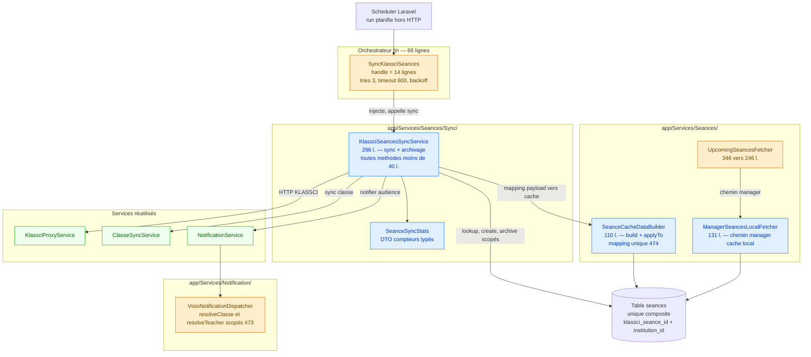
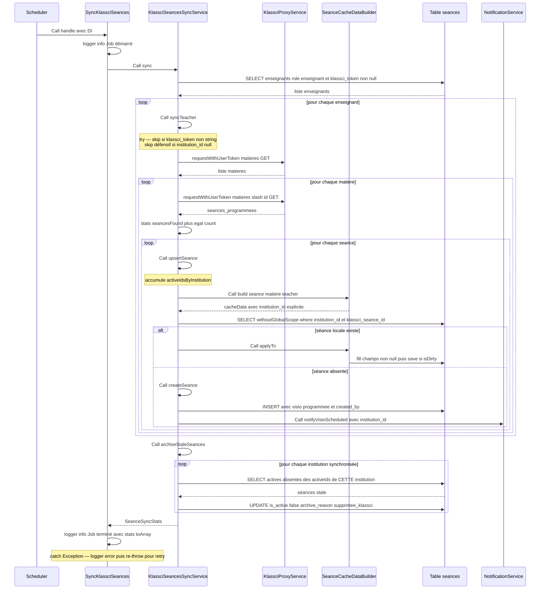
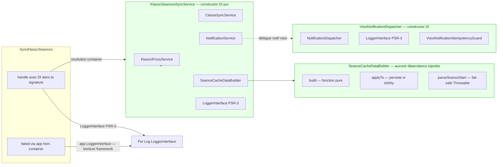
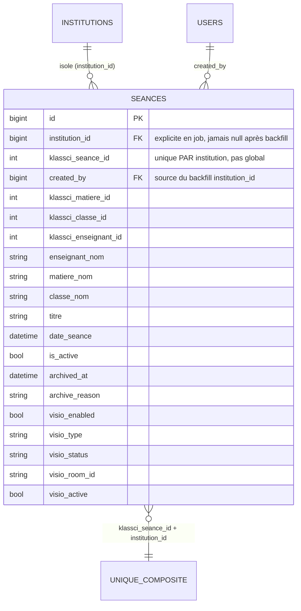
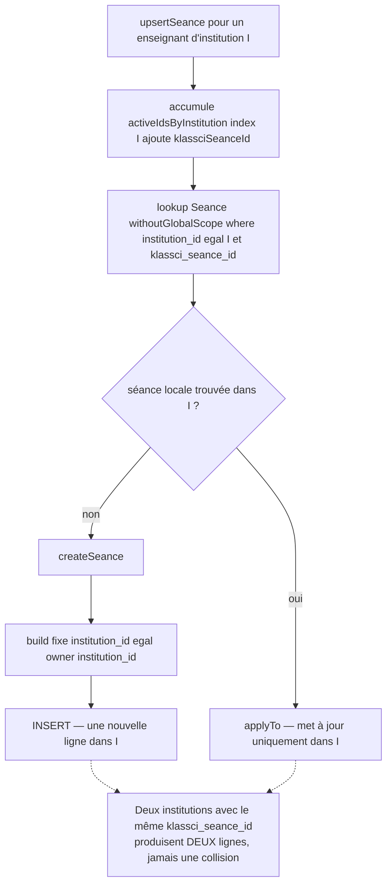
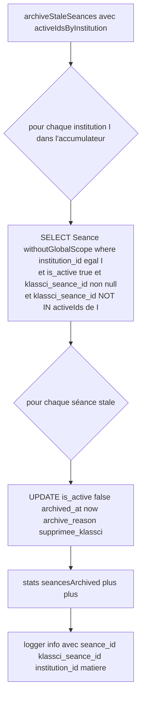
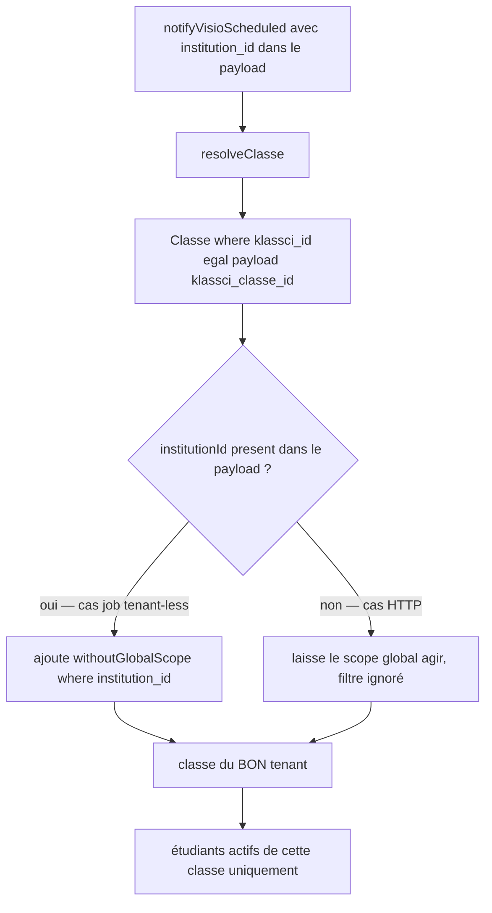
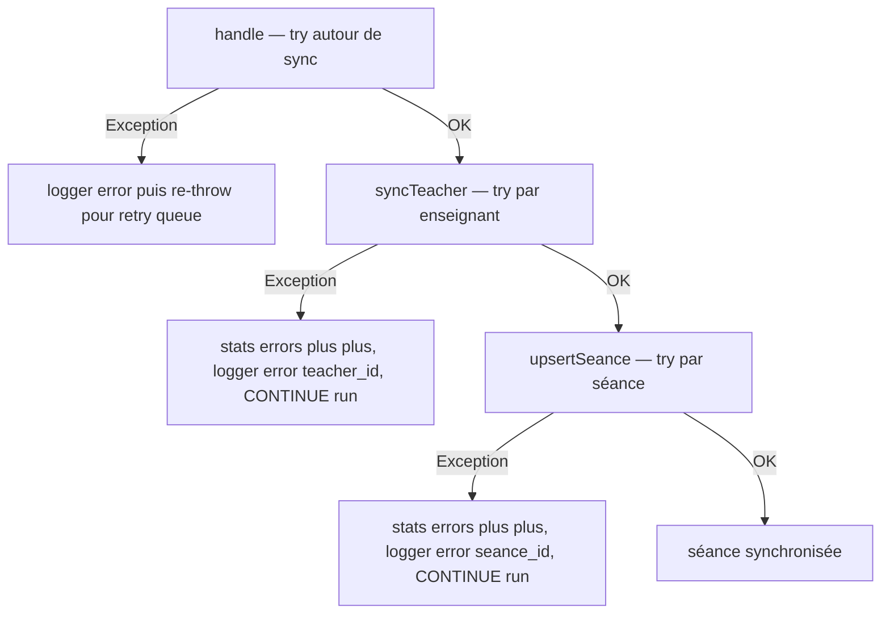

# Durcissement du cache local des séances KLASSCI — Design

> Spec parent : [`requirements.md`](./requirements.md). Épique : [#472](https://github.com/ouedraogoissouf2012/lms_backend/issues/472) · sous-issues [#473](https://github.com/ouedraogoissouf2012/lms_backend/issues/473) / [#474](https://github.com/ouedraogoissouf2012/lms_backend/issues/474) / [#475](https://github.com/ouedraogoissouf2012/lms_backend/issues/475). PR : #484.
>
> **Nature de ce document : régularisation RÉTROACTIVE.** Le code décrit ci-dessous est **déjà livré**, testé (13 tests dédiés au chantier verts, dans une suite séances+services+jobs+notifications de 60 tests) et poussé. Ce design documente **fidèlement l'architecture réelle du code en dépôt** — chaque assertion est citée `fichier:ligne` et vérifiée par `Read`. Il ne conçoit pas une architecture future : il décrit celle qui existe sur la branche `fix/475-decouper-handle`.
>
> Suit le pattern **MANIFESTE_REFACTORING.md** (orchestrateur fin + collaborateurs DI), identique en nature au précédent `auth-controller-refactor` (god-controller → collaborateurs) et au pattern `KlassciUserSynchronizer` (PERF-02).

## 1. Vue d'ensemble architecturale

### 1.1 Le problème résolu

Le job planifié `SyncKlassciSeances` synchronise périodiquement les séances programmées de chaque enseignant depuis les backends KLASSCI vers un cache local (table `seances`). Trois défauts coexistaient sur ce chemin :

| # | Défaut | Nature | Correctif structurel |
|---|--------|--------|----------------------|
| #473 | `klassci_seance_id` en `unique()` **global** + `institution_id` écrit implicitement + lookups/archivage/notifications non scopés | Sécurité **HIGH** (collision + fuite cross-tenant) | Unique composite `(klassci_seance_id, institution_id)` + scoping explicite partout |
| #474 | `localCacheData` / `updateLocalCacheData` / `parseSeanceStart` **dupliqués** entre job et `TeachingSeancesFetcher` | Architecture **HIGH** (DRY) | Collaborateur unique `SeanceCacheDataBuilder` |
| #475 | `SyncKlassciSeances::handle()` ~150 lignes (triple boucle + archivage) | §5 (méthodes ≤40 l.) | Extraction dans `KlassciSeancesSyncService` + DTO `SeanceSyncStats` |

### 1.2 Invariant central — le scope global est inerte dans le job

Le trait `BelongsToInstitution` applique une stratégie **« log-and-no-op »** (choix CRITICAL-06, docblock `BelongsToInstitution.php:12-50`). Hors requête HTTP — cas de **tout job de fond** — aucun tenant n'est résolu par `TenantManager`, donc :

- le global scope de lecture **ne s'applique pas** et logge un warning au lieu de filtrer (`BelongsToInstitution.php:66-85`) ;
- le hook `creating` **n'auto-positionne pas** `institution_id` (`BelongsToInstitution.php:87-110`), et respecte toute affectation explicite, même à `null` (`BelongsToInstitution.php:91-93`).

**Corollaire, qui gouverne tout ce design** : dans le job, l'isolation par institution doit être **portée par le code métier** — `institution_id` écrit explicitement, lookups et archivage scopés à la main via `withoutGlobalScope('institution')->where('institution_id', …)`. Le trait ne peut pas y suppléer, par conception.

### 1.3 Cartographie des composants livrés



**Principe de partition** : le job ne fait plus que de l'orchestration (log début, `sync()`, log fin, re-throw). Toute la logique métier (triple boucle + archivage + résilience) vit dans `KlassciSeancesSyncService`, testable en isolation sans queue. Le mapping payload→cache, autrefois dupliqué, est centralisé dans `SeanceCacheDataBuilder`, injecté aux deux call-sites (job via le service, et `TeachingSeancesFetcher`).

## 2. Diagrammes de flux

### 2.1 Diagramme de séquence — un run de synchronisation



Trace de vérification : `sync()` `KlassciSeancesSyncService.php:49-67` ; `syncTeacher()` `:75-108` ; `syncMatiereSeances()` `:116-138` ; `upsertSeance()` `:148-185` ; `createSeance()` `:195-231` ; `archiveStaleSeances()` `:239-265` ; orchestration job `SyncKlassciSeances.php:33-49`.

### 2.2 Diagramme de composants — dépendances injectées



**Invariant DI (§1.6 D)** : aucun collaborateur métier n'utilise de Facade. Le service injecte 5 dépendances par constructeur (`KlassciSeancesSyncService.php:37-43`). Les seules Facades subsistantes sont des **bordures framework documentées** : `failed()` résout `LoggerInterface` via `app()` car appelé hors container (`SyncKlassciSeances.php:58-59`, pattern `AutoCloseEmptySeances` #209), et la migration utilise `DB::` / `Schema::` (contexte migration, hors code métier).

## 3. Modèles de données

### 3.1 Contrainte d'unicité composite

La migration `2026_07_20_000001_fix_seances_unique_per_institution.php` remplace l'unicité globale par une unicité **composite par tenant**, en deux volets indissociables :

**Volet 1 — Backfill** (`up()` `:30-37`). Avant de poser la contrainte, les séances orphelines (`institution_id IS NULL AND created_by IS NOT NULL`) sont rattachées à l'institution de leur créateur via une sous-requête corrélée sur `users.institution_id`. Justification citée au docblock (`:16-21`) : en SQL, **plusieurs `NULL` restent permis dans un index unique** — sans backfill, deux lignes `(NULL, 42)` resteraient acceptées et la contrainte ne protégerait pas l'historique.

**Volet 2 — Bascule d'index** (`up()` `:40-46`) :

```
DROP  seances_klassci_seance_id_unique          (klassci_seance_id)
CREATE seances_klassci_institution_unique       (klassci_seance_id, institution_id)
```

`down()` restaure exactement l'état antérieur (`:49-55`) — réversibilité stricte. Le choix est **identique** aux migrations sœurs `fix_matieres_unique_per_institution` (#258) et `fix_classes_unique_per_institution` : même défaut, même remède (traçabilité inter-domaines, docblock `:11-14`).



### 3.2 DTO `SeanceSyncStats`

Objet mutable typé qui remplace l'`array<string,int>` autrefois passé **par référence** à travers toutes les méthodes (fragile, non typé). Chaque méthode reçoit l'objet et incrémente les compteurs pertinents.

| Propriété (`SeanceSyncStats.php`) | Type | Incrémentée dans |
|-----------------------------------|------|------------------|
| `teachersChecked` (`:16`) | `int` | `syncTeacher()` `:78` |
| `seancesFound` (`:18`) | `int` | `syncMatiereSeances()` `:133` |
| `seancesNew` (`:20`) | `int` | `createSeance()` `:205` |
| `notificationsSent` (`:22`) | `int` | `createSeance()` `:230` |
| `seancesArchived` (`:24`) | `int` | `archiveStaleSeances()` `:255` |
| `errors` (`:26`) | `int` | `syncTeacher()` `:102`, `upsertSeance()` `:179` |

`toArray()` (`:33-43`) expose une vue tableau avec les **mêmes clés snake_case que l'historique du job** (`teachers_checked`, `seances_found`, …) pour préserver le format des logs structurés consommés en aval.

### 3.3 Forme du `cacheData` produit par `SeanceCacheDataBuilder::build()`

Fonction **pure** (aucune I/O), citée `SeanceCacheDataBuilder.php:42-64`. Elle projette `(payload séance, payload matière, enseignant propriétaire)` vers le tableau de cache local :

| Clé du cacheData | Source | Note |
|------------------|--------|------|
| `institution_id` | `$owner->institution_id` (`:54`) | **explicite** — pilier de l'isolation #473 |
| `klassci_matiere_id` | `matiere['id']` via `toInt` (`:55`) | |
| `klassci_classe_id` | `seance['classe']['id']` via `toInt` (`:56`) | `null` toléré (classe absente) |
| `klassci_enseignant_id` | `$owner->klassci_id` (`:57`) | |
| `enseignant_nom` | `$owner->name` (`:58`) | |
| `matiere_nom` | `matiere['nom'] ?? matiere['libelle']` (`:51,:59`) | fallback `libelle` |
| `classe_nom` | `seance['classe']['nom']` (`:60`) | |
| `titre` | = `matiere_nom` (`:61`) | |
| `date_seance` | `parseSeanceStart(heureDebut, date)` (`:62`) | `Carbon` ou `null` |

`build()` ne produit **pas** les champs visio ni `created_by` : ceux-ci sont ajoutés par fusion `+` uniquement à la **création** dans `createSeance()` (`KlassciSeancesSyncService.php:209-217`), pas à la mise à jour — une séance existante ne se voit jamais réinitialiser sa configuration visio.

## 4. Processus métier

### 4.1 Flux A — Isolation tenant à l'écriture

Pilier de #473. Trois écritures se coordonnent pour garantir qu'une séance ne peut jamais franchir la frontière d'un tenant, **malgré le scope global inerte** :



Points de vérification :
- Lookup scopé : `Seance::withoutGlobalScope('institution')->where('institution_id', $institutionId)->where('klassci_seance_id', $klassciSeanceId)` (`KlassciSeancesSyncService.php:165-168`).
- `institution_id` explicite via le builder (`SeanceCacheDataBuilder.php:54`), jamais délégué au hook `creating` (inerte).
- Champs de création visio fixés à l'INSERT : `visio_enabled=true`, `visio_type='jitsi'`, `visio_status='programmee'`, `visio_room_id=SecureVisioRoomIdGenerator::make()`, `visio_active=false`, `created_by=$teacher->id` (`:209-217`).
- La contrainte composite (§3.1) est le **filet DB** : même si un bug logique laissait passer une collision, l'index refuse physiquement deux `(klassci_seance_id, institution_id)` identiques.

### 4.2 Flux B — Archivage tenant par tenant

Une séance disparue de KLASSCI doit être archivée, mais **jamais** parce qu'elle est absente du run d'un **autre** tenant. Le run accumule `array<int $institutionId, array<int> $activeIds>` (`KlassciSeancesSyncService.php:53-54`, alimenté `:163`), puis l'archivage itère par institution :



Invariant clé (`:242-247`) : le `whereNotIn` est **borné aux `activeIds` de l'institution courante uniquement**. Une institution B jamais synchronisée dans ce run n'apparaît pas dans l'accumulateur → **aucune** de ses séances n'est parcourue → aucun archivage cross-tenant possible. C'est exactement ce que verrouille `test_archival_does_not_cross_tenants` (§6).

### 4.3 Flux C — Résolution d'audience de notification scopée

Quand `createSeance()` notifie l'audience (`:223-229`), il passe `institution_id` dans le payload. `VisioNotificationDispatcher` s'en sert pour scoper la résolution de la classe et de l'enseignant — indispensable car `klassci_id` de classe **n'est pas unique entre tenants** :



Points de vérification :
- `resolveClasse()` scopé quand `institution_id` présent (`VisioNotificationDispatcher.php:226-236`).
- `resolveTeacher()` applique le même scope conditionnel (`:199-214`).
- `institutionId()` extrait un `int` du payload ou `null` (`:244-249`) : en contexte HTTP le payload n'a pas d'`institution_id`, le filtre explicite est **ignoré** et le scope global (alors actif) suffit — le comportement HTTP est préservé à l'identique.

## 5. Stratégie de gestion des erreurs

Le refactor **préserve à l'identique** la résilience de l'ancien job. Elle est structurée sur trois niveaux imbriqués + deux fail-safes de mapping :



| Niveau | Emplacement | Comportement |
|--------|-------------|--------------|
| **Fatal (job)** | `SyncKlassciSeances.php:41-48` | `catch \Exception` → log error + **re-throw** pour laisser jouer le retry (`tries=3`, `backoff=[60,300,900]`) |
| **Enseignant** | `KlassciSeancesSyncService.php:101-107` | `catch \Exception` → `stats->errors++`, log, **poursuit** les autres enseignants |
| **Séance** | `:178-184` | `catch \Exception` → `stats->errors++`, log, **poursuit** les autres séances |

**Fail-safes de mapping** (dégradation silencieuse plutôt que crash) :

1. **`parseSeanceStart()` fail-safe** (`SeanceCacheDataBuilder.php:90-109`) : `Carbon::parse($heureDebut)` si présent/parsable ; sinon `Carbon::parse($date)->startOfDay()` ; sinon `null`. Les `Throwable` de parsing sont **avalés** (`catch (\Throwable)` `:95`, `:103`) — une date KLASSCI malformée ne fait jamais échouer le run, elle produit une `date_seance` nulle.
2. **Skip défensif `institution_id` null** (`KlassciSeancesSyncService.php:90-93`) : un enseignant sans `institution_id` (donnée incohérente) est **skippé** sans synchronisation — l'`institution_id` étant la clé de tenant, on refuse d'écrire une séance non isolable plutôt que de créer une ligne orpheline.
3. **Guard de type `klassci_token`** (`:82-85`) : bien que la query filtre déjà `whereNotNull('klassci_token')`, un guard `is_string()` narrower le type pour l'analyse statique et reste défensif.

**`applyTo()` — écriture idempotente et conservatrice** (`SeanceCacheDataBuilder.php:73-84`) : n'écrase que les champs **non-null** (`null` KLASSCI = préserver l'existant, `:75`) et ne persiste que si `isDirty()` (`:81-82`) — pas d'écriture DB inutile, pas de `updated_at` bruité sur un run sans changement.

## 6. Stratégie de test

Le refactor est **purement structurel** : la garantie centrale est l'absence de régression comportementale, plus des tests neufs verrouillant les invariants d'isolation qui n'existaient pas avant. Couverture réelle observée (comptée par `Read` des fichiers) :

| Fichier de test | Tests | Ce qu'il verrouille |
|-----------------|-------|---------------------|
| `tests/Feature/LMS/Seances/SeanceTenantIsolationTest.php` | **4** | Isolation à **2 institutions** (§1.3) |
| `tests/Feature/Services/Seances/KlassciSeancesSyncServiceTest.php` | **2** | Service en **isolation** (sans le job) |
| `tests/Feature/Services/Seances/SeanceCacheDataBuilderTest.php` | **7** | Mapping + edge cases du builder |

Ces 13 tests dédiés s'inscrivent dans la suite plus large séances+services+jobs+notifications (60 tests, REQ-11), qui inclut notamment `AsyncVisioNotificationTest` (5 tests, notifications visio idempotentes) et `TeachingSeancesParallelFetchTest` (chemin fetcher partageant le builder).

### 6.1 Isolation à 2 institutions (le cœur de #473)

`SeanceTenantIsolationTest` reproduit le **job réel tenant-less** (`runSyncJob()` `:232-238` instancie `SyncKlassciSeances` et appelle `handle()` avec DI, après `TenantManager::reset()`) :

- `test_same_klassci_seance_id_creates_isolated_rows_per_institution` (`:49-97`) : deux enseignants d'institutions A/B synchronisent tous deux `klassci_seance_id=42` → **2 lignes distinctes**, chacune avec son `institution_id`, son `enseignant_nom`, son `created_by` — **aucun écrasement croisé**.
- `test_archival_does_not_cross_tenants` (`:104-133`) : A synchronise sa séance 42 ; la séance 99 de B (hors run de A) reste `is_active=true` — **pas d'archivage cross-tenant** (Flux B).
- `test_teaching_fetcher_isolates_same_seance_id_across_tenants` (`:142-181`) : prouve que le **chemin HTTP** (`TeachingSeancesFetcher`, tenant résolu) isole aussi via le scope global — confirme que le builder partagé produit un comportement cohérent des deux côtés (#474).
- `test_notifications_do_not_leak_across_tenants` (`:188-230`) : deux classes de tenants différents partagent `klassci_id=700` ; le sync de A ne notifie **que** `studentA`, jamais `studentB` (Flux C).

### 6.2 Service en isolation

`KlassciSeancesSyncServiceTest` teste `sync()` **sans le job**, en mockant `KlassciProxyService` (`MockInterface`) et en laissant tourner les services `final` réels (`ClasseSyncService`, `NotificationService`) sur base vide :

- `test_sync_creates_new_seance_and_reports_stats` (`:33-69`) : stats cohérentes (`teachersChecked=1`, `seancesFound=1`, `seancesNew=1`, `errors=0`) + `assertDatabaseHas` sur `(klassci_seance_id=42, institution_id)`.
- `test_sync_archives_seance_absent_from_klassci` (`:71-107`) : une séance préexistante absente du sync passe à `is_active=false`, `archive_reason='supprimee_klassci'`.

### 6.3 Contrat du builder

`SeanceCacheDataBuilderTest` verrouille le mapping et ses edge cases : payload complet (`:35-59`), fallback `libelle` quand `nom` absent (`:61-71`), date seule sans `heure_debut` (`:73-83`), `date_seance` null sans date (`:85-94`), classe absente tolérée (`:96-106`), `applyTo` n'écrase que le non-null et persiste une seule fois (`:108-124`), `applyTo` no-op quand tout est null — `updated_at` inchangé (`:126-137`).

## 7. Décisions de conception

| Décision | Choix retenu | Alternative écartée | Justification |
|----------|--------------|---------------------|---------------|
| **`institution_id` écrit explicitement** | Positionné depuis `$owner->institution_id` dans `build()` (`SeanceCacheDataBuilder.php:54`) | Compter sur le hook `creating` de `BelongsToInstitution` | Le hook est un **no-op délibéré hors HTTP** (`BelongsToInstitution.php:97-107`). En job, il ne posera jamais `institution_id` → lignes `NULL` → collisions. L'explicite est la **seule** option correcte, pas un excès de prudence. |
| **DTO `SeanceSyncStats`** | Objet mutable typé passé aux méthodes | `array<string,int>` passé **par référence** | L'array par ref est fragile (clés non typées, PHPStan aveugle, mutation implicite difficile à tracer). Le DTO donne un contrat typé, `toArray()` préserve le format de log. Coût : 44 lignes — justifié par 6 compteurs traversant 4 méthodes. |
| **Extraction en service dédié** | `KlassciSeancesSyncService` + job orchestrateur fin | Garder la logique dans `handle()` | `handle()` faisait ~150 l. (triple boucle + archivage), viole §5, **intestable en isolation** (nécessitait de dispatch le job complet). Pattern `AutoCloseEmptySeances` (#209) : logique métier → service injecté, job = bordure. Résultat : `handle()`=14 l., service testé sans queue. |
| **Collaborateur de mapping unique** | `SeanceCacheDataBuilder` injecté aux 2 call-sites | Laisser `localCacheData`/`parseSeanceStart` dupliqués | Le mapping était **byte-à-byte identique** entre job et `TeachingSeancesFetcher` (~40 l.). Une correction sur un seul chemin aurait divergé les `Seance` produites par le job planifié vs le fetch temps-réel. Source unique = divergence impossible. |
| **Scoping via `withoutGlobalScope` + `where` explicite** | Appliqué à lookup/archivage/notif | S'appuyer sur le scope global | Scope global inerte en job (cf. §1.2). Le scope explicite est la traduction directe de l'invariant : sans lui, archivage et notifications fuiteraient cross-tenant. |
| **`applyTo` préserve les champs null** | `array_filter(... !== null)` + `isDirty()` | Écraser tous les champs | Un champ KLASSCI `null` signifie « pas de valeur fournie », pas « effacer ». Écraser détruirait des données locales valides. `isDirty()` évite l'écriture DB inutile. |

### 7.1 Compromis assumé — `createSeance()` à 8 paramètres

`createSeance()` (`KlassciSeancesSyncService.php:195-204`) prend **8 paramètres** (`$teacher`, `$teacherToken`, `$institutionId`, `$matiere`, `$seanceArr`, `$klassciSeanceId`, `$cacheData`, `$stats`). C'est un **code smell mineur** (long parameter list), **assumé et tracé ici** au titre de la dette explicite (règle globale : jamais de raccourci masqué).

Raison de ne pas le résoudre : la méthode est **privée** et a un **unique appelant** (`upsertSeance()` `:177`). Introduire un DTO « contexte de création » (`SeanceCreationContext`) pour 8 arguments passés une seule fois serait de la **sur-ingénierie** (YAGNI) — un objet créé, rempli et lu immédiatement en aval, sans autre consommateur. Le compromis : lisibilité locale légèrement dégradée vs. une abstraction sans valeur de réutilisation. Si un 2ᵉ appelant apparaissait, ou si la liste dépassait un usage privé, le DTO deviendrait justifié — c'est le critère de bascule. Toutes les méthodes restent **≤ 40 lignes** (§5) ; seule la signature est longue.

## 8. Conformité PRODUCTION_STANDARDS (vérifiée)

| Contrôle | État réel | Preuve |
|----------|-----------|--------|
| Fichiers ≤ 300 l. | `SyncKlassciSeances` 66, `KlassciSeancesSyncService` 266, `SeanceCacheDataBuilder` 110, `SeanceSyncStats` 44, `ManagerSeancesLocalFetcher` 131, `UpcomingSeancesFetcher` 246 | `Read` de chaque fichier |
| Méthodes ≤ 40 l. | `handle()` 14 l. ; toutes les méthodes du service découpées à responsabilité unique | §2.1, §5 |
| Aucune Facade en code métier | Service = 5 deps DI (`:37-43`), builder/dispatcher DI | §2.2 ; bordures `failed()` via `app()` + migration `DB::` documentées |
| Isolation multi-tenant | scoping explicite lookup/archivage/notif, unique composite | §4, §3.1 |
| DRY mapping | source unique `SeanceCacheDataBuilder` | §7 |

## 9. Divergences constatées entre requirements et code

Vérification systématique des 12 REQ contre le code livré : **aucune divergence de comportement ou de structure**. Les fichiers, lignes, signatures et invariants cités dans `requirements.md` correspondent au code lu. Deux remarques mineures de **granularité de comptage**, sans impact sur la validité :

1. **« 60 tests » vs tests directement attribuables au chantier.** Le requirements (REQ-11, ligne 174) annonce « 60 tests verts » pour la suite *séances + services + jobs + notifications*. Les tests **spécifiquement créés/dédiés à ce chantier** que j'ai pu lire et compter sont au nombre de **13** (4 isolation + 2 service + 7 builder). Les 47 restants sont des tests **connexes préexistants ou périphériques** de cette même suite (notifications visio, fetch parallèle, routing, requests séances…), qui restent verts et couvrent le périmètre élargi. Ce n'est pas une contradiction — c'est la différence entre « tests du chantier » et « tests de la suite fonctionnelle qui l'entoure ». Ce design documente honnêtement la couverture **directement attribuable** (§6).

2. **Numérotation de lignes des notifications.** REQ-5 cite `VisioNotificationDispatcher.php:226-236` (resolveClasse), `:199-214` (resolveTeacher), `:244-249` (institutionId). Le fichier lu confirme exactement ces plages (`resolveClasse` `:226-236`, `resolveTeacher` `:199-214`, `institutionId` `:244-249`). **Concordance parfaite.**

Conclusion : le code livré reflète fidèlement les 12 REQ. Le seul écart est sémantique (« 60 tests de la suite » ≠ « 13 tests du chantier »), déjà cohérent avec le libellé « suite séances + services + jobs + notifications » du requirements.

---

**Does the design look good? If so, we can move on to the implementation plan.**

(Note : ce chantier étant une régularisation rétroactive — code déjà livré en PR #484 — l'« implementation plan » consisterait à documenter la séquence de commits déjà poussés plutôt qu'un plan prospectif. Dis-moi si tu veux que je produise ce `tasks.md` rétrospectif ou si le design suffit pour clore la spec.)
