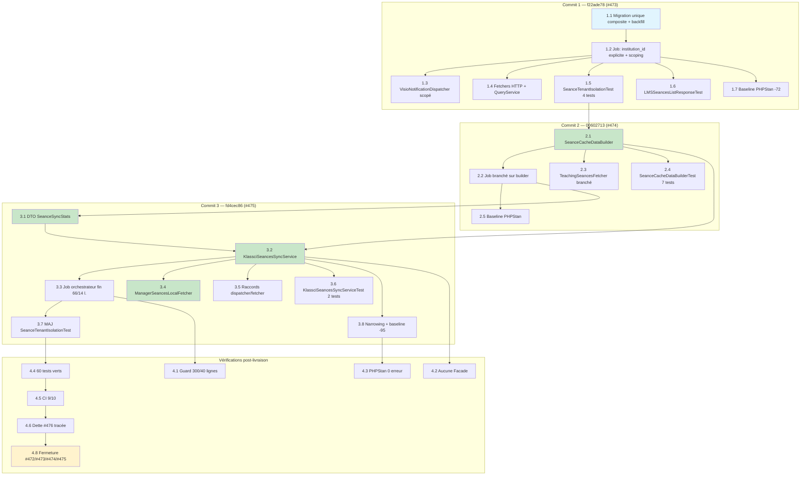

# Durcissement du cache local des séances KLASSCI — Plan d'implémentation

> Spec parent : [`requirements.md`](./requirements.md) + [`design.md`](./design.md).
> Épique : [#472](https://github.com/ouedraogoissouf2012/lms_backend/issues/472) · sous-issues [#473](https://github.com/ouedraogoissouf2012/lms_backend/issues/473) / [#474](https://github.com/ouedraogoissouf2012/lms_backend/issues/474) / [#475](https://github.com/ouedraogoissouf2012/lms_backend/issues/475). PR : #484.
>
> **Nature de ce document : régularisation RÉTROACTIVE.** Le code est **déjà implémenté, testé et poussé**. Ce `tasks.md` ne planifie pas un travail futur : il **documente fidèlement la séquence réelle des 3 commits atomiques** livrés sur la branche `fix/475-decouper-handle`. Toutes les tâches sont donc marquées **faites `[x]`**, et chaque tâche trace le(s) requirement(s) qu'elle satisfait.
>
> Structure retenue : **1 PR (#484), 3 commits atomiques**, un par sous-issue, dans l'ordre de dépendance #473 → #474 → #475.

## Séquence des commits livrés

| # | Commit | Sous-issue | Objet |
|---|--------|------------|-------|
| 1 | `f22ade78` | [#473](https://github.com/ouedraogoissouf2012/lms_backend/issues/473) | `fix(seances): isoler les séances par tenant` — migration unique composite + backfill, `institution_id` explicite, lookup/archivage/notifications scopés, tests d'isolation 2 institutions |
| 2 | `00602713` | [#474](https://github.com/ouedraogoissouf2012/lms_backend/issues/474) | `refactor(seances): extraire SeanceCacheDataBuilder` — collaborateur de mapping unique (DRY), job et `TeachingSeancesFetcher` branchés dessus |
| 3 | `fd4cec86` | [#475](https://github.com/ouedraogoissouf2012/lms_backend/issues/475) | `refactor(seances): decouper SyncKlassciSeances via un service` — `KlassciSeancesSyncService` + `SeanceSyncStats` + `ManagerSeancesLocalFetcher`, `handle()` 150→14 lignes, narrowing PHPStan |

---

## Commit 1 — `f22ade78` : isolation multi-tenant (#473)

**Scope** : poser le filet DB (unique composite + backfill) et porter l'isolation par le code métier là où le scope global est inerte (job hors HTTP). C'est le commit **sécurité HIGH** ; il crée la garantie d'isolation avant tout refactor structurel.

- [x] 1.1 Créer la migration `database/migrations/2026_07_20_000001_fix_seances_unique_per_institution.php`
  - Backfiller `institution_id` des séances `institution_id IS NULL AND created_by IS NOT NULL` via sous-requête corrélée sur `users.institution_id` du créateur (`up()` :30-37)
  - Remplacer l'unique global `seances_klassci_seance_id_unique` par l'unique composite `seances_klassci_institution_unique` sur `(klassci_seance_id, institution_id)` (`up()` :40-46)
  - Implémenter `down()` réversible : drop composite, recréation de l'unique global (`down()` :49-55)
  - Aligner le choix de conception sur les migrations sœurs `fix_matieres_unique_per_institution` (#258) et `fix_classes_unique_per_institution`
  - _Requirements: REQ-1_

- [x] 1.2 Écrire `institution_id` explicitement + scoper lookup/création/archivage dans `app/Jobs/SyncKlassciSeances.php` (état de ce commit, avant le découpage #475)
  - Positionner `institution_id` explicitement depuis l'enseignant propriétaire (le hook `creating` du trait étant un no-op hors HTTP)
  - Skipper défensivement un enseignant sans `institution_id` (clé de tenant absente)
  - Scoper le lookup : `Seance::withoutGlobalScope('institution')->where('institution_id', …)->where('klassci_seance_id', …)`
  - Accumuler `activeIdsByInstitution` et n'archiver que tenant par tenant, scopé `withoutGlobalScope('institution')->where('institution_id', …)`
  - Persister à la création : `visio_enabled=true`, `visio_type='jitsi'`, `visio_status='programmee'`, `visio_room_id` via `SecureVisioRoomIdGenerator::make()`, `visio_active=false`, `created_by`
  - _Requirements: REQ-2, REQ-3, REQ-4_

- [x] 1.3 Scoper les notifications visio par institution dans `app/Services/Notification/VisioNotificationDispatcher.php`
  - `resolveClasse()` : ajouter `withoutGlobalScope('institution')->where('institution_id', …)` quand `institution_id` est présent dans le payload (`klassci_id` de classe non unique entre tenants)
  - `resolveTeacher()` : appliquer le même scope conditionnel
  - Préserver le comportement HTTP : payload sans `institution_id` ⇒ filtre explicite ignoré, scope global actif suffit
  - _Requirements: REQ-5_

- [x] 1.4 Propager le scoping tenant dans les fetchers HTTP impactés (`TeachingSeancesFetcher.php`, `UpcomingSeancesFetcher.php`) et `SeancesListQueryService.php`
  - Garantir la cohérence de projection des `Seance` isolées côté chemin temps-réel (walk KLASSCI)
  - _Requirements: REQ-2, REQ-5_

- [x] 1.5 Écrire les tests d'isolation à 2 institutions `tests/Feature/LMS/Seances/SeanceTenantIsolationTest.php` (4 tests)
  - `test_same_klassci_seance_id_creates_isolated_rows_per_institution` : même `klassci_seance_id=42` ⇒ 2 lignes distinctes, aucun écrasement croisé
  - `test_archival_does_not_cross_tenants` : la séance d'un tenant hors run n'est jamais archivée (Flux B)
  - `test_teaching_fetcher_isolates_same_seance_id_across_tenants` : le chemin HTTP isole aussi via scope global
  - `test_notifications_do_not_leak_across_tenants` : seul l'étudiant du bon tenant est notifié (Flux C)
  - `runSyncJob()` reproduit le job réel tenant-less (`TenantManager::reset()` + `handle()` avec DI)
  - _Requirements: REQ-11_

- [x] 1.6 Ajouter le test de non-régression de la réponse liste `tests/Feature/LMS/Seances/LMSSeancesListResponseTest.php`
  - Verrouiller la forme de réponse legacy après scoping (aucune régression de contrat frontend)
  - _Requirements: REQ-11_

- [x] 1.7 Nettoyer `phpstan-baseline.neon` des entrées devenues obsolètes par ce commit (−72 lignes)
  - _Requirements: REQ-12_

---

## Commit 2 — `00602713` : collaborateur de mapping unique (#474)

**Scope** : éliminer la duplication byte-à-byte du mapping payload→cache entre le job et `TeachingSeancesFetcher` en la centralisant dans un collaborateur unique, injecté aux deux call-sites. Purement DRY ; aucun changement de comportement observable.

- [x] 2.1 Créer `app/Services/Seances/SeanceCacheDataBuilder.php` (110 lignes, aucune dépendance injectée)
  - `build(array $seance, array $matiere, User $owner): array` — **fonction pure** (aucune I/O), positionne `institution_id` explicitement depuis `$owner->institution_id`, mappe `klassci_matiere_id` / `klassci_classe_id` / `klassci_enseignant_id` / `enseignant_nom` / `matiere_nom` (fallback `libelle`) / `classe_nom` / `titre` / `date_seance`
  - `applyTo(Seance $seance, array $cacheData): void` — n'écrase que les champs non-null (`null` KLASSCI = préserver l'existant), ne persiste que si `isDirty()`
  - `parseSeanceStart()` fail-safe : `Carbon::parse($heureDebut)` si parsable, sinon `Carbon::parse($date)->startOfDay()`, sinon `null` ; avale les `Throwable` sans propager
  - Ne produit pas les champs visio ni `created_by` (ajoutés par fusion `+` à la seule création)
  - _Requirements: REQ-6, REQ-2_

- [x] 2.2 Brancher `app/Jobs/SyncKlassciSeances.php` sur `SeanceCacheDataBuilder`
  - Supprimer les méthodes dupliquées `localCacheData` / `updateLocalCacheData` / `parseSeanceStart` du job
  - Injecter le builder et déléguer le mapping (job −93 lignes sur ce commit)
  - _Requirements: REQ-6_

- [x] 2.3 Brancher `app/Services/Seances/TeachingSeancesFetcher.php` sur `SeanceCacheDataBuilder`
  - Supprimer la ré-implémentation locale du mapping (−70 lignes) ; injecter le builder
  - Source unique = divergence de mapping impossible entre job planifié et fetch temps-réel
  - _Requirements: REQ-6_

- [x] 2.4 Écrire les tests de contrat du builder `tests/Feature/Services/Seances/SeanceCacheDataBuilderTest.php` (7 tests)
  - Payload complet ; fallback `libelle` quand `nom` absent ; date seule sans `heure_debut` ; `date_seance` null sans date ; classe absente tolérée ; `applyTo` n'écrase que le non-null et persiste une seule fois ; `applyTo` no-op quand tout est null (`updated_at` inchangé)
  - _Requirements: REQ-6, REQ-11_

- [x] 2.5 Ajuster `phpstan-baseline.neon` (entrée résiduelle) et confirmer PHPStan level 9 = 0 erreur
  - _Requirements: REQ-12_

---

## Commit 3 — `fd4cec86` : découpage du god-method via un service (#475)

**Scope** : sortir la logique métier de `SyncKlassciSeances::handle()` (~150 lignes, triple boucle + archivage) vers un service testable en isolation, avec un DTO de compteurs typé ; extraire aussi le chemin manager de `UpcomingSeancesFetcher` pour le repasser sous 300 lignes. Le job devient un orchestrateur fin.

- [x] 3.1 Créer le DTO `app/Services/Seances/Sync/SeanceSyncStats.php` (44 lignes)
  - Objet mutable typé remplaçant l'`array<string,int>` passé par référence : `teachersChecked`, `seancesFound`, `seancesNew`, `notificationsSent`, `seancesArchived`, `errors`
  - `toArray(): array<string,int>` exposant les mêmes clés snake_case que l'historique du job (`teachers_checked`, `seances_found`, …) pour préserver le format des logs structurés
  - _Requirements: REQ-8_

- [x] 3.2 Créer `app/Services/Seances/Sync/KlassciSeancesSyncService.php` (266 lignes, toutes méthodes ≤ 40 lignes)
  - Constructor DI pur, **aucune Facade** : `KlassciProxyService`, `ClasseSyncService`, `NotificationService`, `SeanceCacheDataBuilder`, `LoggerInterface` (PSR-3)
  - Découper en méthodes à responsabilité unique : `sync()`, `syncTeacher()`, `syncMatiereSeances()`, `upsertSeance()`, `createSeance()`, `archiveStaleSeances()`
  - Reprendre verbatim l'isolation tenant (lookup/création/archivage scopés, accumulateur `activeIdsByInstitution`, skip défensif `institution_id` null) précédemment dans le job
  - Préserver la résilience 3 niveaux : `catch \Exception` par enseignant et par séance ⇒ `stats->errors++`, log, poursuite du run
  - _Requirements: REQ-7, REQ-2, REQ-3, REQ-4, REQ-8_

- [x] 3.3 Réduire `app/Jobs/SyncKlassciSeances.php` à un orchestrateur fin (66 lignes ; `handle()` = 14 lignes)
  - `handle()` : logger le démarrage, appeler `$syncService->sync()`, logger `$stats->toArray()`, re-`throw` toute exception fatale pour laisser jouer le retry
  - Injecter `KlassciSeancesSyncService` + `LoggerInterface` dans la signature de `handle()` (résolution container), pas d'instanciation
  - Préserver les invariants de robustesse : `$tries=3`, `$timeout=600`, `$backoff=[60,300,900]`, `failed()` résolvant `LoggerInterface` via `app()` (bordure framework hors container, pattern `AutoCloseEmptySeances` #209)
  - _Requirements: REQ-9_

- [x] 3.4 Extraire `app/Services/Seances/ManagerSeancesLocalFetcher.php` (131 lignes) depuis `UpcomingSeancesFetcher`
  - `fetch()` : lire la table `seances` (`is_active=true`, `klassci_seance_id` et `date_seance` non nuls, dans la fenêtre), filtrer optionnellement par enseignant/classe, projeter via `mapLocalSeance()` dans la forme legacy calendrier/visio
  - Faire passer `UpcomingSeancesFetcher.php` de 346 à 246 lignes (§1.1 respecté)
  - _Requirements: REQ-10_

- [x] 3.5 Ajuster `VisioNotificationDispatcher.php` et `TeachingSeancesFetcher.php` pour consommer le nouveau service/DTO (raccords de signatures)
  - _Requirements: REQ-7, REQ-5_

- [x] 3.6 Écrire les tests du service en isolation `tests/Feature/Services/Seances/KlassciSeancesSyncServiceTest.php` (2 tests)
  - `test_sync_creates_new_seance_and_reports_stats` : mock `KlassciProxyService`, services `final` réels sur base vide, stats cohérentes + `assertDatabaseHas` sur `(klassci_seance_id=42, institution_id)`
  - `test_sync_archives_seance_absent_from_klassci` : séance préexistante absente ⇒ `is_active=false`, `archive_reason='supprimee_klassci'`
  - _Requirements: REQ-7, REQ-4, REQ-11_

- [x] 3.7 Mettre à jour `tests/Feature/LMS/Seances/SeanceTenantIsolationTest.php` pour la nouvelle structure de DI (job → service)
  - _Requirements: REQ-11_

- [x] 3.8 Narrower le typage et purger `phpstan-baseline.neon` (−95 lignes, 22 entrées obsolètes supprimées, aucune ajoutée)
  - PHPStan level 9 = 0 erreur
  - _Requirements: REQ-12_

---

## Vérifications post-livraison

- [x] 4.1 Guard « fichiers ≤ 300 lignes / méthodes ≤ 40 lignes » vert (§1.1 / §5)
  - `SyncKlassciSeances` 66 l. (`handle()` 14 l.), `KlassciSeancesSyncService` 266 l., `SeanceCacheDataBuilder` 110 l., `SeanceSyncStats` 44 l., `ManagerSeancesLocalFetcher` 131 l., `UpcomingSeancesFetcher` 246 l.
  - _Requirements: REQ-9, REQ-10, REQ-12_

- [x] 4.2 Aucune Facade en code métier des collaborateurs (`KlassciSeancesSyncService`, `SeanceCacheDataBuilder`, `VisioNotificationDispatcher`, `ManagerSeancesLocalFetcher`) — DI strict §1.6 D
  - Bordures framework documentées seules tolérées : `failed()` via `app()`, migration `DB::` / `Schema::`
  - _Requirements: REQ-12_

- [x] 4.3 PHPStan level 9 = 0 erreur, 22 entrées de baseline obsolètes supprimées (aucune ajoutée)
  - _Requirements: REQ-12_

- [x] 4.4 Suite séances + services + jobs + notifications = 60 tests verts (dont 13 dédiés au chantier : 4 isolation + 2 service + 7 builder)
  - _Requirements: REQ-11_

- [x] 4.5 CI 9/10 verte (le job restant documenté comme non bloquant / pré-existant, sans lien avec le chantier)
  - _Requirements: REQ-11, REQ-12_

- [x] 4.6 Dette N+1 SQL (`filterSeances()` / `enrichWithVisio()`) tracée sous **#476** — hors scope, défauts antérieurs au chantier, correction séparée pour garder un diff auditable
  - _Requirements: Hors scope (requirements.md §Hors scope)_

- [x] 4.7 Compromis assumé et tracé : `createSeance()` à 8 paramètres (méthode privée, unique appelant) — DTO différé au titre YAGNI, critère de bascule documenté (design.md §7.1)
  - _Requirements: REQ-7_

- [ ] 4.8 Post-merge : fermer les sous-issues #473 / #474 / #475 et l'épique #472 après merge de la PR #484
  - _Requirements: Critère d'acceptation global #12_

---

## Diagramme de dépendances des tâches

_Légende : bleu = filet DB (migration), vert = nouveaux collaborateurs/service, jaune = action post-merge restante (4.8, seule case non cochée)._
