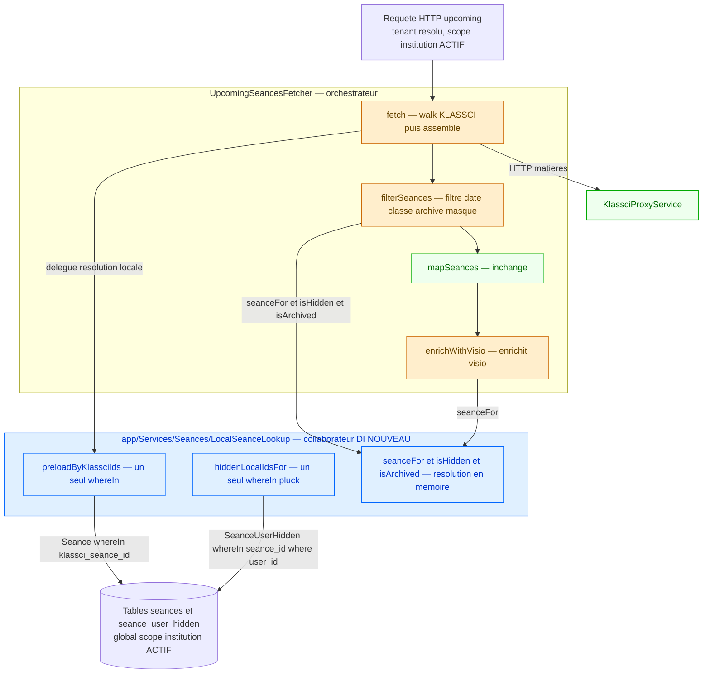
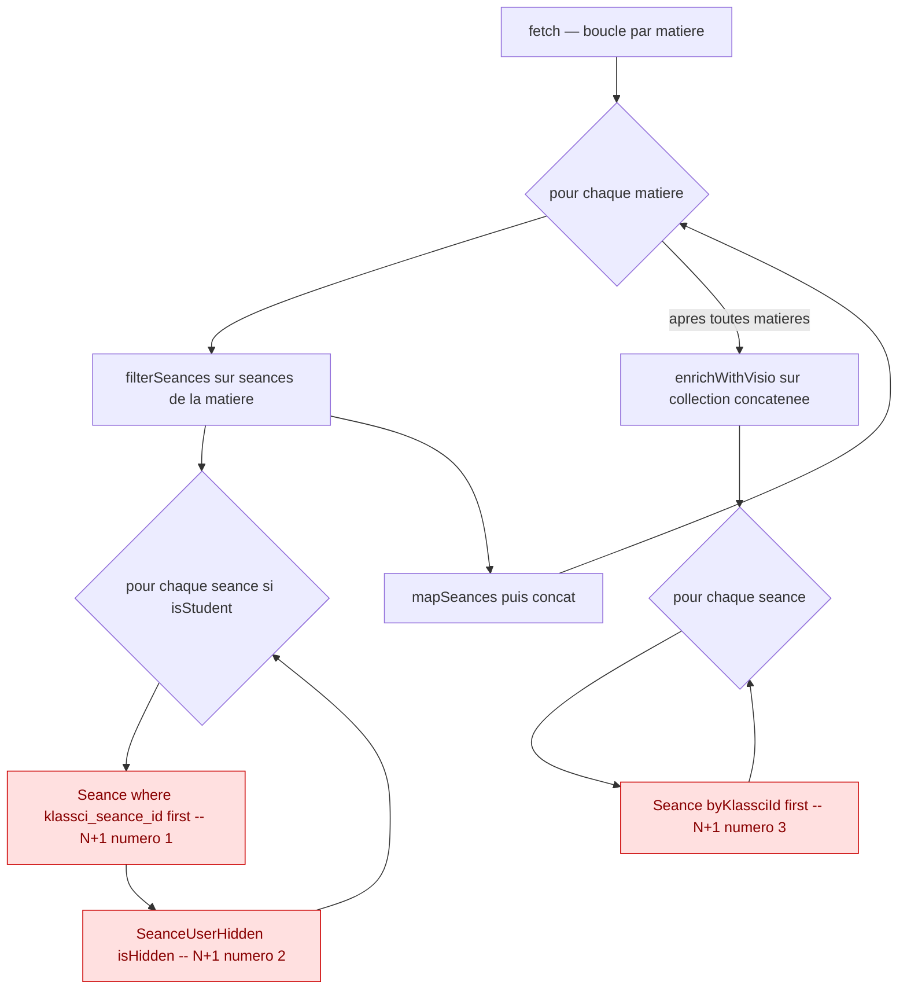
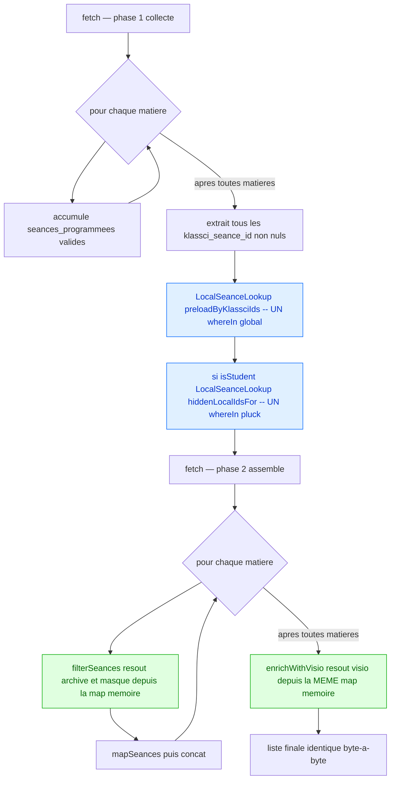
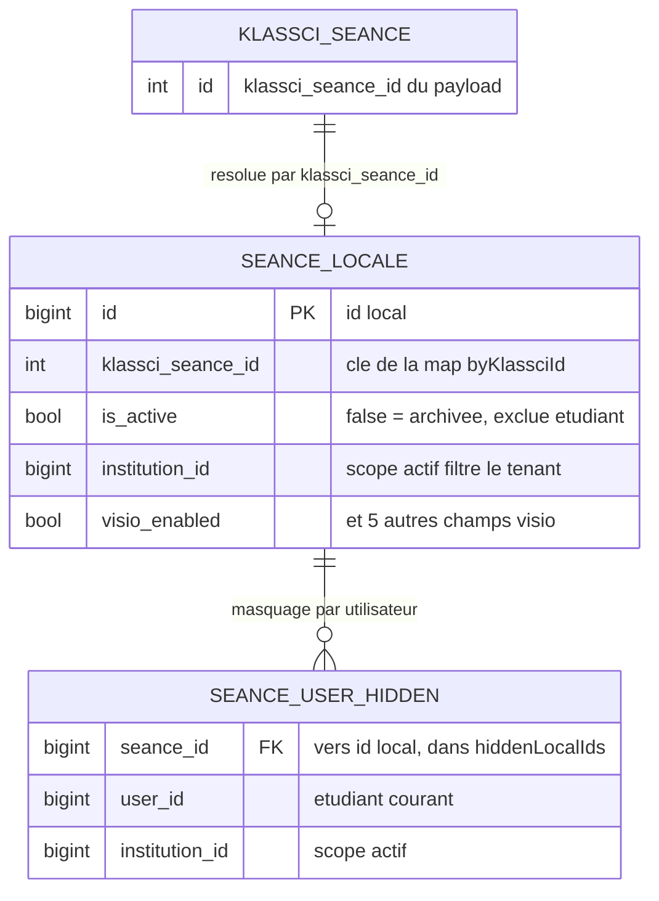

# Élimination des N+1 SQL dans `UpcomingSeancesFetcher` — Design

> Spec parent : [`requirements.md`](./requirements.md) (REQ-1 à REQ-7). Épique : [#472](https://github.com/ouedraogoissouf2012/lms_backend/issues/472) · sous-issue [#476](https://github.com/ouedraogoissouf2012/lms_backend/issues/476). Commit de référence de la dette : `99ffbc512` (#177). Branche de travail : `fix/476-seances-n-plus-1` (depuis `lms` à jour, après le refactor #475).
>
> **Nature de ce document : conception d'une correction À RÉALISER.** Le code n'existe pas encore — c'est un vrai développement TDD à venir. Ce design fixe l'architecture cible, tranche les décisions ouvertes du requirements, et cite systématiquement les `fichier:ligne` **actuels** (vérifiés par `Read`) où la correction doit s'appliquer.
>
> Suit le pattern **MANIFESTE_REFACTORING.md** (orchestrateur fin + collaborateur DI), identique en nature au `SeanceCacheDataBuilder` (#474) déjà livré dans la spec sœur `seances-cache-hardening`.

---

## 1. Vue d'ensemble

### 1.1 Le problème

`app/Services/Seances/UpcomingSeancesFetcher.php` (257 lignes, vérifié) construit la liste « séances à venir » pour les rôles non-manager (étudiant, enseignant). Sur ce chemin, `fetch()` (`:42-114`) walk KLASSCI (`/matieres`), puis **pour chaque matière** appelle `filterSeances()` (`:100`), et enfin **une seule fois** `enrichWithVisio()` (`:113`) sur la collection concaténée.

Ce chemin lit la table locale `seances` (et `seance_user_hidden`) **une ligne à la fois** — trois N+1 SQL confirmés par lecture directe :

| # | Emplacement (fichier:ligne actuel) | Appel unitaire | Requête déclenchée | Fréquence |
|---|-------------------------------------|----------------|--------------------|-----------|
| #1 | `UpcomingSeancesFetcher.php:142` (dans `filterSeances`, branche `isStudent()`) | `Seance::where('klassci_seance_id', …)->first()` | `SELECT … FROM seances WHERE klassci_seance_id = ? LIMIT 1` | 1 par séance de chaque matière (étudiants) |
| #2 | `UpcomingSeancesFetcher.php:150` (même `filter`) | `SeanceUserHidden::isHidden($localSeance->id, $user->id)` → `SeanceUserHidden.php:55-60` | `SELECT EXISTS(… WHERE seance_id = ? AND user_id = ?)` | 1 par séance locale existante (étudiants) |
| #3 | `UpcomingSeancesFetcher.php:233` (dans `enrichWithVisio`) | `Seance::byKlassciId(…)->first()` → scope `Seance.php:126-128` | `SELECT … FROM seances WHERE klassci_seance_id = ? LIMIT 1` | 1 par séance concaténée (**tous** rôles non-manager) |

Coût actuel non borné : un enseignant à 8 matières × ~20 séances ≈ **160 séances** ⇒ jusqu'à **~320 SELECT `seances` + ~160 EXISTS `seance_user_hidden`** pour une seule requête HTTP.

### 1.2 L'observation qui gouverne le design — mutualisation

Les N+1 **#1** (`filterSeances:142`) et **#3** (`enrichWithVisio:233`) interrogent **la même table `seances` par le même `klassci_seance_id`**. Une **seule** requête `whereIn('klassci_seance_id', $allIds)` peut alimenter les deux résolutions, ensuite faites en mémoire (REQ-1, REQ-4).

### 1.3 Contrainte de sécurité CRITIQUE — scope tenant préservé

Les lookups actuels (`:142`, `:233`, et `SeanceUserHidden::isHidden` `:150`) sont des accès Eloquent **standard**, **sans** `withoutGlobalScope`. En contexte HTTP, le global scope `institution` (trait `BelongsToInstitution`) est **actif** et filtre déjà par tenant courant. Vérifié : `Seance` utilise `BelongsToInstitution` (`Seance.php:21`) et `SeanceUserHidden` aussi (`SeanceUserHidden.php:17`).

**Le pré-chargement `whereIn` DOIT rester un accès Eloquent normal, SANS `withoutGlobalScope('institution')`.** Ajouter `withoutGlobalScope` serait une **régression de sécurité** (fuite cross-tenant) : ce chemin s'exécute en **HTTP**, pas dans un job. C'est l'inverse exact de `KlassciSeancesSyncService` (spec sœur), qui `withoutGlobalScope` **parce qu'il tourne en job tenant-less** ; ici, jamais.

### 1.4 Cartographie cible des composants



**Principe de partition** : `UpcomingSeancesFetcher` reste l'orchestrateur du walk KLASSCI ; toute la logique de résolution locale (pré-chargement `whereIn`, indexation en mémoire, résolution archive/masqué/visio) est extraite dans un collaborateur **`LocalSeanceLookup`** injecté par constructeur. La décision d'extraction (vs inline) est tranchée en §7.

---

## 2. Décision de conception centrale — Option A vs Option B (TRANCHÉE)

Le requirements pose le défi : `filterSeances` est appelée **par matière** (boucle `fetch():85-103`, appel `:100`), alors que l'optimum voudrait pré-charger **tous** les `klassci_seance_id` avant les boucles.

### 2.1 Les deux options

**Option A — Pré-charger par matière, dans `filterSeances`.**
Chaque appel de `filterSeances` (une fois par matière) émet son propre `whereIn` sur les seules séances de cette matière. Simple, local, mais **O(m)** requêtes `seances` (m = nombre de matières) pour le chemin étudiant, plus le `whereIn` global déjà présent dans `enrichWithVisio`. La mutualisation #1↔#3 est **impossible** : `filterSeances` s'exécute avant la concaténation, `enrichWithVisio` après — deux `whereIn` distincts, jamais un seul.

**Option B — Restructurer `fetch()` pour collecter tous les ids d'abord.**
`fetch()` walk KLASSCI, accumule **toutes** les `seances_programmees` de toutes les matières, en extrait l'ensemble complet des `klassci_seance_id`, émet **un seul** `whereIn` global via `LocalSeanceLookup`, puis filtre et enrichit depuis la map en mémoire. **O(1)** vrai. La map alimente `filterSeances` (#1) **et** `enrichWithVisio` (#3) — mutualisation effective (REQ-1, REQ-4). Restructuration plus lourde de `fetch()`.

### 2.2 Analyse comparée

| Critère | Option A (par matière) | Option B (collecte globale) |
|---------|------------------------|------------------------------|
| Requêtes `seances` chemin étudiant | **O(m)** (1/matière) + 1 (`enrichWithVisio`) | **1** (mutualisé) |
| Requêtes `seances` chemin enseignant | 1 (`enrichWithVisio` seul, `filterSeances` ne touche pas la DB pour non-étudiants) | **1** (identique) |
| Mutualisation #1↔#3 (REQ-1/REQ-4, critère d'acceptation #3) | **Impossible** | **Réalisée** |
| Conformité « O(1) amorti » (requirements §35-38, tableau état cible ligne 46) | ❌ O(m) | ✓ O(1) |
| Complexité de `fetch()` | inchangée | +restructuration (collecte 2 passes) |
| Test « baseline vs afterGrowth » (REQ-6) | passe *si* on fait croître le nombre de séances **à m constant** ; casse si m croît | passe inconditionnellement |

### 2.3 Décision : **Option B**, restructuration de `fetch()`.

**Justification (pas d'option laissée ouverte) :**

1. **La mutualisation est un critère d'acceptation dur**, pas un confort : critère global #3 (« Un unique `whereIn('klassci_seance_id', …)` alimente à la fois `filterSeances` (#1) et `enrichWithVisio` (#3) ») et REQ-4 (« THE map pré-chargée SHALL être la **même** structure que celle alimentant `filterSeances` »). L'Option A **viole** ces deux clauses par construction. Le requirements ne laisse pas le choix : il exige explicitement un `whereIn` **unique**.

2. **`enrichWithVisio` est DÉJÀ appelée une fois, globalement** (`fetch():113`, sur `$seances` concaténé). Son `whereIn` est donc **naturellement global** sans aucune restructuration. Le seul point à réconcilier est `filterSeances`, appelée par matière. L'Option B aligne `filterSeances` sur la globalité déjà acquise par `enrichWithVisio` — elle ne crée pas une globalité artificielle, elle **étend** celle qui existe déjà côté visio.

3. **O(m) n'est pas O(1).** Le tableau « anti-patterns mesurés » du requirements (lignes 33-38) cible explicitement « O(1) amorti (1 `whereIn` global) ». O(m) reste un N+1 en m (le nombre de matières croît avec le catalogue d'un enseignant). L'Option A laisserait une dette résiduelle mesurable, que le test REQ-6 « baseline vs afterGrowth » ne verrouillerait que partiellement (il faudrait figer m).

4. **Le surcoût de restructuration est borné et local.** `fetch()` fait déjà un walk en deux temps (collecte `$matiereIds` `:75-82`, puis boucle `:85-103`). Ajouter une collecte des `klassci_seance_id` suit exactement le même idiome déjà présent — ce n'est pas une réécriture, c'est une extension symétrique.

**Contrepartie assumée :** `fetch()` gagne en responsabilité (collecte des ids avant filtrage). Pour ne pas alourdir l'orchestrateur ni violer §5 (méthodes ≤40 l.), la collecte + le pré-chargement sont **délégués à `LocalSeanceLookup`** (§7), et `fetch()` ne fait qu'orchestrer l'appel. Voir §4.2 pour la restructuration précise.

---

## 3. Diagrammes de flux — avant / après

### 3.1 Flux AVANT (état actuel — 3 N+1)



### 3.2 Flux APRÈS (Option B — 2 requêtes constantes)



Deux requêtes SQL au total sur le chemin étudiant (1 `seances` + 1 `seance_user_hidden`), **constantes** quel que soit le volume de séances **et** de matières. Chemin enseignant : 1 requête `seances` (pas de filtrage masqué → pas de requête `seance_user_hidden`).

---

## 4. Composants et interfaces

### 4.1 Nouveau collaborateur `LocalSeanceLookup`

Fichier : `app/Services/Seances/LocalSeanceLookup.php` (nouveau). Aucune dépendance injectée (accès Eloquent statiques standard, comme les lookups qu'il remplace) — mais **instancié et injecté** dans `UpcomingSeancesFetcher` par le constructeur pour rester mockable/testable et respecter le pattern DI du projet.

- **Responsabilité (SRP)** : résoudre en mémoire, à partir d'un pré-chargement en 2 requêtes, l'état local (`Seance` locale, archivage, masquage, visio) d'un ensemble de séances KLASSCI identifiées par `klassci_seance_id`.
- **Dépendances** : aucune (pas de Facade, pas de service injecté — §1.6 D respecté).
- **Interface** (méthodes publiques, toutes ≤ 40 lignes) :

```php
final class LocalSeanceLookup
{
    /** @var Collection<int, Seance> indexée par klassci_seance_id */
    private Collection $byKlassciId;
    /** @var array<int, true> ids LOCAUX (Seance->id) masqués pour l'utilisateur */
    private array $hiddenLocalIds = [];

    /**
     * REQ-1 + REQ-4 : UN SEUL whereIn global, scope institution ACTIF.
     * @param list<int> $klassciSeanceIds
     */
    public function preload(array $klassciSeanceIds, ?User $student): void;

    /** Résout la Seance locale ou null (REQ-1 : identique au ->first() nul). */
    public function seanceFor(?int $klassciSeanceId): ?Seance;

    /** REQ-2 : true si une Seance locale existe ET is_active === false. */
    public function isArchived(?int $klassciSeanceId): bool;

    /** REQ-3 : true si Seance locale existe ET son id local est dans l'ensemble masqué. */
    public function isHidden(?int $klassciSeanceId): bool;
}
```

- `preload()` émet **exactement deux** requêtes (une seule si `$student` est `null`) :
  1. `Seance::whereIn('klassci_seance_id', $ids)->get()->keyBy('klassci_seance_id')` (REQ-1, mutualisé #1+#3). **Aucun `withoutGlobalScope`** — le scope `institution` filtre le tenant courant (§1.3).
  2. **Seulement si `$student !== null`** : `SeanceUserHidden::whereIn('seance_id', $localIds)->where('user_id', $student->id)->pluck('seance_id')` où `$localIds = $this->byKlassciId->pluck('id')` (REQ-3). Là aussi **sans `withoutGlobalScope`**.

### 4.2 Restructuration de `UpcomingSeancesFetcher`

Le constructeur `:33-37` gagne un 4ᵉ paramètre injecté :

```php
public function __construct(
    private readonly LoggerInterface $logger,
    private readonly KlassciProxyService $klassciService,
    private readonly ManagerSeancesLocalFetcher $managerFetcher,
    private readonly LocalSeanceLookup $localLookup,   // NOUVEAU
) {}
```

`fetch()` (`:42-114`) passe de « boucle unique filtre+map par matière » à **deux phases** :

- **Phase 1 — collecte** : la boucle `:85-103` accumule les couples `(seancesProgrammees filtrées par date/classe, matiereArr)` **sans** encore résoudre l'état local. À l'issue, on extrait `$allKlassciIds` (tous les `klassci_seance_id` non nuls, dédupliqués) et on appelle `$this->localLookup->preload($allKlassciIds, $user->isStudent() ? $user : null)`.
- **Phase 2 — assemblage** : on rejoue les couples accumulés : `filterSeances` (résolution archive/masqué depuis `localLookup`), `mapSeances`, `concat`. Puis `enrichWithVisio` (résolution visio depuis **le même** `localLookup`).

`filterSeances` (`:120-159`) : la branche `isStudent()` (`:140-156`) remplace les deux lookups par des appels mémoire :

```php
if ($user->isStudent()) {
    $filtered = $filtered->filter(function (array $seance) {
        $kid = KlassciPayload::toInt($seance['id'] ?? null);
        if ($this->localLookup->isArchived($kid)) return false;  // ex-:145-147
        if ($this->localLookup->isHidden($kid))   return false;  // ex-:150-152
        return true;
    });
}
```

`enrichWithVisio` (`:218-256`) : ligne `:233` remplacée par `$visioInfo = $this->localLookup->seanceFor(KlassciPayload::toInt($seance['id'] ?? null));`. Les blocs `:235-249` (assignation des 6 champs visio, valeurs par défaut) restent **strictement identiques** (REQ-4).

**Non touché (hors scope, REQ-5)** : le bloc `duree_minutes` (`:223-230`) reste **inchangé** — c'est du code mort inerte sur ce chemin (voir §8), à tracer comme dette séparée, **pas** corrigé ici.

---

## 5. Modèles de données — structures en mémoire

La map pré-chargée est le cœur du correctif. Deux structures, alimentées par les deux requêtes de `preload()` :

| Structure | Type | Source (1 requête chacune) | Rôle | Sert |
|-----------|------|----------------------------|------|------|
| `byKlassciId` | `Collection<int klassci_seance_id, Seance>` | `Seance::whereIn('klassci_seance_id', $ids)->get()->keyBy('klassci_seance_id')` | Résout la `Seance` locale par id KLASSCI | #1 (`isArchived`, `seanceFor`) **et** #3 (`seanceFor` visio) — **mutualisée** |
| `hiddenLocalIds` | `array<int seance_id_local, true>` | `SeanceUserHidden::whereIn('seance_id', $localIds)->where('user_id', $uid)->pluck('seance_id')` puis `array_flip` | Résout le masquage par appartenance O(1) | #2 (`isHidden`) |

Notes de conception :
- `keyBy('klassci_seance_id')` : `klassci_seance_id` est unique **par institution** (contrainte composite #473) et le scope `institution` est actif → pas de collision d'index dans la map en HTTP tenant-résolu. **Vérifié** cohérent avec `Seance.php` (pas d'unicité globale supposée).
- `array_flip` pour `hiddenLocalIds` : test d'appartenance `isset($this->hiddenLocalIds[$localId])` en O(1), au lieu d'un `->contains()` linéaire sur une Collection.
- **Résolution du `null`** (REQ-1, dernière clause) : `seanceFor($kid)` retourne `$this->byKlassciId->get($kid)` — `null` si absent, **exactement** comme le `->first()` actuel retournant `null`. `isArchived`/`isHidden` sur un id absent retournent `false` (séance visible, non masquée) — comportement identique au code gardé par `$localSeance &&` (`:145`, `:150`).



---

## 6. Stratégie de test

### 6.1 Test anti-N+1 « baseline vs afterGrowth » (REQ-6)

Fichier : `tests/Feature/Performance/UpcomingSeancesNoNPlusOneTest.php` (nouveau), pattern `SeanceParticipantsCountTest.php` (`DB::enableQueryLog()` / `count(DB::getQueryLog())`, `DB::` bordure de test autorisée §1.6 D).

**Principe** : compter les requêtes SQL frappant les tables `seances` et `seance_user_hidden` **pendant l'exécution de `fetch()`**, à deux volumes, et asserter l'**égalité stricte** des deux comptes.

```php
private function countLocalSeancesQueries(callable $run): int
{
    DB::enableQueryLog();
    $run();
    $queries = collect(DB::getQueryLog())->pluck('query');
    DB::disableQueryLog();
    return $queries->filter(fn (string $q): bool =>
        str_contains($q, '"seances"') || str_contains($q, '"seance_user_hidden"')
    )->count();
}
```

- `test_student_path_query_count_is_constant_as_seances_grow` : monter le proxy KLASSCI (voir §6.2) pour retourner **3** séances, mesurer `baseline`; puis **30** séances, mesurer `afterGrowth`. Assert `assertSame($baseline, $afterGrowth)`. Sur le chemin étudiant, `baseline` doit valoir **2** (1 `seances` + 1 `seance_user_hidden`) — asserté en dur pour ancrer la borne, pas seulement l'égalité.
- `test_teacher_path_query_count_is_constant_as_seances_grow` : idem, rôle `enseignant`, `baseline` attendu **1** (seul `enrichWithVisio` touche `seances` ; `filterSeances` ne requête pas pour un non-étudiant, cf. garde `isStudent()` `:140`). Couvre #3 isolé (REQ-6, clause « chemin enseignant #3 seul »).

> Le pré-chargement `whereIn` peut émettre **0** requête `seances` quand la liste d'ids est vide (aucune séance dans la fenêtre) — le test doit garantir un volume non vide aux deux mesures pour que la borne (2 ou 1) soit atteinte et l'égalité significative. Cas « liste vide » couvert séparément par un test fonctionnel (retour vide, aucune requête superflue).

### 6.2 Mocking du walk KLASSCI (pas de réseau réel)

Le fetcher walk KLASSCI (`requestWithUserToken('matieres')` + `fetchManyMatieresDetails`). On mocke `KlassciProxyService`, **exactement** comme les deux tests de référence lus :

- `TeachingSeancesParallelFetchTest.php:66-94` : `Mockery::mock(KlassciProxyService::class)` + `shouldReceive('requestWithUserToken')->with($token,'matieres','GET')` + `shouldReceive('fetchManyMatieresDetails')->with($ids,$token)`, puis `$this->app->instance(KlassciProxyService::class, $proxy)`.
- `LMSSeancesListResponseTest.php:157-163` : `$this->mock(KlassciProxyService::class, fn (MockInterface $mock) => …)` pour figer `requestWithUserToken('matieres')` et `fetchManyMatieresDetails`.

Pour ce test, le double retourne : une liste de matières (`requestWithUserToken('matieres')`), puis `fetchManyMatieresDetails([$ids], $token)` mappant chaque `matiereId` vers `['data' => ['seances_programmees' => [... N séances payload ...]]]`. On génère N séances via un helper `seancePayload($id, $classeId, $date)` (calque de `TeachingSeancesParallelFetchTest.php:114-126`), avec des dates dans la fenêtre `[$dateDebut, $dateFin]`. Aucun appel réseau réel — le walk est entièrement piloté par le double.

Les `Seance` locales et `SeanceUserHidden` de test sont créées via factory (comme `LMSSeancesListResponseTest.php:104-124`), sous une `Institution` factory, l'utilisateur `actingAs` avec cette institution → le scope `institution` est actif et le pré-chargement le traverse (validation implicite de §1.3).

### 6.3 Non-régression fonctionnelle stricte (REQ-5)

Fichier : `tests/Feature/LMS/Seances/UpcomingSeancesFilteringTest.php` (nouveau) — verrouille l'**équivalence de sortie** avant/après, indépendamment du comptage de requêtes :

- **Archivage** : une séance KLASSCI dont la `Seance` locale a `is_active=false` est **absente** de la sortie pour un étudiant, **présente** pour un enseignant (REQ-2).
- **Masquage** : une séance masquée (`SeanceUserHidden` pour l'utilisateur) est **absente** pour l'étudiant concerné, **présente** pour un autre étudiant (REQ-3, isolation par `user_id`).
- **Séance sans `Seance` locale** : conservée (visible), visio aux valeurs par défaut (REQ-1 null, REQ-4 defaults).
- **Enrichissement visio** : les 6 champs (`visio_enabled`, `visio_type`, `visio_room_id`, `visio_active`, `visio_started_at`, `visio_ended_at`) sont positionnés **identiquement** à `:236-241` quand la `Seance` locale existe, et aux défauts `:243-249` sinon (REQ-4).
- **Isolation tenant** : une `Seance` d'une autre institution portant le **même** `klassci_seance_id` n'est **pas** résolue (le `whereIn` sous scope actif ne la voit pas) — verrou direct de §1.3, calqué sur `SeanceTenantIsolationTest` (spec sœur).

### 6.4 Contrat du collaborateur `LocalSeanceLookup`

Fichier : `tests/Unit/Services/Seances/LocalSeanceLookupTest.php` (nouveau) — teste le collaborateur en isolation : `preload` émet 2 requêtes (1 si `$student` null) ; `seanceFor` retourne la bonne entité ou `null` ; `isArchived`/`isHidden`/`seanceFor` sur id absent → `false`/`false`/`null` ; `preload` sur liste vide n'émet aucune requête et laisse toutes les résolutions à `null`/`false`.

---

## 7. Décision de taille — extraction vs inline (TRANCHÉE)

`UpcomingSeancesFetcher.php` = **257 lignes** (vérifié), marge de **43 lignes** avant le plafond de 300 (§1.1).

### 7.1 Estimation du delta si tout était inline

| Ajout inline | Δ lignes estimé |
|--------------|-----------------|
| Restructuration `fetch()` en 2 phases (collecte des couples + extraction `$allKlassciIds` + appel préchargement) | ~+18 |
| Pré-chargement `Seance::whereIn(...)->keyBy(...)` + `keyBy` + docblock isolation tenant | ~+8 |
| Pré-chargement `SeanceUserHidden::whereIn(...)->pluck(...)` + `array_flip` + garde `isStudent` | ~+8 |
| Résolution mémoire `isArchived` / `isHidden` / `seanceFor` (3 helpers privés + docblocks) | ~+22 |
| **Total** | **~+56** |

257 + 56 ≈ **313 lignes** > 300. **Inline fait dépasser le plafond.** La règle REQ-7.1 est explicite : « SI l'ajout … fait dépasser 300 lignes, ALORS la logique de pré-chargement SHALL être extraite dans un collaborateur dédié … et NON inlinée au prix d'un dépassement. »

### 7.2 Décision : **extraction dans `LocalSeanceLookup`** (collaborateur DI).

- L'orchestrateur ne gagne que : +1 paramètre constructeur, la restructuration en 2 phases de `fetch()` (~+18 l.), et le remplacement des 3 lookups par des appels au collaborateur (net **quasi nul** sur `filterSeances`/`enrichWithVisio` : on remplace des lignes existantes). Estimation post-extraction de `UpcomingSeancesFetcher` : **~272-278 lignes** — sous 300 avec marge.
- La logique de pré-chargement + résolution mémoire (~60 l.) vit dans `LocalSeanceLookup` (fichier neuf, ~90 l. avec docblocks), très en dessous de 300.
- Bénéfice au-delà de la taille : `LocalSeanceLookup` est **testable en isolation** (§6.4) et **mockable** dans les tests du fetcher, exactement comme `SeanceCacheDataBuilder` (#474) et `ManagerSeancesLocalFetcher` (#475) — cohérence avec le pattern MANIFESTE_REFACTORING déjà en place dans ce domaine.
- Toutes les méthodes des deux fichiers restent **≤ 40 lignes** (§5) : `preload` ~14 l., `seanceFor`/`isArchived`/`isHidden` ~3-5 l. chacune, `filterSeances`/`enrichWithVisio`/`fetch` re-découpées si besoin.

---

## 8. Gestion des erreurs

Le correctif **préserve à l'identique** la résilience existante et n'introduit aucun nouveau chemin d'échec réseau (les requêtes ajoutées sont des SELECT locaux).

| Cas | Comportement cible | Fidélité au code actuel |
|-----|--------------------|--------------------------|
| Exception dans le walk KLASSCI | `catch (\Exception)` `fetch():107-111` → log + retour de ce qui est déjà collecté. **Inchangé.** Le pré-chargement se fait **après** le walk réussi, donc dans le `try` ; une exception réseau court-circuite avant `preload`, comme aujourd'hui avant `enrichWithVisio`. | Identique |
| `klassci_seance_id` du payload non entier / absent | `KlassciPayload::toInt(...)` → `null` ; exclu de `$allKlassciIds` (filtré non-null) ; `seanceFor(null)`/`isArchived(null)`/`isHidden(null)` → `null`/`false`/`false` (séance visible, non masquée, visio défaut). | Identique au `->first()` sur `toInt(...)` nul actuel |
| Liste d'ids vide (aucune séance dans la fenêtre) | `preload([])` : **aucune** requête `seances`/`seance_user_hidden` (whereIn sur `[]` court-circuité) ; map vide ; toutes les résolutions retournent défaut. | Améliore (0 requête au lieu de 0 aussi — pas de régression) |
| Aucune `Seance` locale pour un `klassci_seance_id` chargé | `byKlassciId->get($kid)` → `null` → séance conservée, visio défaut. | Identique au `->first()` nul (`:145`, `:150`, `:242`) |
| Séance d'un **autre** tenant même `klassci_seance_id` | Non résolue (scope `institution` actif filtre au tenant courant) → traitée comme absente. | Identique aux lookups unitaires actuels (eux aussi scopés) — §1.3 |

Aucun `try/catch` supplémentaire n'est requis : les SELECT Eloquent sur des tables locales n'ont pas de mode de défaillance métier à absorber (une erreur DB relève de l'infrastructure, remontée telle quelle, comme aujourd'hui pour les `->first()` unitaires).

---

## 9. Conformité PRODUCTION_STANDARDS (REQ-7)

| Contrôle | État cible | Preuve / mécanisme |
|----------|-----------|--------------------|
| `UpcomingSeancesFetcher.php` ≤ 300 l. | ~272-278 l. estimées post-extraction | §7 — extraction `LocalSeanceLookup` |
| `LocalSeanceLookup.php` ≤ 300 l. | ~90 l. | §4.1, §7 |
| Toutes méthodes ≤ 40 l. | Oui | §7.2 — découpe explicite |
| Aucune Facade en code métier (§1.6 D) | Oui | `DB::enableQueryLog()` **uniquement en test** (§6.1, bordure autorisée) ; `LocalSeanceLookup` sans Facade |
| Zéro N+1 SQL sur le chemin corrigé (§1.4) | Oui | Test REQ-6 « baseline vs afterGrowth » (§6.1) |
| PHPStan level 9 = 0 erreur, aucune baseline ajoutée | Oui | Types stricts via `KlassciPayload` (`toInt`, `listOfArrays`) ; `keyBy` sur clé int, `array_flip` typé |
| Isolation tenant préservée | Oui | **Aucun** `withoutGlobalScope` (§1.3, §5) — verrou de test §6.3 |

---

## 10. Décisions de conception (récapitulatif)

| Décision | Choix retenu | Alternative écartée | Justification |
|----------|--------------|---------------------|---------------|
| **Restructuration `fetch()`** | Option B — collecte globale des ids, 1 `whereIn` mutualisé | Option A — pré-charge par matière | Mutualisation #1↔#3 = critère d'acceptation dur (REQ-4, critère global #3) ; A la rend impossible ; O(m) ≠ O(1). `enrichWithVisio` est déjà global → B étend la globalité acquise. (§2) |
| **Extraction `LocalSeanceLookup`** | Collaborateur DI dédié | Inliner dans le fetcher | Inline → ~313 l. > 300 (§7.1). REQ-7.1 impose l'extraction en cas de dépassement. Bonus : testable/mockable, cohérent MANIFESTE_REFACTORING. |
| **Pas de `withoutGlobalScope`** | Accès Eloquent standard, scope `institution` actif | `withoutGlobalScope('institution')` | Chemin **HTTP** (pas job) → scope actif = filtrage tenant. `withoutGlobalScope` = fuite cross-tenant (§1.3). Inverse exact du job `KlassciSeancesSyncService`. |
| **`hiddenLocalIds` en `array_flip`** | Map d'appartenance O(1) | `Collection->contains()` par élément | Test d'appartenance O(1) vs O(n) ; le but même du correctif est de supprimer le linéaire. |
| **`duree_minutes` (`:223-230`) non touché** | Laissé strictement inchangé | Corriger le code mort ici | Le corriger change la sortie JSON (ajout d'un champ absent) → viole REQ-5 non-régression stricte. Tracé comme dette séparée (§8, hors scope requirements ligne 151). |

---

## 11. Divergences requirements / code signalées

Vérification systématique des REQ-1 à REQ-7 contre le code lu. **Aucune divergence de structure ou de comportement** entre les `fichier:ligne` du requirements et le code réel :

1. **Lignes des 3 N+1** — REQ cite `:142` (#1), `:150` (#2), `:233` (#3). **Vérifié conforme** par `Read` de `UpcomingSeancesFetcher.php` : lookup `Seance::where('klassci_seance_id', …)->first()` bien en `:142` ; `SeanceUserHidden::isHidden(...)` bien en `:150` ; `Seance::byKlassciId(...)->first()` bien en `:233`. La divergence de numérotation #476 (315/324, 238/240, 248 → 233/142/150) documentée au requirements (lignes 135-145) est **exacte** : le refactor #475 a bien ramené le fichier à 257 lignes.

2. **Traits `BelongsToInstitution`** — REQ affirme que `Seance` et `SeanceUserHidden` l'utilisent. **Vérifié** : `Seance.php:21` (`use BelongsToInstitution, HasFactory, SoftDeletes;`) et `SeanceUserHidden.php:17` (`use BelongsToInstitution;`). La contrainte §1.3 (scope actif en HTTP, ne pas `withoutGlobalScope`) est donc bien fondée.

3. **`isHidden` = `where->where->exists`** — REQ cite `SeanceUserHidden.php:55-60`. **Vérifié** : `where('seance_id')->where('user_id')->exists()`. Le remplacement par `whereIn(...)->where('user_id')->pluck('seance_id')` (REQ-3) est fonctionnellement équivalent (appartenance à l'ensemble ≡ `exists` par élément).

4. **`scopeByKlassciId`** — REQ cite `Seance.php:126-128`. **Vérifié** : `scopeByKlassciId($query, int $klassciSeanceId) => $query->where('klassci_seance_id', $klassciSeanceId)`. Le pré-chargement `whereIn('klassci_seance_id', …)` est la généralisation directe de ce scope.

5. **`duree_minutes` code mort (`:223-230`)** — **Vérifié** : `enrichWithVisio` lit `$seance['date_seance']` **à la racine** (`:223`), mais `mapSeances` (`:171-207`) ne produit `date` que sous `programmation.date` (`:179`), **jamais** `date_seance` à la racine. La condition `:226` est donc toujours fausse sur ce chemin → bloc inerte. Confirme le hors-scope du requirements (ligne 151). **À tracer comme issue de suivi**, non corrigé ici.

**Remarque de granularité (sans impact)** : le requirements (REQ-6, ligne 120) cite `TeacherDashboardServiceTest.php:297-322` comme second pattern QueryLog ; ce design s'appuie principalement sur `SeanceParticipantsCountTest.php` (lu intégralement, pattern `enableQueryLog`/`getQueryLog`/`assertCount` confirmé `:67-77`, `:90-100`). Les deux patterns sont équivalents ; le choix du modèle n'affecte pas la stratégie §6.

---

**Does the design look good? If so, we can move on to the implementation plan.**
