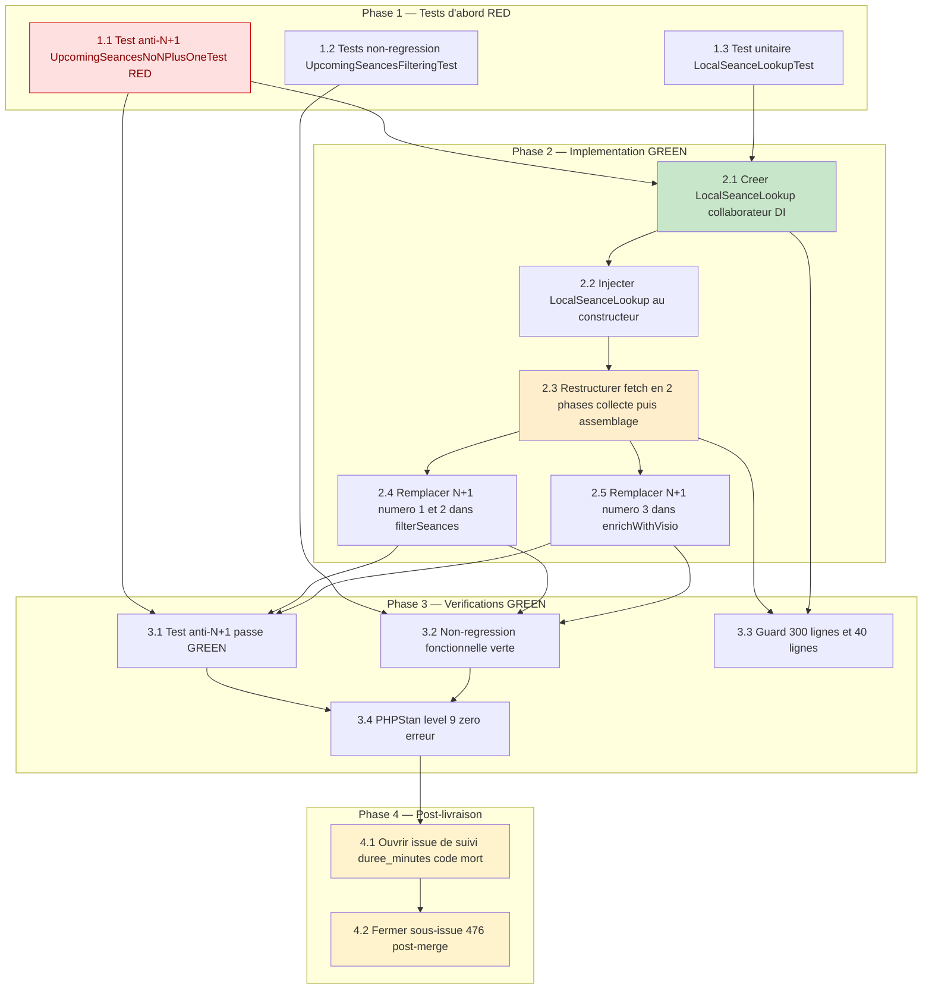

# Élimination des N+1 SQL dans `UpcomingSeancesFetcher` — Plan d'implémentation

> Spec parent : [`requirements.md`](./requirements.md) (REQ-1 à REQ-7) + [`design.md`](./design.md).
> Épique : [#472](https://github.com/ouedraogoissouf2012/lms_backend/issues/472) · sous-issue [#476](https://github.com/ouedraogoissouf2012/lms_backend/issues/476). Commit de référence de la dette : `99ffbc512` (#177). Branche de travail : `fix/476-seances-n-plus-1` (depuis `lms` à jour, après le refactor #475).
>
> **Nature de ce document : plan d'implémentation PROSPECTIF (TDD).** Contrairement à la spec sœur `seances-cache-hardening/tasks.md` (régularisation rétroactive, tâches `[x]`), **le code n'existe pas encore** : c'est un vrai développement à réaliser. Toutes les tâches sont donc **à faire `[ ]`**.
>
> **Ordre TDD strict** : les tests d'abord (RED — le test anti-N+1 DOIT échouer avant le fix, prouvant le N+1), puis l'implémentation (GREEN), puis les vérifications transversales. Chaque tâche trace le(s) requirement(s) qu'elle satisfait.
>
> Suit le pattern **MANIFESTE_REFACTORING.md** (orchestrateur fin + collaborateur DI), identique en nature au `SeanceCacheDataBuilder` (#474) et `ManagerSeancesLocalFetcher` (#475) déjà livrés dans la spec sœur.

---

## Phase 1 — Tests d'abord (RED)

**Scope** : écrire les tests avant tout code de production. Le test anti-N+1 (1.1) DOIT **échouer** contre le code actuel (il prouve les trois N+1). Les tests fonctionnels (1.2) passent déjà contre le code actuel (ils verrouillent la non-régression) ; les tests unitaires du collaborateur (1.3) échouent tant que `LocalSeanceLookup` n'existe pas.

- [ ] 1.1 Écrire le test anti-N+1 `tests/Feature/Performance/UpcomingSeancesNoNPlusOneTest.php` — doit ÉCHOUER contre le code actuel
  - Implémenter le helper `countLocalSeancesQueries(callable $run): int` : `DB::enableQueryLog()`, exécuter `$run`, filtrer les requêtes contenant `"seances"` ou `"seance_user_hidden"`, `DB::disableQueryLog()`, retourner le compte (`DB::` = bordure de test autorisée §1.6 D)
  - Mocker le walk KLASSCI (pas de réseau réel) calqué sur `TeachingSeancesParallelFetchTest.php:66-94` : `Mockery::mock(KlassciProxyService::class)` + `shouldReceive('requestWithUserToken')->with($token,'matieres','GET')` + `shouldReceive('fetchManyMatieresDetails')->with($ids,$token)`, puis `$this->app->instance(KlassciProxyService::class, $proxy)`
  - Écrire le helper `seancePayload($id, $classeId, $date)` (calque de `TeachingSeancesParallelFetchTest.php:114-126`) générant N séances payload avec dates dans la fenêtre `[$dateDebut, $dateFin]`
  - `test_student_path_query_count_is_constant_as_seances_grow` : chemin étudiant, mesurer `baseline` à **3** séances puis `afterGrowth` à **30** séances ; `assertSame($baseline, $afterGrowth)` ET `assertSame(2, $baseline)` (borne dure : 1 `seances` + 1 `seance_user_hidden`) — couvre les N+1 #1, #2, #3
  - `test_teacher_path_query_count_is_constant_as_seances_grow` : chemin enseignant, `baseline` attendu **1** (seul `enrichWithVisio` touche `seances` ; `filterSeances` ne requête pas pour un non-étudiant, garde `isStudent()` `:140`) — couvre #3 isolé
  - Garantir un volume non vide aux deux mesures pour que la borne (2 ou 1) soit atteinte et l'égalité significative
  - _Requirements: REQ-6_

- [ ] 1.2 Écrire les tests de non-régression fonctionnelle `tests/Feature/LMS/Seances/UpcomingSeancesFilteringTest.php` — verrouillent l'équivalence de sortie avant/après
  - Créer les `Seance` locales et `SeanceUserHidden` via factory sous une `Institution` factory, `actingAs` l'utilisateur avec cette institution (scope `institution` actif, validation implicite de §1.3), en mockant `KlassciProxyService` comme en 1.1
  - `test_archived_seance_is_hidden_from_student_but_visible_to_teacher` : séance KLASSCI dont la `Seance` locale a `is_active=false` est **absente** pour un étudiant, **présente** pour un enseignant (REQ-2)
  - `test_hidden_seance_is_absent_only_for_the_concerned_student` : séance masquée (`SeanceUserHidden` pour l'utilisateur) est **absente** pour l'étudiant concerné, **présente** pour un autre étudiant (REQ-3, isolation par `user_id`)
  - `test_seance_without_local_row_stays_visible_with_default_visio` : séance sans `Seance` locale conservée (visible), visio aux valeurs par défaut (REQ-1 null, REQ-4 defaults)
  - `test_visio_fields_are_enriched_from_local_seance` : les 6 champs (`visio_enabled`, `visio_type`, `visio_room_id`, `visio_active`, `visio_started_at`, `visio_ended_at`) positionnés identiquement quand la `Seance` locale existe, et aux défauts sinon (REQ-4)
  - `test_same_klassci_id_in_another_tenant_is_not_resolved` : une `Seance` d'une autre institution portant le **même** `klassci_seance_id` n'est **pas** résolue (le `whereIn` sous scope actif ne la voit pas) — verrou direct de §1.3, calqué sur `SeanceTenantIsolationTest`
  - _Requirements: REQ-2, REQ-3, REQ-4, REQ-5_

- [ ] 1.3 Écrire le test unitaire du collaborateur `tests/Unit/Services/Seances/LocalSeanceLookupTest.php` — échoue tant que `LocalSeanceLookup` n'existe pas
  - `test_preload_emits_two_queries_for_a_student` : `preload($ids, $student)` émet **exactement 2** requêtes (`DB::enableQueryLog()` en bordure de test) — 1 `seances` + 1 `seance_user_hidden`
  - `test_preload_emits_one_query_when_student_is_null` : `preload($ids, null)` émet **exactement 1** requête (`seances` seul, pas de `seance_user_hidden`)
  - `test_preload_emits_no_query_on_empty_id_list` : `preload([], $student)` n'émet **aucune** requête et laisse toutes les résolutions à `null`/`false`
  - `test_seance_for_returns_entity_or_null` : `seanceFor($kid)` retourne la bonne `Seance` locale, `null` sur id absent (identique au `->first()` nul)
  - `test_is_archived_true_only_when_local_seance_inactive` : `isArchived($kid)` retourne `true` ssi une `Seance` locale existe ET `is_active === false` ; `false` sur id absent
  - `test_is_hidden_true_only_when_local_id_in_hidden_set` : `isHidden($kid)` retourne `true` ssi la `Seance` locale existe ET son id local est dans l'ensemble masqué ; `false` sur id absent
  - _Requirements: REQ-1, REQ-2, REQ-3, REQ-4_

---

## Phase 2 — Implémentation (GREEN)

**Scope** : créer le collaborateur `LocalSeanceLookup`, puis restructurer `UpcomingSeancesFetcher` en 2 phases (collecte des ids → préchargement → assemblage), remplaçant les trois lookups N+1 par des résolutions en mémoire. **Aucun `withoutGlobalScope`** (chemin HTTP, scope `institution` actif — §1.3). Le bloc `duree_minutes` (`:223-230`) reste strictement inchangé (code mort hors scope, REQ-5).

- [ ] 2.1 Créer `app/Services/Seances/LocalSeanceLookup.php` (collaborateur DI, ~90 lignes, aucune Facade)
  - `private Collection $byKlassciId` (`Collection<int klassci_seance_id, Seance>`) et `private array $hiddenLocalIds` (`array<int seance_id_local, true>`)
  - `preload(array $klassciSeanceIds, ?User $student): void` — émet **exactement 2** requêtes (1 si `$student` null) : (1) `Seance::whereIn('klassci_seance_id', $ids)->get()->keyBy('klassci_seance_id')` ; (2) **seulement si** `$student !== null` : `SeanceUserHidden::whereIn('seance_id', $localIds)->where('user_id', $student->id)->pluck('seance_id')` avec `$localIds = $this->byKlassciId->pluck('id')`, puis `array_flip` pour un test d'appartenance O(1). **Aucun `withoutGlobalScope`** sur les deux requêtes (§1.3). `whereIn` sur `[]` court-circuité (0 requête sur liste vide)
  - `seanceFor(?int $klassciSeanceId): ?Seance` — retourne `$this->byKlassciId->get($kid)`, `null` si absent (identique au `->first()` nul actuel) (REQ-1)
  - `isArchived(?int $klassciSeanceId): bool` — `true` ssi `Seance` locale existe ET `is_active === false` ; `false` sur id absent (REQ-2)
  - `isHidden(?int $klassciSeanceId): bool` — résout le `Seance->id` local puis teste `isset($this->hiddenLocalIds[$localId])` en O(1) ; `false` sur id absent (REQ-3)
  - Toutes méthodes ≤ 40 lignes ; classe `final` ; aucune dépendance injectée (accès Eloquent statiques standard, §1.6 D)
  - _Requirements: REQ-1, REQ-2, REQ-3, REQ-4, REQ-7_

- [ ] 2.2 Injecter `LocalSeanceLookup` au constructeur de `app/Services/Seances/UpcomingSeancesFetcher.php`
  - Ajouter le 4ᵉ paramètre `private readonly LocalSeanceLookup $localLookup` à la signature `:33-37`, après `ManagerSeancesLocalFetcher $managerFetcher`
  - _Requirements: REQ-7_

- [ ] 2.3 Restructurer `UpcomingSeancesFetcher::fetch()` (`:42-114`) en 2 phases (collecte → préchargement → assemblage)
  - **Phase 1 — collecte** : la boucle `:85-103` accumule les couples `(seances_programmees filtrées par date/classe, matiereArr)` **sans** résoudre l'état local ; à l'issue, extraire `$allKlassciIds` (tous les `klassci_seance_id` non nuls, dédupliqués)
  - Appeler `$this->localLookup->preload($allKlassciIds, $user->isStudent() ? $user : null)` (le `null` en non-étudiant évite la requête `seance_user_hidden`, REQ-6 chemin enseignant à 1 requête)
  - **Phase 2 — assemblage** : rejouer les couples accumulés (`filterSeances` → `mapSeances` → `concat`), puis `enrichWithVisio` sur la collection concaténée
  - Le préchargement se fait **dans le `try`**, après le walk KLASSCI réussi (une exception réseau court-circuite avant `preload`, comme aujourd'hui avant `enrichWithVisio` — `catch` `:107-111` inchangé)
  - Découper en méthodes privées si nécessaire pour respecter ≤ 40 lignes/méthode (§5)
  - _Requirements: REQ-1, REQ-5, REQ-7_

- [ ] 2.4 Remplacer les N+1 #1 et #2 dans `filterSeances()` (branche `isStudent()`, `:140-156`) par des résolutions mémoire
  - Remplacer `Seance::where('klassci_seance_id', …)->first()` (`:142`, N+1 #1) par `$this->localLookup->isArchived($kid)` avec `$kid = KlassciPayload::toInt($seance['id'] ?? null)` (REQ-2)
  - Remplacer `SeanceUserHidden::isHidden($localSeance->id, $user->id)` (`:150`, N+1 #2) par `$this->localLookup->isHidden($kid)` (REQ-3)
  - Préserver la sémantique : archivée ⇒ exclue (`:145-147`), masquée ⇒ exclue (`:150-152`), pas de `Seance` locale ⇒ conservée (null actuel) ; ne pas interroger `seance_user_hidden` pour une séance sans locale (garde `$localSeance &&` reproduite par `isHidden` retournant `false` sur id absent)
  - _Requirements: REQ-2, REQ-3, REQ-5_

- [ ] 2.5 Remplacer le N+1 #3 dans `enrichWithVisio()` (`:218-256`) par une résolution mémoire depuis la MÊME map
  - Remplacer `Seance::byKlassciId(…)->first()` (`:233`, N+1 #3) par `$visioInfo = $this->localLookup->seanceFor(KlassciPayload::toInt($seance['id'] ?? null))` — même structure `byKlassciId` que celle servant `filterSeances` (mutualisation #1↔#3, REQ-4)
  - Laisser les blocs `:235-249` (assignation des 6 champs visio + valeurs par défaut) **strictement identiques** (REQ-4)
  - **NE PAS toucher** le bloc `duree_minutes` (`:223-230`) — code mort inerte hors scope, à tracer comme dette séparée (REQ-5)
  - _Requirements: REQ-4, REQ-5_

---

## Phase 3 — Vérifications (les tests RED passent GREEN)

**Scope** : confirmer que les tests de la Phase 1 passent désormais au vert, la non-régression fonctionnelle tient, et les invariants PRODUCTION_STANDARDS (REQ-7) sont satisfaits.

- [ ] 3.1 Confirmer que `UpcomingSeancesNoNPlusOneTest` passe GREEN (était RED avant le fix)
  - Les deux tests verts : chemin étudiant `baseline == afterGrowth == 2`, chemin enseignant `baseline == afterGrowth == 1` — nombre de requêtes `seances`/`seance_user_hidden` **constant** vis-à-vis du volume (preuve zéro N+1)
  - _Requirements: REQ-6, REQ-7_

- [ ] 3.2 Confirmer la non-régression fonctionnelle verte
  - `UpcomingSeancesFilteringTest` (archivage, masquage, séance sans locale, enrichissement visio, isolation tenant) et `LocalSeanceLookupTest` (contrat du collaborateur) tous verts
  - Vérifier qu'aucun `withoutGlobalScope` n'a été introduit sur les `whereIn` de préchargement (isolation tenant HTTP préservée, §1.3) — verrouillé par le test d'isolation de 1.2
  - _Requirements: REQ-1, REQ-2, REQ-3, REQ-4, REQ-5_

- [ ] 3.3 Vérifier le guard « fichiers ≤ 300 lignes / méthodes ≤ 40 lignes » (§1.1 / §5)
  - `UpcomingSeancesFetcher.php` ≤ 300 lignes (cible ~272-278 post-extraction, marge sous plafond) ; `LocalSeanceLookup.php` ≤ 300 lignes (cible ~90) ; toutes méthodes des deux fichiers ≤ 40 lignes
  - _Requirements: REQ-7_

- [ ] 3.4 Vérifier PHPStan level 9 = 0 erreur, aucune entrée de baseline ajoutée
  - Types stricts via `KlassciPayload` (`toInt`), `keyBy` sur clé int, `array_flip` typé ; aucune Facade en code métier (`DB::enableQueryLog()` uniquement en test)
  - _Requirements: REQ-7_

---

## Phase 4 — Post-livraison

- [ ] 4.1 Ouvrir une issue de suivi pour le bug `duree_minutes` code mort (`enrichWithVisio` `:223-230`)
  - Documenter : `enrichWithVisio` lit `$seance['date_seance']` à la racine (`:223`), mais `mapSeances` (`:171-207`) ne produit `date` que sous `programmation.date` (`:179`), jamais `date_seance` à la racine → condition `:226` toujours fausse, bloc inerte ; le corriger changerait la sortie JSON (ajout d'un champ absent) donc hors scope #476 pour garder le diff non-régressif (REQ-5)
  - _Requirements: Hors scope (requirements.md §Hors scope) ; Critère d'acceptation global #8_

- [ ] 4.2 Post-merge : fermer la sous-issue #476 après merge de la PR
  - _Requirements: Critère d'acceptation global #10_

---

## Diagramme de dépendances des tâches

_Légende : rouge = test RED devant échouer avant le fix (prouve le N+1), vert = nouveau collaborateur, orange = restructuration de l'orchestrateur, jaune = actions post-livraison._
