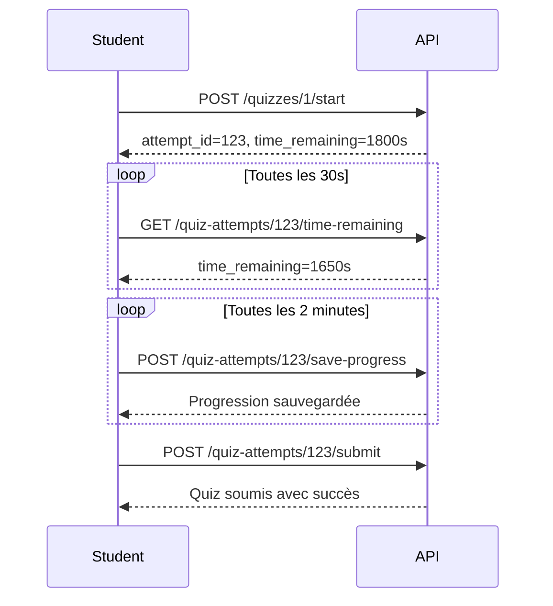
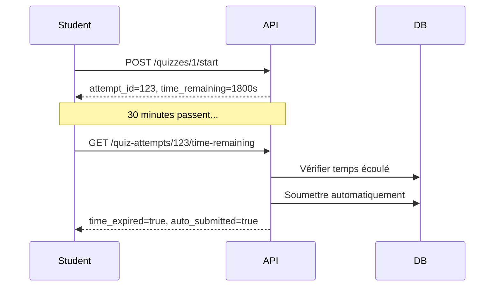
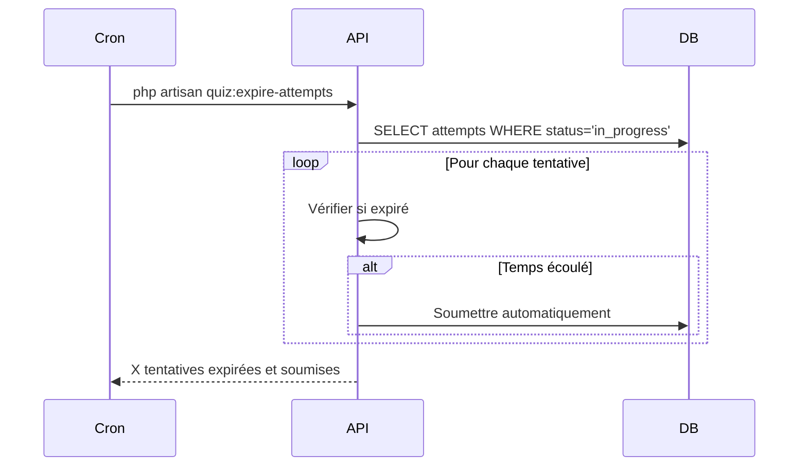

# Étape 3 : Amélioration du Quiz Timer

## 📋 Vue d'ensemble

Amélioration majeure du système de timer pour les quiz afin d'empêcher les tricheries et garantir l'intégrité des tentatives. Le timer est maintenant **géré côté serveur** avec validation automatique et expiration forcée.

---

## 🎯 Fonctionnalités ajoutées

### 1. **Vérification du temps côté serveur**
- ✅ Validation du temps restant à chaque soumission
- ✅ Expiration automatique des tentatives dont le temps est écoulé
- ✅ Protection contre la manipulation du timer côté client

### 2. **Endpoint de vérification en temps réel**
```
GET /api/quiz-attempts/{id}/time-remaining
```
Permet au frontend de vérifier le temps restant de manière sécurisée.

**Réponse (temps restant) :**
```json
{
    "success": true,
    "data": {
        "time_remaining_seconds": 1245,
        "is_expired": false,
        "started_at": "2025-10-17T10:30:00.000000Z",
        "duration_minutes": 30
    }
}
```

**Réponse (temps écoulé) :**
```json
{
    "success": false,
    "message": "Le temps est écoulé. Votre tentative a été soumise automatiquement.",
    "data": {
        "time_remaining_seconds": 0,
        "is_expired": true,
        "auto_submitted": true,
        "attempt": { ... }
    }
}
```

### 3. **Sauvegarde automatique de la progression**
```
POST /api/quiz-attempts/{id}/save-progress
```
Permet de sauvegarder les réponses sans soumettre le quiz.

**Body :**
```json
{
    "answers": {
        "1": "A",
        "2": "B",
        "3": "La réponse courte ici"
    }
}
```

**Réponse :**
```json
{
    "success": true,
    "message": "Progression sauvegardée",
    "data": {
        "time_remaining": 1200,
        "saved_at": "2025-10-17T10:35:00.000000Z"
    }
}
```

### 4. **Expiration automatique via Cron**
Une commande artisan exécute régulièrement l'expiration des tentatives :

```bash
php artisan quiz:expire-attempts
```

**Configuration dans `app/Console/Kernel.php` :**
```php
protected function schedule(Schedule $schedule)
{
    // Exécuter toutes les 5 minutes
    $schedule->command('quiz:expire-attempts')->everyFiveMinutes();
}
```

---

## 🔧 Modifications apportées

### 1. **QuizController.php**

#### Nouvelle méthode : `checkTimeRemaining()`
```php
public function checkTimeRemaining(Request $request, int $id): JsonResponse
```
- Vérifie le temps restant pour une tentative
- Soumet automatiquement si le temps est écoulé
- Retourne le statut en temps réel

#### Nouvelle méthode : `saveProgress()`
```php
public function saveProgress(Request $request, int $id): JsonResponse
```
- Sauvegarde les réponses temporaires sans soumettre
- Vérifie également le temps écoulé
- Utile pour éviter la perte de données

#### Modification : `submitAttempt()`
```php
// NOUVEAU: Vérification du temps écoulé avant soumission
if ($attempt->isTimeExpired()) {
    $attempt->submit($request->answers ?? []);
    return response()->json([
        'success' => false,
        'message' => 'Le temps est écoulé. Votre tentative a été soumise automatiquement.',
        'data' => [
            'attempt' => $attempt,
            'time_expired' => true,
        ],
    ], 422);
}
```

### 2. **QuizAttempt.php (Model)**

#### Nouvelle méthode : `isTimeExpired()`
```php
public function isTimeExpired(): bool
{
    return $this->hasExpired();
}
```
Alias pour `hasExpired()` pour une meilleure lisibilité.

### 3. **routes/api.php**

Ajout des nouvelles routes :
```php
// Timer et sauvegarde de progression
Route::get('quiz-attempts/{id}/time-remaining', [QuizController::class, 'checkTimeRemaining']);
Route::post('quiz-attempts/{id}/save-progress', [QuizController::class, 'saveProgress']);
```

### 4. **ExpireQuizAttempts.php (Command)**

Nouvelle commande artisan pour l'expiration automatique :
```php
php artisan quiz:expire-attempts
```

**Fonctionnement :**
1. Récupère toutes les tentatives `in_progress` avec un `duration_minutes` défini
2. Vérifie si le temps est écoulé pour chaque tentative
3. Soumet automatiquement les tentatives expirées
4. Log le nombre de tentatives traitées

---

## 📊 Flux de fonctionnement

### Scénario 1 : Quiz avec timer normal



### Scénario 2 : Timer expiré (soumission automatique)



### Scénario 3 : Expiration via Cron



---

## 🔒 Sécurité et Anti-triche

### Mesures de sécurité implémentées :

1. **Timer côté serveur uniquement**
   - Le client ne peut pas manipuler le temps
   - Calcul basé sur `started_at` + `duration_minutes`

2. **Validation à chaque requête**
   - Vérification du temps à chaque appel API
   - Soumission automatique si temps écoulé

3. **Expiration forcée par Cron**
   - Job qui tourne toutes les 5 minutes
   - Soumet les tentatives abandonnées

4. **Sauvegarde automatique**
   - Évite la perte de données
   - Les réponses sont sauvegardées même en cas de déconnexion

---

## 🎨 Intégration Frontend (Vue.js)

### Exemple d'implémentation du composant Quiz

```vue
<template>
  <div class="quiz-container">
    <div class="timer-warning" v-if="timeRemaining < 300">
      ⚠️ Il reste {{ formatTime(timeRemaining) }}
    </div>

    <div class="timer" :class="{ 'timer-critical': timeRemaining < 60 }">
      ⏱️ {{ formatTime(timeRemaining) }}
    </div>

    <div class="questions">
      <!-- Questions du quiz -->
    </div>

    <button @click="submitQuiz" :disabled="isSubmitting">
      Soumettre le quiz
    </button>
  </div>
</template>

<script setup>
import { ref, onMounted, onUnmounted } from 'vue';

const attemptId = ref(null);
const timeRemaining = ref(0);
const isSubmitting = ref(false);
let timerInterval = null;
let saveInterval = null;

// Démarrer le quiz
async function startQuiz(quizId) {
  const response = await fetch(`/api/quizzes/${quizId}/start`, {
    method: 'POST',
    headers: { 'Authorization': `Bearer ${token}` }
  });

  const data = await response.json();
  attemptId.value = data.data.attempt.id;
  timeRemaining.value = data.data.time_remaining;

  // Démarrer les timers
  startTimers();
}

// Vérifier le temps restant toutes les 30 secondes
function startTimers() {
  timerInterval = setInterval(async () => {
    const response = await fetch(
      `/api/quiz-attempts/${attemptId.value}/time-remaining`
    );
    const data = await response.json();

    if (data.data.is_expired) {
      // Le temps est écoulé, quiz soumis automatiquement
      clearIntervals();
      alert('Le temps est écoulé ! Votre quiz a été soumis automatiquement.');
      // Rediriger vers les résultats
    } else {
      timeRemaining.value = data.data.time_remaining_seconds;
    }
  }, 30000); // Toutes les 30 secondes

  // Sauvegarder la progression toutes les 2 minutes
  saveInterval = setInterval(() => {
    saveProgress();
  }, 120000); // Toutes les 2 minutes
}

// Sauvegarder la progression
async function saveProgress() {
  await fetch(`/api/quiz-attempts/${attemptId.value}/save-progress`, {
    method: 'POST',
    headers: {
      'Content-Type': 'application/json',
      'Authorization': `Bearer ${token}`
    },
    body: JSON.stringify({ answers: currentAnswers.value })
  });
}

// Soumettre le quiz
async function submitQuiz() {
  isSubmitting.value = true;
  clearIntervals();

  const response = await fetch(
    `/api/quiz-attempts/${attemptId.value}/submit`,
    {
      method: 'POST',
      headers: {
        'Content-Type': 'application/json',
        'Authorization': `Bearer ${token}`
      },
      body: JSON.stringify({ answers: currentAnswers.value })
    }
  );

  const data = await response.json();

  if (!data.success && data.data?.time_expired) {
    alert('Le temps était écoulé. Votre quiz a été soumis automatiquement.');
  }

  // Rediriger vers les résultats
}

// Formater le temps
function formatTime(seconds) {
  const mins = Math.floor(seconds / 60);
  const secs = seconds % 60;
  return `${mins}:${secs.toString().padStart(2, '0')}`;
}

// Nettoyer les intervalles
function clearIntervals() {
  if (timerInterval) clearInterval(timerInterval);
  if (saveInterval) clearInterval(saveInterval);
}

onUnmounted(() => {
  clearIntervals();
});
</script>

<style scoped>
.timer {
  font-size: 24px;
  font-weight: bold;
  padding: 10px;
  background: #f0f0f0;
  border-radius: 8px;
}

.timer-critical {
  background: #ffebee;
  color: #c62828;
  animation: pulse 1s infinite;
}

@keyframes pulse {
  0%, 100% { opacity: 1; }
  50% { opacity: 0.7; }
}

.timer-warning {
  background: #fff3e0;
  color: #e65100;
  padding: 12px;
  border-radius: 4px;
  margin-bottom: 16px;
}
</style>
```

---

## 📝 Configuration du Cron

### Sur Linux (Production)

Ajouter au crontab :
```bash
crontab -e
```

```cron
# Expirer les tentatives de quiz toutes les 5 minutes
*/5 * * * * cd /path/to/lms-backend && php artisan quiz:expire-attempts >> /dev/null 2>&1
```

### Sur Windows (Développement)

Utiliser le Task Scheduler ou exécuter manuellement :
```bash
php artisan quiz:expire-attempts
```

### Avec Laravel Scheduler (Recommandé)

Dans `app/Console/Kernel.php` :
```php
protected function schedule(Schedule $schedule)
{
    $schedule->command('quiz:expire-attempts')
        ->everyFiveMinutes()
        ->withoutOverlapping()
        ->runInBackground();
}
```

Puis ajouter au crontab :
```cron
* * * * * cd /path/to/lms-backend && php artisan schedule:run >> /dev/null 2>&1
```

---

## ✅ Tests recommandés

### Test manuel

1. **Démarrer un quiz avec timer de 5 minutes**
```bash
POST /api/quizzes/1/start
```

2. **Vérifier le temps restant**
```bash
GET /api/quiz-attempts/1/time-remaining
```

3. **Sauvegarder la progression**
```bash
POST /api/quiz-attempts/1/save-progress
{
  "answers": {"1": "A", "2": "B"}
}
```

4. **Attendre 5 minutes et essayer de soumettre**
```bash
POST /api/quiz-attempts/1/submit
# Devrait retourner 422 avec message "temps écoulé"
```

5. **Tester l'expiration automatique**
```bash
php artisan quiz:expire-attempts
```

---

## 📈 Statistiques

### Nouveaux endpoints ajoutés : **2**
- `GET /api/quiz-attempts/{id}/time-remaining`
- `POST /api/quiz-attempts/{id}/save-progress`

### Fichiers modifiés : **3**
- `app/Http/Controllers/API/QuizController.php`
- `app/Models/QuizAttempt.php`
- `routes/api.php`

### Fichiers créés : **2**
- `app/Console/Commands/ExpireQuizAttempts.php`
- `ETAPE3_QUIZ_TIMER_IMPROVEMENT.md`

### Total endpoints API : **75** (73 + 2 nouveaux)

---

## 🎯 Bénéfices

✅ **Sécurité renforcée** : Timer côté serveur impossible à manipuler
✅ **Expérience utilisateur** : Sauvegarde automatique évite la perte de données
✅ **Intégrité des données** : Expiration automatique garantit des résultats fiables
✅ **Monitoring** : Logs des tentatives expirées pour analyse
✅ **Performance** : Pas de surcharge, vérifications optimisées

---

## 🚀 Prochaines étapes recommandées

1. ✅ Tests unitaires créés
2. ✅ Collection Postman créée
3. ✅ Amélioration Quiz timer complétée
4. 🔄 Configuration du Cron en production
5. 🔄 Tests d'intégration avec le frontend Vue.js
6. 🔄 Monitoring des tentatives expirées (dashboard admin)

---

**Date de création** : 17 octobre 2025
**Version** : 1.0
**Statut** : ✅ Complété
